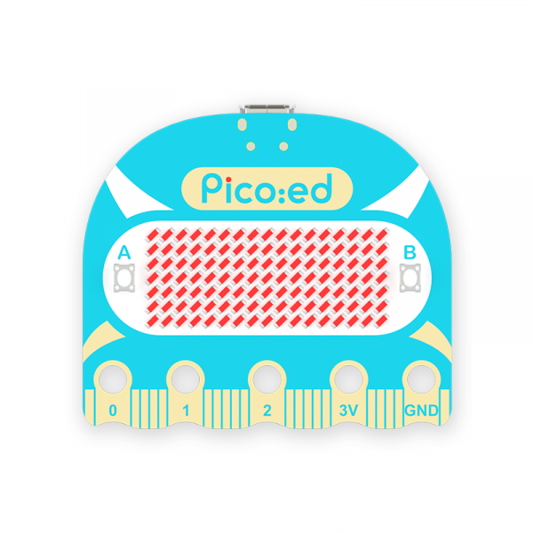

import nezhaa_inventors_kit_Icon from './building-blocks/nezhaa-inventors-kit/images/36-in-1-nezhaa-inventors-kit-icon.png';

# Arduino 相关产品

## Building Blocks
---

<cardbox>
  <card
    href="./building-blocks/nezhaa-inventors-kit/"
    title="哪吒A科学套装"
    description="小小科学家(Starter Kit)套件是ELECFREAKS团队出品的micro:bit入门套件。
ElecFreaks Micro：bit 小小科学家专为那些学习电路和编程知识的人们而设计。 该套件提供了一些基本的电子元件，如LED，按钮，蜂鸣器，温度传感器，舵机和电机等。 Micro：bit小小科学家套件可以帮助您进入一个美好的电子世界。"
    img={nezhaa_inventors_kit_Icon}
  />
</cardbox>
