# 哔啵小熊板

## 简介
---

哔啵小熊板可将万物化作键盘。使用它可以学习电路，创作音乐，制作游戏……有了它，世界万物都是你的创作工具。在思绪泉涌时运用手中的键盘敲击出你想要的画面和内容，通过小熊板都可以实现，只需要简单的图形益智类编程，简单易懂的思维逻辑语句，简单的拼接，可以自由选择的音量、颜色、画笔粗细、移动方向、魔术般变化，都可以通过小熊板化虚为实，体验极致的想象力盛宴。

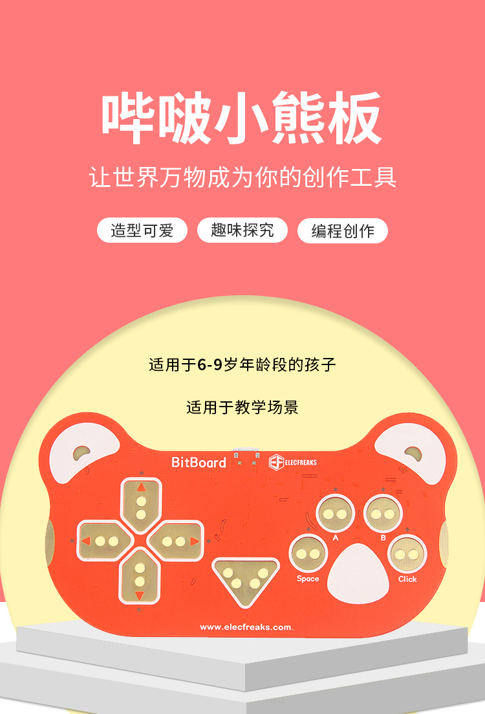

## 购买链接
---

[哔啵小熊板](https://detail.tmall.com/item.htm?spm=a1z10.3-b-s.w4011-23853853911.157.547e4081Tdx7gm&id=662180553102&rn=5cca6b251e1d83a9ea0d0936de1c534b&abbucket=18&sku_properties=20281519:17008038648)

## 产品参数
---

|  产品参数   | 描述  |
| :----: | :----: |
| 工作电压 | 5V |
| 工作电流 | 15mA |
| 供电传输接口 | micro-USB |
| 触点数量 | 8个 |
| 产品尺寸 | 约140mm×76mm |
| 产品重量 | 31g（小熊板）【200g（套装）】 |
| 使用人群 | 6-9岁年龄段的孩子 |
| 包装清单 | bitboard主板×1、鳄鱼夹线×10、USB线×1、铜箔胶带×1 |

## 发货清单

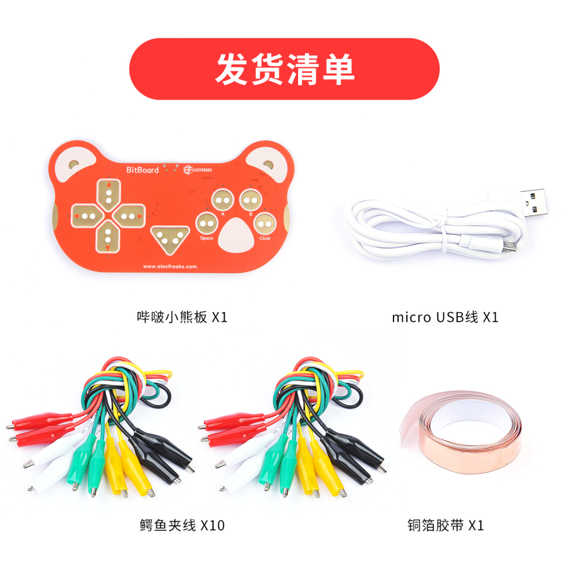

注意：
1、拆封前，请检查是否出现破损或刮擦划痕等破损情况，可及时与售后人员联系
2、拆封后，根据清单明细仔细翻阅并校对产品及零件数量是否正确，若存在及时与售后联系
3、使用后，若丢失或损伤零部件，可以根据以下清单中的对应名称单独自行购买

## 产品结构
---
该产品主要是基于主板和连接线以及金属胶带三部分构成
小熊板拥有多样的传感器和ecode以及scratch两大核心编程软件驱动大脑，可以通过代码编写来实现声音、颜色、动作等领域的多功能特效和动画，大家抓紧点击列表下的内容来深入了解吧！

操盘手--------小熊板
集成多个电子模块，可编程控制，实现传感联动【A键、B键、Click键、Space键、GND键、↑、↓、←、→键】

A键（B键）：实现键控制屏幕上显示器的人或物的各项特效或动画

↑、↓、←、→键：1、实现键控制屏幕上显示器的人或物的各项特效或动画
                           2、实现所设计代码内部主体的各方向移动等

GND键：任何触发结果联动前必须将GND键接地，可以通过连接人手、水果等

感应指示灯：编程的控制可以在触碰该按键时指示灯亮起，提示成功按压连接

扬声器：通过编程代码控制扬声器，使其发出各色音效，并可改变声音大小

连接器：micro USB线、鳄鱼夹线

导电材料：铜箔胶带

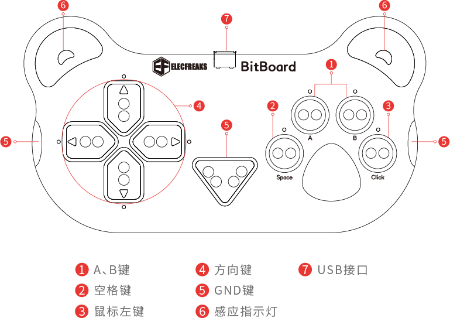

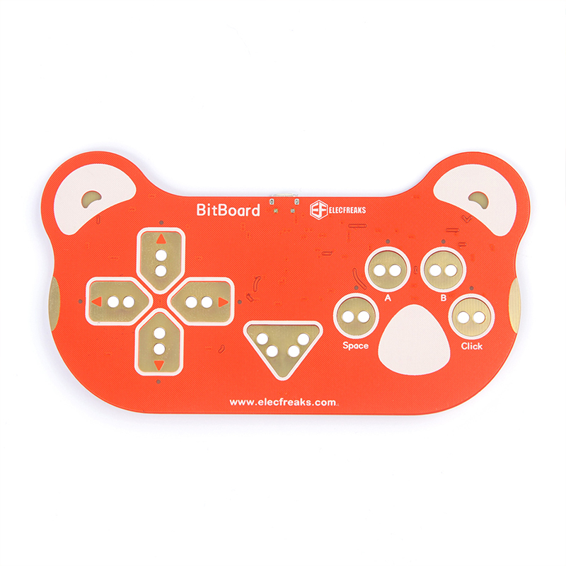

## 快速上手
---
快速使用指南可以翻阅包装内的说明书或官网都可查阅

### 步骤详解

1、组装：通过USB接线连接组装小熊板主板与电脑
2、连接：通过鳄鱼夹线将主板的接口与铜箔胶带连接使其导通（导通标志：两侧耳朵的指示灯亮起）【尤其是GND接口必须接地】
3、软件下载：哔啵小熊板支持[ecode](https://www.ecode.cn/)（或scratch）编程程序编写指令，具体可查阅ecode教程自行学习【输入ecode.cn网址搜索直接编写】或scratch【可以通过电脑下载scratch软件后编写】
4、在ecode（或scratch）上进行图形化编程设计
5、点击右上角框图小屏幕中的左上角的绿色旗按钮，点击后即可运行
6、直接通过触碰各按钮运行程序各功能模块

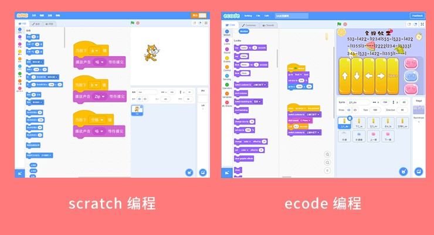

### 硬件快速上手图解

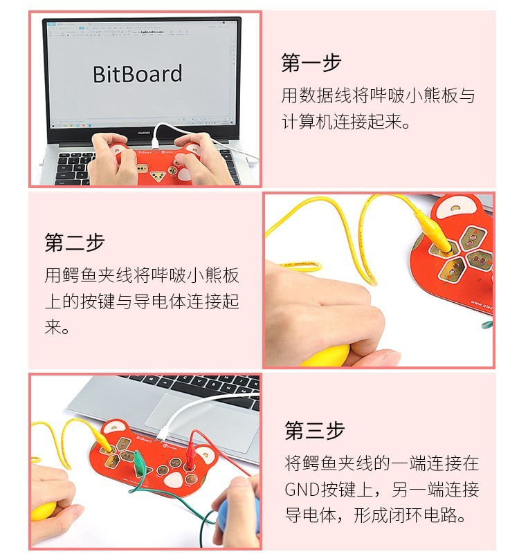

### ecode网站编程上手图解

1、点击下方图示界面的”开始创作按钮：

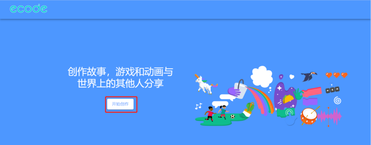

2、进入主界面

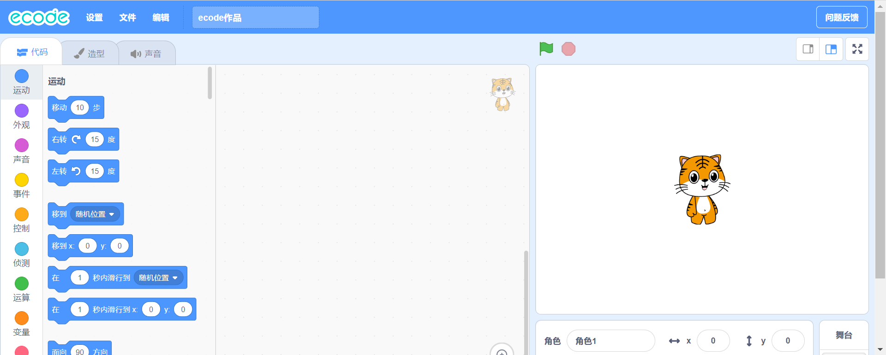

3、点击左上角代码按钮

4、左侧显示的是功能模块类型，可以自由选择想要输入的图形块代码的功能

5、代码类型右侧会显示代码具体所属类型的图形块代码，如下图是“运动”板块的代码，在此可以自由选择需要的代码块拖动至右侧代码设计界面

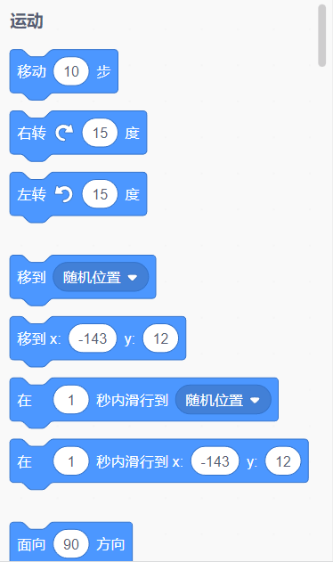

6、代码的右侧是代码设计界面，在此可以自由设计你将要运行的代码程序

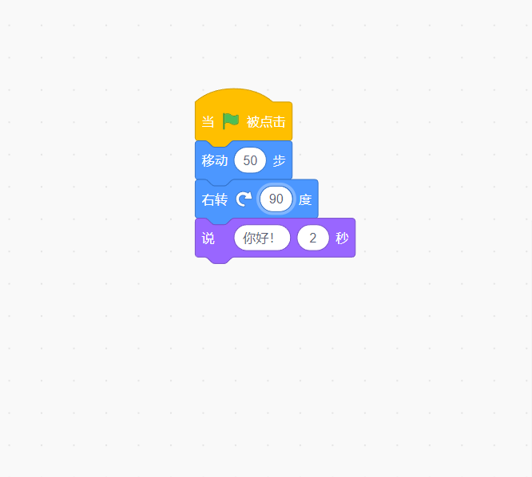

7、右侧是最终展示界面（即主舞台），初始进入时默认显示一只猫，后面可以自由更改内容（包括图形、文字、图片等）

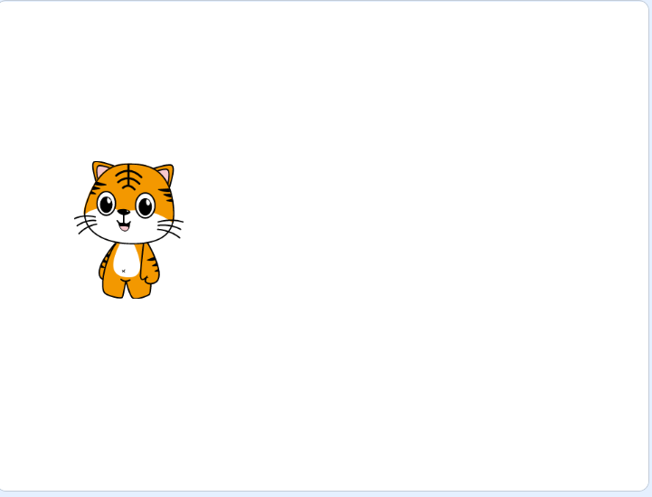

8、注意最终展示界面（即主舞台）左上角有绿旗和红色八边形按钮【绿旗：开始运行代码程序；红圈：停止运行代码程序】

9、右侧主舞台下方有针对对象的设置参数模块，可以自由设置想要设定的对象

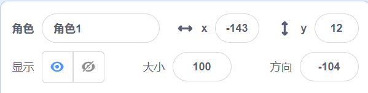

10、默认选择的设置角色为初始的猫，可以自由添加想要的角色，可以在右侧中设置，设置方法如下图

1）选择一个数据库中已有的角色

首先选择放大镜按钮

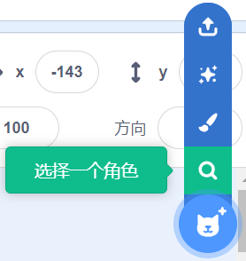

再选择自己想要的对象

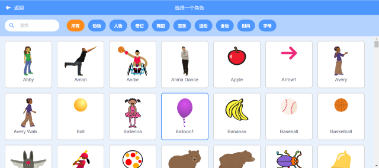

2）绘制一个自定义对象

首先点击绘制按钮

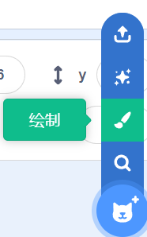

再进入界面后自由绘制

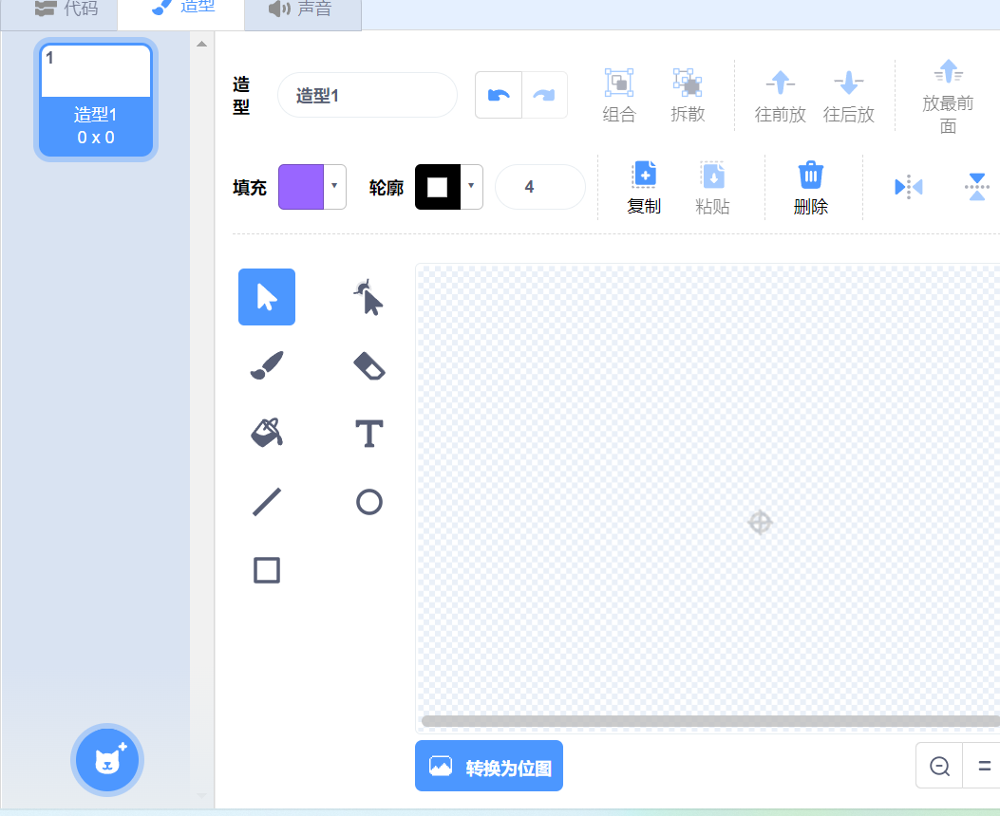

也可以在初始界面的左上角“代码”右侧的“造型”按钮直接绘制

3）也可以选择随机选项，随机生成对象

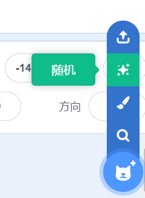

4）也可以选择“上传角色”

首先点击“上传角色”按钮

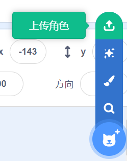

再点击自己想要的图片上传即可

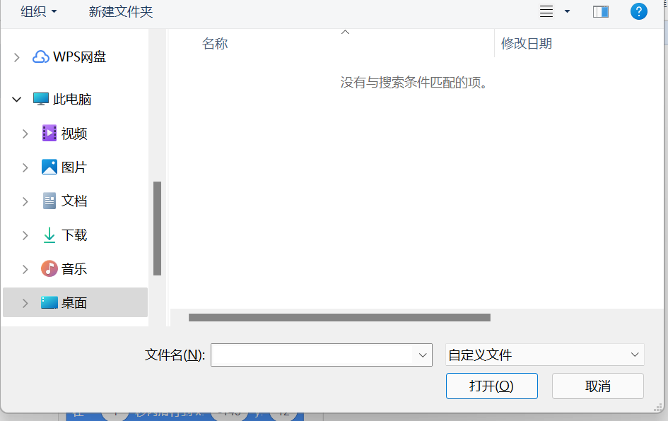

11、背景模块也可以单击，进行全面设置，设置方式与基础人物或图片对象一样（即同上），其界面在右下角的人物/图片设置右侧：（单击“舞台”按钮可以切换至针对舞台设置的模式）

12、同理，也可以在声音界面找到设置的具体参数，自定义需要的声音

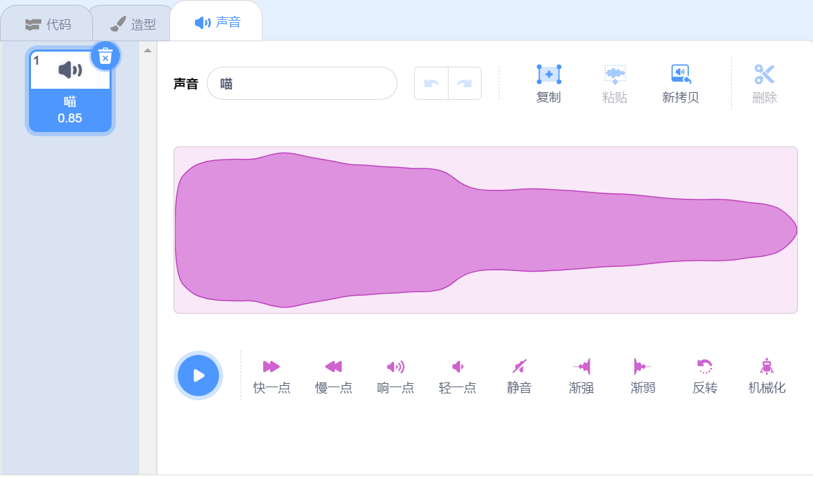

PS：

另外，也可以设置你想要的语言体系

也可以在电脑中上传已有的代码文件或保存已编辑好的文件放入电脑中，也可以插入新作品来覆盖原有内容

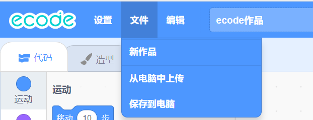

另外，也可以复原不小心删除的内容，也可以打开加速模式（加快代码的运行速度）

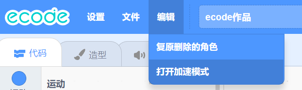

## 常见问题

1、如何查看小熊板与电脑连接是否成功?

使用 micro USB线连接小熊板USB接口，接口处红色指示灯常亮，同时小熊板正面各按键指示灯会依次亮起，随后熄灭。如上述情况正常呈现,则小熊板与电脑连接成功。

2、小熊板与电脑连接失败该怎么办?

1) 用U盘或者有线鼠标键盘连接电脑USB接口，检查接口功能是否正常。

2) 排查连接线问题：市面上的USB连接线通常是兼容充电与传输数据为一体，但是一些厂家为了节约成本，去除了数据传输功能，仅保留充电功能；所以在连接小熊板之前，务必检查连接线是否具备传输数据功能。最便捷的测试方法就是将手机通过数据线与电脑连接，检查是否能传输数据。

3) 如果USB接口正常，但小熊板还是不能正常使用，可以按照以下步骤进行设置：右击桌面上“我的电脑”图标，弹出的快捷菜单选择“属性”命令，在系统属性界面切换到“硬件”选项卡，在下面单击“设备管理器”按钮。打开设备管理器，在菜单栏上单击“查看”——“显示隐藏的设备”，双击“通用串行总线控制器”项目，将下面所有灰色项目和USB大容量存储设备都卸载掉，然后右击“通用串行总线控制器”项目，弹出的下拉菜单选择“扫描检查硬件改动”，拔掉USB设备，然后再重新插上。如果还没好，右击“通用串行总线控制器”下的“USB Root Hub”项目，打开的右键菜单单击“属性”命令，打开的属性窗口切换到“电源管理”选项卡，去掉“允许计算机关闭此设备以节约电源”，单击“确定”按钮（依次对每个USB Root Hub的属性进行修改）。

3、编程软件是否需要购买呢？

不需要，本产品配套的线上编程程序是ecode，该编程程序是网页版，不需要付费。另一套编程程序是scratch，是电脑端软件程序，不需要付费就可以直接下载安装。

4、小熊板不插USB接线可以无线蓝牙连接吗？

暂时不行，后续会推出更新后的版本，会考虑加入该功能。目前暂时只支持连接电脑端运行。

5、是否有视频教程来演示如何上手操作，以及后续有没有新的玩法教程呢？

暂时没有，后续会尽快推出教程视频供大家学习。

6、如果我不小心丢了部分零配件，能单独购买吗？

可以的，在我们官网链接中都有呈现各种零配件单独购买的选项，可以自行按需选购。

购买链接：[恩孚科技](https://elecfreaks.tmall.com/search.htm?spm=a1z10.1-b-s.w5002-23853848589.1.1d09316bMLHKEs&search=y)

7、在哪里可以获得其他使用帮助呢？

可以添加恩孚科技官方微信号，并告知您需要加群的意愿后，它会帮您拉入群聊。

恩孚科技官方微信号：elecfreaks002

8、以后有新的产品更新信息我该如何了解到呢？

可以添加恩孚科技官方微信公众号，之后都会实时推文更新最新的产品信息。

恩孚科技官方微信公众号：EF恩孚科技
