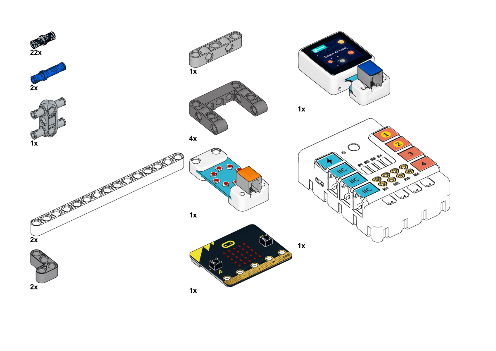
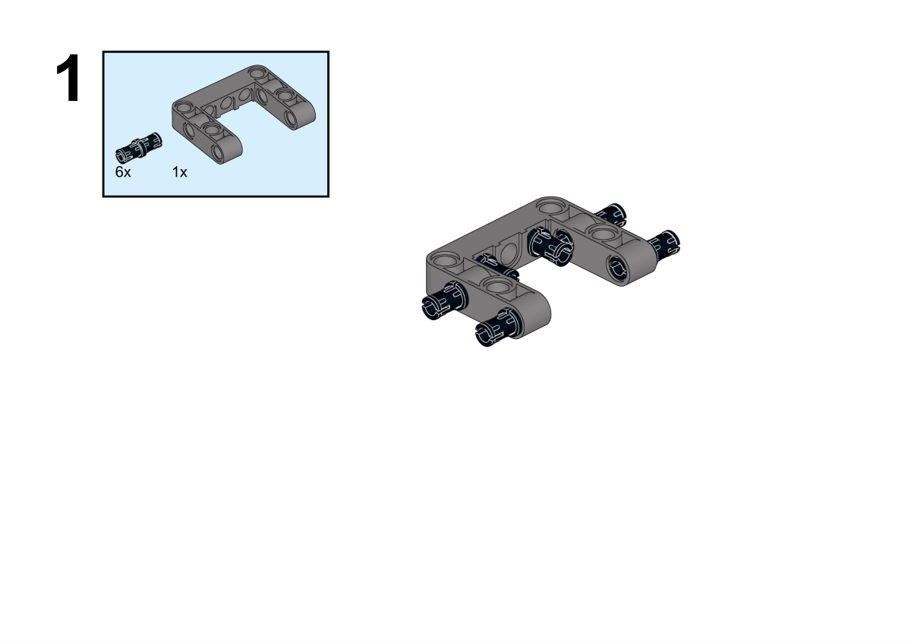
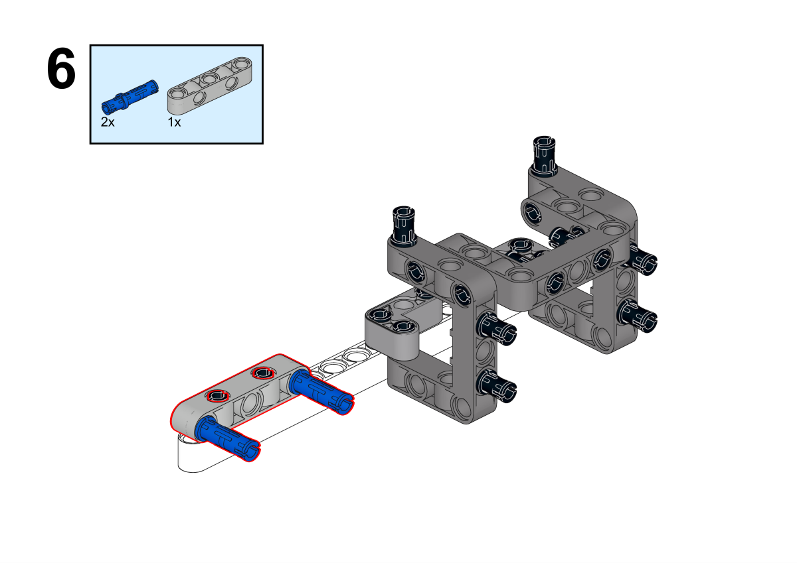
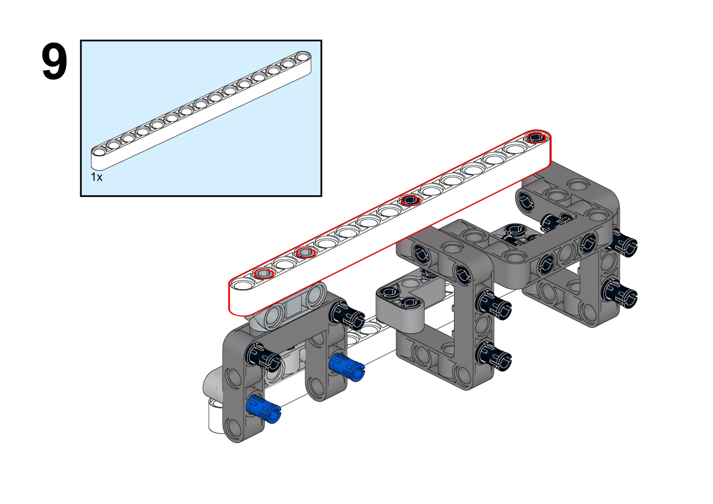
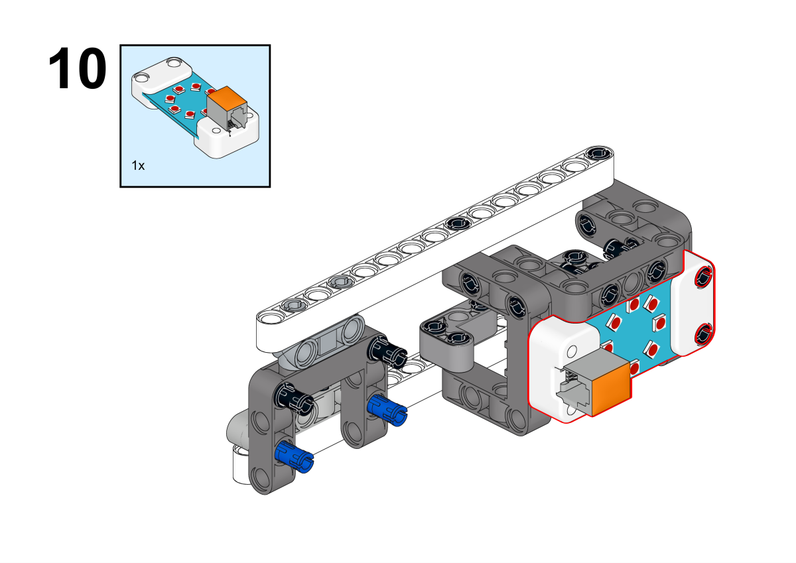
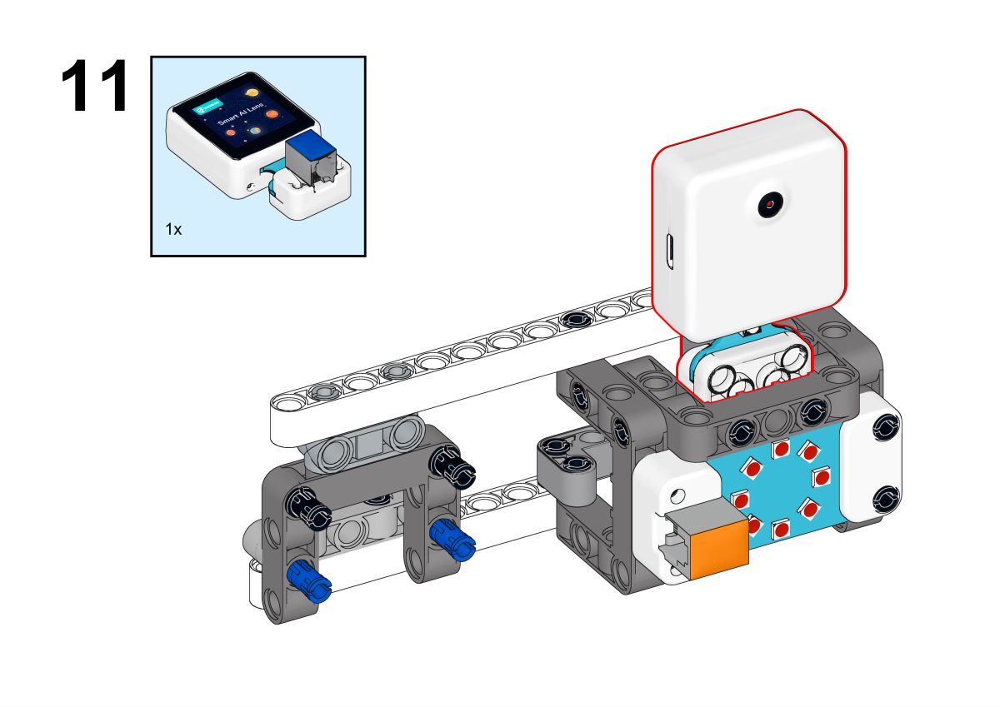
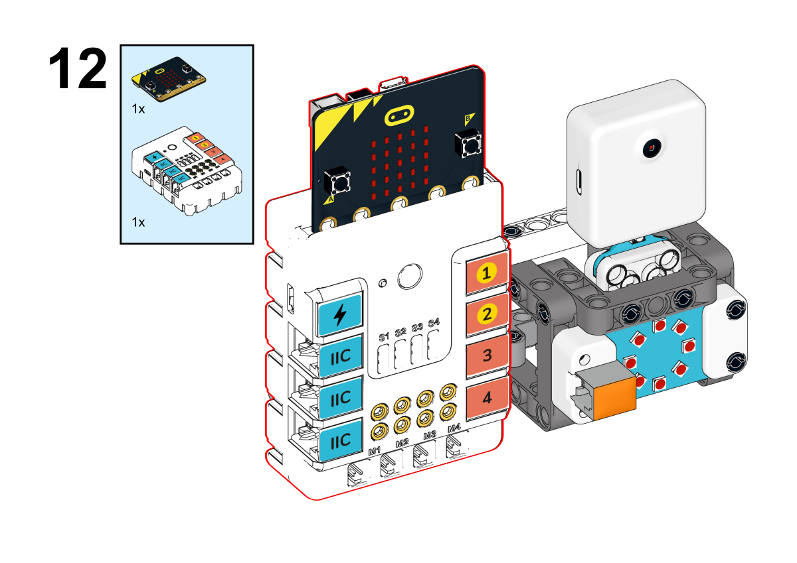
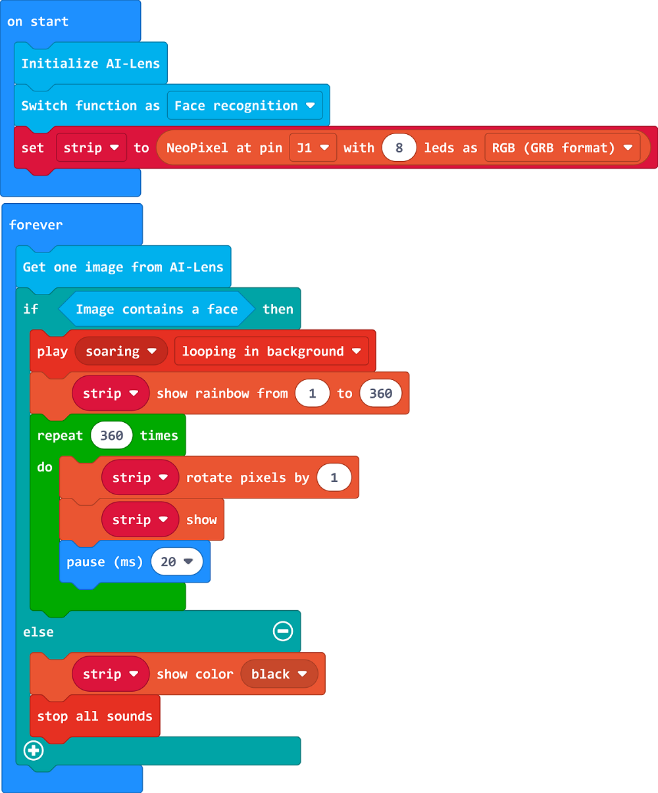

# Case 01 AI报警器

## 简介

本课程将引导学生使用哪吒发明家套装V2和AI扩展包制作一个AI警报器。通过AI摄像头的人脸识别功能，当有人接近预定范围时，彩虹灯效会触发并伴随蜂鸣器报警。学生将学习如何结合硬件与人工智能技术，创造出一个有趣且有实际应用的装置。

## 教学目标

- 理解人工智能技术在日常生活中的应用。
- 学会制作AI警报器。
- 培养解决问题和创意设计的能力。

## 教学准备

[哪吒发明家套装 V2](https://www.elecfreaks.com/nezha-inventor-s-kit-v2-for-micro-bit.html)

[AI扩展包](https://www.elecfreaks.com/nezha-inventor-s-kit-v2-for-micro-bit.html)

电脑

## 教学过程

### 引入

>教师可以引导学生思考以下问题：什么是人脸识别技术？它在现实生活中有哪些应用？如何将这个技术应用于一个有趣的装置中，比如一个AI警报器？通过这些问题，激发学生的兴趣，并引导他们思考如何将技术与创意相结合。

大家好！在今天的课程中，我们将探索神奇的人工智能世界。我们将制作一个特殊的AI警报器，它可以通过摄像头识别人脸，当有人接近时，将会展现出绚丽的彩虹灯光和响亮的蜂鸣声。这是如何实现的呢？答案就在于AI摄像头的人脸识别功能。让我们一起动手，探索科技如何在日常生活中发挥作用，让我们的创意和技能汇聚成一个令人惊叹的作品吧！

### 探究

>分组讨论，让学生思考如何用AI摄像头来制作一个AI报警器，重点关注人脸识别功能的使用和人工智能技术在日常生活中的应用。

- 人脸识别技术是如何工作的？它如何识别人的脸部？
- 如何连接AI摄像头和彩虹灯效、蜂鸣器等元件，并编写程序实现预定范围内有人接近时的警报效果？
- 如何调试和优化警报器的性能，确保人脸识别的准确性和报警的及时性？

### 实践

>分组动手，按照自己的设计方案，用积木材料来制作一个AI报警器。

按照自己的设计方案，用积木材料来制作一个AI报警器。

#### 示例

##### 搭建步骤

**搭建完成**

##### 硬件连接

将彩虹灯环连接到哪吒扩展板的J1接口，将AI摄像头连接到哪吒扩展板的IIC接口。

##### 软件编程

打开编程平台[makecode](https://makecode.microbit.org/#)

新建项目

点击扩展

在搜索栏搜索`nezha`添加哪吒多功能扩展盒的扩展库

编写程序

程序链接:[https://makecode.microbit.org/S79066-57549-09027-31054](https://makecode.microbit.org/S79066-57549-09027-31054)

你也可以通过以下网页直接下载程序。

    <iframe
        src="https://makecode.microbit.org/S79066-57549-09027-31054"
        frameborder="0"
        sandbox="allow-popups allow-forms allow-scripts allow-same-origin"
        style={{
            position: 'absolute',
            width: '100%',
            height: '100%',
        }}
    />

### 展示

>分组展示，让每组的机器人在横杆上做引体向上运动，并用计时器记录时间，比较各组的成果和效果。

#### 示例案例效果

按下micro:bit上的A键，机器人开始做引体向上运动，按下micro:bit上的B键，机器人停止做引体向上运动。

### 反思

>分组分享，让每组的学生分享自己的制作过程和心得，总结自己遇到的问题和解决办法，评价自己的优点和不足。

### 扩展知识

*** 什么是人工智能？ ***

人工智能（Artificial Intelligence，简称AI）是一种模拟人类智能思维和行为的计算机系统和技术。它旨在使计算机具备像人类一样的认知能力，可以理解、学习、推理、解决问题和适应新情境。人工智能涉及多种技术和方法，其中包括：

机器学习: 机器学习是人工智能的一个关键分支，它使计算机能够从数据中学习并改进性能，而无需明确的编程。机器学习算法使计算机能够根据过去的数据进行模式识别，从而做出预测或决策。

深度学习: 深度学习是机器学习的一种特殊形式，使用称为神经网络的模型来模拟人脑神经元的结构和功能。深度学习在图像识别、语音识别和自然语言处理等领域取得了显著的成果。

自然语言处理: 自然语言处理是让计算机理解、处理和生成人类语言的技术。它涉及文本分析、语义理解、机器翻译等领域。

计算机视觉: 计算机视觉使计算机能够理解和解释图像和视频。它用于物体检测、人脸识别、医学影像分析等领域。

强化学习: 强化学习是让计算机通过与环境互动来学习最优行为的技术。它在自动驾驶、游戏策略等领域有应用。

知识表示与推理: 这些技术使计算机能够存储和处理复杂的知识，并使用逻辑推理来解决问题。

人机交互: 人工智能还包括改善人与计算机之间的交互方式，使之更加自然和智能，如语音助手和智能对话系统。

人工智能的目标是模仿人类智能的多个方面，但并不一定要模拟所有方面。它在诸多领域已经取得了显著的成就，但在一些方面仍面临挑战，如常识推理、情感理解和真正的智能创造力。

*** 人工智能技术的在生活中的应用。 ***

人工智能技术已经在日常生活的各个领域得到广泛应用，以下是一些例子：

智能助理: 虚拟助理如Siri、Google助手和Alexa利用语音识别和自然语言处理技术，帮助人们执行任务，如设置提醒、查找信息、播放音乐等。

社交媒体: 社交媒体平台利用AI技术来分析用户的兴趣和行为，为他们推荐内容、朋友和广告。此外，图像识别技术也可以自动识别照片中的人物和物体，方便用户标记和分享。

推荐系统: 在流媒体平台、电子商务网站和新闻应用中，推荐系统利用AI分析用户的历史行为和偏好，推荐他们可能感兴趣的内容，从而提高用户体验。

智能家居: 物联网设备结合AI技术，使家居设备能够自动化操作，如智能照明、智能温控和智能家电等，可以通过手机应用或语音控制进行管理。

医疗诊断: 医疗影像分析利用计算机视觉技术来辅助医生诊断，如通过扫描结果帮助检测疾病，如癌症。此外，AI还可以分析大量的医疗数据，提供个性化的治疗建议。

自动驾驶: 自动驾驶汽车利用传感器和AI算法来感知周围环境，做出驾驶决策，从而实现无人驾驶或辅助驾驶。
