# Case 03 节能风扇

## 简介

在这个创意的STEAM项目中，学生将结合哪吒发明家套装V2和AI扩展包，制作一个智能节能风扇。通过使用AI摄像头的人脸识别功能，风扇能够识别人的接近并自动打开，并通过蜗轮蜗杆的机械原理自动调整风扇的朝向，使风扇始终对准人的脸部位置。通过这个项目，学生将学习如何将AI技术与机械设计相结合，实现智能的能源节约。

## 教学目标

- 了解AI技术在智能装置中的应用。
- 学习蜗轮蜗杆的原理和运用。
- 掌握AI摄像头的人脸识别原理和功能。
- 培养动手实践和团队合作的能力。
- 激发学生的创造力和兴趣。

## 教学准备

[哪吒发明家套装 V2](https://www.elecfreaks.com/nezha-inventor-s-kit-v2-for-micro-bit.html)

[AI扩展包](https://www.elecfreaks.com/nezha-inventor-s-kit-v2-for-micro-bit.html)

电脑

## 教学过程

### 引入

>教师可以引导学生思考以下问题：在人脸追踪装置的基础上我们可以进行哪些改造让它的功能更加丰富呢？通过这些问题，激发学生的兴趣，并引导他们思考如何将技术与创意相结合。

大家是否有想过，能不能制作一个智能风扇，在人靠近的时候自动启动，并且能够自动调整风扇的朝向，让风扇一直对着人的脸部位置呢？在今天的课程中，我们将探索如何通过AI摄像头的人脸识别功能和蜗轮蜗杆的机械原理，制作一个智能节能风扇，不仅能够为我们带来凉爽，还能够实现能源的节约。

### 探究

>分组讨论，让学生思考如何用AI摄像头来制作一个AI节能风扇，重点关注人脸识别功能的使用和人脸识别装置的在生活中可能的应用场景。

- 什么是AI节能风扇，它的工作原理是什么？
- 蜗轮蜗杆在风扇中起到了什么作用？
- 如何利用AI摄像头的人脸识别功能实现风扇的自动启动和朝向调整？
- 这个智能节能风扇在哪些场景中可以应用，有哪些优势？

### 实践

>分组动手，按照自己的设计方案，用积木材料来制作一个AI节能风扇。

按照自己的设计方案，用积木材料来制作一个AI节能风扇。

#### 示例

##### 搭建步骤

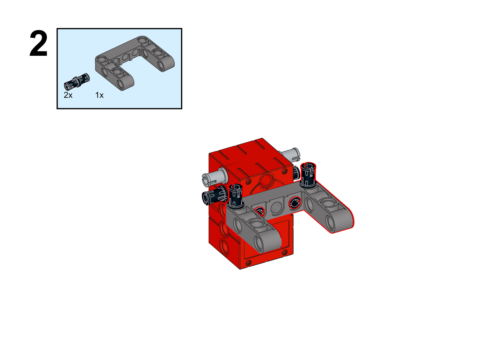

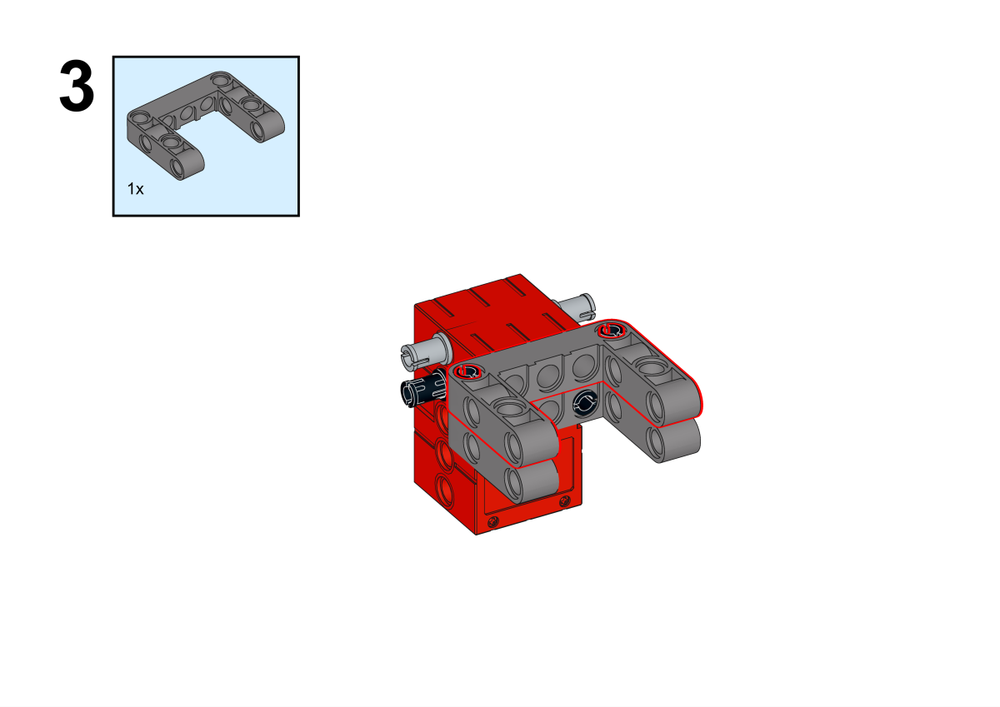

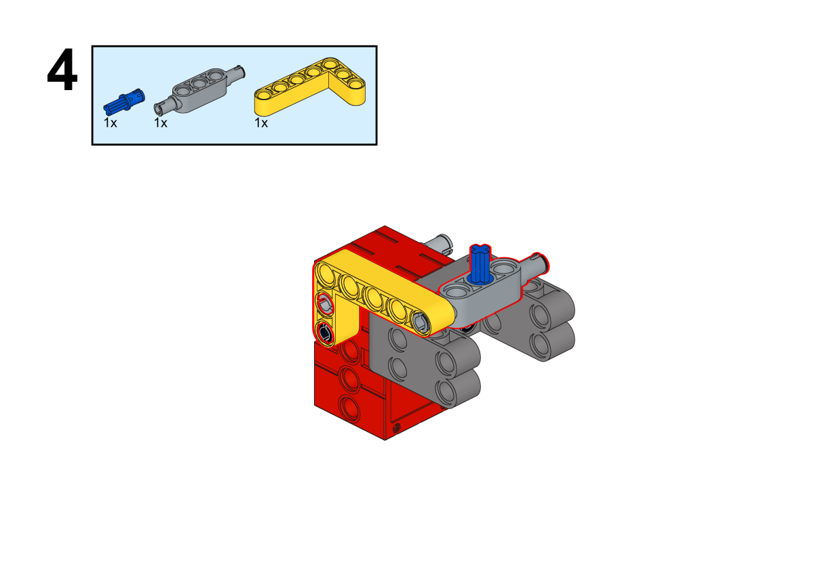

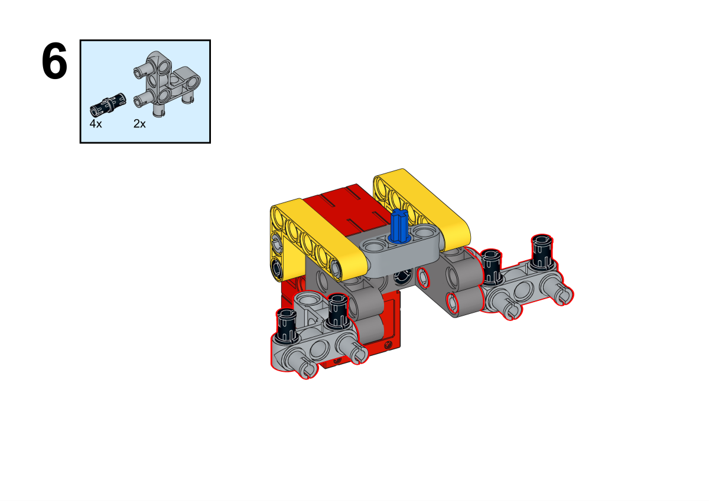

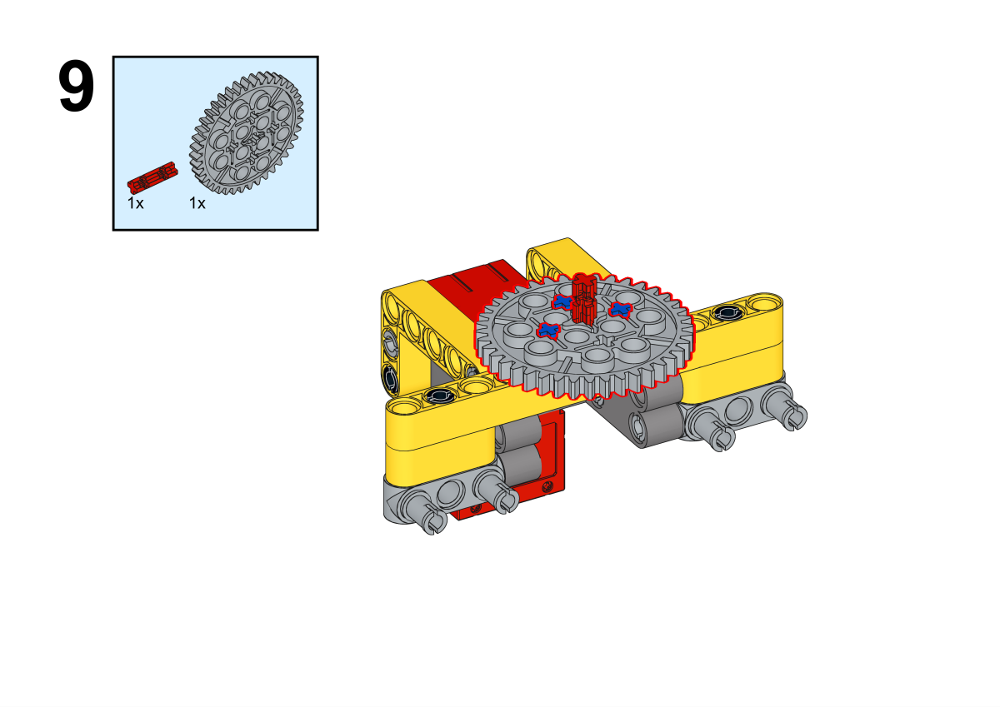

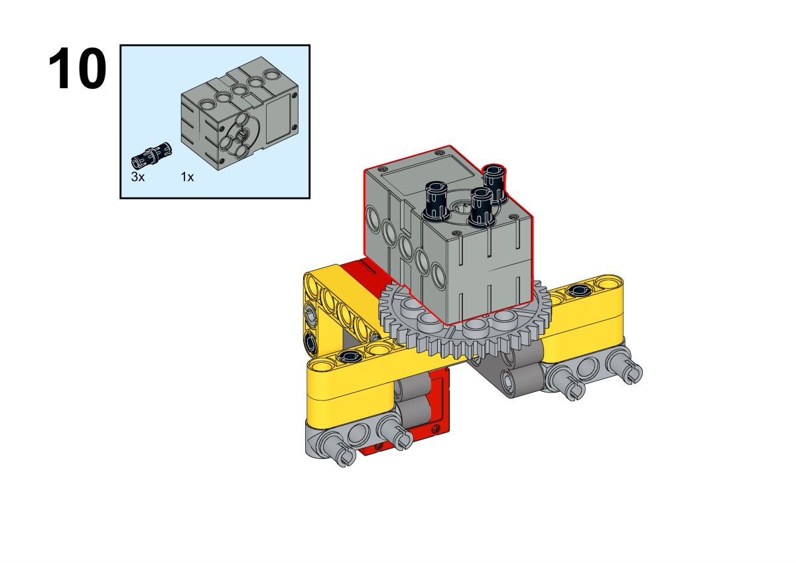

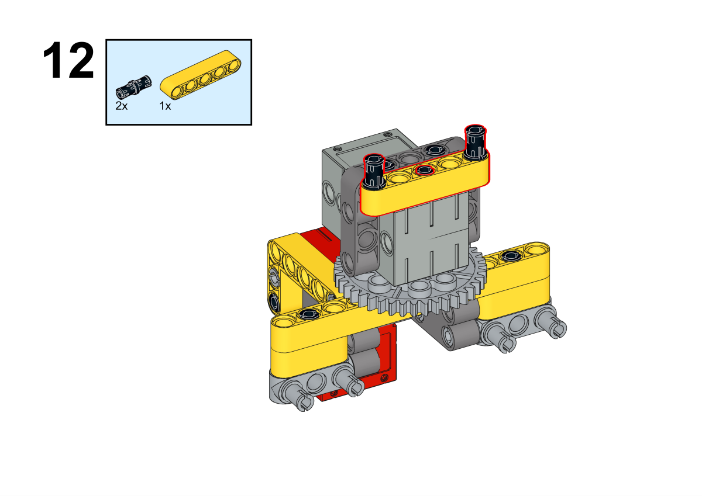

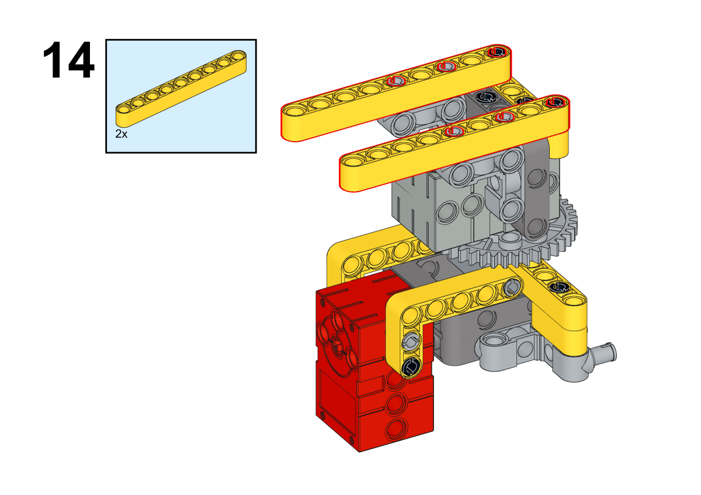

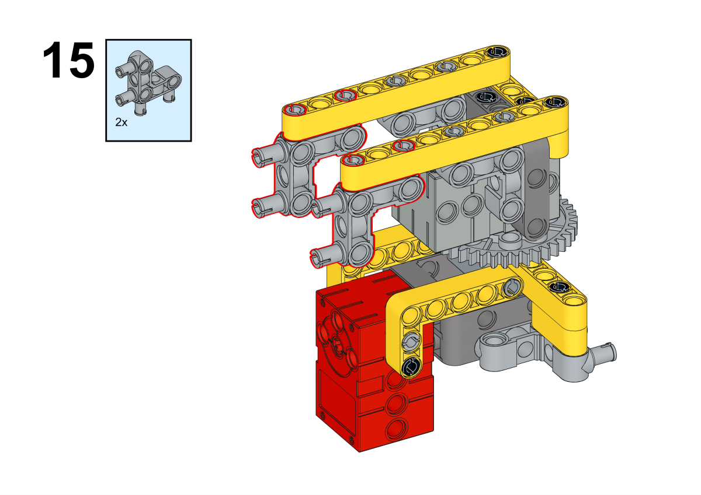

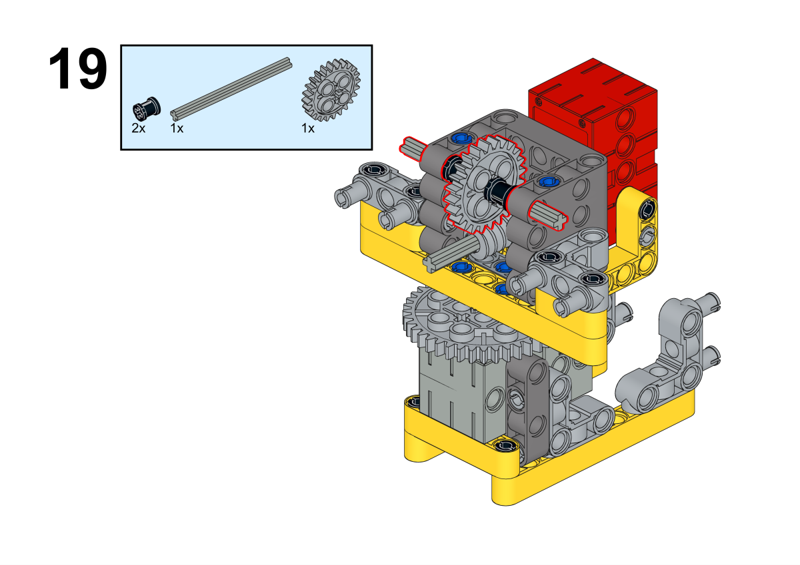

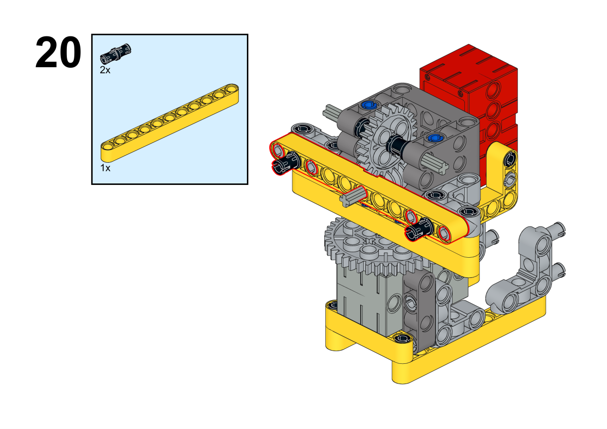

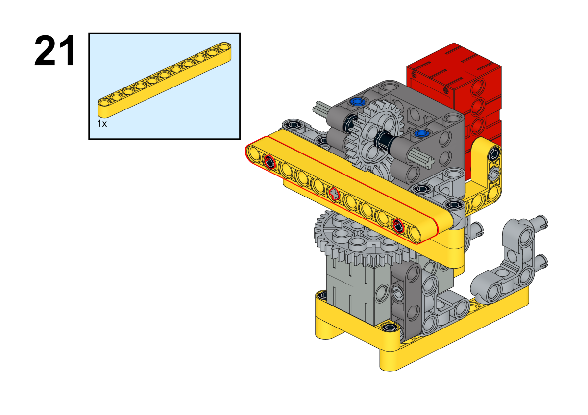

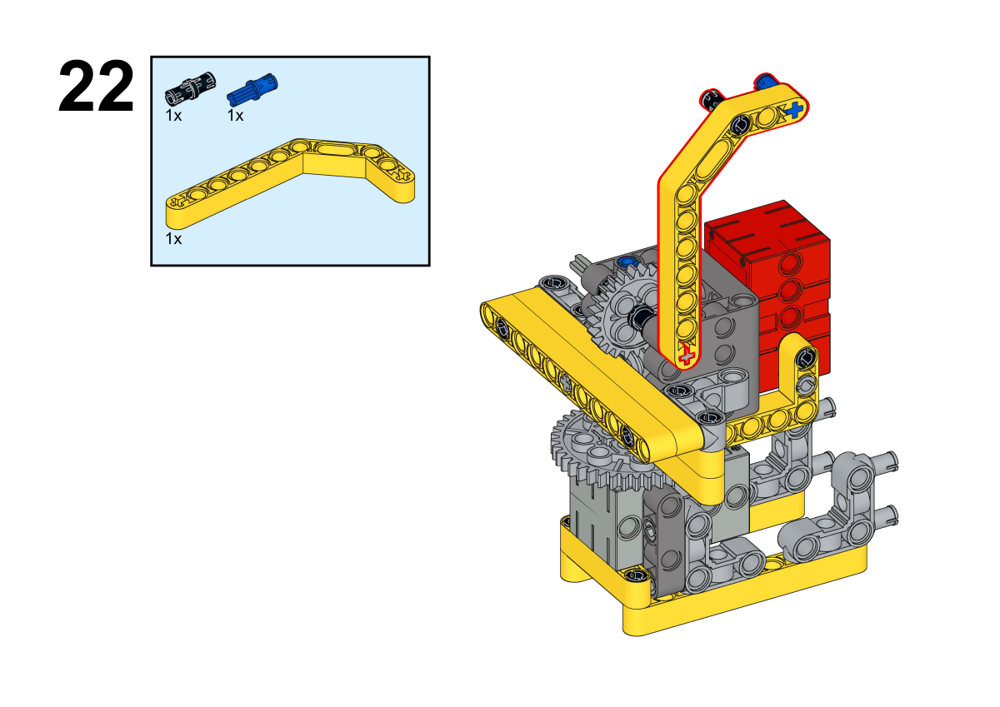

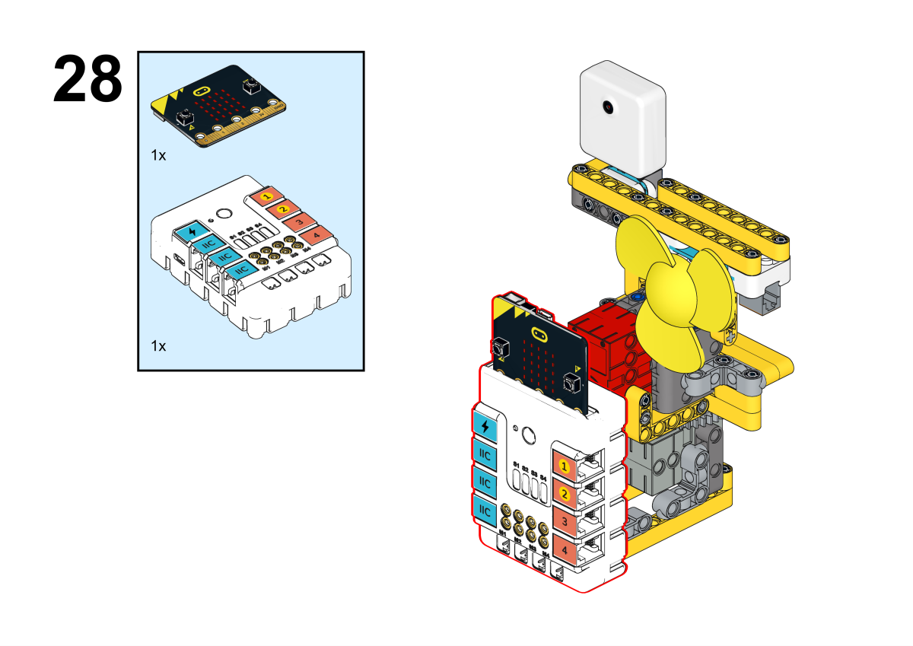

**搭建完成**

##### 硬件连接

将舵机连接到哪吒扩展板的S1接口，将电机连接到哪吒扩展板的M1接口，将风扇连接到哪吒扩展板的J1接口，将AI摄像头连接到哪吒扩展板的IIC接口。

 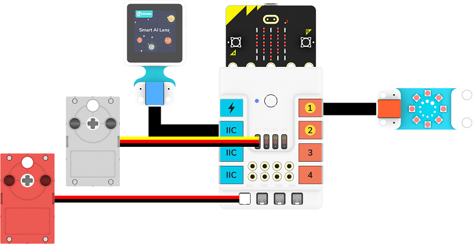

##### 软件编程

打开编程平台[makecode](https://makecode.microbit.org/#)

新建项目

点击扩展

在搜索栏搜索`nezha`添加哪吒多功能扩展盒的扩展库

在搜索栏搜索`planets`添加哪吒多功能扩展盒的扩展库

编写程序

程序链接:[https://makecode.microbit.org/_4JKguJKdqAgR](https://makecode.microbit.org/_4JKguJKdqAgR)

你也可以通过以下网页直接下载程序。

    <iframe
        src="https://makecode.microbit.org/_4JKguJKdqAgR"
        frameborder="0"
        sandbox="allow-popups allow-forms allow-scripts allow-same-origin"
        style={{
            position: 'absolute',
            width: '100%',
            height: '100%',
        }}
    />

### 展示

>分组展示，让每组的机器人在横杆上做引体向上运动，并用计时器记录时间，比较各组的成果和效果。

#### 示例案例效果

按下micro:bit上的A键，机器人开始做引体向上运动，按下micro:bit上的B键，机器人停止做引体向上运动。

### 反思

>分组分享，让每组的学生分享自己的制作过程和心得，总结自己遇到的问题和解决办法，评价自己的优点和不足。
