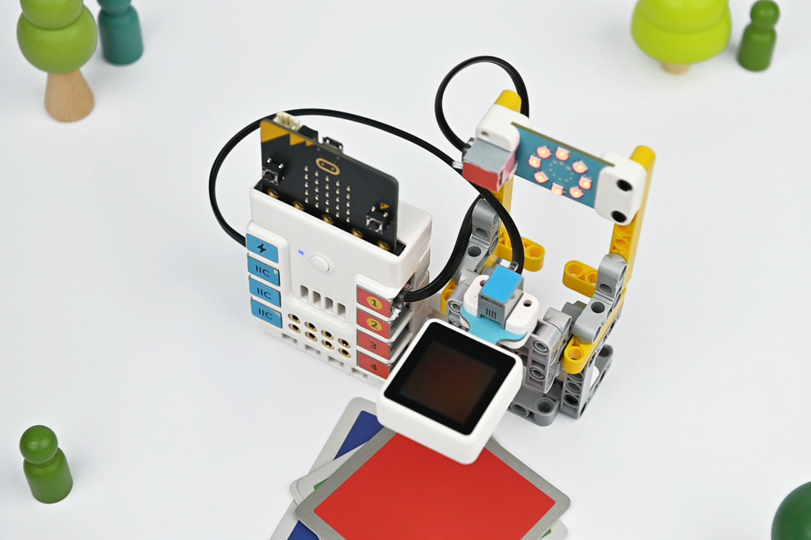
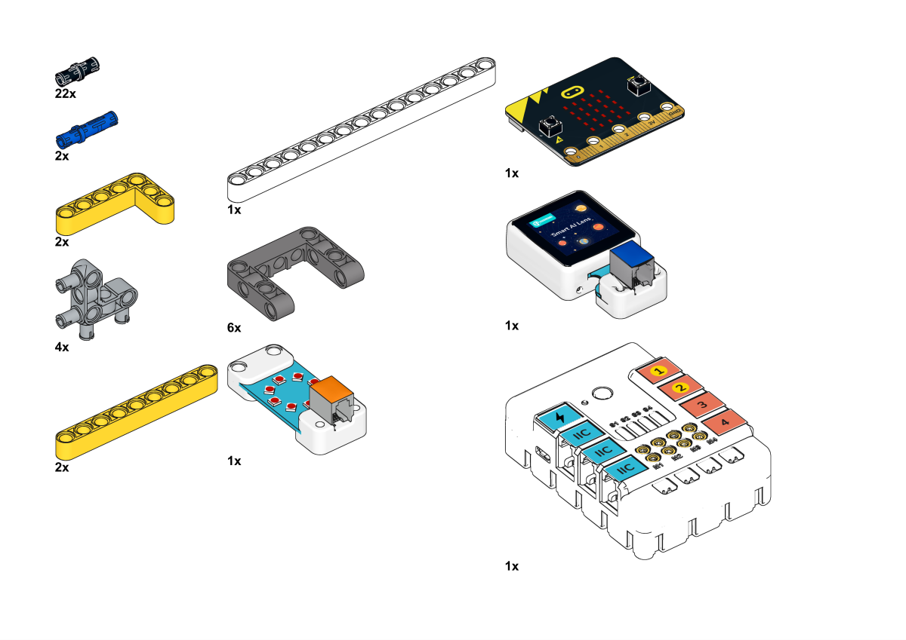
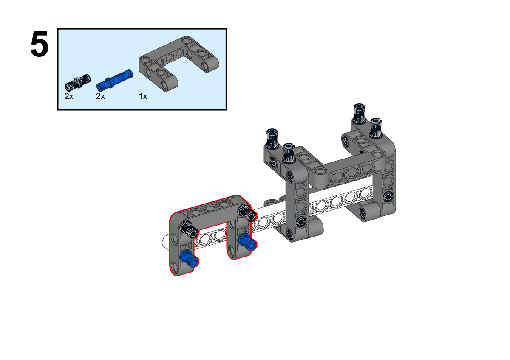
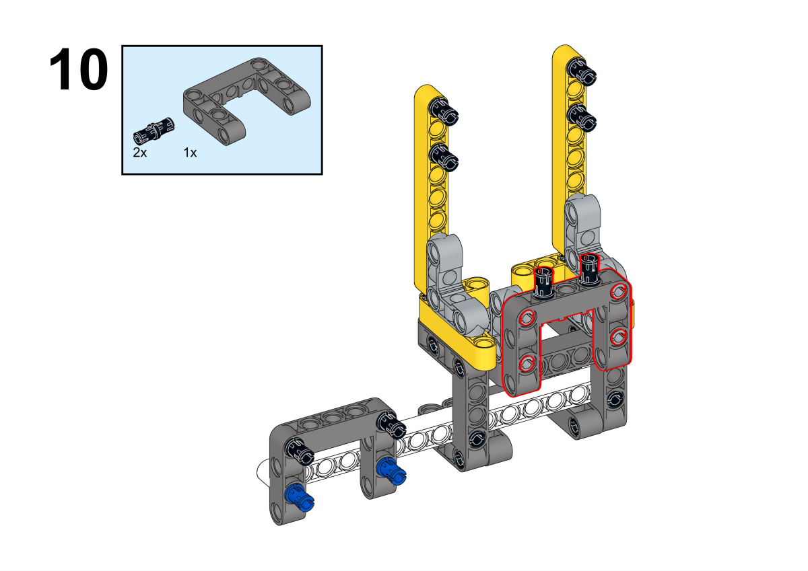

# Case 05 颜色识别灯

## 简介

本课程将带领学生们使用哪吒发明家套装V2和AI扩展包，制作一个颜色识别灯。通过学习颜色识别技术，学生们将能够让灯光根据识别到的颜色变化，创造出独特的灯光效果。

## 教学目标

- 了解颜色识别的基本原理。
- 学习使用AI摄像头进行颜色识别的操作。
- 掌握将颜色识别与灯光控制相结合的方法。
- 培养学生的动手实践能力和创新思维。

## 教学准备

[哪吒发明家套装 V2](https://www.elecfreaks.com/nezha-inventor-s-kit-v2-for-micro-bit.html)

[AI扩展包](https://www.elecfreaks.com/nezha-inventor-s-kit-v2-for-micro-bit.html)

电脑

## 教学过程

### 引入

>教师可以引导学生思考以下问题：什么是颜色识别技术？它在现实生活中有哪些应用？如何将这个技术应用于一个有趣的装置中，比如一个颜色识别灯？通过这些问题，激发学生的兴趣，并引导他们思考如何将技术与创意相结合。

大家好，今天我们将一起制作一个非常有趣的项目——颜色识别灯。这个灯可以根据识别到的颜色变化，产生不同的灯光效果。例如，当识别到红色卡片时，灯光会变成红色；当识别到蓝色卡片时，灯光会变成蓝色。那么，这个颜色识别灯是怎么实现的呢？让我们一起探索吧！

### 探究

>分组讨论，让学生思考如何用AI摄像头来制作一个颜色识别灯，重点关注颜色识别功能的使用和颜色识别技术的在生活中可能的应用场景。

- AI摄像头是如何识别颜色的？
- 颜色识别技术有什么实际应用？

### 实践

>分组动手，按照自己的设计方案，用积木材料来制作一个颜色识别灯。

按照自己的设计方案，用积木材料来制作一个颜色识别灯。

#### 示例

##### 搭建步骤

**搭建完成**

##### 硬件连接

将彩虹灯环连接到哪吒扩展板的J1接口，将AI摄像头连接到哪吒扩展板的IIC接口。

 

##### 软件编程

打开编程平台[makecode](https://makecode.microbit.org/#)

新建项目

点击扩展

在搜索栏搜索`planetx`添加行星系列传感器的扩展库

编写程序

程序链接:[https://makecode.microbit.org/_6F4VKTMWicoq](https://makecode.microbit.org/_6F4VKTMWicoq)

你也可以通过以下网页直接下载程序。

    <iframe
        src="https://makecode.microbit.org/_6F4VKTMWicoq"
        frameborder="0"
        sandbox="allow-popups allow-forms allow-scripts allow-same-origin"
        style={{
            position: 'absolute',
            width: '100%',
            height: '100%',
        }}
    />

### 团队合作与展示

学生分成小组，共同完成案例的制作和程序编写。

鼓励学生之间相互合作、交流和分享经验。

每个小组有机会向其他小组展示他们制作的案例。

#### 示例案例效果

在摄像头下方放下一个颜色卡片，彩虹灯环的灯光会根据识别到的颜色自动变化色彩。

### 反思

>分组分享，让每组的学生分享自己的制作过程和心得，总结自己遇到的问题和解决办法，评价自己的优点和不足。-->

### 扩展知识

*** 颜色识别技术的基本原理 ***

颜色识别技术的基本原理是基于图像处理和计算机视觉的技术。它通过摄像头采集图像，然后利用算法对图像中的颜色进行识别和分析，从而实现对颜色属性的识别。

具体来说，颜色识别技术首先对图像进行预处理，包括图像的增强、去噪和归一化等操作，以提高图像的质量和识别准确率。然后，通过对每个像素的颜色值进行分析，可以得到每个像素的RGB（红绿蓝）值。RGB值是描述颜色的一种常见方式，它分别表示红色、绿色和蓝色的亮度。通过对RGB值进行计算和比较，可以确定像素的颜色属性。

常用的颜色识别方法有基于阈值的颜色识别、基于颜色的颜色识别和基于图像分割的颜色识别等。其中，基于阈值的颜色识别是最简单的一种方法，它通过设定不同的阈值，将图像中的颜色分为不同的类别。基于颜色的颜色识别是一种基于颜色的分布特征的识别方法，它通过对图像中每个像素的颜色进行统计和分布分析，实现颜色的识别。而基于图像分割的颜色识别则是在整个图像中根据颜色进行分割，从而得到不同区域的颜色属性。

*** 颜色识别技术在生活中的实际应用 ***

颜色识别技术在现实生活中有广泛的应用，以下是几个常见的例子：

工业生产：在工业生产中，颜色识别技术可以用于产品质量检测，例如在制药、食品、化工等行业，通过颜色识别技术对产品进行自动化检测，保证产品的质量和稳定性。

交通行业：在交通行业中，颜色识别技术可以用于交通信号灯的识别和交通拥堵的检测。例如，通过颜色识别技术对摄像头拍摄的交通图像进行分析，可以实现交通信号灯的自动识别和交通拥堵的检测，提高交通效率。

零售行业：在零售行业中，颜色识别技术可以用于商品识别和销售分析。例如，通过颜色识别技术对摄像头拍摄的商品图像进行分析，可以实现商品的自动识别和销售统计，提高销售效率和管理水平。

医疗行业：在医疗行业中，颜色识别技术可以用于病理图像分析和疾病诊断。例如，通过颜色识别技术对病理图像进行分析，可以实现疾病的自动化诊断和病情监测，提高医疗水平和效率。

智能家居：在智能家居中，颜色识别技术可以用于智能灯光控制和环境监测。例如，通过颜色识别技术对环境光的颜色进行识别和分析，可以实现智能灯光的自动调节和环境温湿度的监测，提高居住舒适度和节能效果。

这些例子表明，颜色识别技术在各个领域都有广泛的应用，为人们的生活和工作带来了便利和效益。
