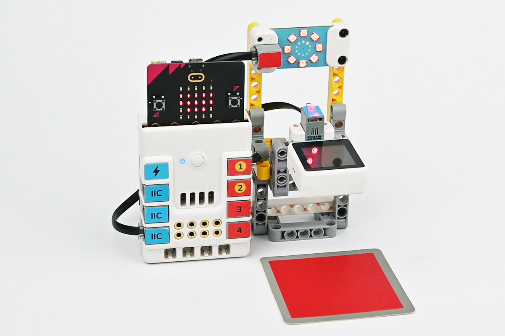

# Case 06 记忆力小游戏

## 简介

本课程将带领学生们使用哪吒发明家套装V2和AI扩展包，制作一个记忆力小游戏。通过学习颜色识别技术，学生们将能够让装置根据识别到的颜色顺序亮起灯光，然后玩家需要根据灯光颜色的顺序来放入对应的颜色卡片，卡片放入的顺序和颜色都正确即为胜利。

## 教学目标

- 了解颜色识别的基本原理。
- 学习使用AI摄像头进行颜色识别的操作。
- 掌握将颜色识别与装置控制相结合的方法。
- 培养学生的动手实践能力和创新思维。

## 教学准备

[哪吒发明家套装 V2](https://www.elecfreaks.com/nezha-inventor-s-kit-v2-for-micro-bit.html)

[AI扩展包](https://www.elecfreaks.com/nezha-inventor-s-kit-v2-for-micro-bit.html)

电脑

## 教学过程

### 引入

>教师可以引导学生思考以下问题：颜色识别功能在现实生活中还有哪些有趣的应用？通过这些问题，激发学生的兴趣，并引导他们思考如何将技术与创意相结合。

大家好，今天我们将一起制作一个非常有趣的记忆力小游戏。在这个游戏中，装置会先亮起不同颜色的灯光，然后玩家需要根据灯光颜色的顺序来放入对应的颜色卡片。如果玩家放入的卡片顺序和颜色都正确，那么他就赢了。那么，这个记忆力小游戏是怎么实现的呢？让我们一起探索吧！

### 探究

>分组讨论，让学生思考如何用AI摄像头来制作一个有趣的小游戏。

- 如何优化记忆力小游戏的难度和趣味性？

### 实践

>分组动手，按照自己的设计方案，用积木材料来制作一个记忆力小游戏。

按照自己的设计方案，用积木材料来制作一个记忆力小游戏。

#### 示例

##### 搭建步骤

**搭建完成**

##### 硬件连接

将彩虹灯环连接到哪吒扩展板的J1接口，将AI摄像头连接到哪吒扩展板的IIC接口。

 

##### 软件编程

打开编程平台[makecode](https://makecode.microbit.org/#)

新建项目

点击扩展

在搜索栏搜索`planetx`添加行星系列传感器的扩展库

编写程序

程序链接:[https://makecode.microbit.org/_M2uiPfajCEjA](https://makecode.microbit.org/_M2uiPfajCEjA)

你也可以通过以下网页直接下载程序。

    <iframe
        src="https://makecode.microbit.org/_M2uiPfajCEjA"
        frameborder="0"
        sandbox="allow-popups allow-forms allow-scripts allow-same-origin"
        style={{
            position: 'absolute',
            width: '100%',
            height: '100%',
        }}
    />

### 团队合作与展示

学生分成小组，共同完成案例的制作和程序编写。

鼓励学生之间相互合作、交流和分享经验。

每个小组有机会向其他小组展示他们制作的案例。

#### 示例案例效果

记忆力小游戏装置通过使用AI摄像头的颜色识别功能，识别卡片颜色，玩家按下徽标后，装置先亮起不同颜色的灯光，然后玩家需要根据灯光颜色的顺序来放入对应的颜色卡片，并按下按钮A进行确认，最后按下按钮B确认所有的操作已经完成，最后装置会根据卡片放入的顺序和颜色进行判断，当卡片放入的顺序和颜色都正确即为胜利。

### 反思

>分组分享，让每组的学生分享自己的制作过程和心得，总结自己遇到的问题和解决办法，评价自己的优点和不足。
