# Case 07 AI路牌识别车

## 简介

本课程将引导学生使用哪吒发明家套装V2和AI扩展包制作一个人脸追踪装置。通过结合机械设计和人工智能技术，学生将学习如何使用AI摄像头的人脸识别功能。这个项目将培养学生的创新思维和问题解决能力，让他们体验到科技与机械的融合。

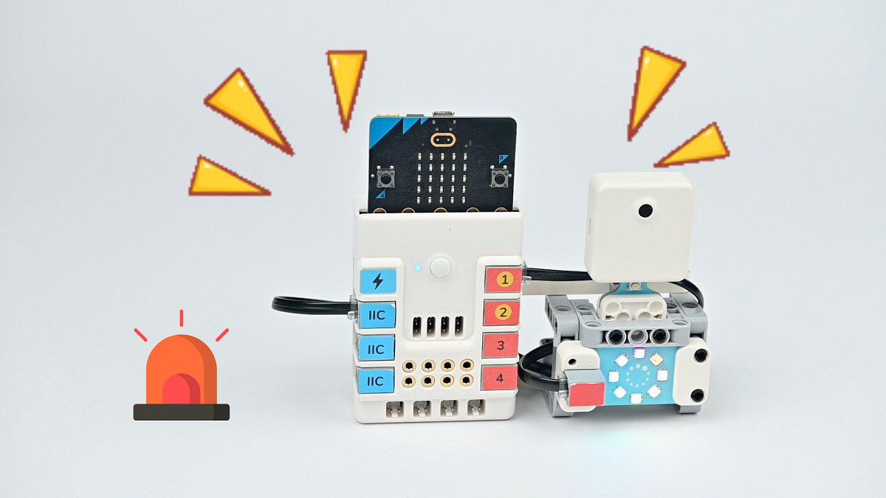

## 教学目标

- 了解AI摄像头的人脸识别原理和功能。
- 学会制作AI人脸追踪装置。
- 学习蜗轮蜗杆的原理和运用。
- 培养解决问题和创意设计的能力。

## 教学准备

[哪吒发明家套装 V2](https://www.elecfreaks.com/nezha-inventor-s-kit-v2-for-micro-bit.html)

[AI扩展包](https://www.elecfreaks.com/nezha-inventor-s-kit-v2-for-micro-bit.html)

电脑

## 教学过程

### 引入

>教师可以引导学生思考以下问题：什么是人脸识别技术？它在现实生活中有哪些应用？如何将这个技术应用于一个有趣的装置中，比如一个人脸追踪装置？通过这些问题，激发学生的兴趣，并引导他们思考如何将技术与创意相结合。

大家好！在今天的课程中，我们将进入一个充满科技的世界，一起制作一个超酷的AI人脸追踪装置。这个装置能够像魔法一样，通过AI摄像头的人脸识别功能，检测预定范围内是否有人接近，并将注意力集中在他们身上。

同时，我们会引入蜗轮蜗杆的知识，这是一个可以在机械装置中实现非常有趣功能的概念。让我们一起动手，将这些知识和技能结合，创造出一个令人惊叹的AI人脸追踪装置吧！

你们准备好了吗？让我们一起进入这个创新的世界，用科技的魔力创造奇迹！"

### 探究

>分组讨论，让学生思考如何用AI摄像头来制作一个AI人脸追踪装置，重点关注人脸识别功能的使用和人脸识别装置的在生活中可能的应用场景。

- 人脸识别技术是如何工作的？它如何识别人的脸部？
- AI人脸追踪装置如何工作？
- AI人脸追踪装置如何工作？
- 这个装置有什么实际应用？

### 实践

>分组动手，按照自己的设计方案，用积木材料来制作一个AI人脸追踪装置。

按照自己的设计方案，用积木材料来制作一个AI人脸追踪装置。

#### 示例

##### 搭建步骤

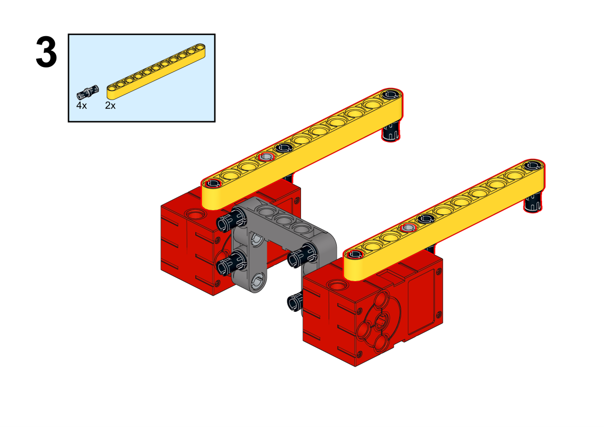

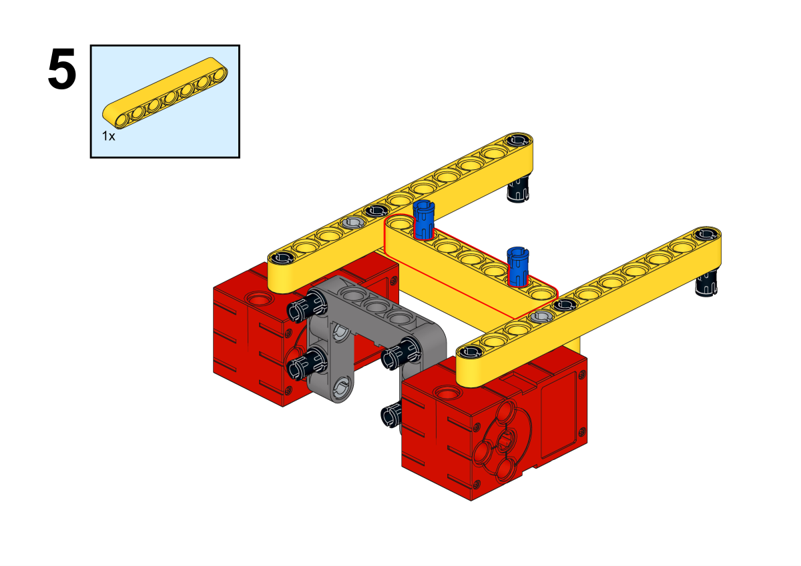

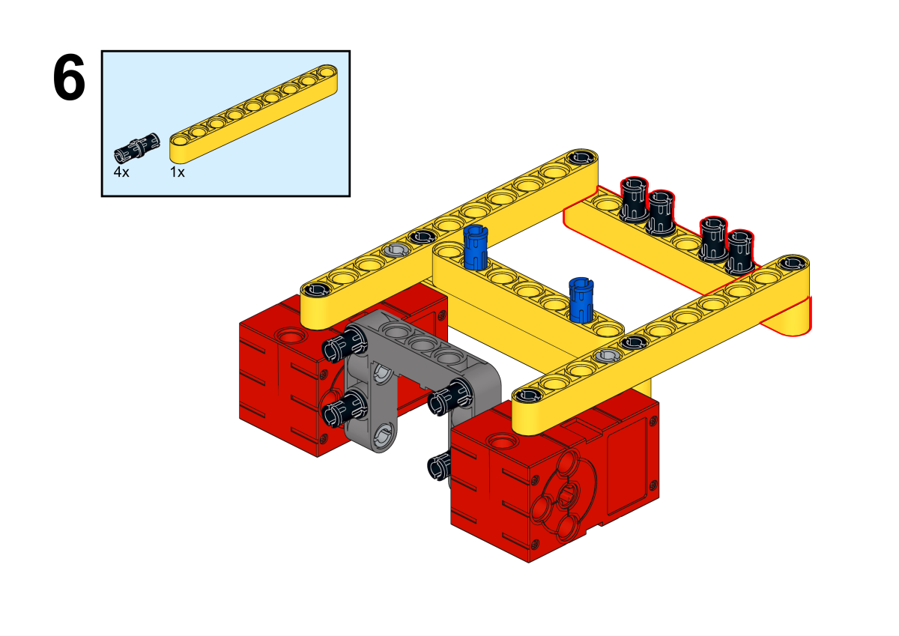

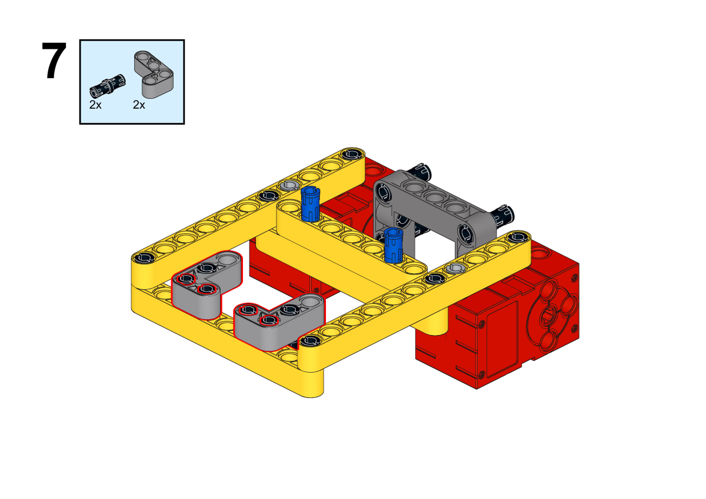

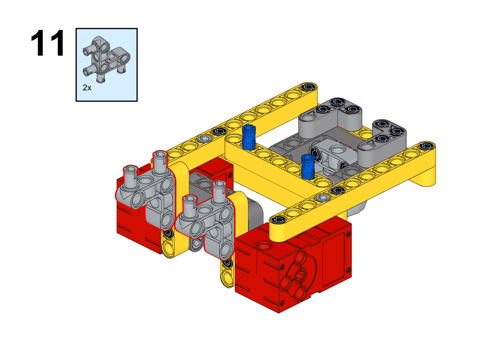

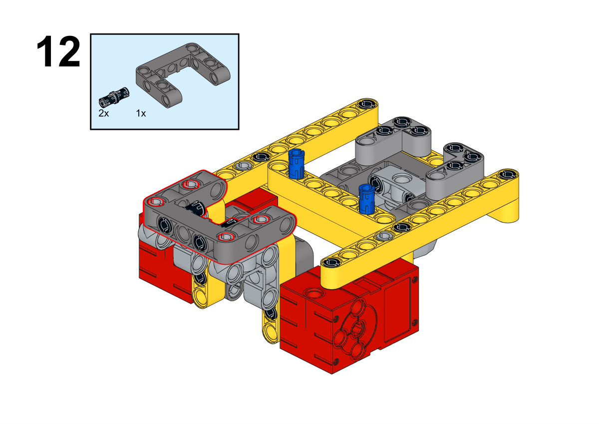

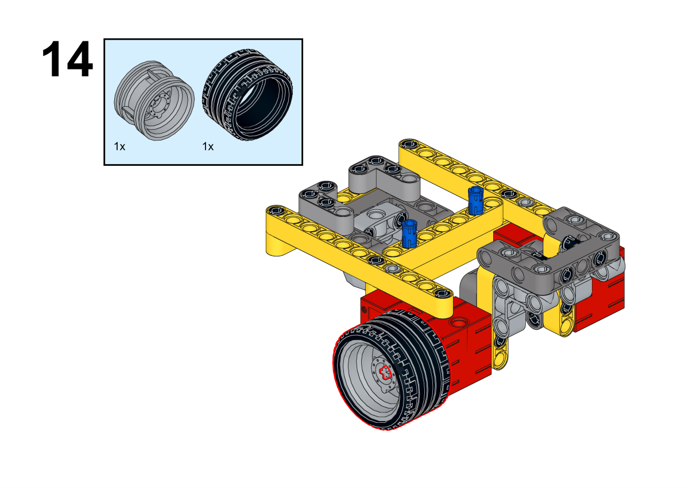

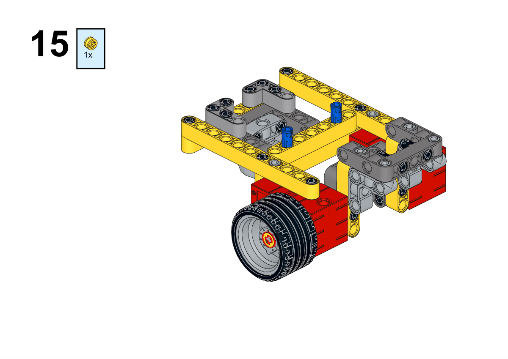

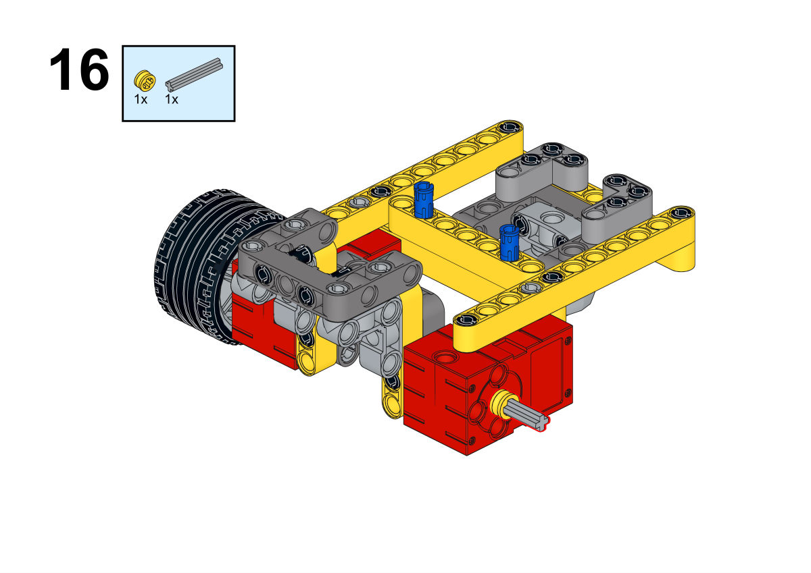

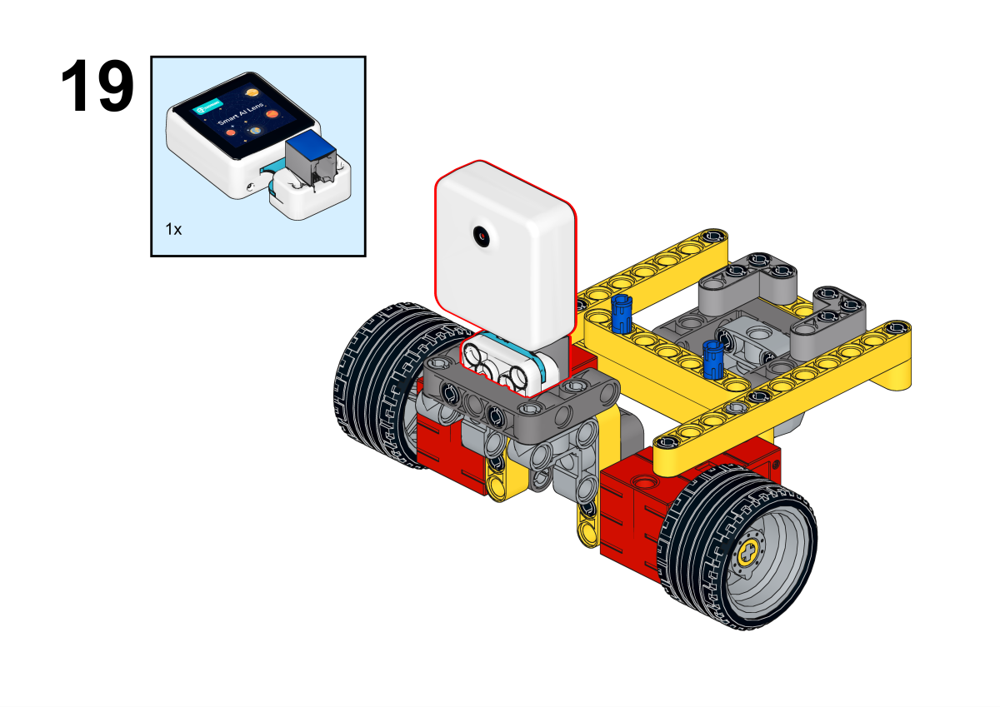

**搭建完成**

##### 硬件连接

将两个电机分别连接到哪吒扩展板的M1和M2接口，将AI摄像头连接到哪吒扩展板的IIC接口。

 

##### 软件编程

打开编程平台[makecode](https://makecode.microbit.org/#)

新建项目

点击扩展

在搜索栏搜索`nezha`添加哪吒多功能扩展盒的扩展库

在搜索栏搜索`planets`添加哪吒多功能扩展盒的扩展库

编写程序

程序链接:[https://makecode.microbit.org/_DhcWbYUAWYcK](https://makecode.microbit.org/_DhcWbYUAWYcK)

你也可以通过以下网页直接下载程序。

    <iframe
        src="https://makecode.microbit.org/_DhcWbYUAWYcK"
        frameborder="0"
        sandbox="allow-popups allow-forms allow-scripts allow-same-origin"
        style={{
            position: 'absolute',
            width: '100%',
            height: '100%',
        }}
    />

### 展示

>分组展示，让每组的机器人在横杆上做引体向上运动，并用计时器记录时间，比较各组的成果和效果。

#### 示例案例效果

按下micro:bit上的A键，机器人开始做引体向上运动，按下micro:bit上的B键，机器人停止做引体向上运动。

### 反思

>分组分享，让每组的学生分享自己的制作过程和心得，总结自己遇到的问题和解决办法，评价自己的优点和不足。
