# Case 10 语音识别风扇

## 简介

本课程旨在引导学生使用哪吒发明家套装V2和AI扩展包来制作一个具有语音识别功能的风扇控制系统。通过这个项目，学生将学习如何将科技与生活实际应用相结合，培养他们的STEAM（科学、技术、工程、艺术、数学）技能，提高问题解决和创造力。

## 教学目标

- 了解语音识别技术的基本原理和应用。
- 掌握哪吒发明家套装V2和AI扩展包的基本使用方法。
- 学会构建一个具有语音识别功能的风扇控制系统。
- 提高团队协作和创造性解决问题的能力。

## 教学准备

[哪吒发明家套装 V2](https://www.elecfreaks.com/nezha-inventor-s-kit-v2-for-micro-bit.html)

[AI扩展包](https://www.elecfreaks.com/nezha-inventor-s-kit-v2-for-micro-bit.html)

电脑

## 教学过程

### 引入

>教师可以引导学生思考以下问题：什么是语音识别技术，语音识别技术有什么应用场景。

大家好，今天我们将进入科技的世界，学习如何使用哪吒发明家套装V2和AI扩展包制作一个神奇的语音识别风扇控制系统。你是否曾想过只需说一句话，就能控制风扇的开启、关闭、调节档位甚至是否摇头？这是我们今天要一起探索的问题，让我们开始这个充满创意和技术挑战的项目。

### 探究

>分组讨论，让学生思考如何用语音识别传感器来制作一个语音识别风扇。

- 什么是语音识别技术，它如何应用于风扇控制系统？
- 如何设计并实现语音指令来控制风扇的各种功能？

### 实践

>分组动手，按照自己的设计方案，用积木材料来制作一个语音识别风扇。

按照自己的设计方案，用积木材料来制作一个语音识别风扇。

#### 示例

##### 搭建步骤

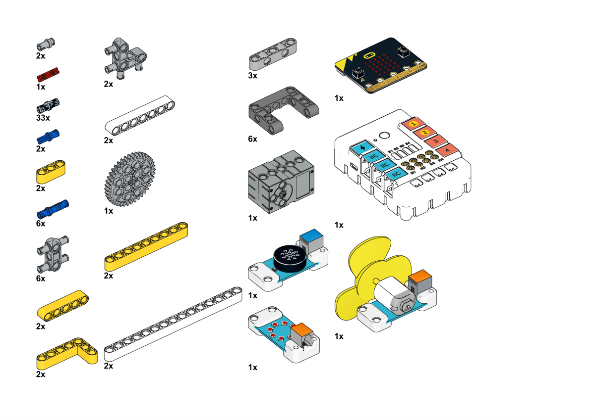

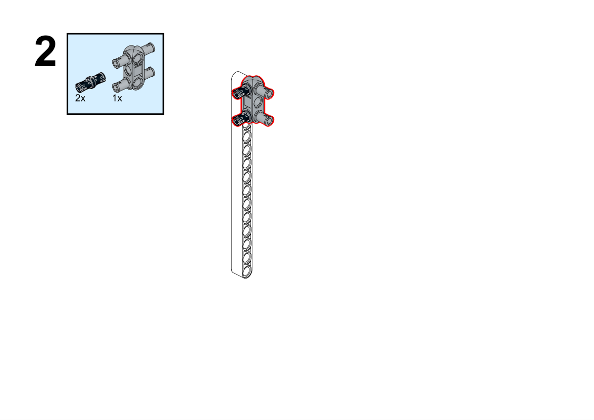

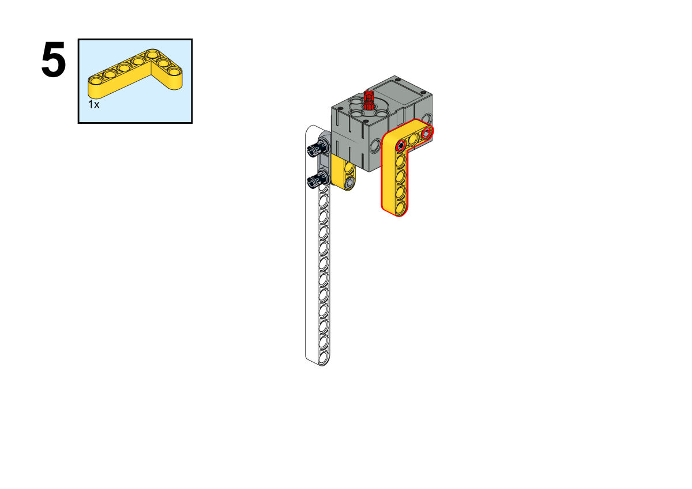

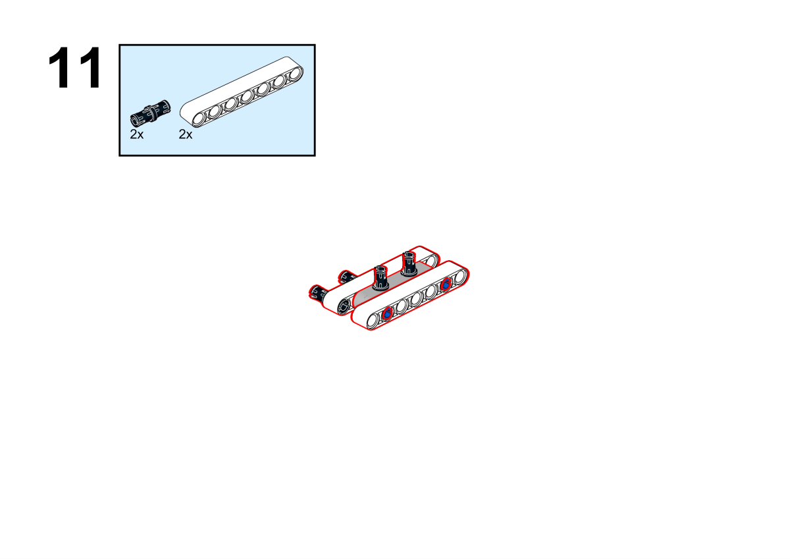

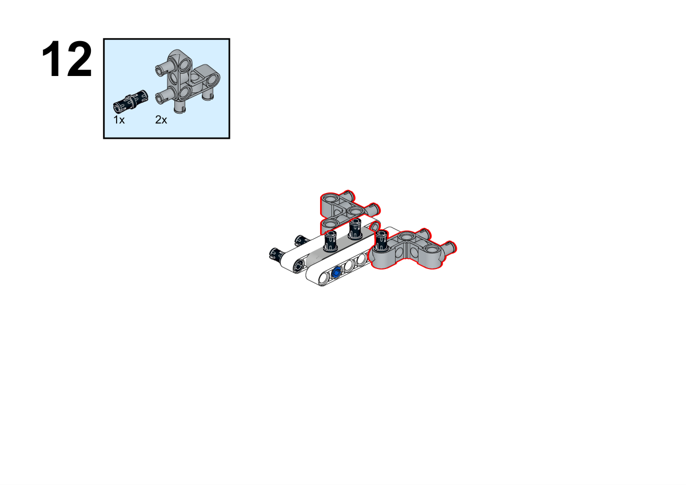

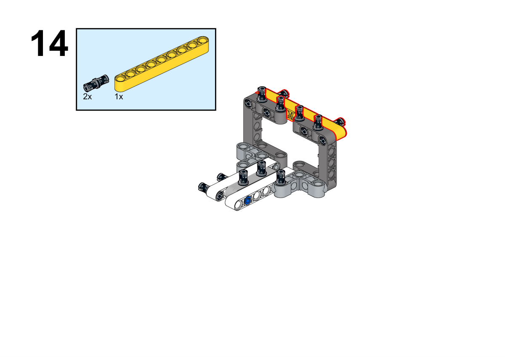

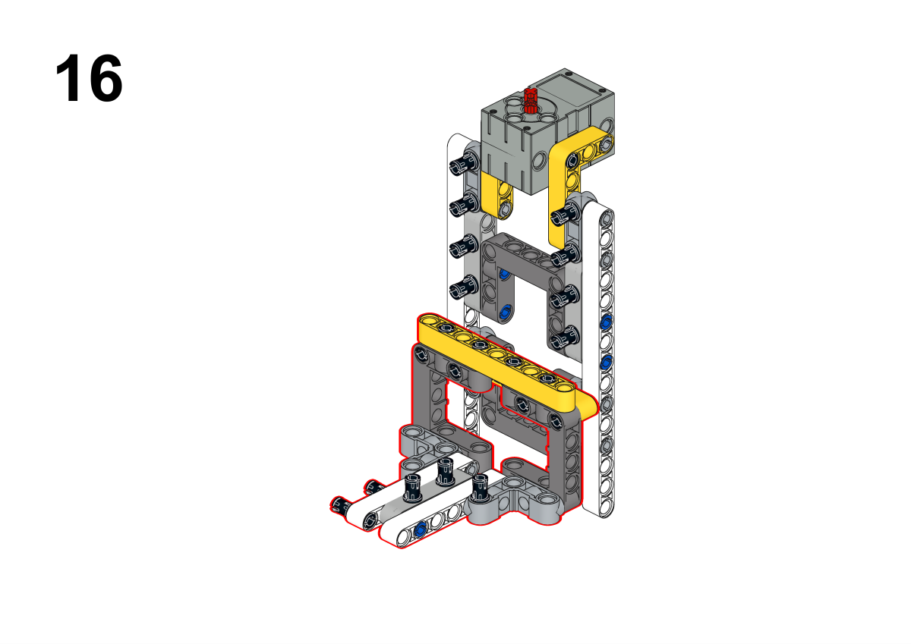

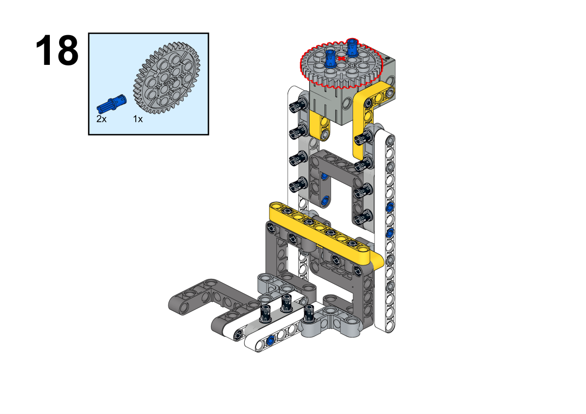

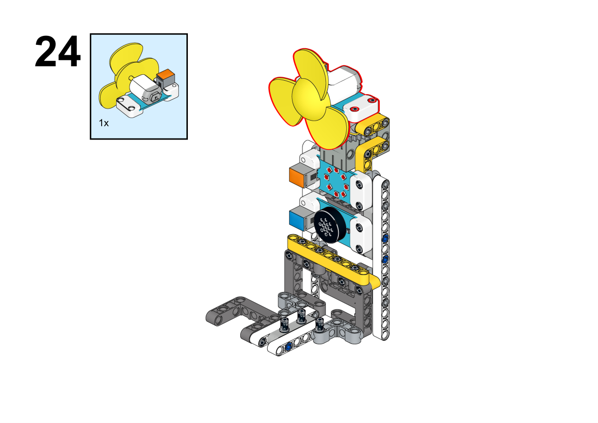

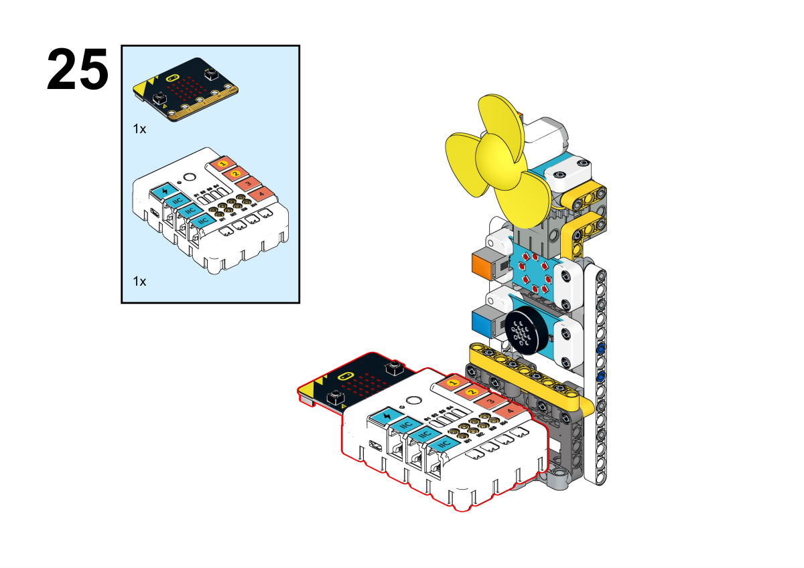

**搭建完成**

##### 硬件连接

将彩虹灯环连接到哪吒扩展板的J1接口，舵机连接到哪吒扩展板的J1接口，风扇连接到哪吒扩展板的J2接口，将语音识别传感器连接到哪吒扩展板的IIC接口。

 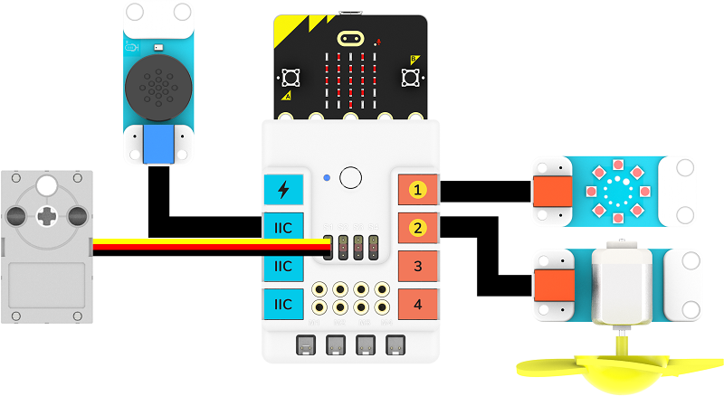

##### 软件编程

打开编程平台[makecode](https://makecode.microbit.org/#)

新建项目

点击扩展

在搜索栏搜索`nezha`添加哪吒多功能扩展盒的扩展库

在搜索栏搜索`planetx`添加行星系列传感器的扩展库

编写程序

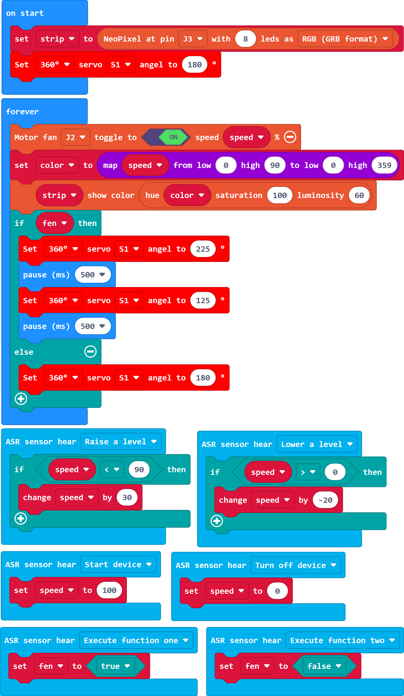

程序链接:[https://makecode.microbit.org/_WoURtRcYmHk6](https://makecode.microbit.org/_WoURtRcYmHk6)

你也可以通过以下网页直接下载程序。

    <iframe
        src="https://makecode.microbit.org/_WoURtRcYmHk6"
        frameborder="0"
        sandbox="allow-popups allow-forms allow-scripts allow-same-origin"
        style={{
            position: 'absolute',
            width: '100%',
            height: '100%',
        }}
    />

### 团队合作与展示

学生分成小组，共同完成案例的制作和程序编写。

鼓励学生之间相互合作、交流和分享经验。

每个小组有机会向其他小组展示他们制作的案例。

#### 示例案例效果

通过语音即可控制风扇的开启、关闭、档位、是否摇头等功能。

### 反思

>分组分享，让每组的学生分享自己的制作过程和心得，总结自己遇到的问题和解决办法，评价自己的优点和不足。

### 扩展知识

*** 语音识别技术的基本原理 ***

语音识别技术，也被称为自动语音识别（Automatic Speech Recognition，ASR），是一种用于将人类语音转换为文本或命令的技术。其原理涉及多个步骤和复杂的模型，以下是语音识别技术的基本原理：

音频输入：语音识别系统首先接收到来自麦克风或音频文件的声音信号。这个信号是连续的模拟波形。

预处理：在分析语音之前，通常需要进行预处理。这包括去噪，降低背景噪音的影响，以及进行语音信号的分帧，将连续的声音信号分割成短时间段的帧。

特征提取：从每个音频帧中提取特征。常用的特征包括梅尔频率倒谱系数（MFCC）和声学特征。这些特征表示声音的频率、能量和声学特性。

声学模型：使用声学模型来匹配音频特征与语音单位（音素）之间的关系。声学模型通常基于深度学习技术，如循环神经网络（RNN）或卷积神经网络（CNN），以学习音频特征与文本之间的映射关系。

语言模型：在语音转文本的过程中，语言模型考虑了词汇、语法和语境，以确定哪些词可能在特定上下文中出现。这有助于提高识别的准确性，特别是在有歧义的情况下。

解码器：解码器使用声学模型和语言模型，以及音频特征序列，来生成最可能的文本序列。这个过程被称为声学解码。

后处理：生成的文本可能包含错误，因此通常需要进行后处理，例如纠错和语法校正，以提高识别结果的质量。

输出结果：最终，语音识别系统输出识别出的文本或指令，以供应用程序或系统使用。

总的来说，语音识别技术基于声音特征的提取和深度学习模型的应用，通过模式匹配和语言模型来将声音转化为文本。这种技术在自然语言处理、智能助手、语音控制系统、语音翻译等领域具有广泛的应用。
