# Case 32 智能晾衣架

## 简介

制作一个智能晾衣架，当下雨时，装置上方的土壤湿度传感器检测到雨水，此时晾衣架自动收缩，当装置上方的土壤湿度传感器没有检测到雨水时，则晾衣架自动伸出。

## 购买链接

## 快速上手

### 搭建步骤

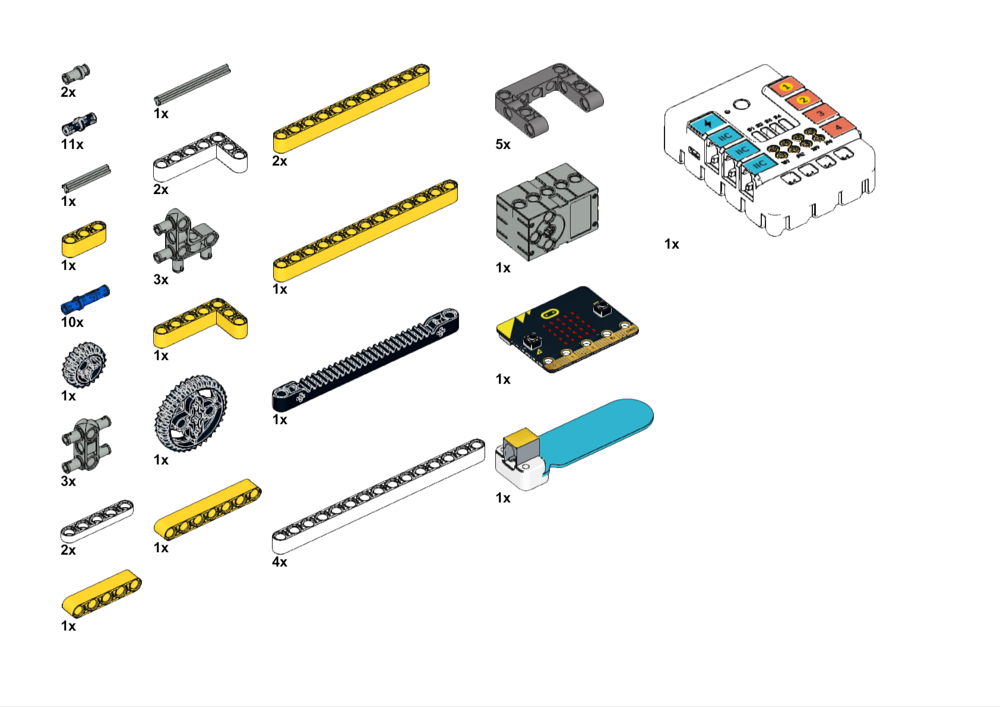

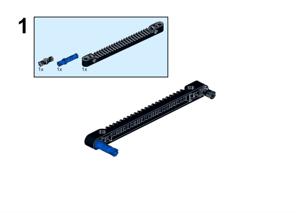

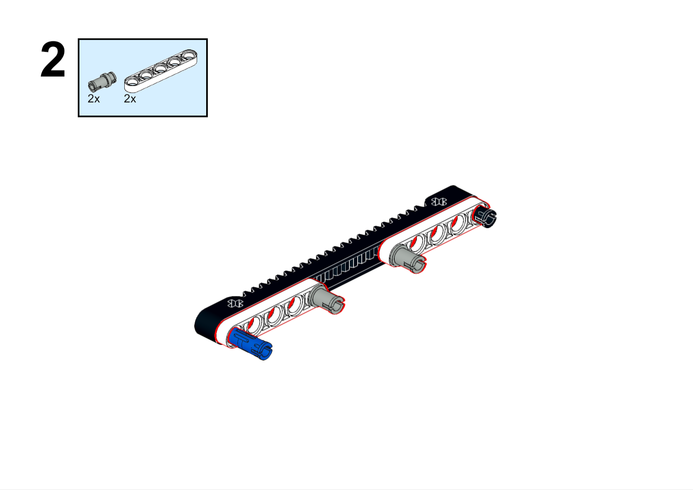

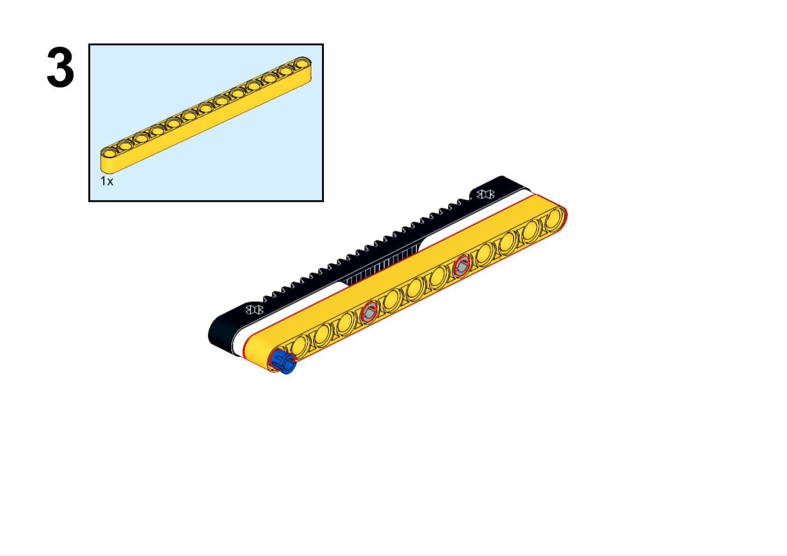

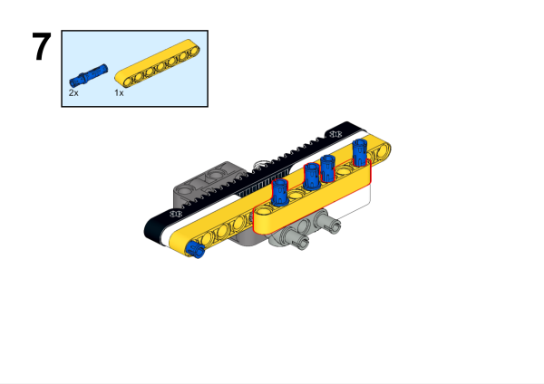

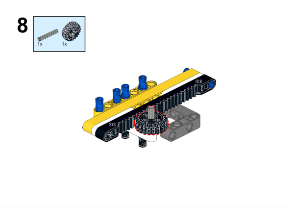

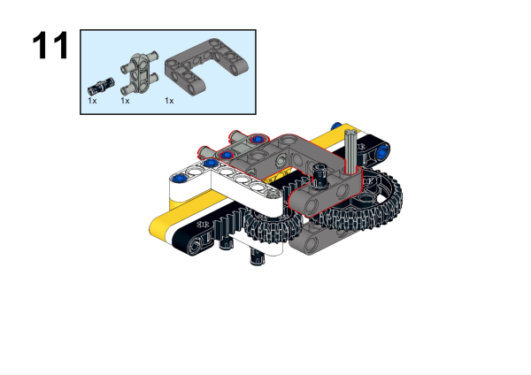

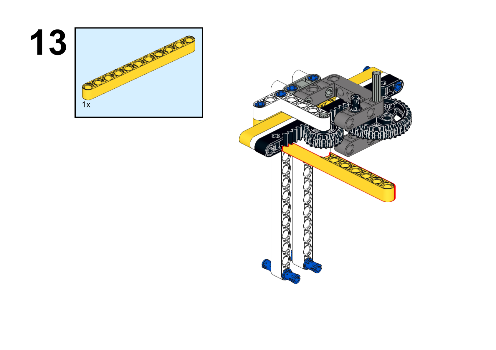

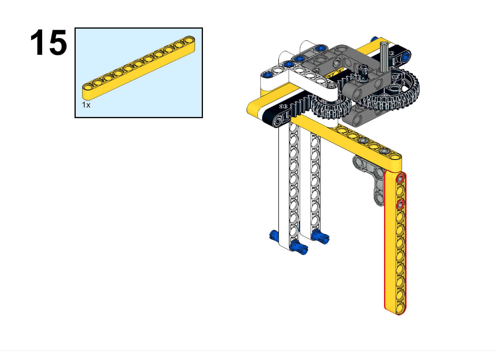

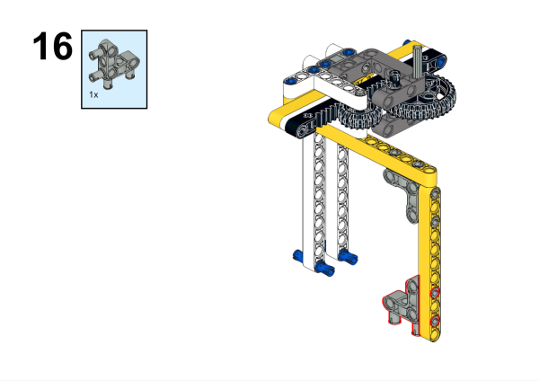

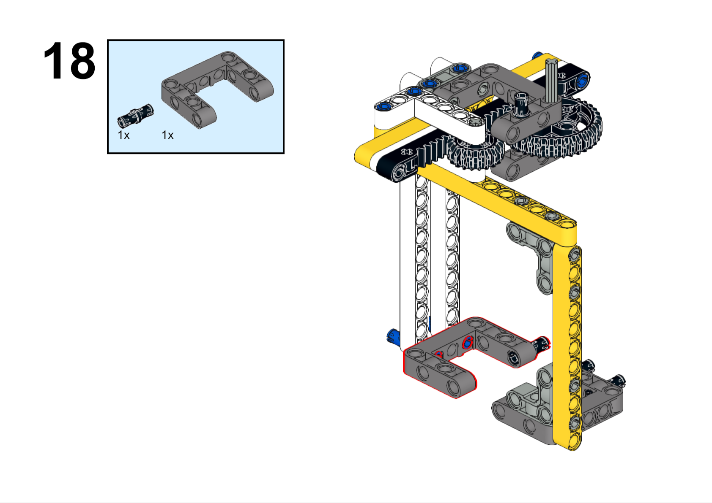

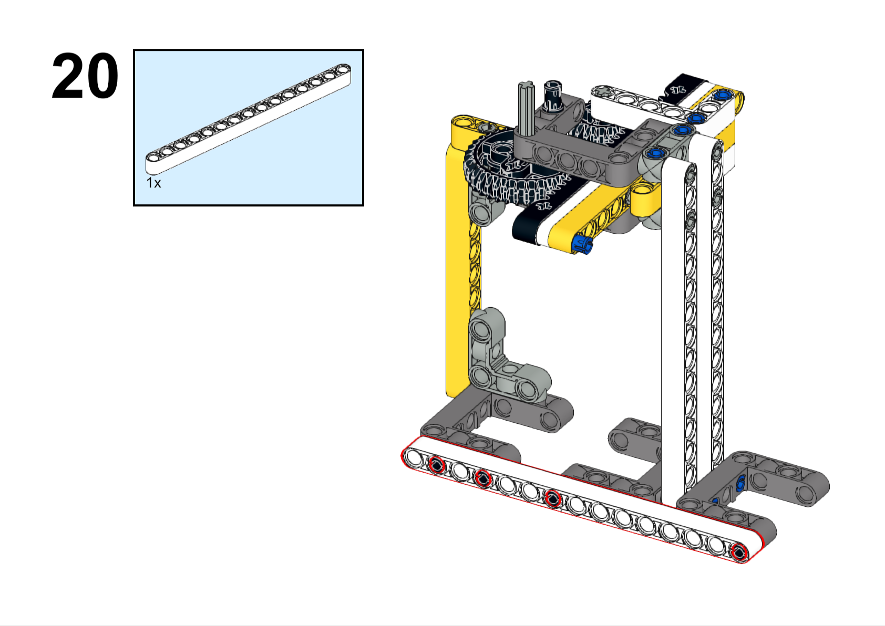

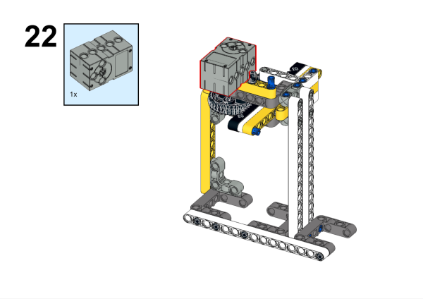

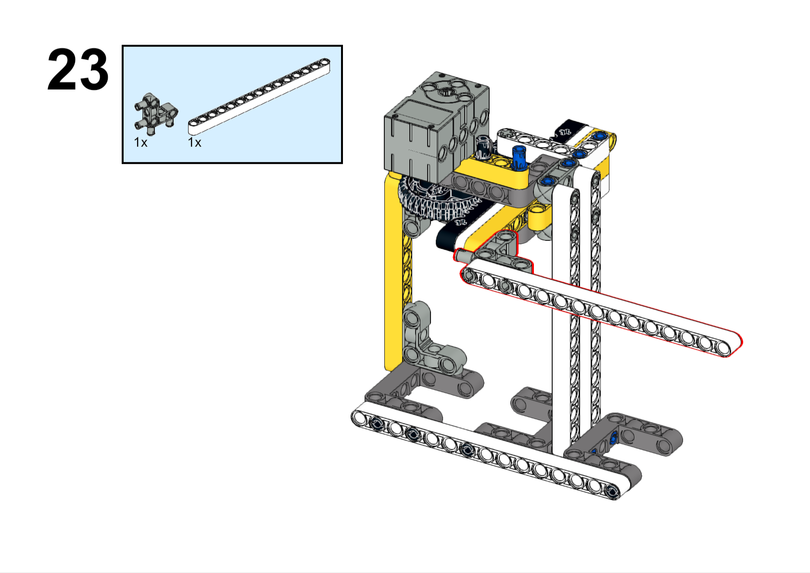

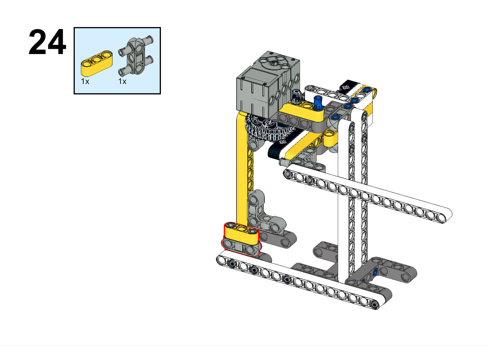

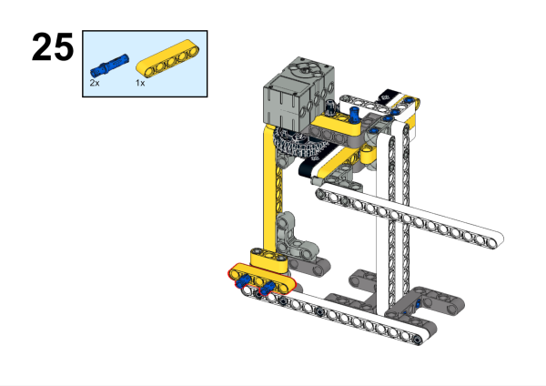

### 硬件连接

将碰撞传感器连接到哪吒扩展板的J1接口，将舵机连接到哪吒扩展板的S1接口。

### 软件编程

打开编程平台[makecode](https://makecode.microbit.org/#)

新建项目

点击扩展

在搜索栏搜索`PlanetX`添加行星系列传感器的扩展库

在搜索栏搜索`nezha`添加哪吒扩展板的扩展库

编写程序

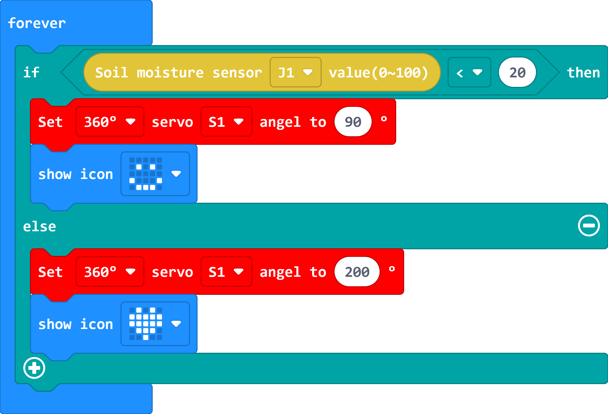

程序链接:[https://makecode.microbit.org/_bXf6baUgiDgX](https://makecode.microbit.org/_bXf6baUgiDgX)

你也可以通过以下网页直接下载程序。

    <iframe
        src="https://makecode.microbit.org/_bXf6baUgiDgX"
        frameborder="0"
        sandbox="allow-popups allow-forms allow-scripts allow-same-origin"
        style={{
            position: 'absolute',
            width: '100%',
            height: '100%',
        }}
    />

### 现象

当下雨时，装置上方的土壤湿度传感器检测到雨水，此时晾衣架自动收缩，当装置上方的土壤湿度传感器没有检测到雨水时，则晾衣架自动伸出。

