# Case 11 螃蟹

## 简介

制作一只可以发现避开障碍的螃蟹。

## 购买链接

## 快速上手

### 搭建步骤

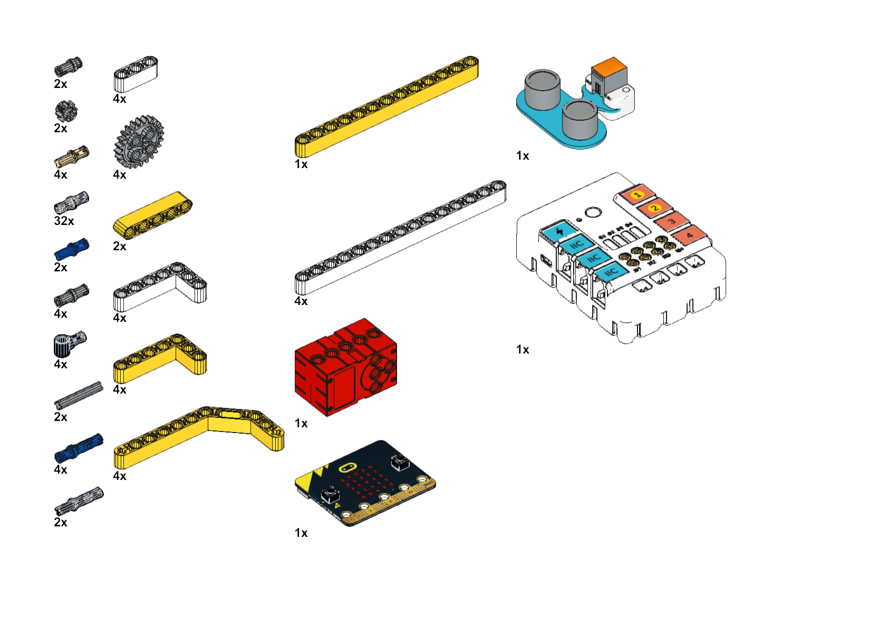

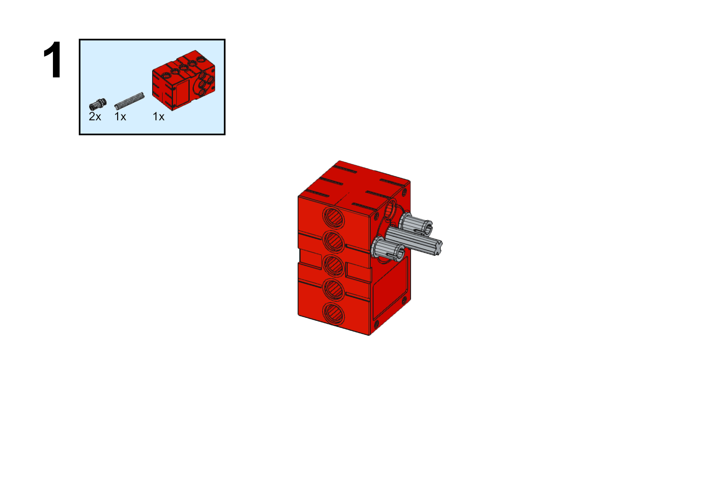

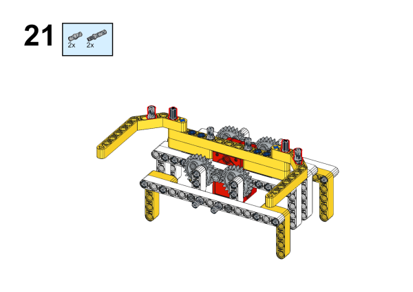

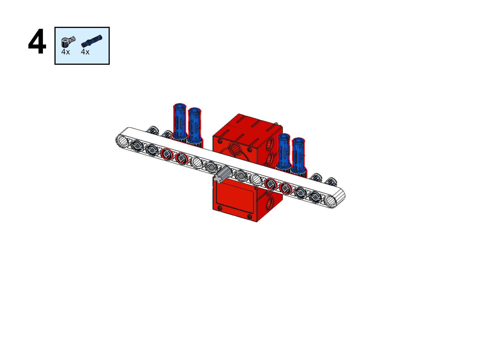

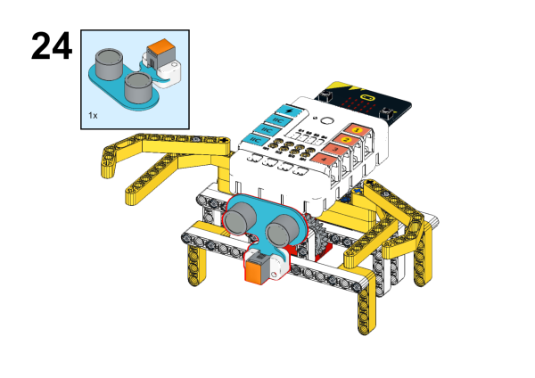

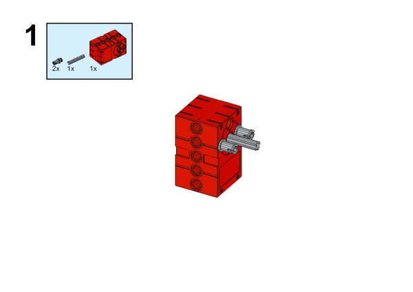

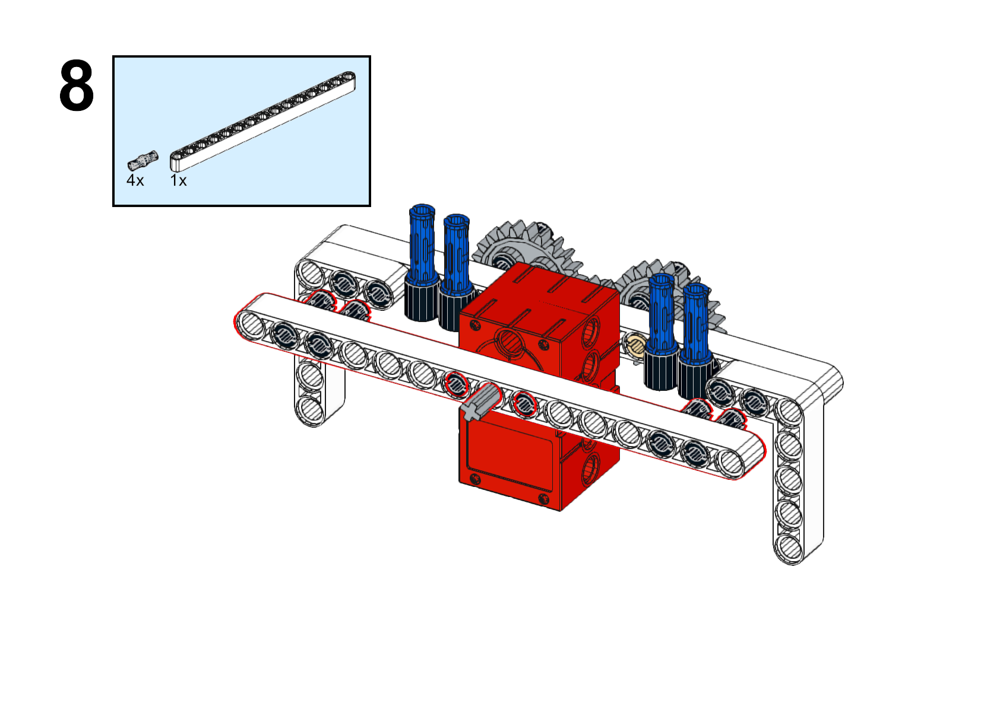

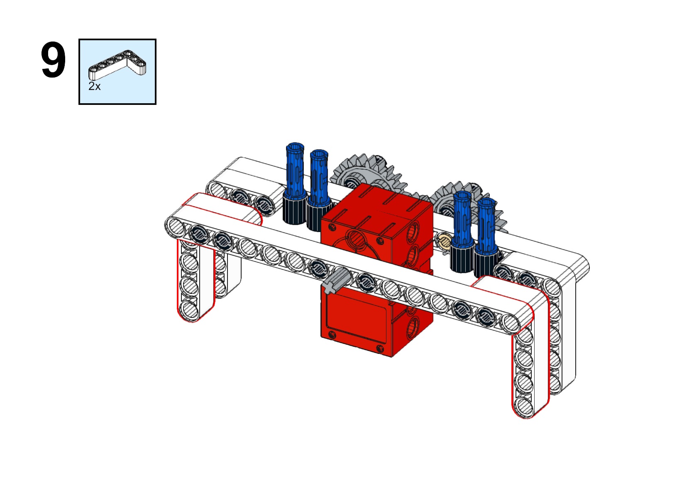

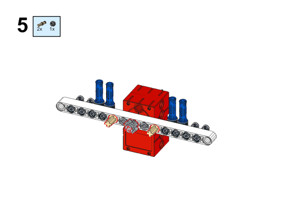

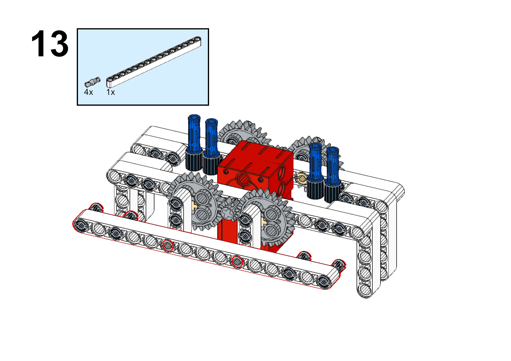

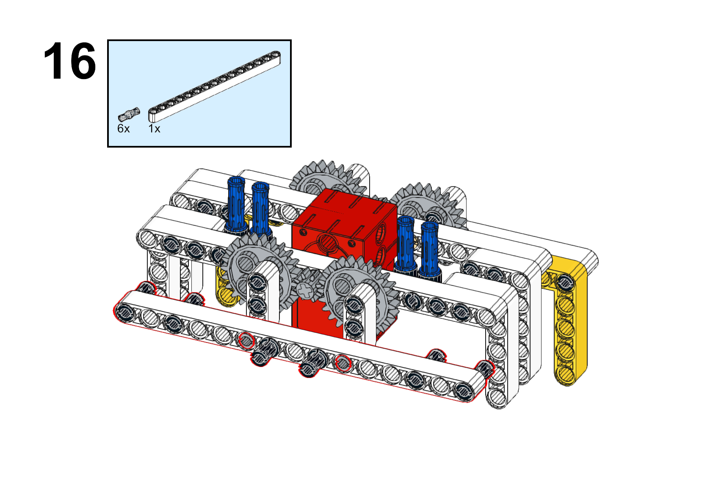

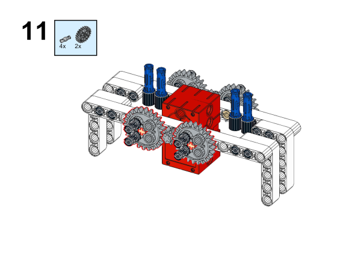

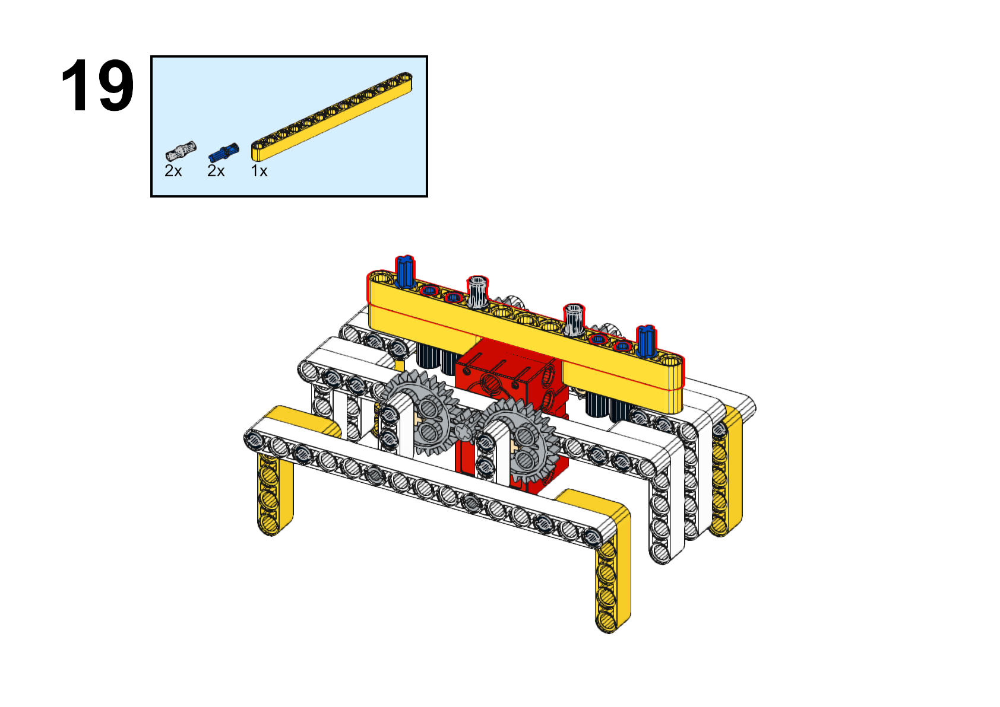

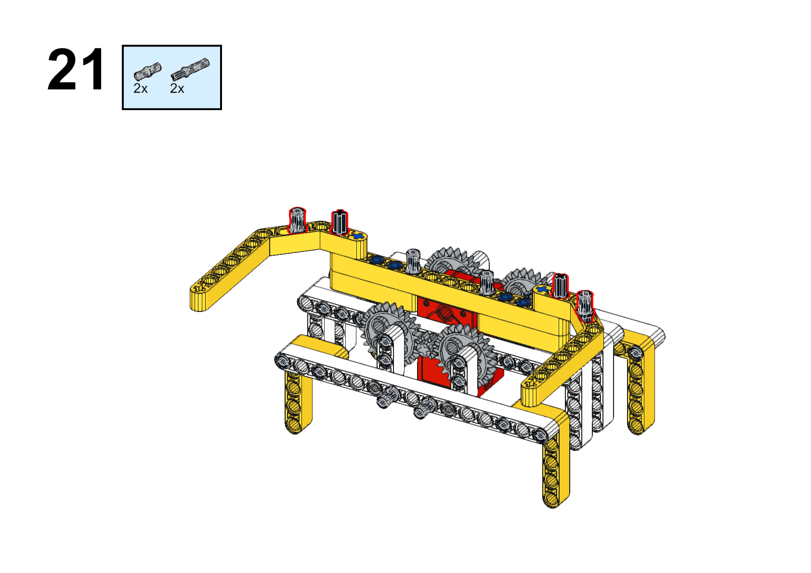

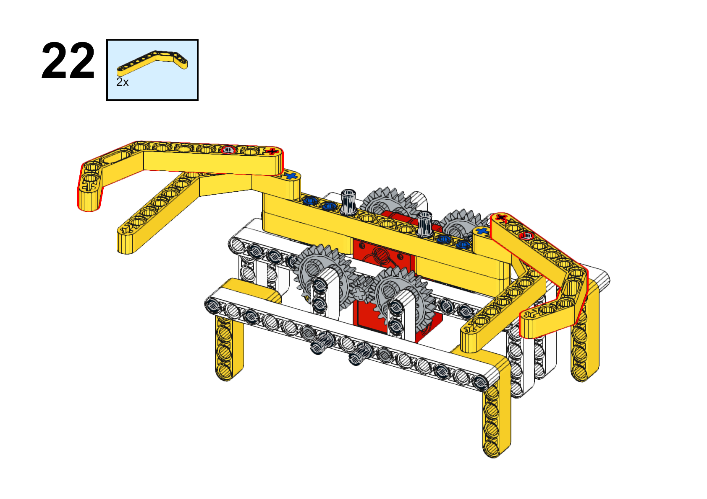

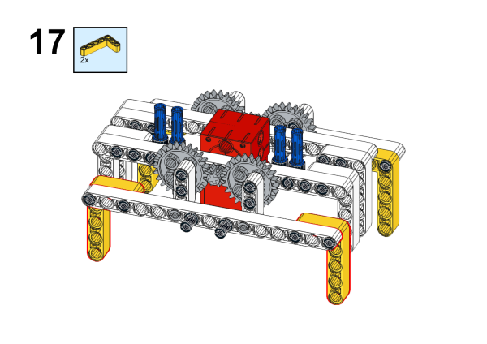

### 硬件连接

将超声波传感器连接到哪吒扩展板的J1接口，电机连接到哪吒扩展板的M1接口。

### 软件编程

打开编程平台[makecode](https://makecode.microbit.org/#)

新建项目

点击扩展

在搜索栏搜索`PlanetX`添加行星系列传感器的扩展库

在搜索栏搜索`nezha`添加哪吒扩展板的扩展库

编写程序

程序链接:[https://makecode.microbit.org/_7c7WtwVXyTRM](https://makecode.microbit.org/_7c7WtwVXyTRM)

你也可以通过以下网页直接下载程序。

    <iframe
        src="https://makecode.microbit.org/_7c7WtwVXyTRM"
        frameborder="0"
        sandbox="allow-popups allow-forms allow-scripts allow-same-origin"
        style={{
            position: 'absolute',
            width: '100%',
            height: '100%',
        }}
    />

### 现象

当有障碍物阻挡在螃蟹面前，螃蟹就会向旁边行走一段距离。

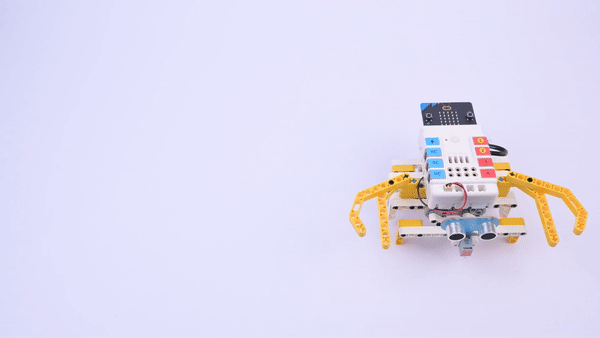
