# Case 17 打蛋器

## 简介

打蛋器是一种常见的厨房工具，它能够快速有效地将蛋液打散，并使其变得松软和均匀。在本节课中，我们将一起学习如何使用哪吒发明家套装V2制作一个有趣的打蛋器。

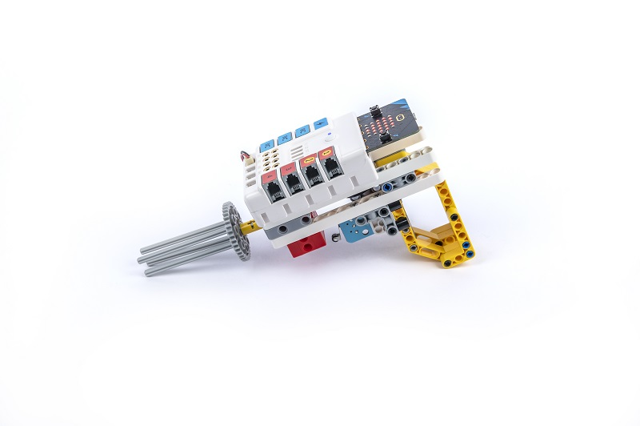

## 教学目标

- 了解打蛋器的基本原理和应用。
- 学习如何使用哪吒发明家套装V2来制作一个自动旋转的打蛋器。
- 设计和搭建合适的机械结构来支撑打蛋器的运动。
- 培养团队合作、问题解决和创新思维能力。

## 教学准备

[哪吒发明家套装 V2](https://www.elecfreaks.com/nezha-inventor-s-kit-v2-for-micro-bit.html)

## 教学过程

### 引入

>向学生介绍打蛋器制作的背景和目标，激发学生的兴趣和好奇心。

大家一定都见过打蛋器吧！它是一种用来搅拌食材的工具，特别是在制作蛋糕、面点等食物时非常有用。你们知道打蛋器是如何工作的吗？在今天的课程中，我们将一起探索打蛋器的原理，并用哪吒发明家套装V2制作一个可以自动旋转的打蛋器。

### 探究

>分组讨论，让学生思考如何用积木材料来制作一台打蛋器。

- 打蛋器是如何使蛋液变得松软和均匀的？
- 你们认为打蛋器是通过什么方式实现旋转的？

### 实践

>分组动手，按照自己的设计方案，用积木材料来制作一台打蛋器。

按照自己的设计方案，用积木材料来制作一台打蛋器。

#### 示例

##### 搭建步骤

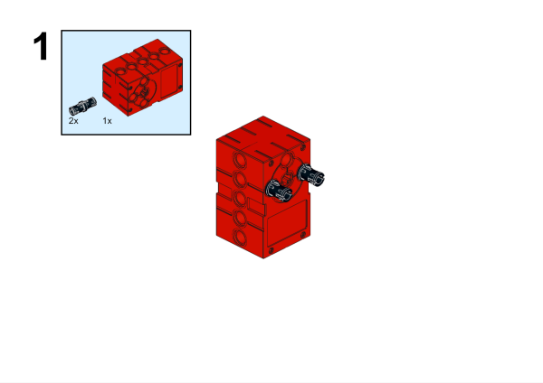

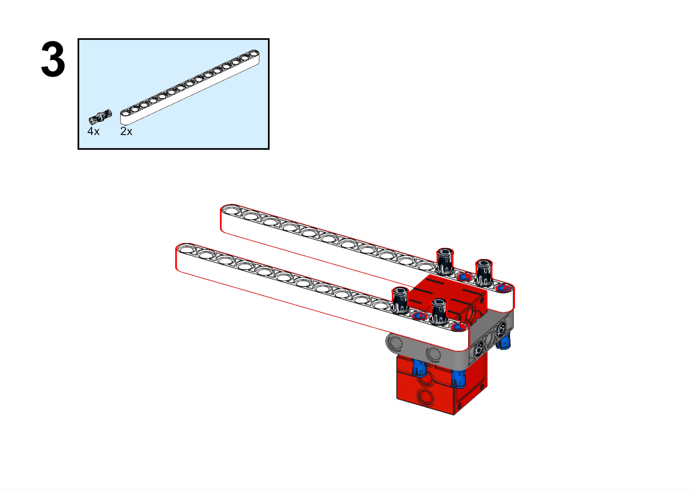

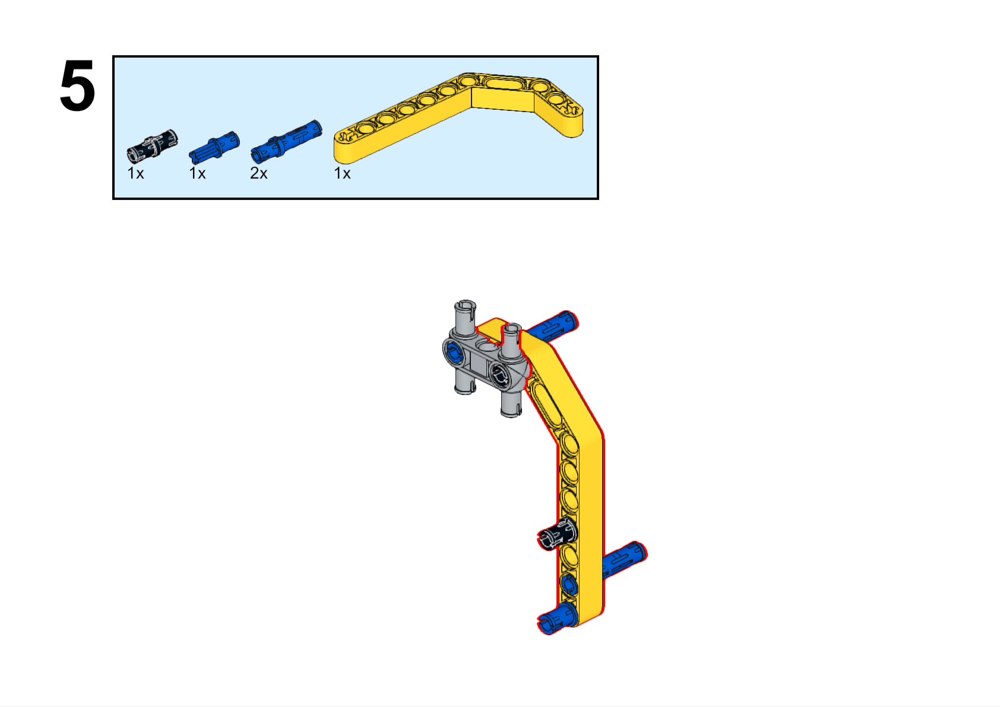

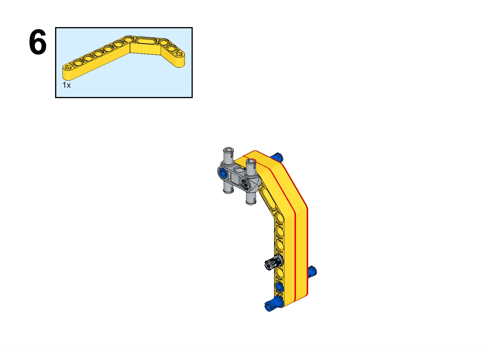

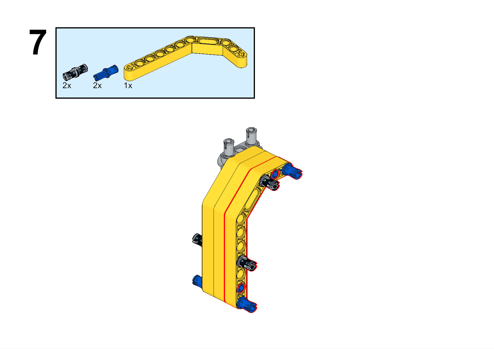

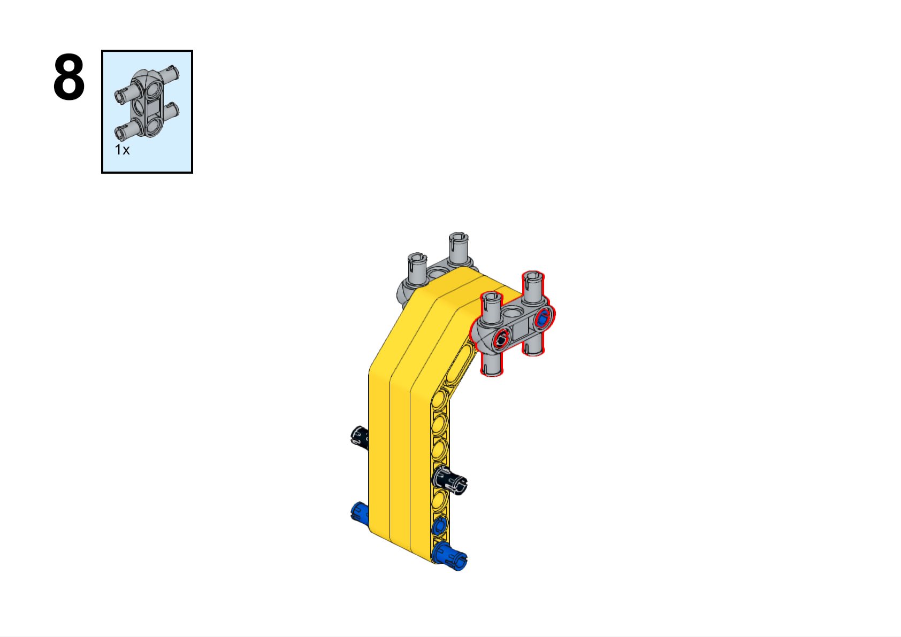

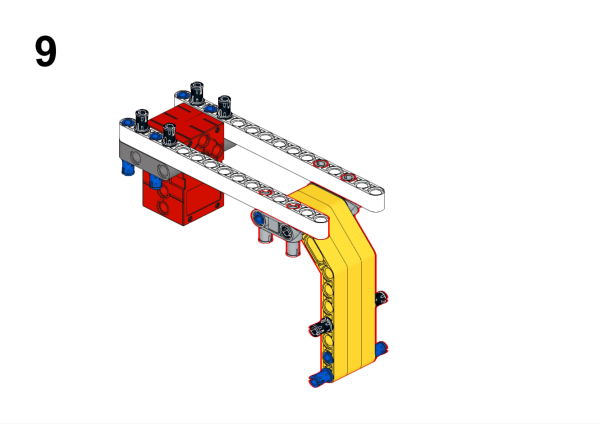

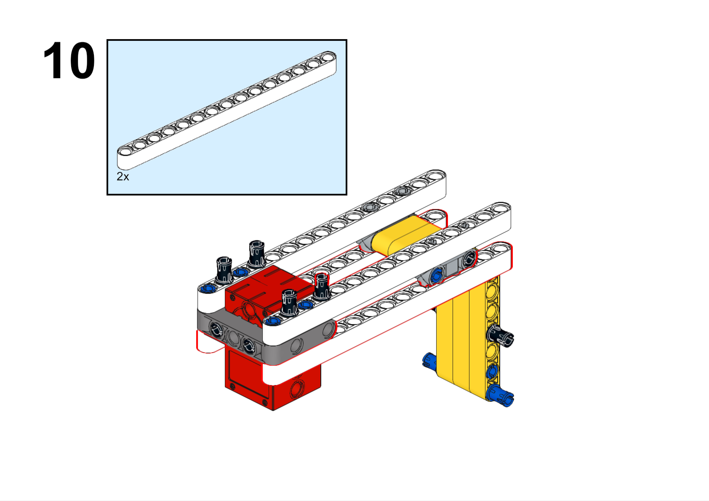

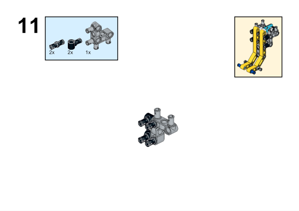

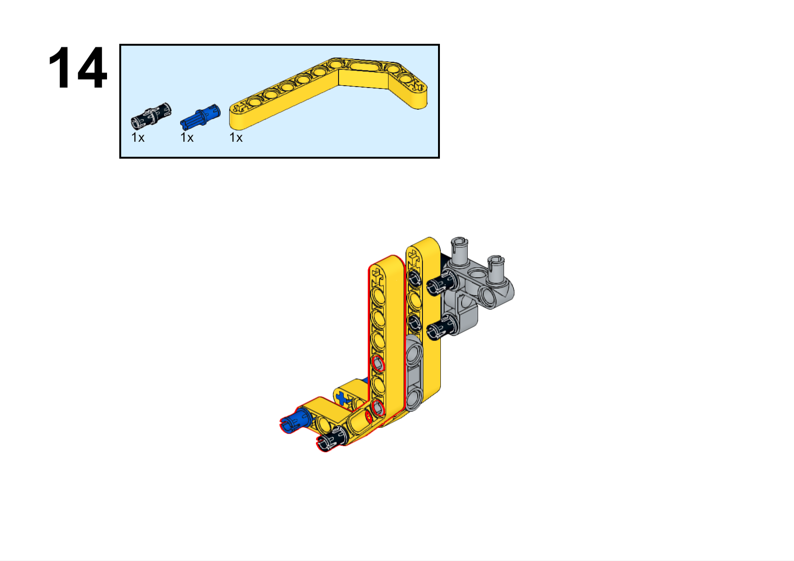

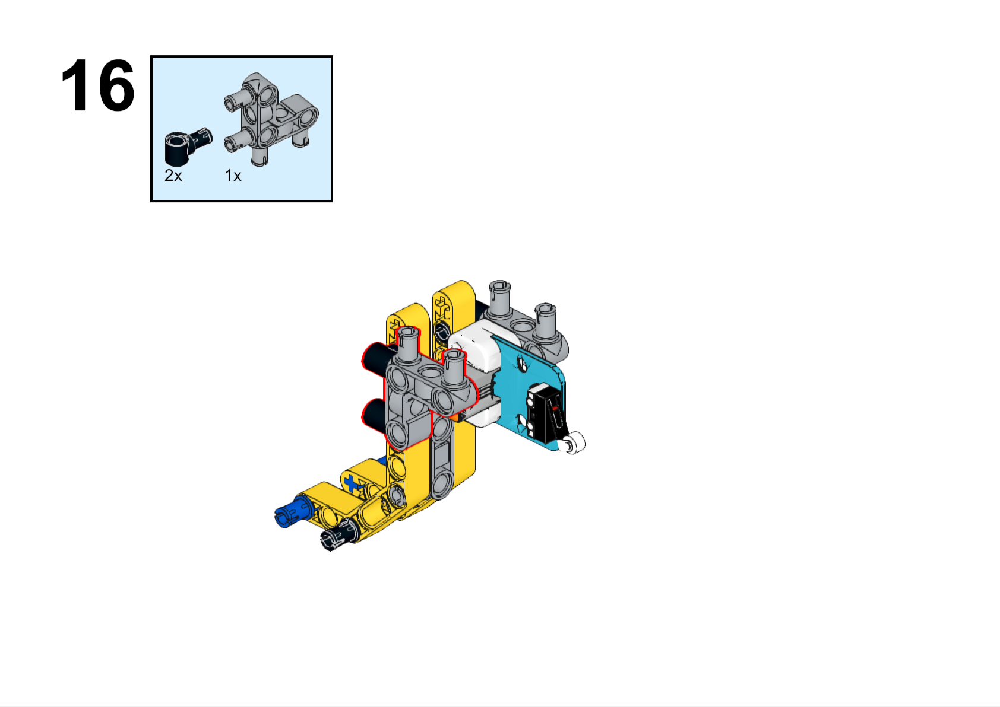

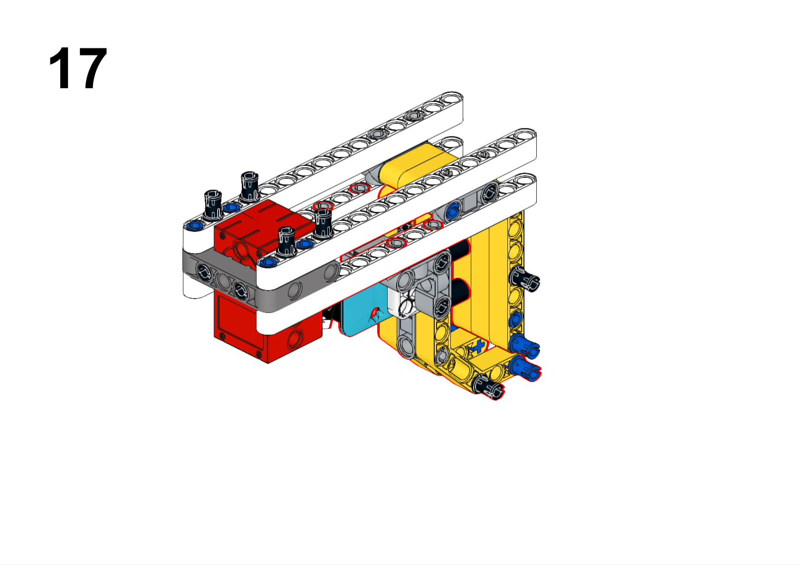

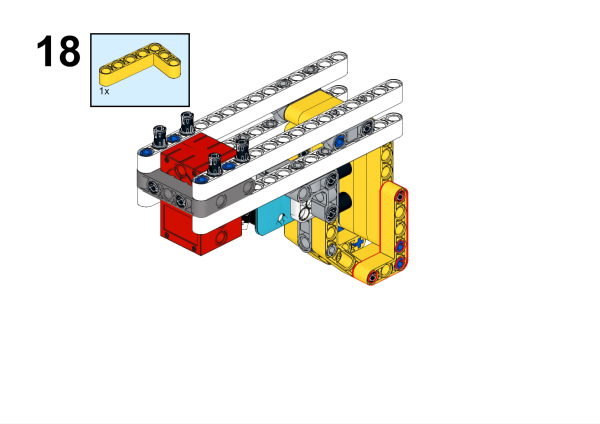

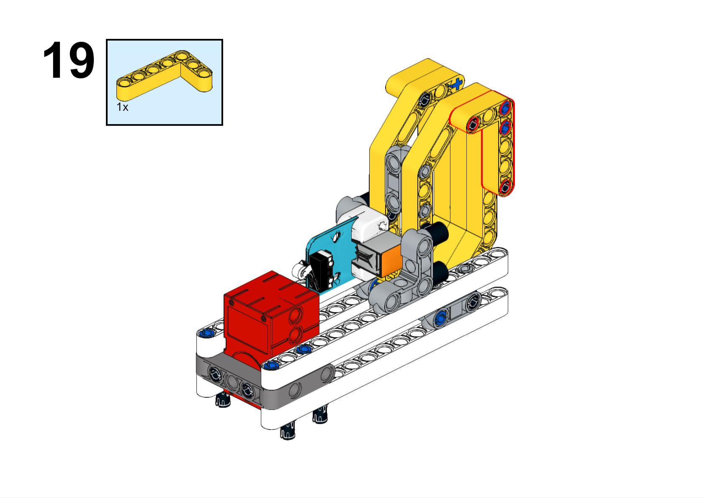

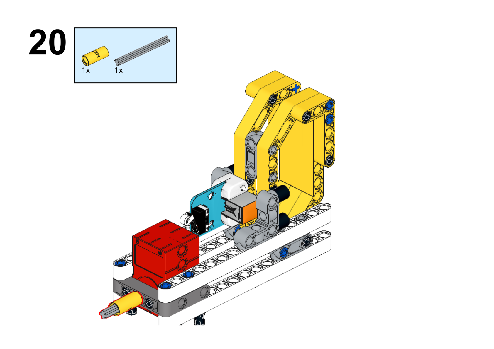

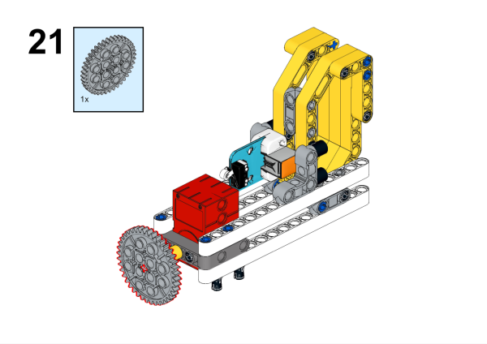

**搭建完成**

##### 硬件连接

将碰撞传感器连接到哪吒扩展板的J1接口，将电机连接到哪吒扩展板的M1接口。

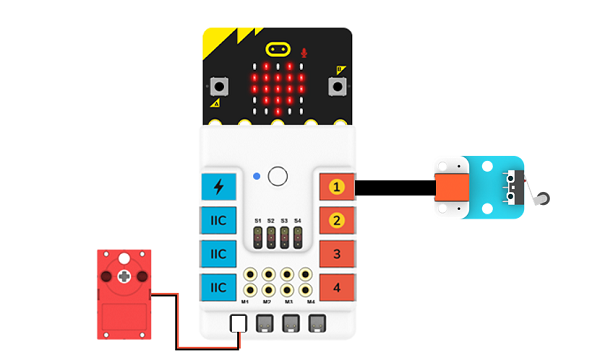

##### 软件编程

打开编程平台[makecode](https://makecode.microbit.org/#)

新建项目

点击扩展

在搜索栏搜索`PlanetX`添加行星系列传感器的扩展库

在搜索栏搜索`nezha`添加哪吒扩展板的扩展库

编写程序

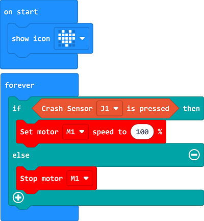

程序链接:[https://makecode.microbit.org/_4pvKroATsiao](https://makecode.microbit.org/_4pvKroATsiao)

你也可以通过以下网页直接下载程序。

    <iframe
        src="https://makecode.microbit.org/_4pvKroATsiao"
        frameborder="0"
        sandbox="allow-popups allow-forms allow-scripts allow-same-origin"
        style={{
            position: 'absolute',
            width: '100%',
            height: '100%',
        }}
    />

### 展示

>分组展示，比较各组的成果和效果。

#### 示例案例效果

按住碰撞传感器，打蛋器开始运行，松开碰撞传感器，打蛋器停止运行。

### 反思

>分组分享，让每组的学生分享自己的制作过程和心得，总结自己遇到的问题和解决办法，评价自己的优点和不足。
