# Case 22 叉车2

## 简介

叉车是一种能够搬运和举升物体的机械装置。在本课程中，我们将学习齿条传动的知识点，并通过使用哪吒发明家套装V2制作一个简单的叉车模型。我们将探索齿条传动的原理和应用，了解它在叉车装置中的作用。

## 教学目标

- 了解齿条传动的基本原理和应用。
- 学习如何使用哪吒发明家套装V2制作一个简单的叉车模型。
- 设计和搭建合适的齿条传动机构来实现叉车的上下运动和举升物体的功能。
- 培养团队合作、问题解决和创新思维能力。

## 教学准备

[哪吒发明家套装 V2](https://www.elecfreaks.com/nezha-inventor-s-kit-v2-for-micro-bit.html)

## 教学过程

### 引入

>向学生介绍叉车制作的背景和目标，激发学生的兴趣和好奇心。

大家是否对叉车感兴趣呢？叉车是一种能够搬运和举升物体的机械装置。在今天的课程中，我们将一起学习如何使用哪吒发明家套装V2制作一辆有趣的叉车。

让我们先来了解一下齿条传动的概念。齿条传动是一种将旋转运动转换为线性运动的机械传动方式。它由一个带有齿条的直线轨道和一个与之配合的齿轮组成。通过齿轮的旋转，可以使齿条在轨道上上下移动。

齿条传动在许多机械装置中都有广泛的应用，包括叉车。通过了解齿条传动的原理和使用哪吒发明家套装V2的技巧，我们将能够制作一个可以实现叉车上下运动和举升物体的模型。

接下来，让我们一起探索齿条传动的工作原理，并动手制作属于我们自己的叉车模型吧！

### 探究

>分组讨论，让学生思考如何用积木材料来制作一辆叉车。

- 什么是齿条传动？它的工作原理是什么？
- 如何使用哪吒发明家套装V2制作一个简单的叉车模型？
- 如何设计和搭建合适的齿条传动机构，以实现叉车的上下运动和举升物体的功能？
- 如何调整齿条传动机构的参数，以改变叉车的举升高度和速度？
- 你们有没有其他创意或改进的想法，可以使叉车更加有趣或功能更强大？

### 实践

>分组动手，按照自己的设计方案，用积木材料来制作一辆叉车。

按照自己的设计方案，用积木材料来制作一辆叉车。

#### 示例

##### 搭建步骤

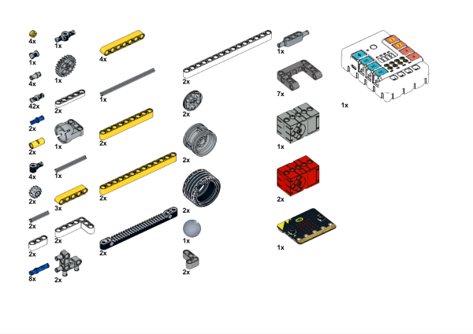

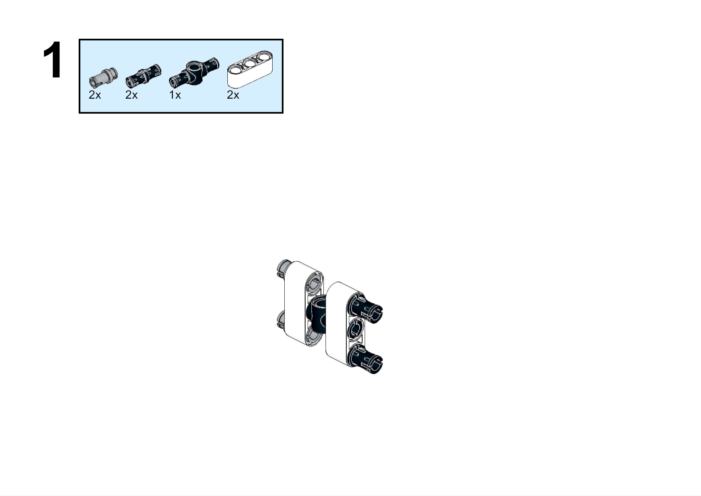

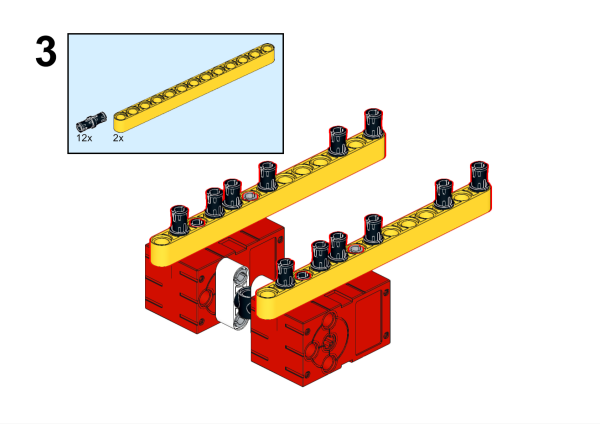

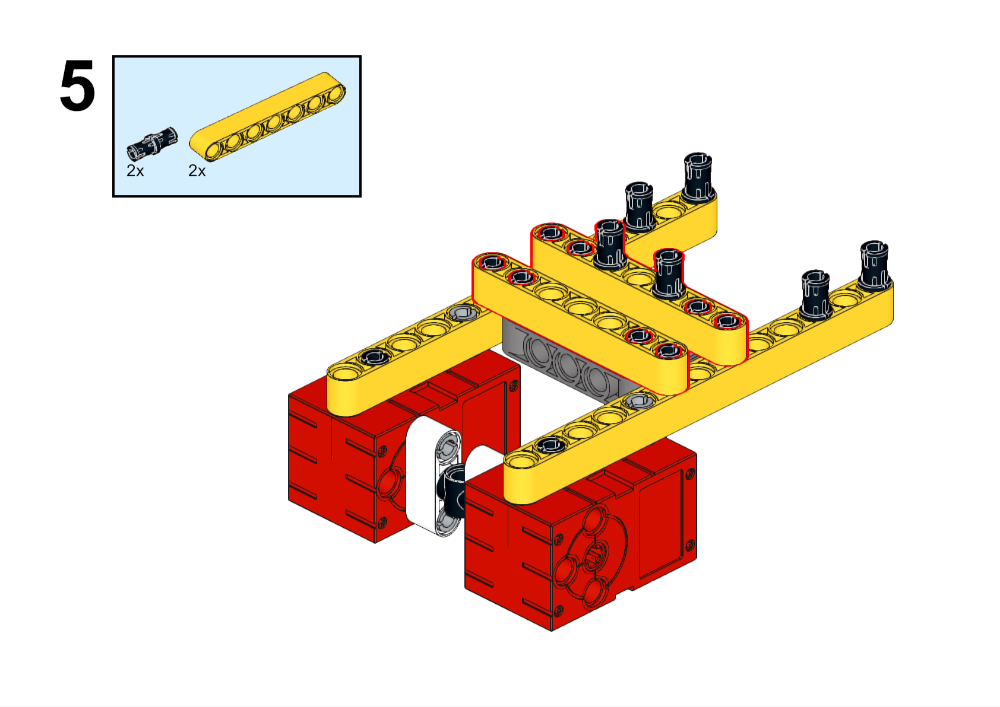

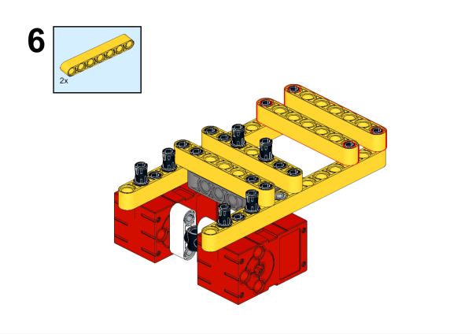

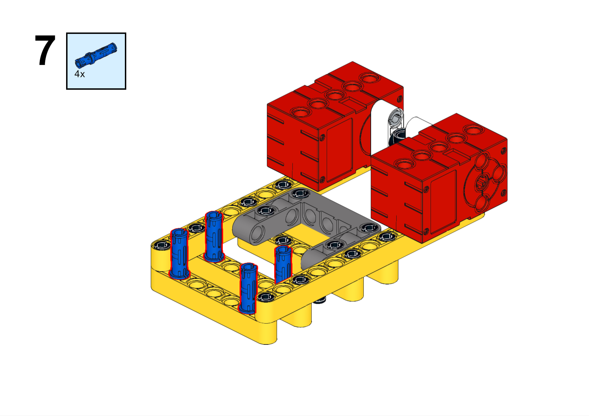

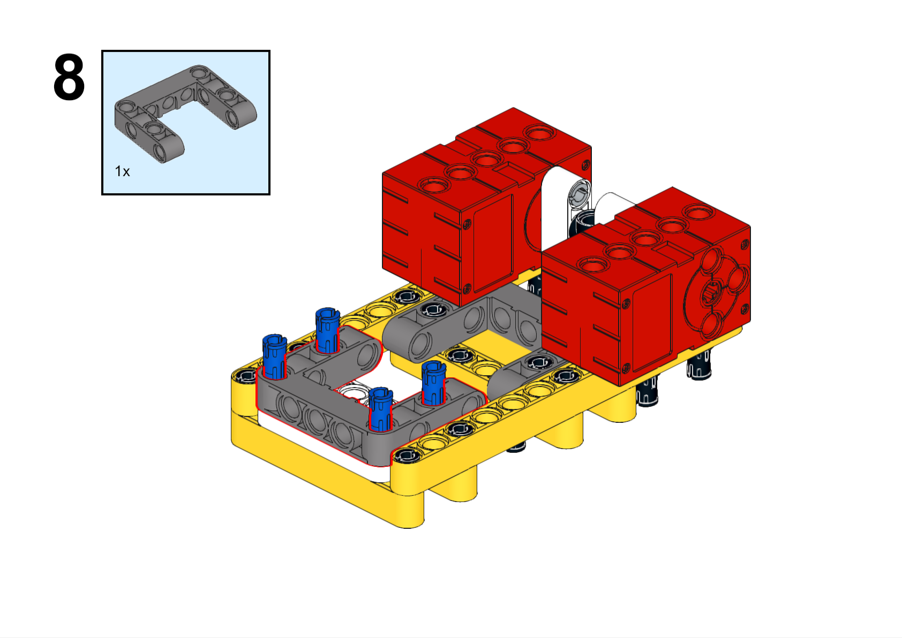

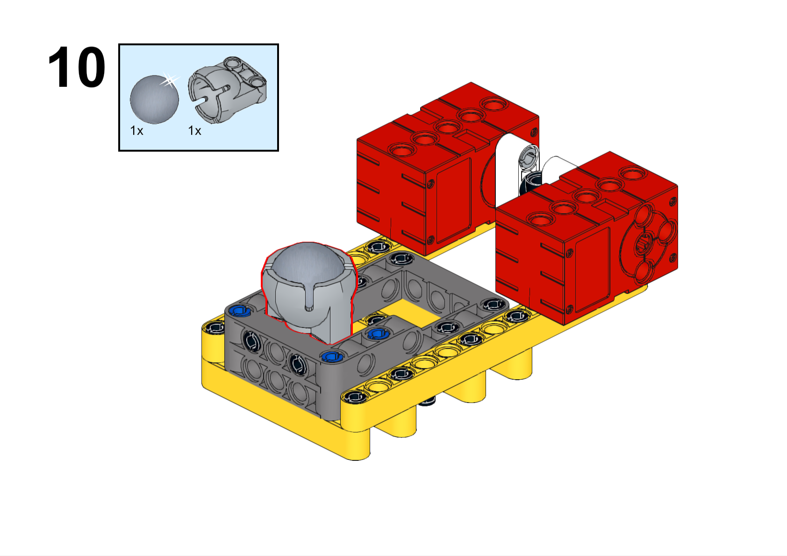

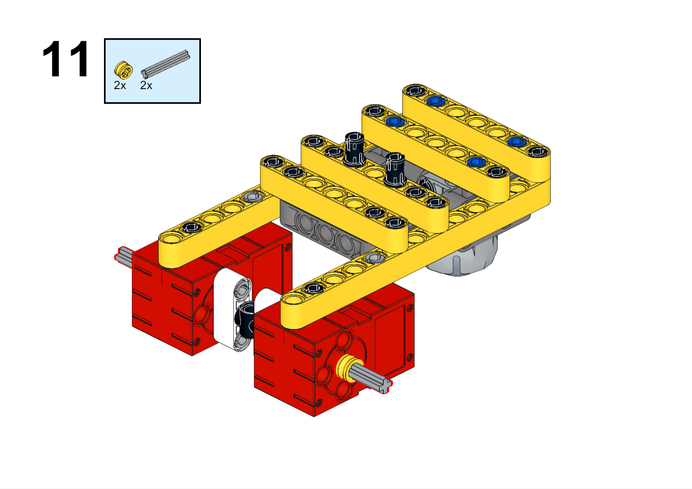

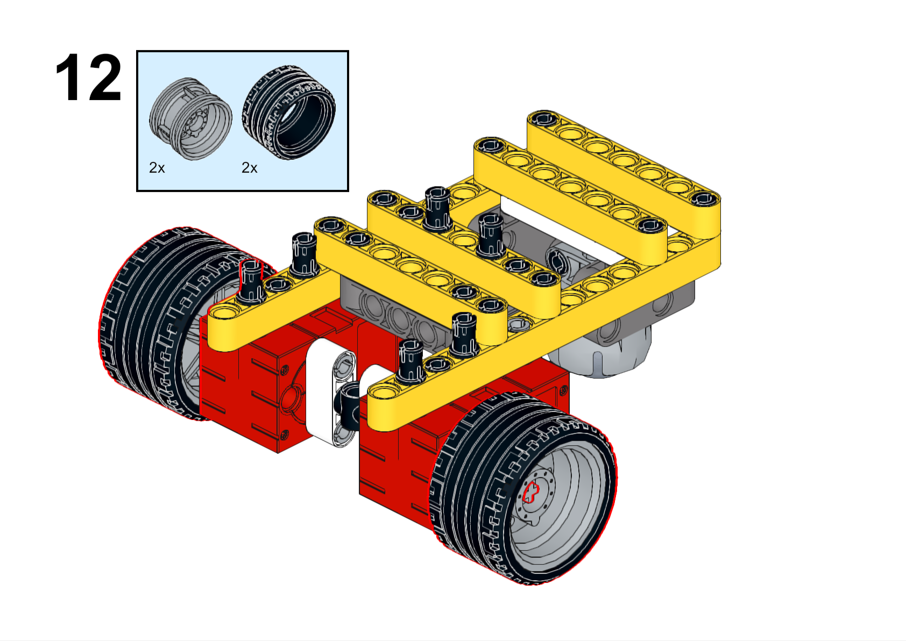

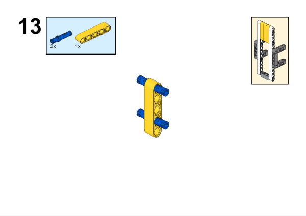

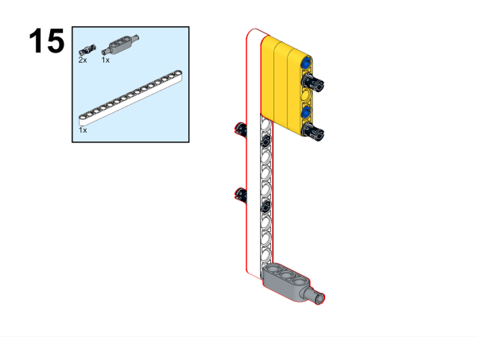

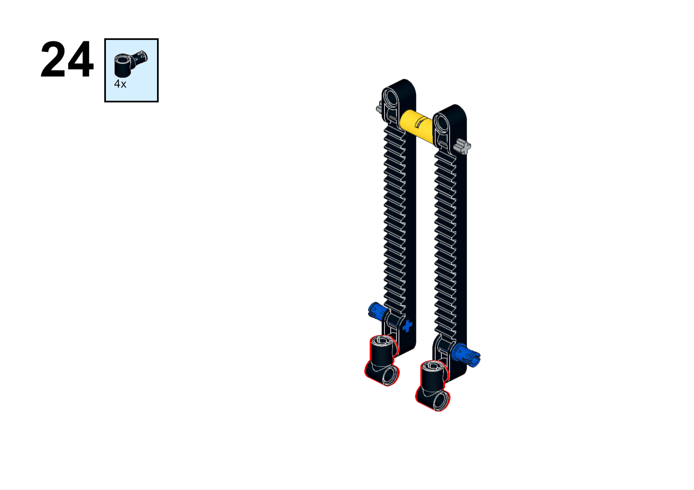

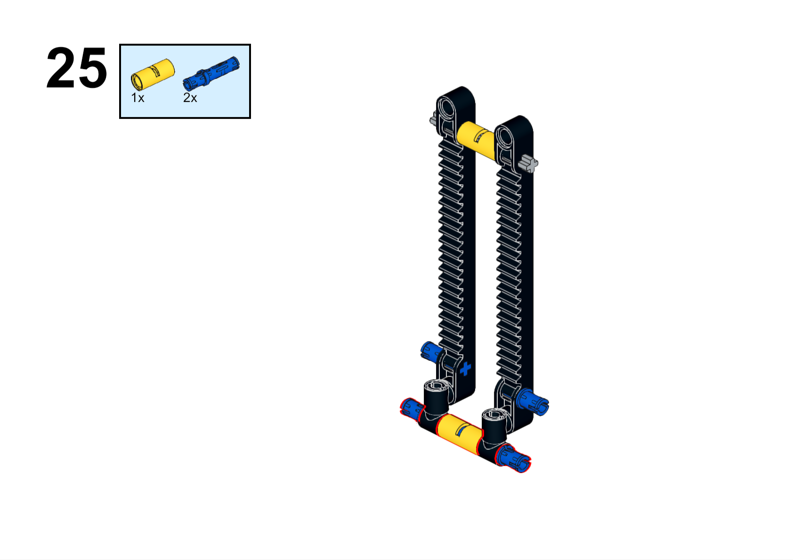

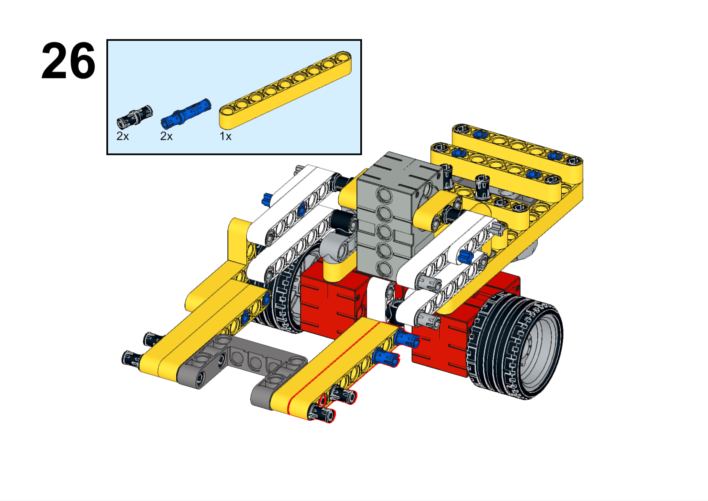

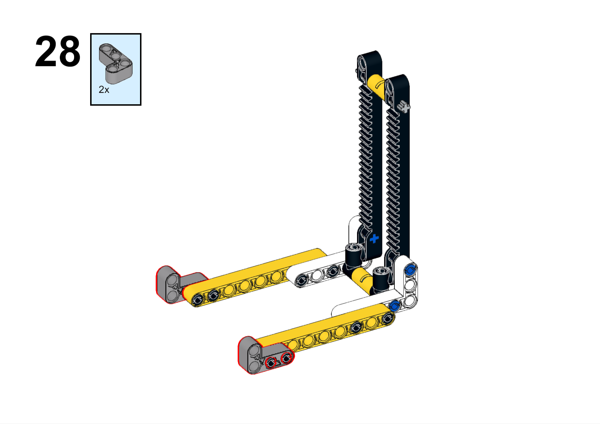

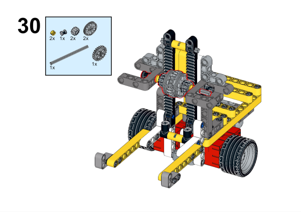

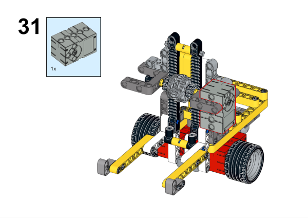

**搭建完成**

##### 硬件连接

将电机连接到哪吒扩展板的M1、M2接口，将舵机连接到哪吒扩展板的S1接口。

##### 软件编程

打开编程平台[makecode](https://makecode.microbit.org/#)

新建项目

点击扩展

在搜索栏搜索`nezha`添加哪吒扩展板的扩展库

编写程序

程序链接:[https://makecode.microbit.org/_LHXgcjVcJ5po](https://makecode.microbit.org/_LHXgcjVcJ5po)

你也可以通过以下网页直接下载程序。

    <iframe
        src="https://makecode.microbit.org/_LHXgcjVcJ5po"
        frameborder="0"
        sandbox="allow-popups allow-forms allow-scripts allow-same-origin"
        style={{
            position: 'absolute',
            width: '100%',
            height: '100%',
        }}
    />

## 展示

>分组展示，尝试制作遥控叉车，比较各组的成果和效果。

#### 示例案例效果

按下micro:bit上的A键，叉车向前行驶并叉起物体，按下micro:bit上的B键，叉车转向行驶并放下物体。

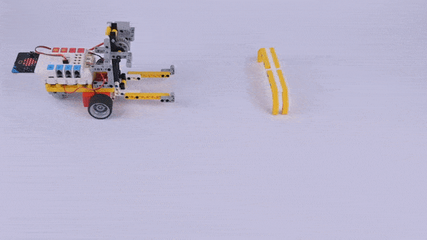

## 反思

>分组分享，让每组的学生分享自己的制作过程和心得，总结自己遇到的问题和解决办法，评价自己的优点和不足。
