# Case 01 引体向上机器人

## 简介

引体向上运动就是用自己的力量把自己的身体拉到一根横杆上，然后再放下来，重复多次。这是一种很好的锻炼身体的运动，可以让我们的背部、肩膀和手臂变得更强壮。引体向上运动还可以让我们的身体更挺拔，更有精神。这节课我们将用哪吒发明家套装 V2 来制作一个会做引体向上的机器人。

## 教学目标

- 通过制作引体向上机器人，让学生了解平行四边形的易变形且变形之后对边平行的特性，以及如何利用这一特性来实现机械臂的运动。
- 通过制作引体向上机器人，让学生了解电机的工作原理和使用方法，以及如何利用电机来驱动机械臂的运动。
- 通过制作引体向上机器人，让学生了解引体向上运动的意义和好处，以及如何模拟引体向上运动的过程。
- 通过制作引体向上机器人，培养学生的动手能力、创造力、合作能力和问题解决能力。

## 教学准备

[哪吒发明家套装 V2](https://www.elecfreaks.com/nezha-inventor-s-kit-v2-for-micro-bit.html)

计时器

## 教学过程

### 引入：向学生介绍引体向上运动和机器人制作的背景和目标，激发学生的兴趣和好奇心。

引体向上运动是一种能够锻炼我们的背部、肩膀和手臂的运动，但是有些人可能觉得太难了，或者没有合适的地方，所以我们可以用积木来制作一个会做引体向上的机器人。这样，我们不仅能够锻炼我们的动手能力和创造力，还能够学习到机械结构、传感器、编程等方面的知识和技能。你们想不想尝试一下呢？激发学生的兴趣和好奇心。

### 探究：分组讨论，让学生思考如何用积木材料来制作一个会做引体向上的机器人，重点关注平行四边形积木的特性、电机的使用方法和机械臂的设计方案。

平行四边形积木可以变形，但是变形之后对边还是平行的，这样就可以实现机械臂的弯曲和伸直；电机可以转动，但是需要进行硬件连接，这样就可以实现机械臂的上下运动；机械臂的设计方案可以根据自己的想法和创意来确定，但是要注意结构的稳定性和可行性。

### 实践：分组动手，按照自己的设计方案，用积木材料来制作一个会做引体向上的机器人，并将其挂载到横杆上。

按照自己的设计方案，用积木材料来制作一个会做引体向上的机器人，并将其挂载到横杆上。例如：用平行四边形积木来搭建机械臂的骨架，用电机来驱动机械臂的关节。

#### 示例

##### 搭建步骤

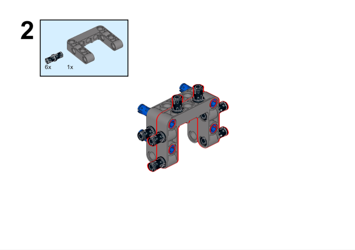

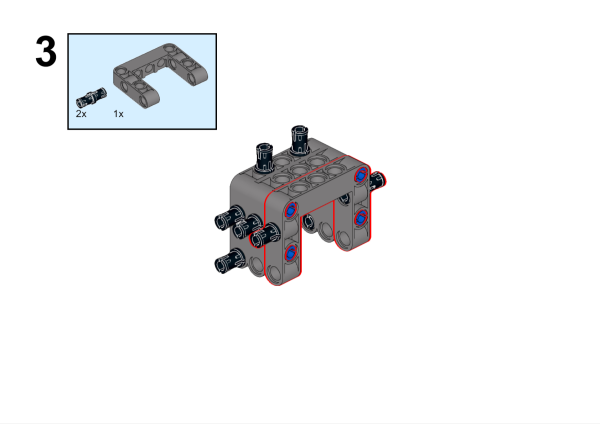

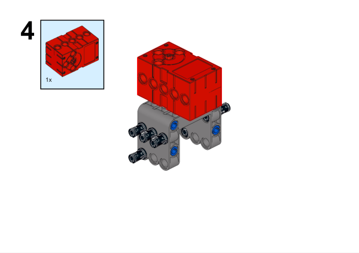

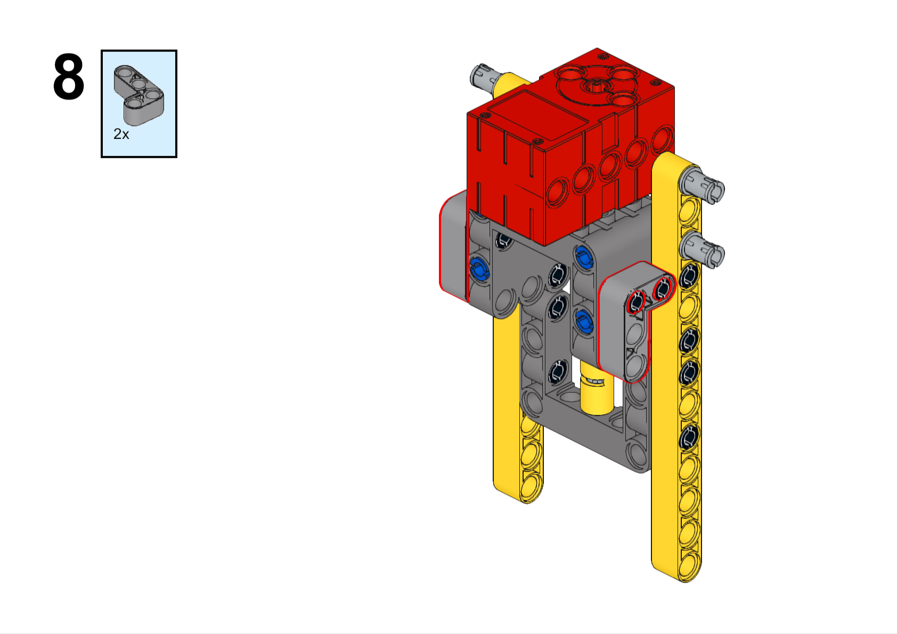

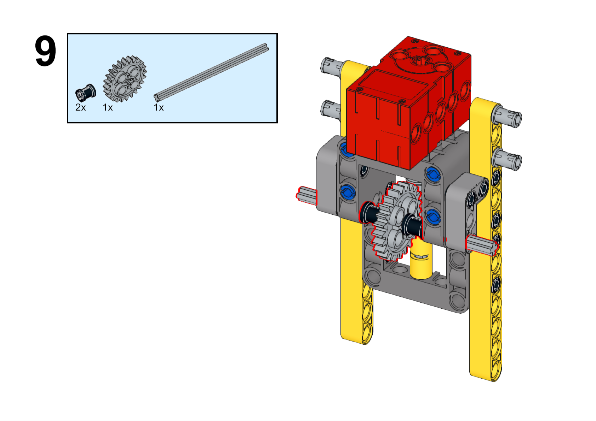

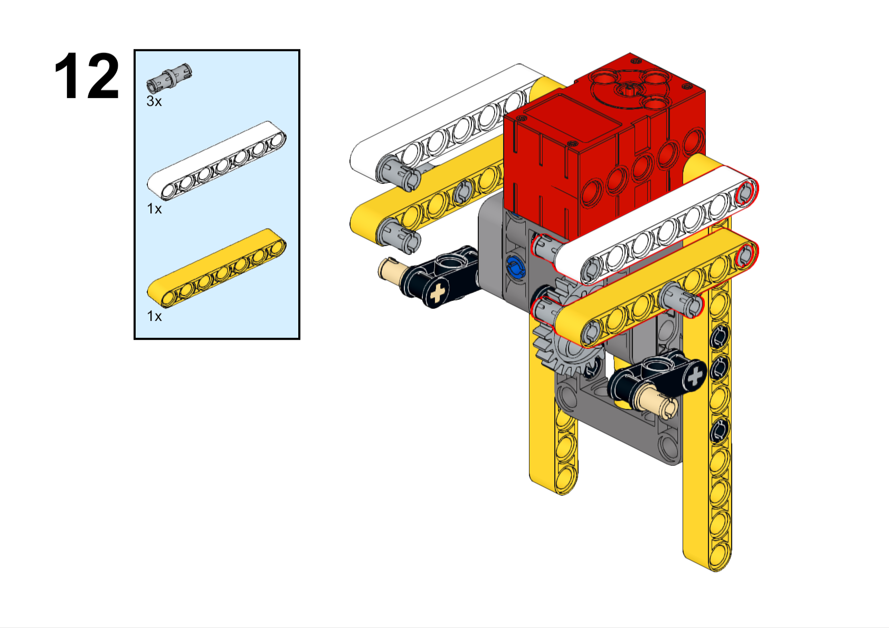

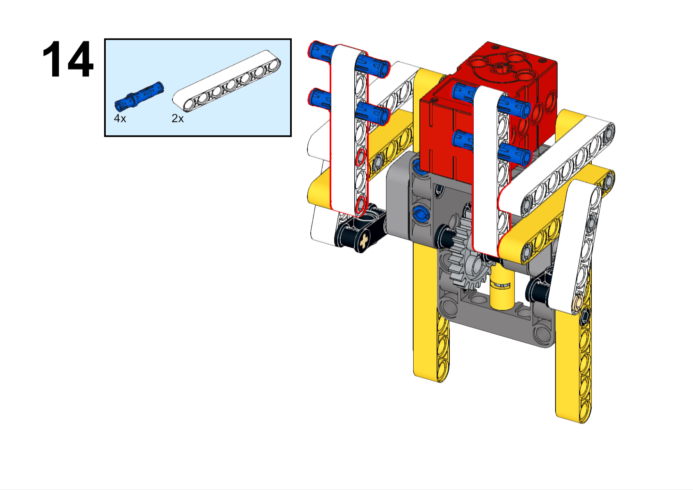

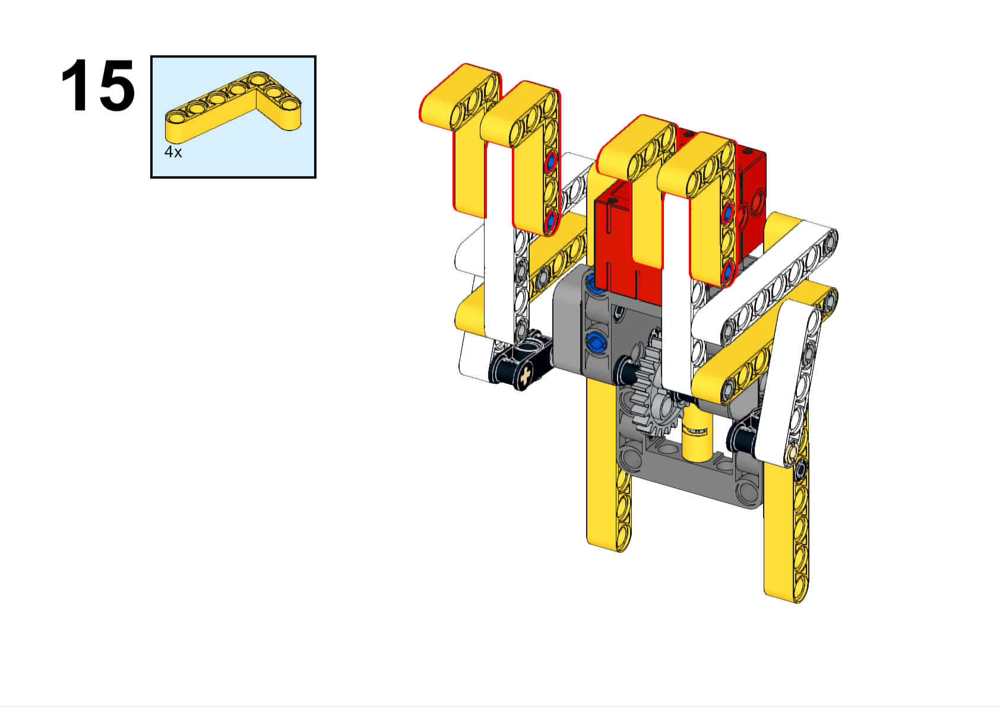

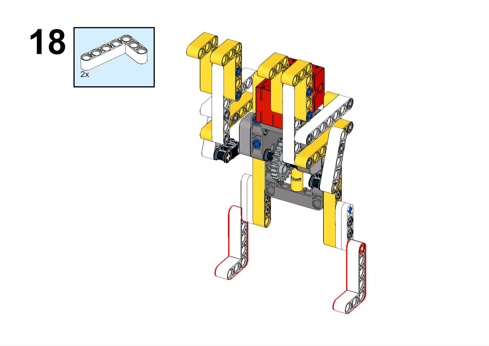

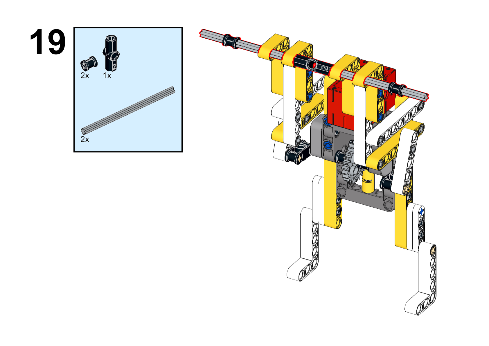

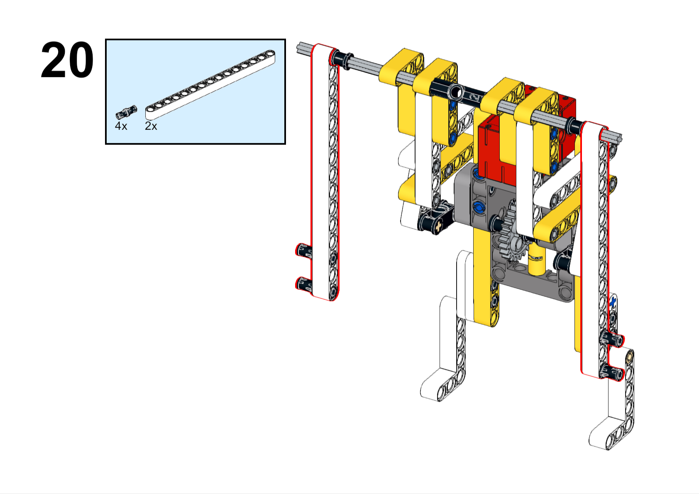

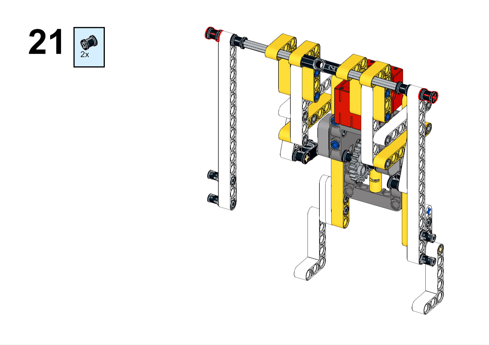

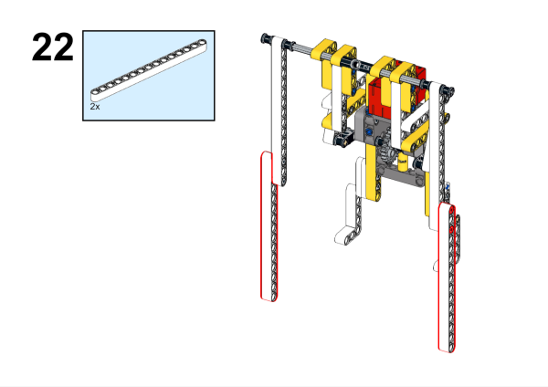

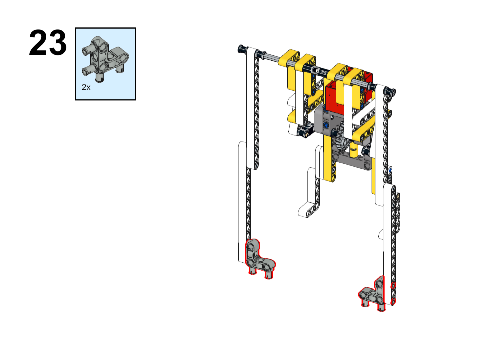

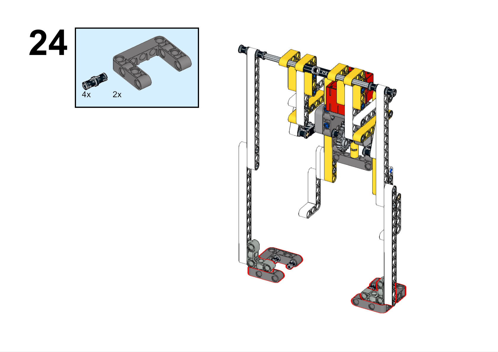

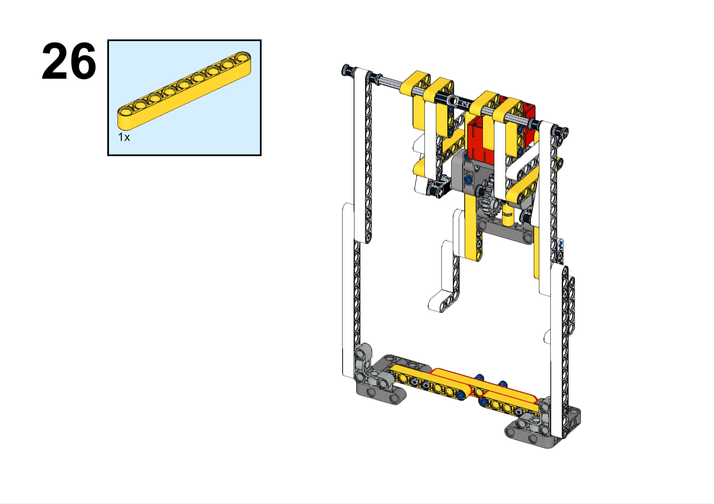

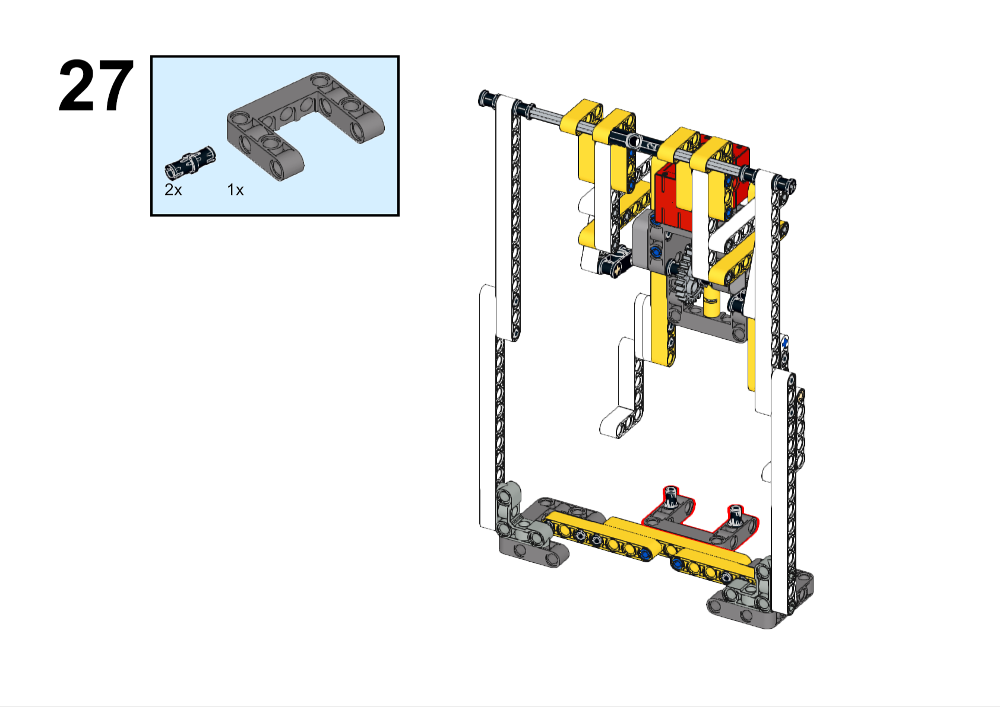

##### 硬件连接

将电机连接到哪吒扩展板的M1接口。

##### 软件编程

打开编程平台[makecode](https://makecode.microbit.org/#)

新建项目

点击扩展

在搜索栏搜索`nezha`添加哪吒扩展板的扩展库

编写程序

程序链接:[https://makecode.microbit.org/_8bYg1C9v1WJA](https://makecode.microbit.org/_8bYg1C9v1WJA)

你也可以通过以下网页直接下载程序。

    <iframe
        src="https://makecode.microbit.org/_8bYg1C9v1WJA"
        frameborder="0"
        sandbox="allow-popups allow-forms allow-scripts allow-same-origin"
        style={{
            position: 'absolute',
            width: '100%',
            height: '100%',
        }}
    />

### 展示：分组展示，让每组的机器人在横杆上做引体向上运动，并用计时器记录时间，比较各组的成果和效果。

#### 示例案例效果

按下micro:bit上的A键，机器人开始做引体向上运动，按下micro:bit上的B键，机器人停止做引体向上运动。

### 反思：分组分享，让每组的学生分享自己的制作过程和心得，总结自己遇到的问题和解决办法，评价自己的优点和不足。
