# Case 16 跷跷板

## 简介

跷跷板是一种经典的游乐设施，它能够利用杠杆原理实现两端的平衡。在本课程中，我们将学习跷跷板的原理，并使用哪吒发明家套装V2来制作一个能够摆动的跷跷板。

## 教学目标

- 了解跷跷板的基本原理和应用。
- 掌握齿轮传动的工作原理和应用。
- 学习如何使用齿轮传动来实现跷跷板的平衡。
- 设计和搭建合适的机械结构来支撑跷跷板的运动。
- 培养团队合作、问题解决和创新思维能力。

## 教学准备

[哪吒发明家套装 V2](https://www.elecfreaks.com/nezha-inventor-s-kit-v2-for-micro-bit.html)

## 教学过程

### 引入

>向学生介绍跷跷板制作的背景和目标，激发学生的兴趣和好奇心。

大家一定都玩过跷跷板吧！跷跷板是一种非常有趣的游乐设施，它可以让我们感受到杠杆原理的奇妙。你们知道跷跷板是如何实现平衡的吗？在今天的课程中，我们将一起探索跷跷板的原理，并用哪吒发明家套装V2制作一个特别的跷跷板。

### 探究

>分组讨论，让学生思考如何用积木材料来制作一个跷跷板。

- 什么是跷跷板？它有什么特点和应用？
- 跷跷板是如何实现平衡的？杠杆原理在其中起到了什么作用？
- 齿轮传动是什么？它在跷跷板制作中的作用是什么？
- 如何使用哪吒发明家套装V2来制作一个能够自动平衡的跷跷板？
- 跷跷板的设计和机械结构对平衡有何影响？如何调整跷跷板的平衡点？

### 实践

>分组动手，按照自己的设计方案，用积木材料来制作一个跷跷板。

按照自己的设计方案，用积木材料来制作一个跷跷板。

#### 示例

##### 搭建步骤

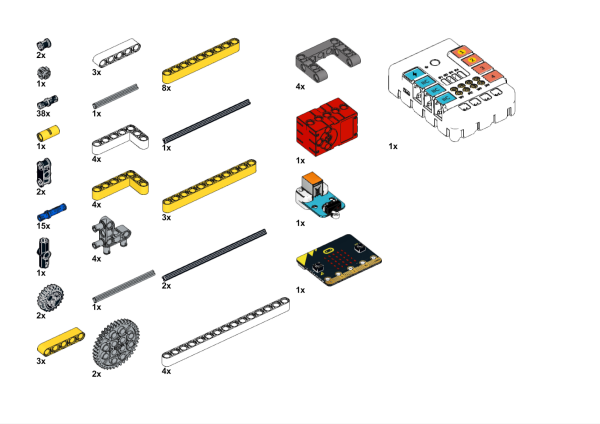

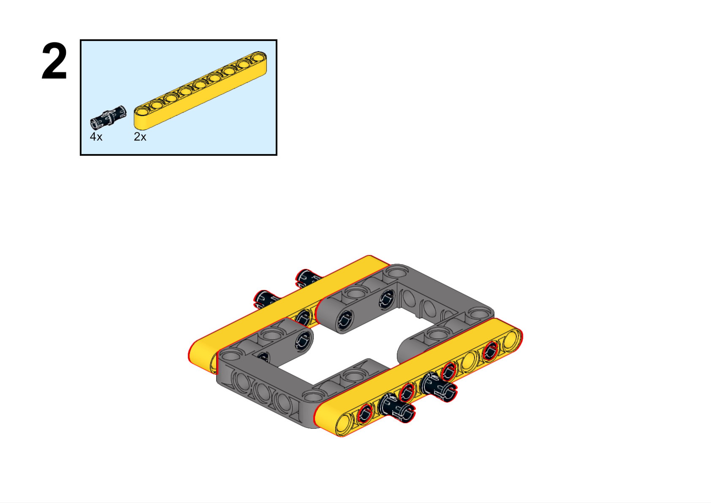

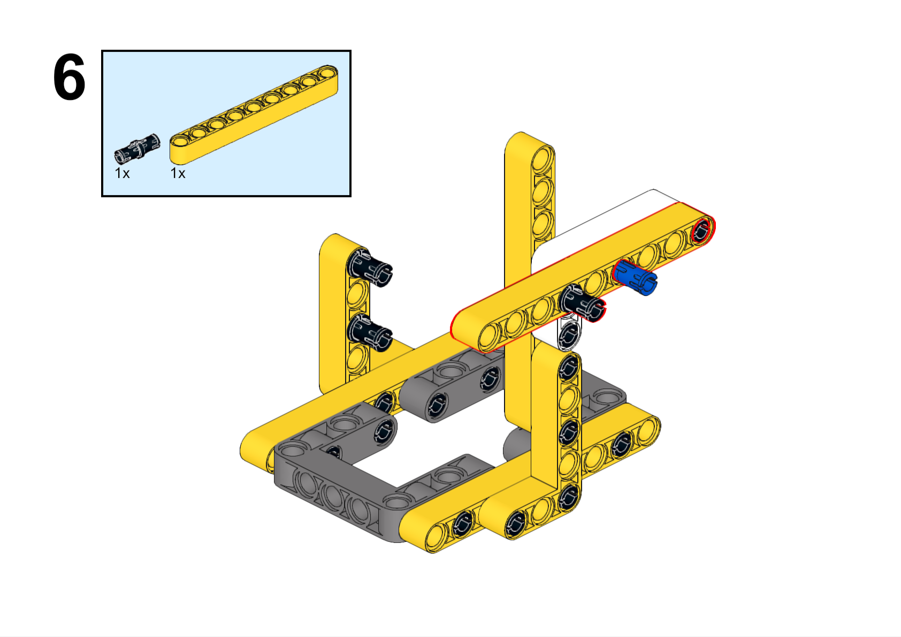

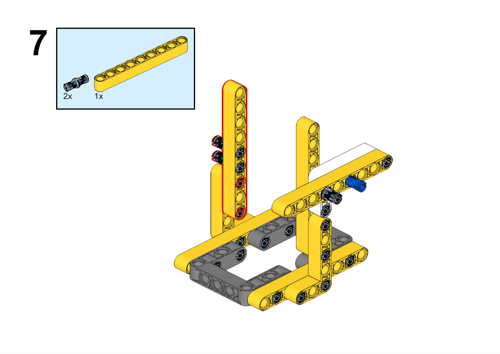

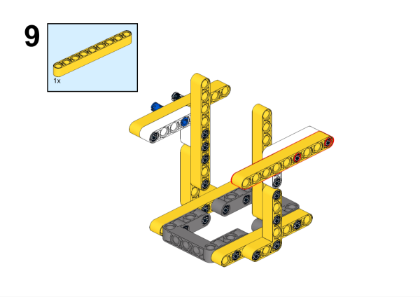

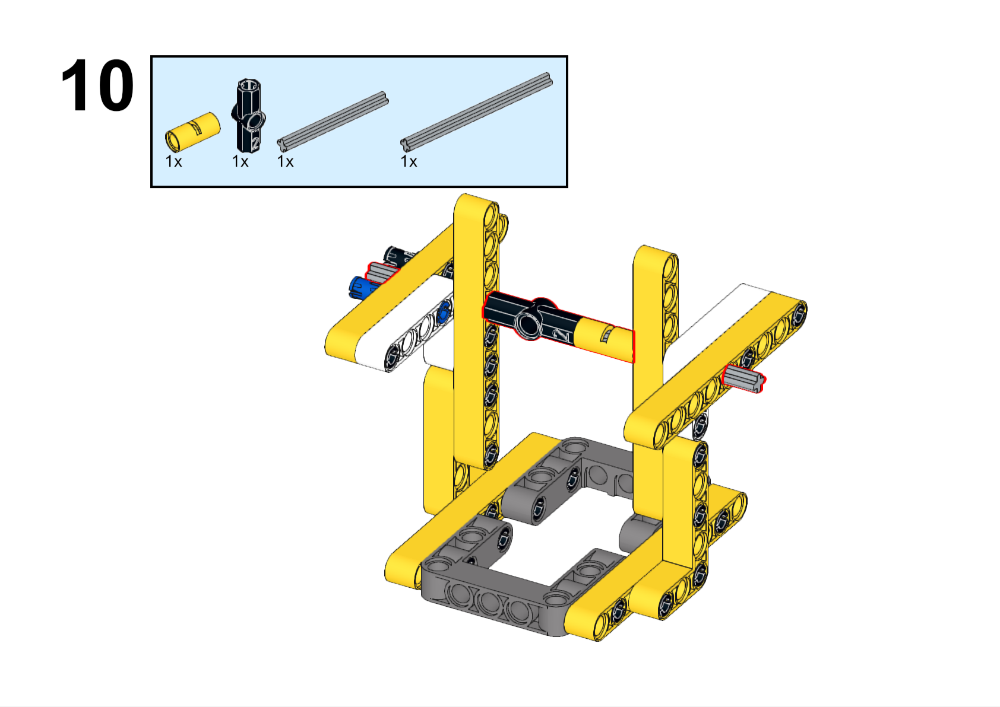

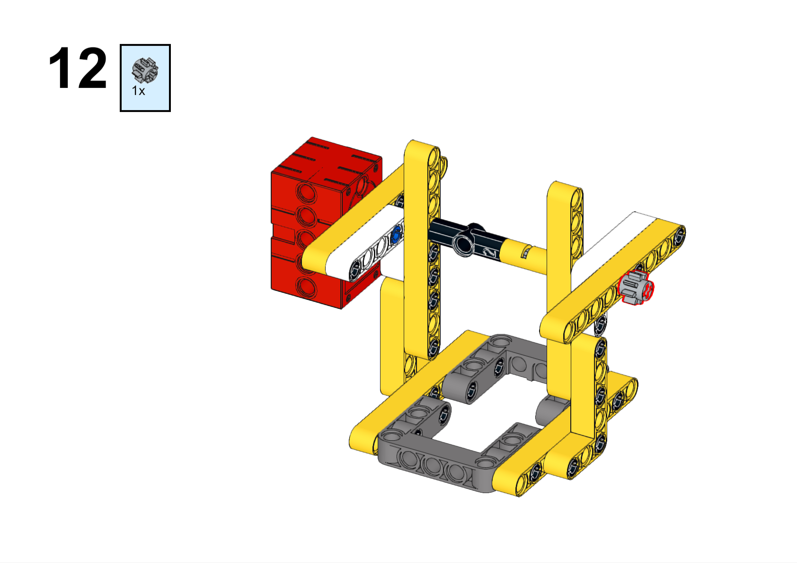

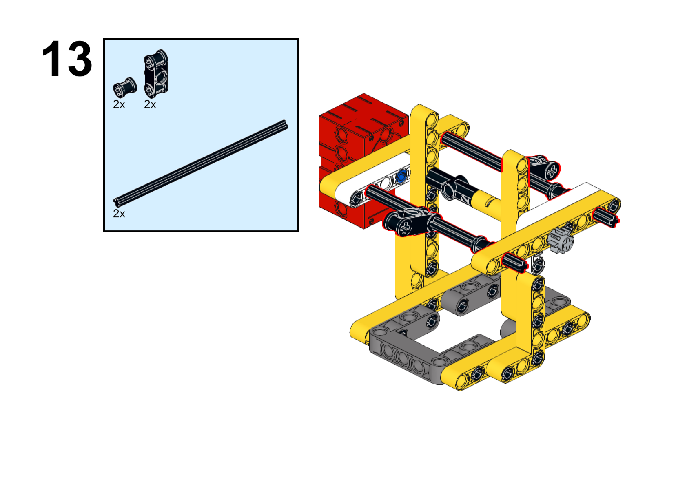

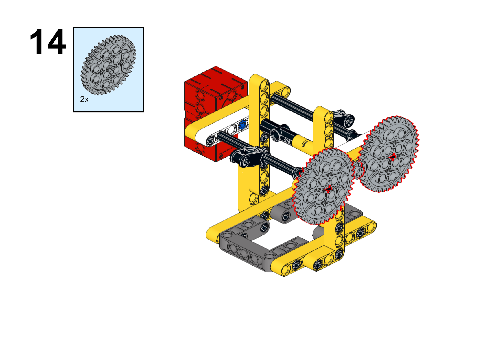

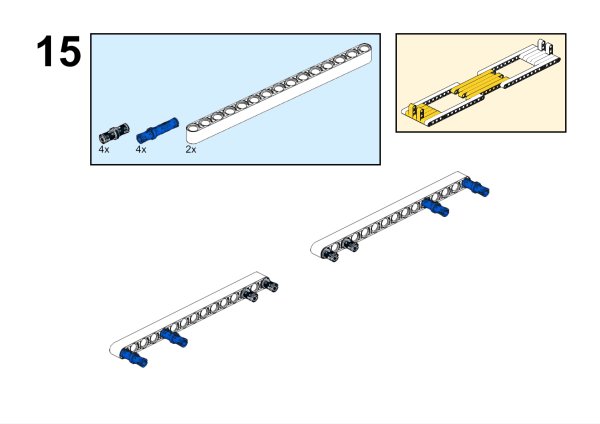

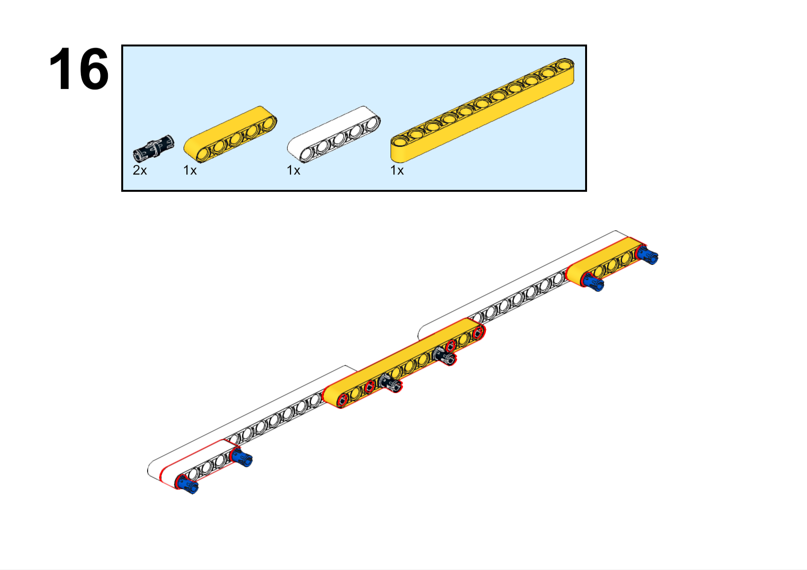

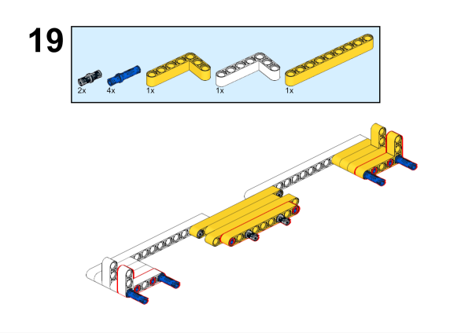

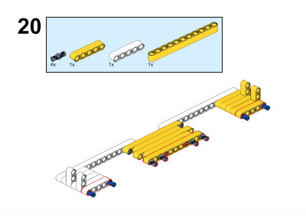

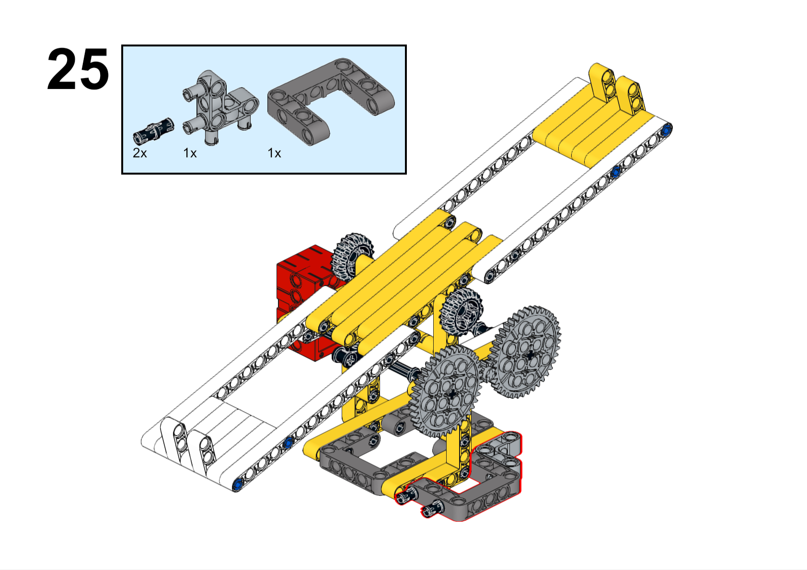

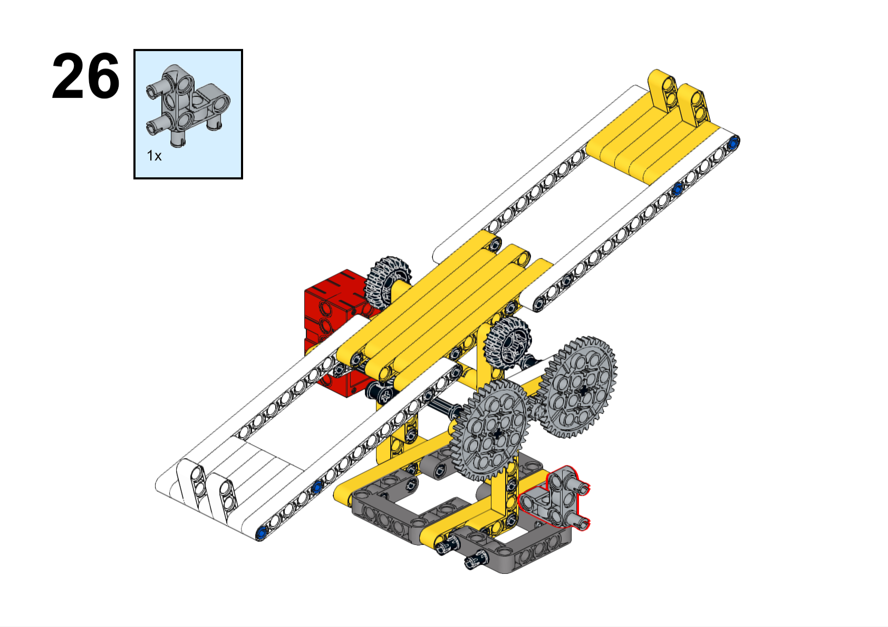

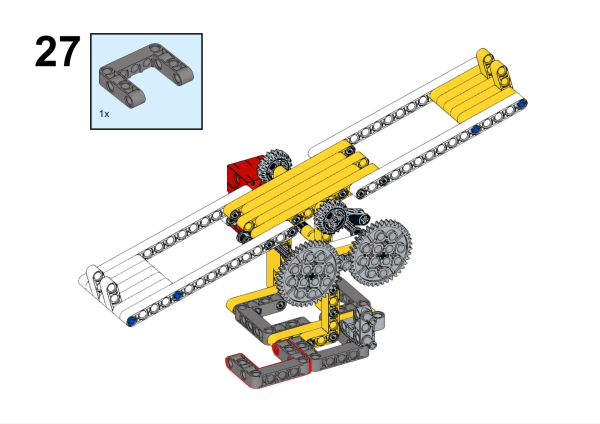

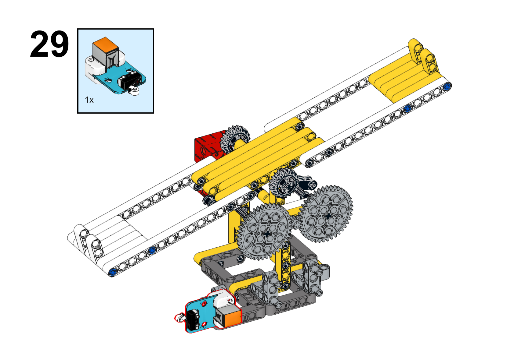

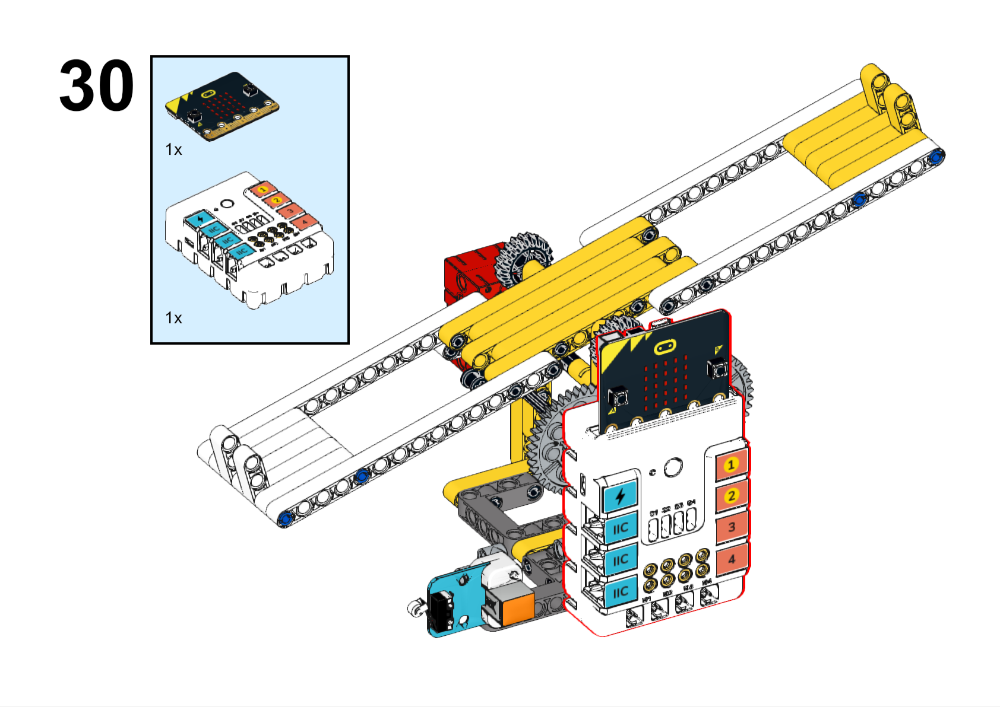

**搭建完成**

### 硬件连接

将碰撞传感器连接到哪吒扩展板的J1接口，将电机连接到哪吒扩展板的M1接口。

### 软件编程

打开编程平台[makecode](https://makecode.microbit.org/#)

新建项目

点击扩展

在搜索栏搜索`PlanetX`添加行星系列传感器的扩展库

在搜索栏搜索`nezha`添加哪吒扩展板的扩展库

编写程序

程序链接:[https://makecode.microbit.org/_C7R6bL6m63rC](https://makecode.microbit.org/_C7R6bL6m63rC)

你也可以通过以下网页直接下载程序。

    <iframe
        src="https://makecode.microbit.org/_C7R6bL6m63rC"
        frameborder="0"
        sandbox="allow-popups allow-forms allow-scripts allow-same-origin"
        style={{
            position: 'absolute',
            width: '100%',
            height: '100%',
        }}
    />

### 展示

>分组展示，比较各组的成果和效果。

#### 示例案例效果

按下碰撞传感器，跷跷板开始运行，再次按下碰撞传感器，跷跷板停止运行。

### 反思

>分组分享，让每组的学生分享自己的制作过程和心得，总结自己遇到的问题和解决办法，评价自己的优点和不足。
