# Case 27 智能巡线小车

## 简介

本次课程将带领学生制作一辆巡线车，利用哪吒发明家套装V2和双路巡线传感器，使车辆能够沿着黑线行驶。通过该项目，学生将学习有关巡线传感器的工作原理和应用，培养问题解决能力和创造性思维，并了解机器人技术在自动导航中的应用。

## 教学目标

- 了解双路巡线传感器的工作原理和信号输出。
- 学习如何搭建巡线车的机械结构，并将双路巡线传感器集成到车身中。
- 掌握如何编写程序使巡线车能够根据传感器信号沿着黑线行驶。
- 培养学生的团队合作精神、创造力和解决问题的能力。

## 教学准备

[哪吒发明家套装 V2](https://www.elecfreaks.com/nezha-inventor-s-kit-v2-for-micro-bit.html)

## 教学过程

### 引入

>向学生介绍智能巡线车制作的背景和目标，激发学生的兴趣和好奇心。

你有没有看过机器人或小车沿着黑线行驶的情景？你有没有想过这些机器人是如何知道要沿着黑线走的呢？这就涉及到了巡线传感器的工作原理。巡线传感器能够检测到黑线，并通过发送信号告诉小车要朝着什么方向行驶。

在本次课程中，我们将深入了解双路巡线传感器的工作原理，并将其应用到巡线车的制作中。我们将一步步搭建巡线车的机械结构，将双路巡线传感器安装到车身上，并学习如何编写程序，让巡线车能够根据传感器信号自动沿着黑线行驶。

### 探究

>分组讨论，让学生思考如何用积木材料来制作一辆智能巡线车。

- 双路巡线传感器是什么？它是如何工作的？如何通过检测黑线来输出信号？

- 如何搭建巡线车的机械结构？如何将双路巡线传感器集成到车身中？

- 如何编写程序使巡线车能够根据传感器信号沿着黑线行驶？

- 遇到多条或交叉的黑线时，巡线车将如何作出决策并调整行驶方向？

- 如何调试和优化巡线车的性能，使其能够稳定地沿着黑线行驶？

### 实践

>分组动手，按照自己的设计方案，用积木材料来制作一辆智能巡线车。

按照自己的设计方案，用积木材料来制作一辆智能巡线车。

#### 示例

##### 搭建步骤

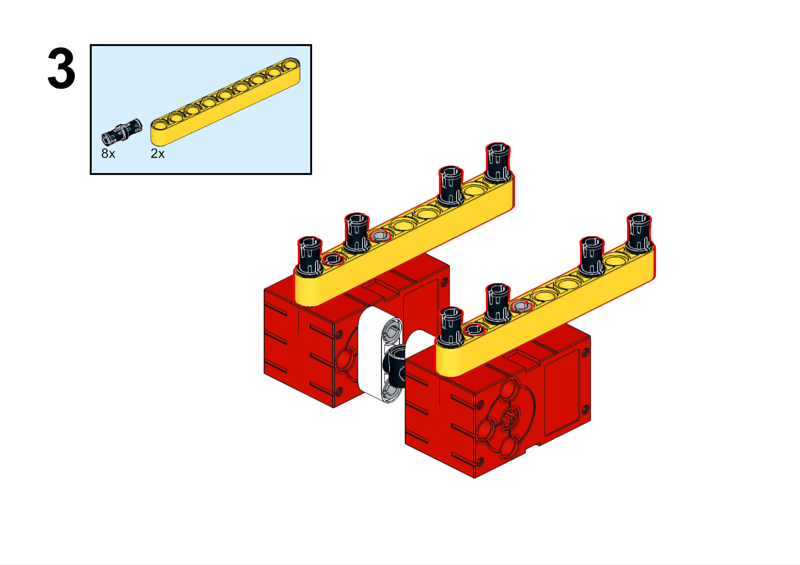

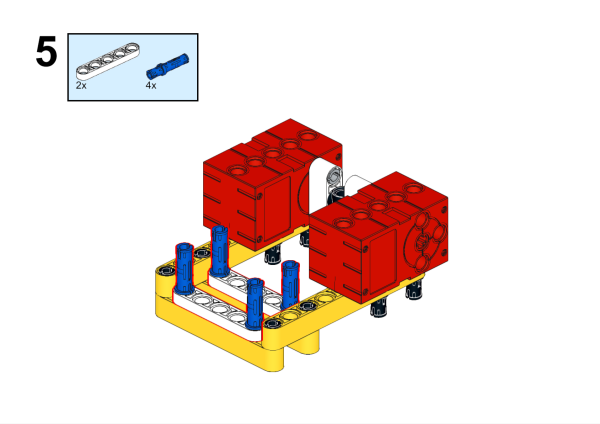

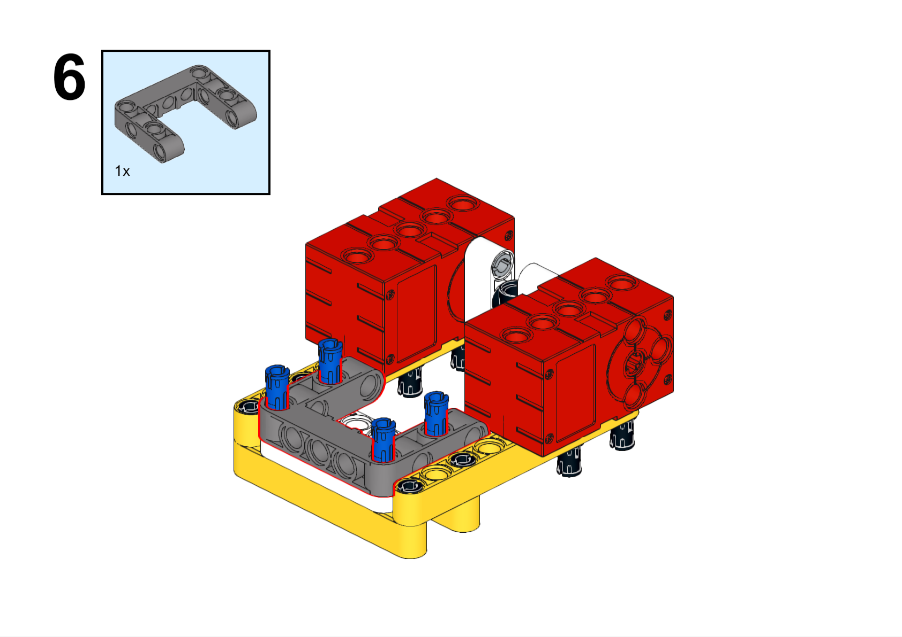

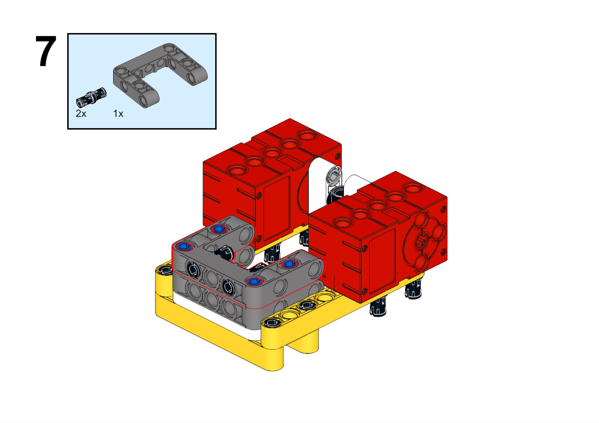

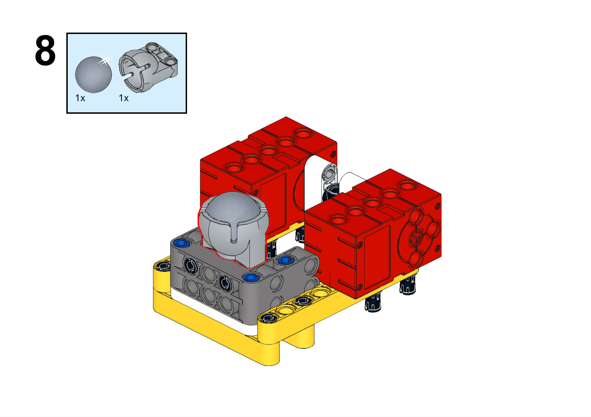

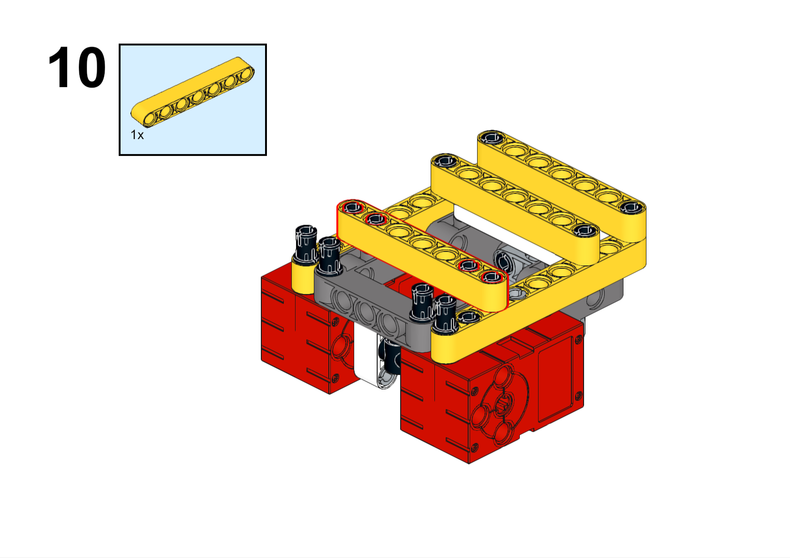

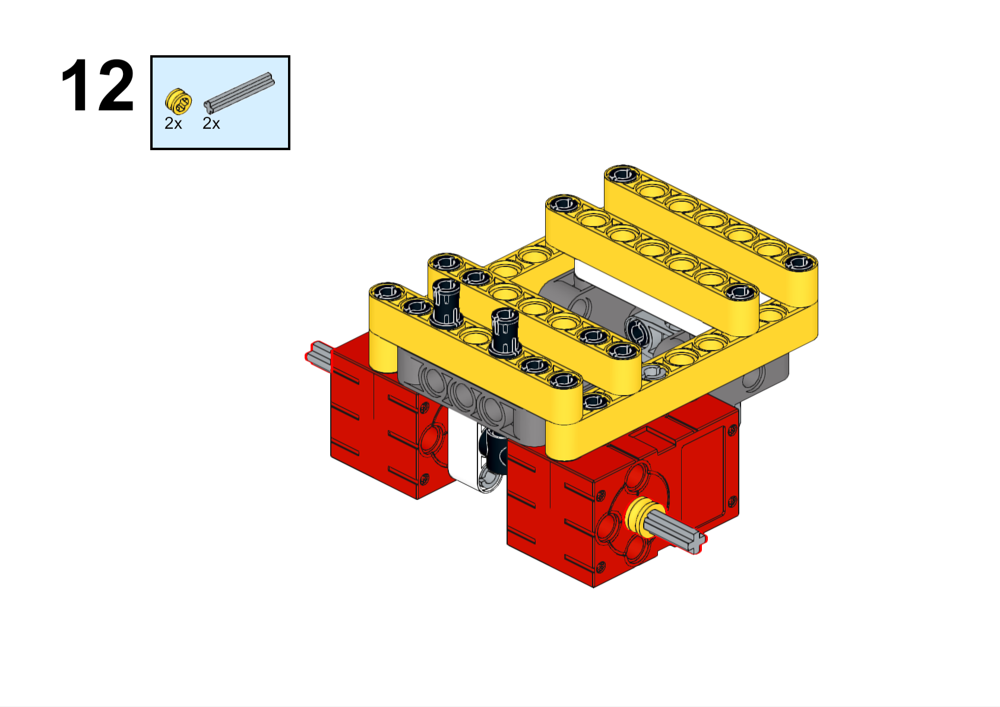

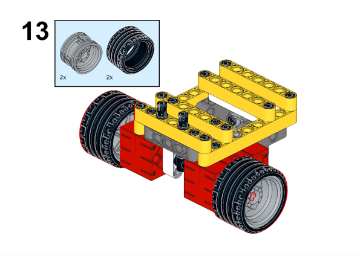

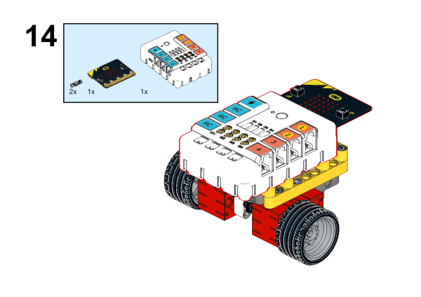

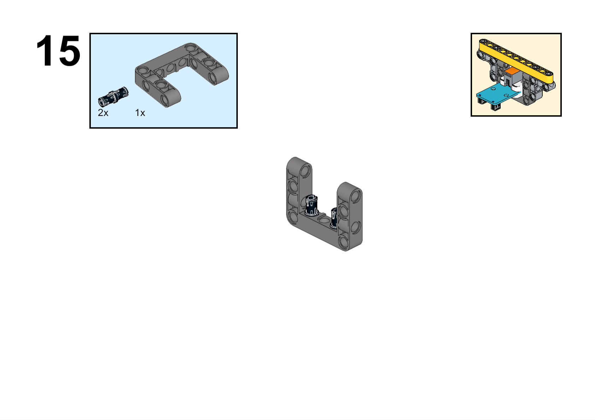

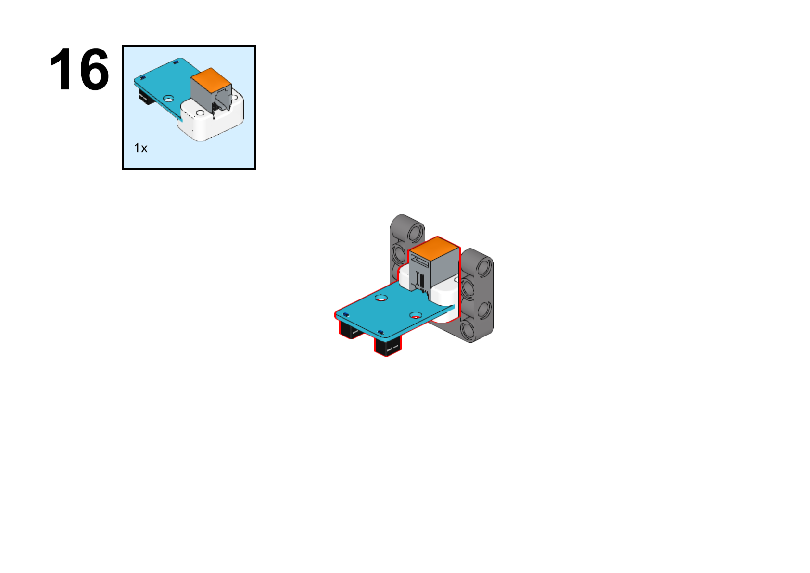

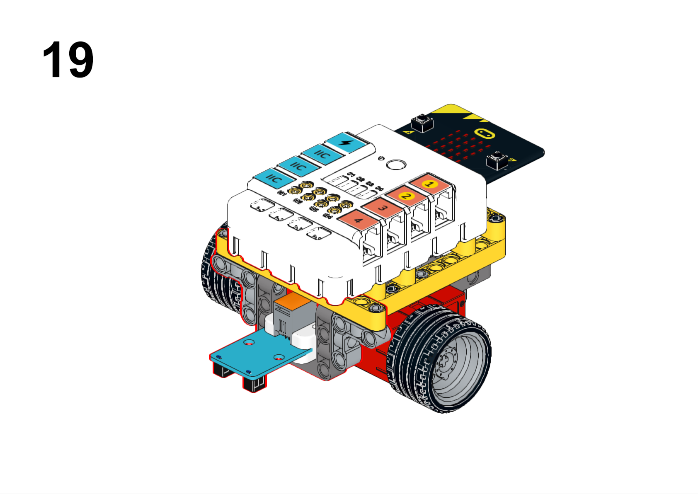

**搭建完成**

##### 硬件连接

将巡线传感器连接到哪吒扩展板的J1接口，电机连接到哪吒扩展板的M1、M4接口。

##### 软件编程

打开编程平台[makecode](https://makecode.microbit.org/#)

新建项目

点击扩展

在搜索栏搜索`PlanetX`添加行星系列传感器的扩展库

在搜索栏搜索`nezha`添加哪吒扩展板的扩展库

编写程序

程序链接:[https://makecode.microbit.org/_3EV1ULio68sq](https://makecode.microbit.org/_3EV1ULio68sq)

你也可以通过以下网页直接下载程序。

    <iframe
        src="https://makecode.microbit.org/_3EV1ULio68sq"
        frameborder="0"
        sandbox="allow-popups allow-forms allow-scripts allow-same-origin"
        style={{
            position: 'absolute',
            width: '100%',
            height: '100%',
        }}
    />

### 展示

>分组展示，学生对机器人进行测试、调试和优化，提高巡线的准确性和稳定性，比较各组的成果和效果。

#### 示例案例效果

小车沿着黑线行驶。

### 反思

>分组分享，让每组的学生分享自己的制作过程和心得，总结自己遇到的问题和解决办法，评价自己的优点和不足。
