# Case 25 智能避障小车1

## 简介

在这个课程中，我们将一起制作一辆智能避障车，利用哪吒发明家套装V2和超声波传感器，让车辆能够自动检测并避开前方的障碍物。通过这个项目，我们将学习超声波传感器的工作原理，并将其应用于实际机器人的设计与制作中。

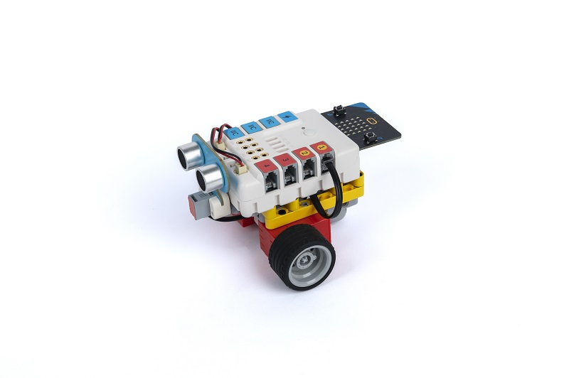

## 教学目标

- 了解超声波传感器的工作原理和应用
- 学习使用哪吒发明家套装V2搭建机器人
- 培养问题解决和创新思维能力
- 掌握基本的编程概念和图形化编程工具

## 教学准备

[哪吒发明家套装 V2](https://www.elecfreaks.com/nezha-inventor-s-kit-v2-for-micro-bit.html)

## 教学过程

### 引入

>向学生介绍智能避障车制作的背景和目标，激发学生的兴趣和好奇心。

在现实生活中，有许多机器人都使用了超声波传感器来感知周围的环境，并根据检测到的障碍物来做出相应的动作。你是否好奇超声波传感器是如何工作的？如何利用它来制作一个智能避障车呢？

在本课程中，我们将深入了解超声波传感器的工作原理，并将其应用到机器人设计中。我们将使用哪吒发明家套装V2搭建智能避障车的机器人原型，并连接超声波传感器。通过学习和实践，我们将探索如何编写程序，使机器人能够根据超声波传感器的数据做出智能的避开障碍物的动作。

现在，让我们一起开启这个有趣而富有挑战的STEAM项目，探索超声波传感器的工作原理，发挥创造力，培养问题解决和创新思维的能力吧！准备好了吗？让我们开始吧！

### 探究

>分组讨论，让学生思考如何用积木材料来制作一辆智能避障车。

- 超声波传感器是如何工作的？它如何测量距离？
- 如何将超声波传感器与哪吒发明家套装V2结合起来，使机器人能够检测前方的障碍物？
- 如何编写程序，使机器人能够根据超声波传感器的数据做出相应的动作，避开障碍物？

### 实践

>分组动手，按照自己的设计方案，用积木材料来制作一辆智能避障车。

按照自己的设计方案，用积木材料来制作一辆智能避障车。

#### 示例

##### 搭建步骤

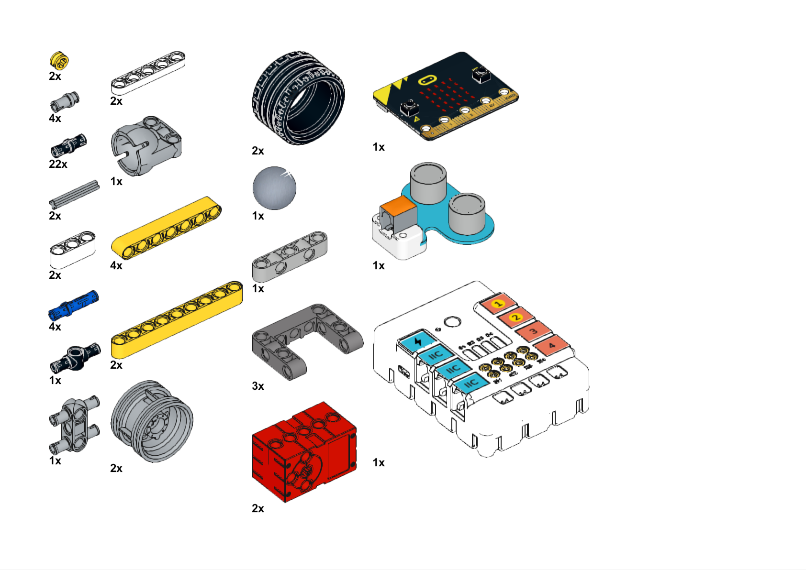

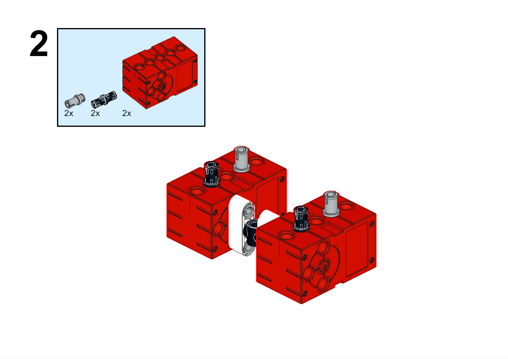

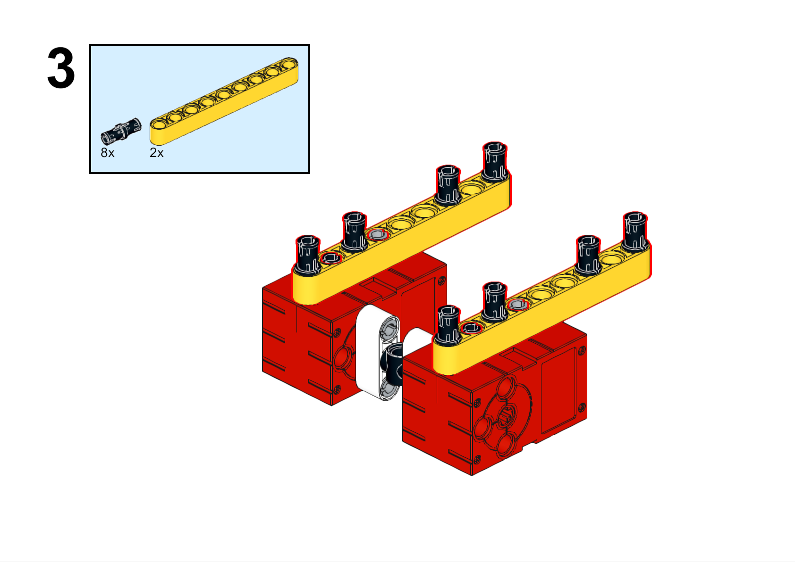

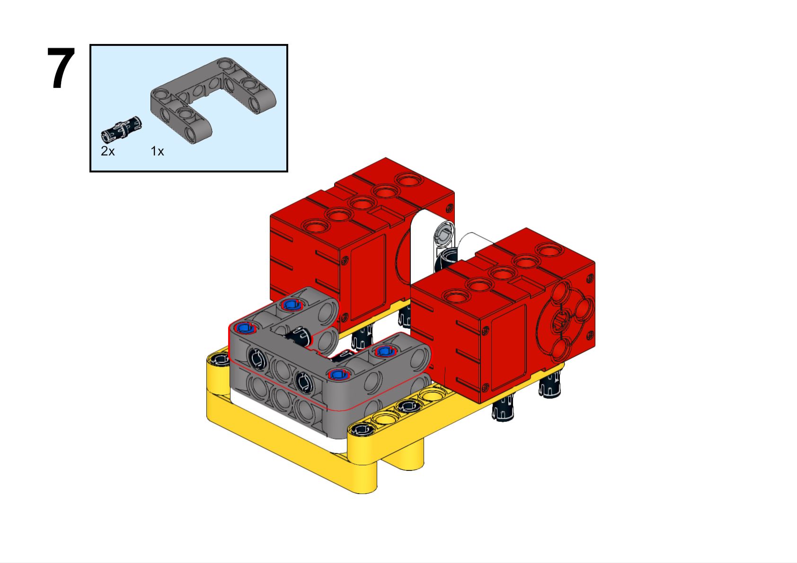

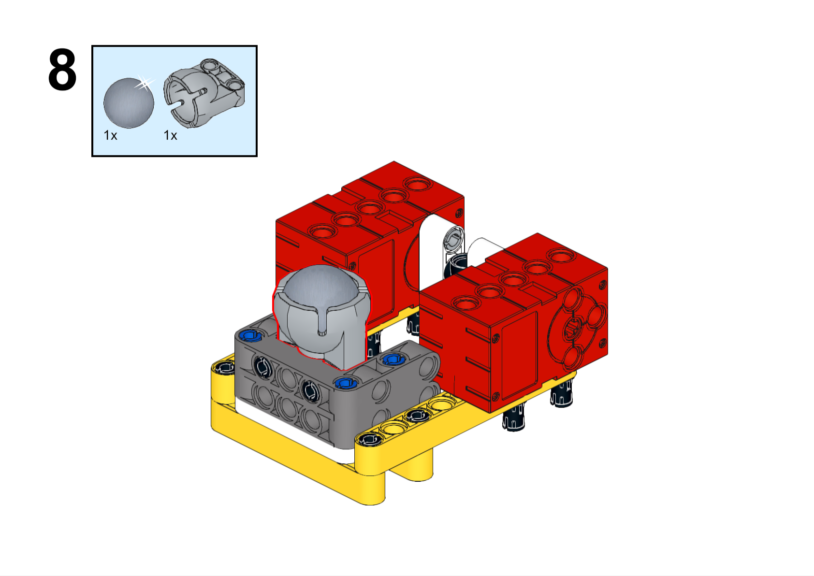

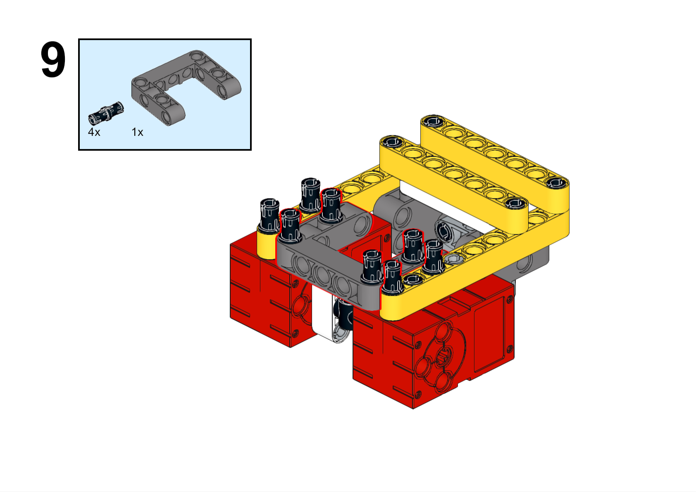

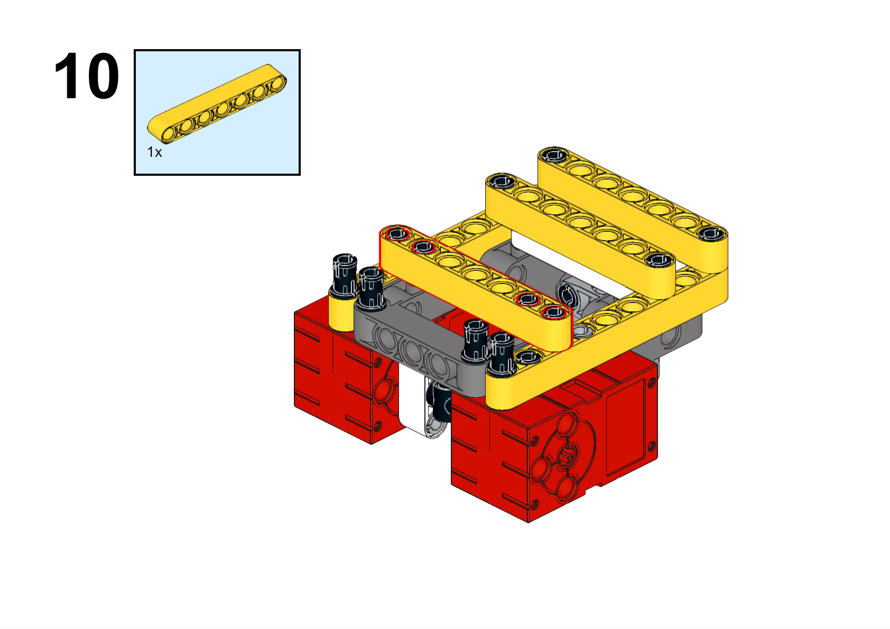

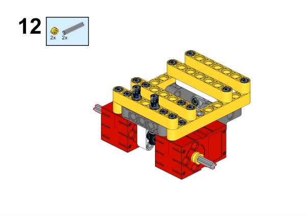

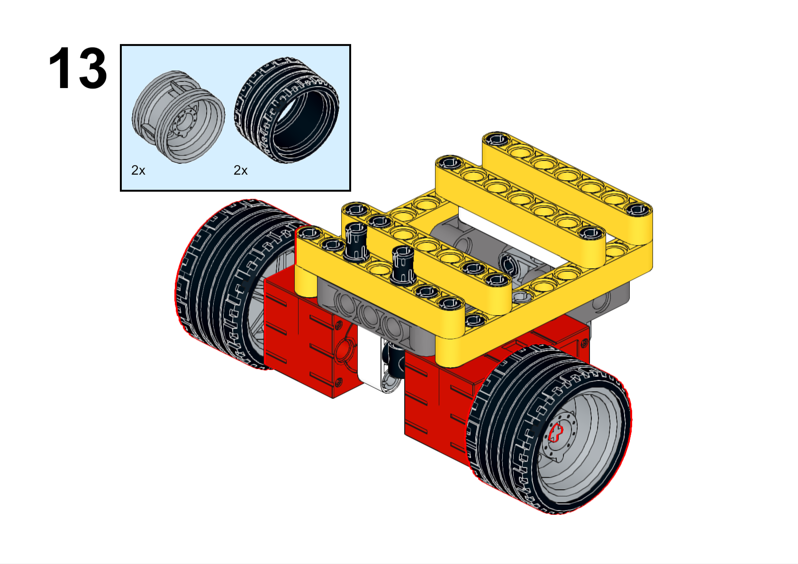

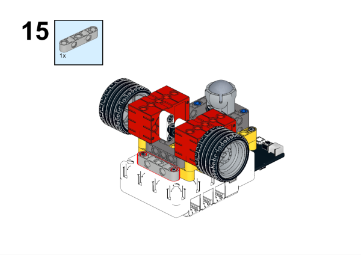

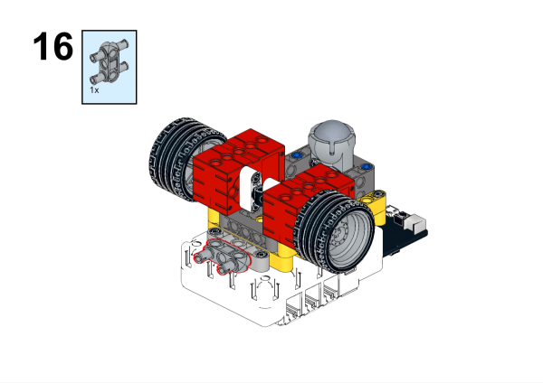

**搭建完成**

### 硬件连接

将超声波传感器连接到哪吒扩展板的J1接口，电机连接到哪吒扩展板的M1、M4接口。

### 软件编程

打开编程平台[makecode](https://makecode.microbit.org/#)

新建项目

点击扩展

在搜索栏搜索`PlanetX`添加行星系列传感器的扩展库

在搜索栏搜索`nezha`添加哪吒扩展板的扩展库

编写程序

程序链接:[https://makecode.microbit.org/_Ab3EyVLy7Cit](https://makecode.microbit.org/_Ab3EyVLy7Cit)

你也可以通过以下网页直接下载程序。

    <iframe
        src="https://makecode.microbit.org/_Ab3EyVLy7Cit"
        frameborder="0"
        sandbox="allow-popups allow-forms allow-scripts allow-same-origin"
        style={{
            position: 'absolute',
            width: '100%',
            height: '100%',
        }}
    />

### 展示

>分组展示，学生对机器人进行测试、调试和优化，提高避障的准确性和稳定性，比较各组的成果和效果。

#### 示例案例效果

当有障碍物阻挡在小车面前，小车会转向行驶。

### 反思

>分组分享，让每组的学生分享自己的制作过程和心得，总结自己遇到的问题和解决办法，评价自己的优点和不足。
