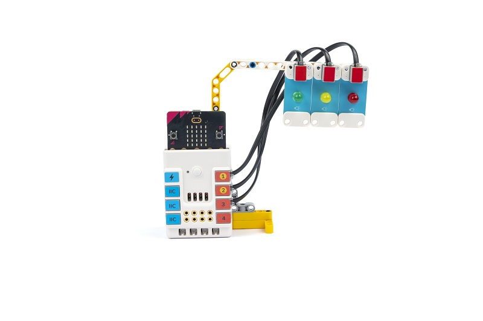
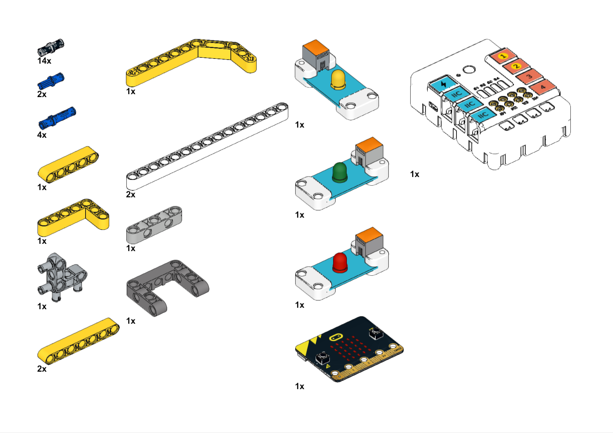
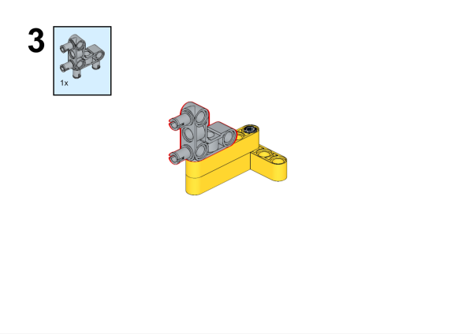
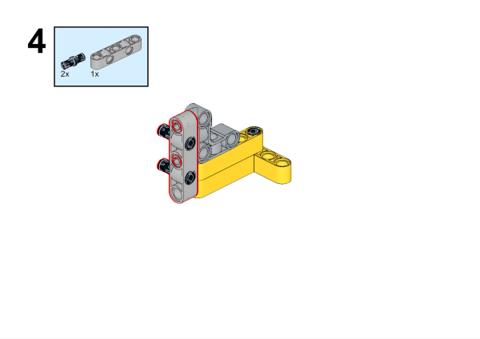
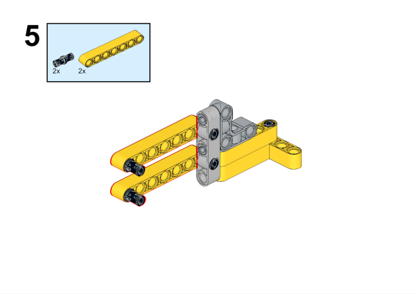
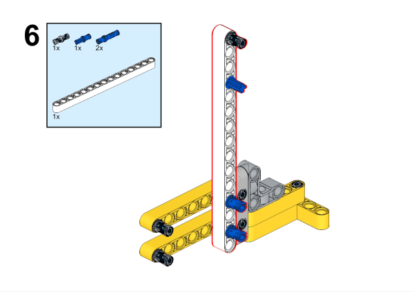
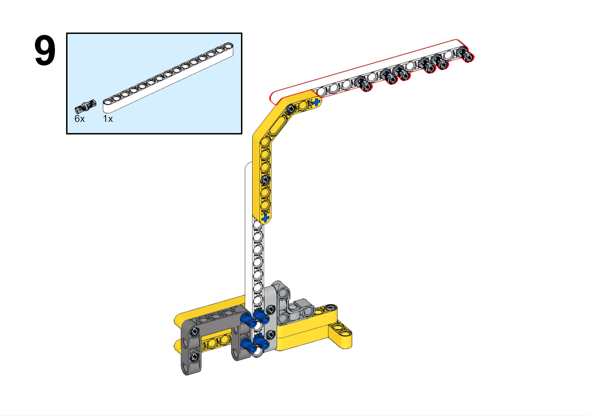
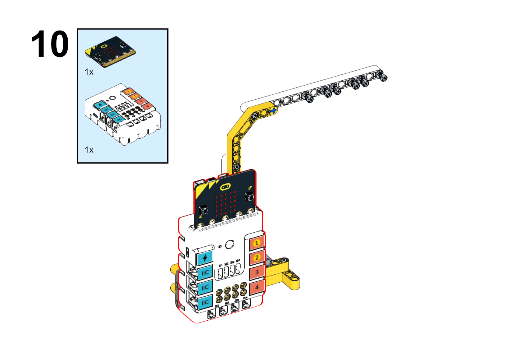
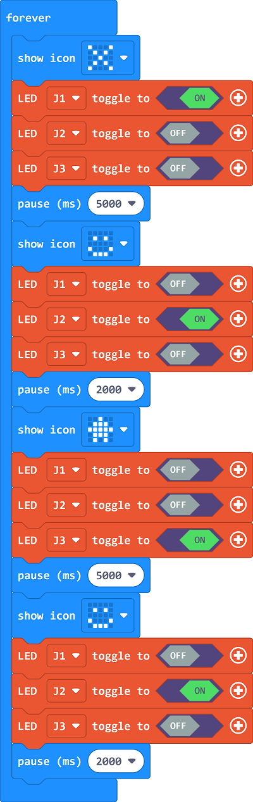

# Case 30 交通灯

## 简介

在这个项目中，我们将使用哪吒发明家套装V2制作一个交通灯模型。我们将学习LED灯的控制、编程等知识，并将其应用到交通灯的制作中。

## 教学目标

- 掌握LED灯的使用和控制方法
- 学会使用哪吒发明家套装V2编程交通灯的亮灭和变换序列
- 培养创造力和创新思维

## 教学准备

[哪吒发明家套装 V2](https://www.elecfreaks.com/nezha-inventor-s-kit-v2-for-micro-bit.html)

## 教学过程

### 引入

>向学生介绍交通灯制作的背景和目标，激发学生的兴趣和好奇心。

交通灯在我们的日常生活中扮演着非常重要的角色，它们能够控制交通流量，保障道路安全。想象一下，如果我们能够自己制作一个交通灯模型并控制它的亮灭状态和变换序列，那将是多么有趣和有用的发明呢？

### 探究

>分组讨论，让学生思考如何用积木材料来制作一个交通灯。

- 如何通过编程控制LED灯的亮灭状态？
- 如何编写程序实现交通灯的变换序列，例如红灯亮->绿灯亮->黄灯亮->红灯亮的循环？
- 如何发挥创造力，设计独特的交通灯外观和变换序列？

### 实践

>分组动手，按照自己的设计方案，用积木材料来制作一个交通灯。

按照自己的设计方案，用积木材料来制作一个交通灯。

#### 示例

##### 搭建步骤

**搭建完成**

##### 硬件连接

将绿色LED灯连接到哪吒扩展板的J1接口，黄色LED灯连接到哪吒扩展板的J2接口，红色LED灯连接到哪吒扩展板的J3接口。

##### 软件编程

打开编程平台[makecode](https://makecode.microbit.org/#)

新建项目

点击扩展

在搜索栏搜索`PlanetX`添加行星系列传感器的扩展库

编写程序

程序链接:[https://makecode.microbit.org/_Wv0gDTaTUY88](https://makecode.microbit.org/_Wv0gDTaTUY88)

你也可以通过以下网页直接下载程序。

    <iframe
        src="https://makecode.microbit.org/_Wv0gDTaTUY88"
        frameborder="0"
        sandbox="allow-popups allow-forms allow-scripts allow-same-origin"
        style={{
            position: 'absolute',
            width: '100%',
            height: '100%',
        }}
    />

### 展示

>分组展示，比较各组的成果和效果。

#### 示例案例效果

绿灯亮5秒，红灯亮5秒，交替亮起，每次切换中间黄灯亮2秒。

### 反思

>分组分享，让每组的学生分享自己的制作过程和心得，总结自己遇到的问题和解决办法，评价自己的优点和不足。
