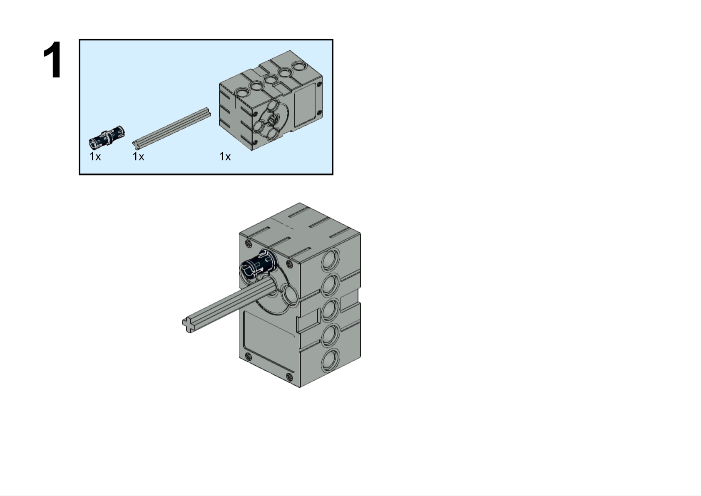
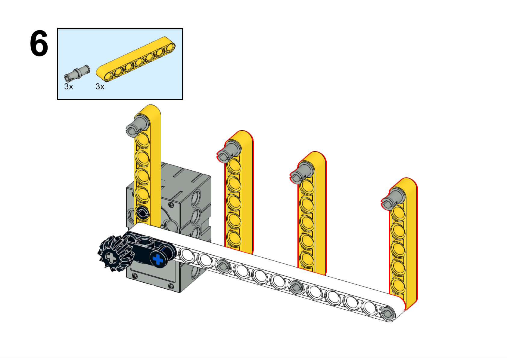
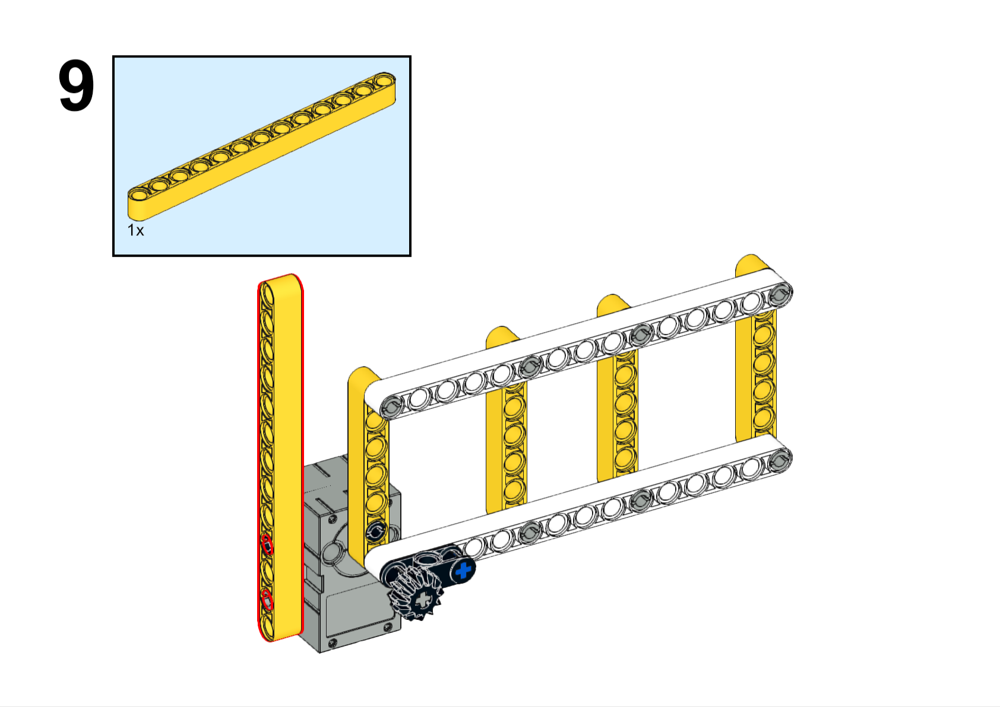
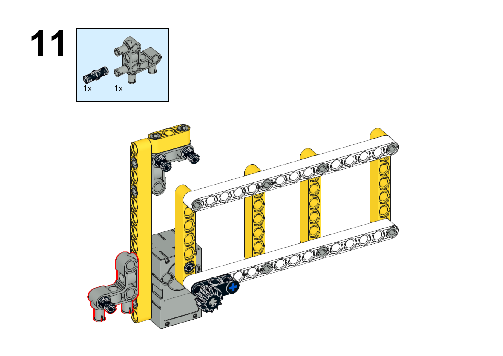
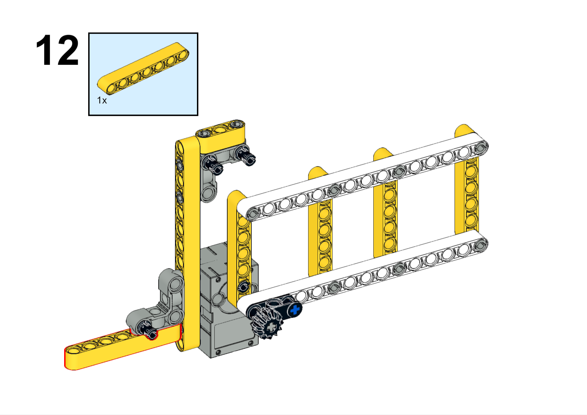
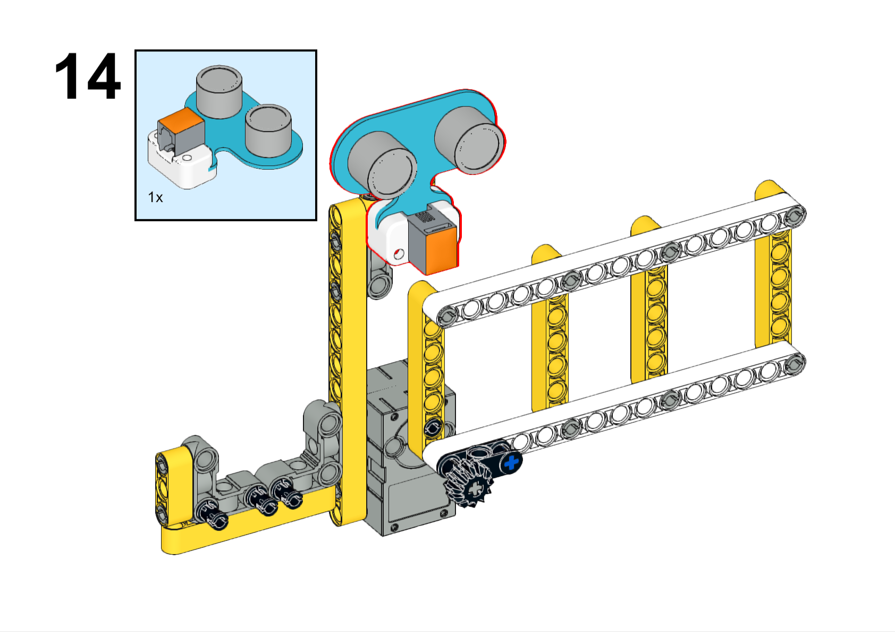

# Case 31 超声波闸门

## 简介

在这个项目中，我们将使用哪吒发明家套装V2制作一个超声波闸门模型。我们将学习超声波传感器的工作原理、编程等知识，并将其应用到闸门模型的制作中。

## 教学目标

- 学习超声波传感器的工作原理
- 学会使用哪吒发明家套装V2编程控制闸门的运动
- 培养创造力和创新思维

## 教学准备

[哪吒发明家套装 V2](https://www.elecfreaks.com/nezha-inventor-s-kit-v2-for-micro-bit.html)

## 教学过程

### 引入

>向学生介绍超声波闸门制作的背景和目标，激发学生的兴趣和好奇心。

超声波传感器是一种常用的测距传感器，它能够通过发送超声波并测量其返回时间来检测物体的距离。想象一下，如果我们能够利用超声波传感器制作一个闸门模型，并通过探测到的距离来自动控制闸门的打开和关闭，那将是多么有趣和实用的发明呢？

### 探究

>分组讨论，让学生思考如何用积木材料来制作一个超声波闸门。

- 如何通过编程将超声波传感器的测量结果转化为闸门的运动控制信号？
- 如何调整闸门的运动范围和速度以适应不同的应用场景？
- 如何发挥创造力，设计独特的闸门外观和运动控制方式？

### 实践

>分组动手，按照自己的设计方案，用积木材料来制作一个超声波闸门。

按照自己的设计方案，用积木材料来制作一个超声波闸门。

#### 示例

##### 搭建步骤

**搭建完成**

##### 硬件连接

将超声波传感器连接到哪吒扩展板的J1接口，将舵机连接到哪吒扩展板的S1接口。

##### 软件编程

打开编程平台[makecode](https://makecode.microbit.org/#)

新建项目

点击扩展

在搜索栏搜索`PlanetX`添加行星系列传感器的扩展库

在搜索栏搜索`nezha`添加哪吒扩展板的扩展库

编写程序

程序链接:[https://makecode.microbit.org/_71MTtr1dH9go](https://makecode.microbit.org/_71MTtr1dH9go)

你也可以通过以下网页直接下载程序。

    <iframe
        src="https://makecode.microbit.org/_71MTtr1dH9go"
        frameborder="0"
        sandbox="allow-popups allow-forms allow-scripts allow-same-origin"
        style={{
            position: 'absolute',
            width: '100%',
            height: '100%',
        }}
    />

### 展示

>分组展示，比较各组的成果和效果。

#### 示例案例效果

当超声波传感器检测到物体靠近时，则自动打开闸门。

### 反思

>分组分享，让每组的学生分享自己的制作过程和心得，总结自己遇到的问题和解决办法，评价自己的优点和不足。
