# Case 08 行走机器人

## 简介

行走是动物世界中最基本、常见的运动方式之一。我们可以观察到许多动物如人类、猫、狗等都有各自独特的行走方式。它们通过协调地移动四肢，调整身体的平衡，才能实现稳定的行走动作。不同的动物有着不同的步态和姿势，展现出各自的特点和灵活性。

在本项目中，我们将尝试模仿动物的行走动作，设计和制作一个能够模拟它们步伐的机器人。通过哪吒发明家套装V2中的材料，我们将搭建机器人的结构，并通过一个电机控制机器人的运动。同时，我们将学习和应用齿轮传动的原理，以实现机器人的协调运动和行走动作。

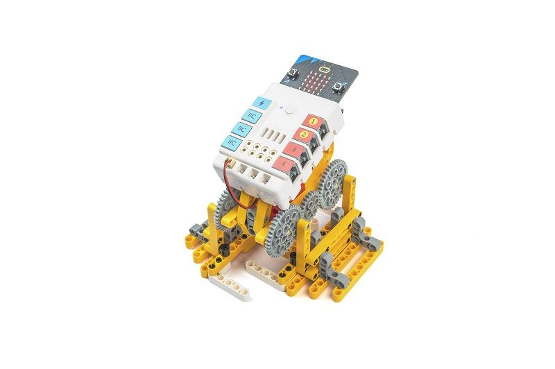

## 教学目标

- 理解电机的工作原理和控制方法。
- 掌握齿轮传动的基本原理和应用。
- 学会使用哪吒发明家套装V2中的材料搭建行走机器人的基本结构。
- 了解重心对机器人稳定性的影响，并学习如何调整重心来保持机器人的平衡。
- 培养创造力、问题解决能力和团队合作精神。

## 教学准备

[哪吒发明家套装 V2](https://www.elecfreaks.com/nezha-inventor-s-kit-v2-for-micro-bit.html)

## 教学过程

### 引入

>向学生介绍行走机器人制作的背景和目标，激发学生的兴趣和好奇心。

行走是动物世界中最基本、常见的运动方式之一。我们可以观察到许多动物如人类、猫、狗等都有各自独特的行走方式。它们通过协调地移动四肢，调整身体的平衡，才能实现稳定的行走动作。不同的动物有着不同的步态和姿势，展现出各自的特点和灵活性。

在本项目中，我们将尝试模仿动物的行走动作，设计和制作一个能够模拟它们步伐的机器人。通过哪吒发明家套装V2中的材料，我们将搭建机器人的结构，并通过一个电机控制机器人的运动。同时，我们将学习和应用齿轮传动的原理，以实现机器人的协调运动和行走动作。

### 探究

>分组讨论，让学生思考如何用积木材料来制作一个行走机器人，重点关注齿轮传动和重心对平衡的影响。

- 通过调整齿轮的传动比例，你们能否改变机器人的行走速度？
- 如何调整机器人的重心位置来保持机器人的平衡？
- 如果给机器人添加更多的齿轮传动，会对机器人的行走效果产生什么影响？

### 实践

>分组动手，按照自己的设计方案，用积木材料来制作一个行走机器人。

按照自己的设计方案，用积木材料来制作一个行走机器人，看看谁的机器人走的更快。

#### 示例

##### 搭建步骤

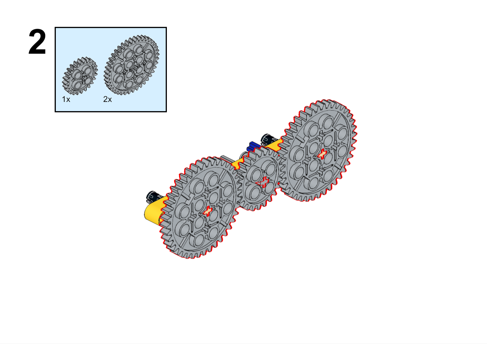

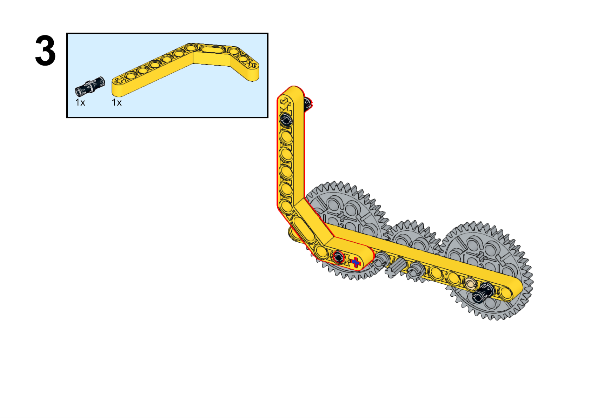

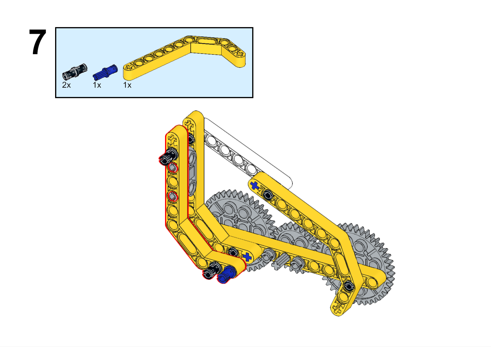

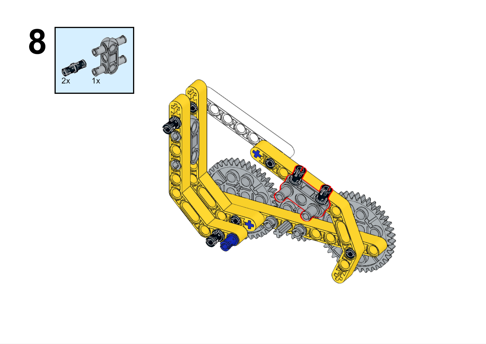

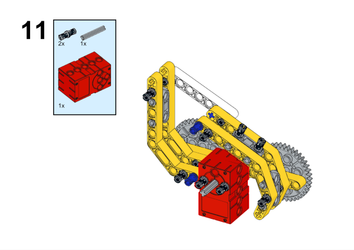

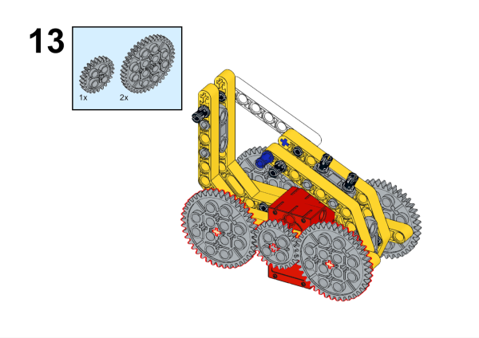

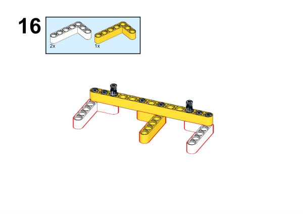

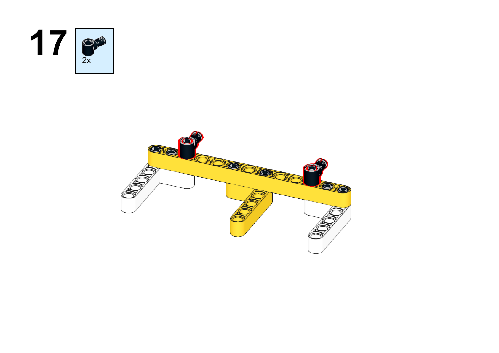

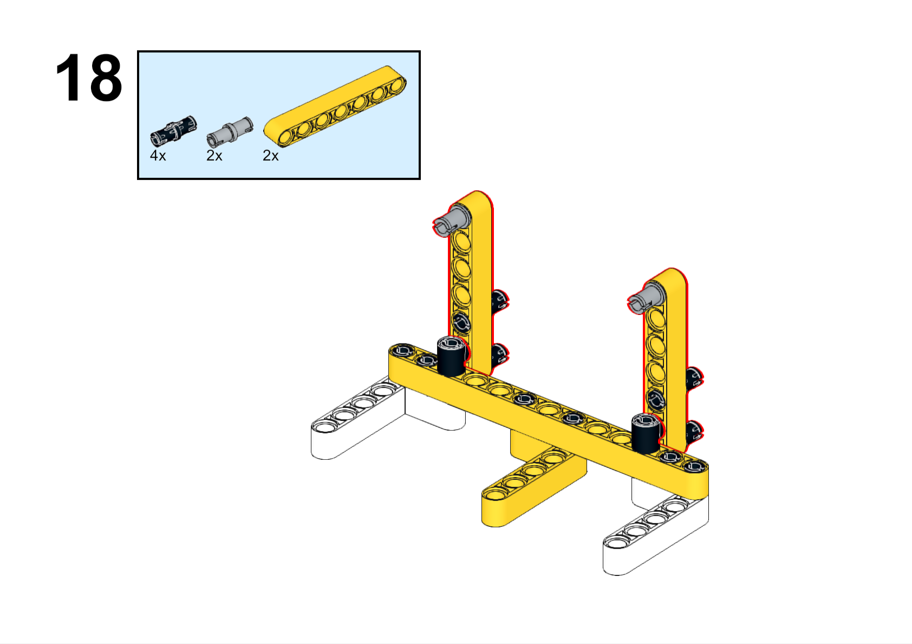

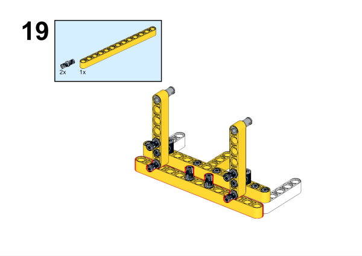

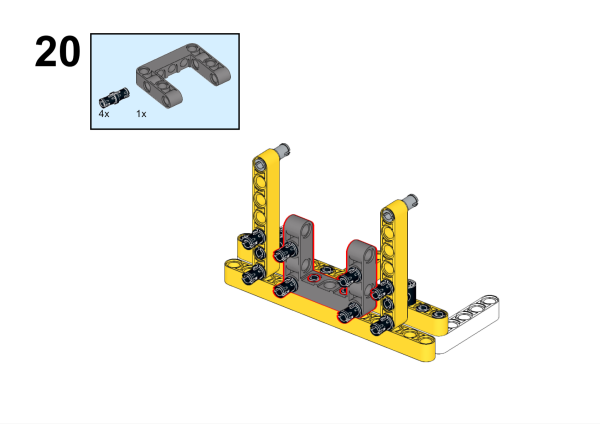

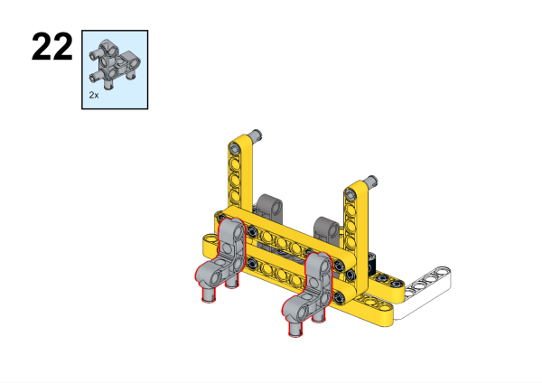

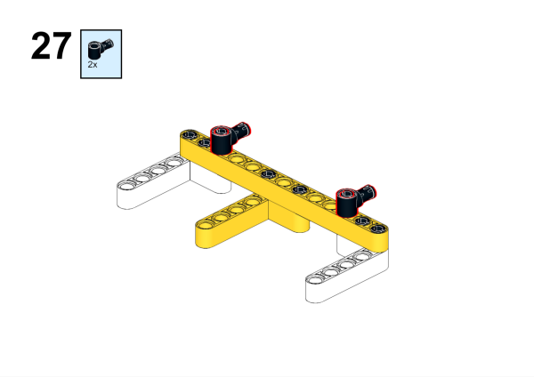

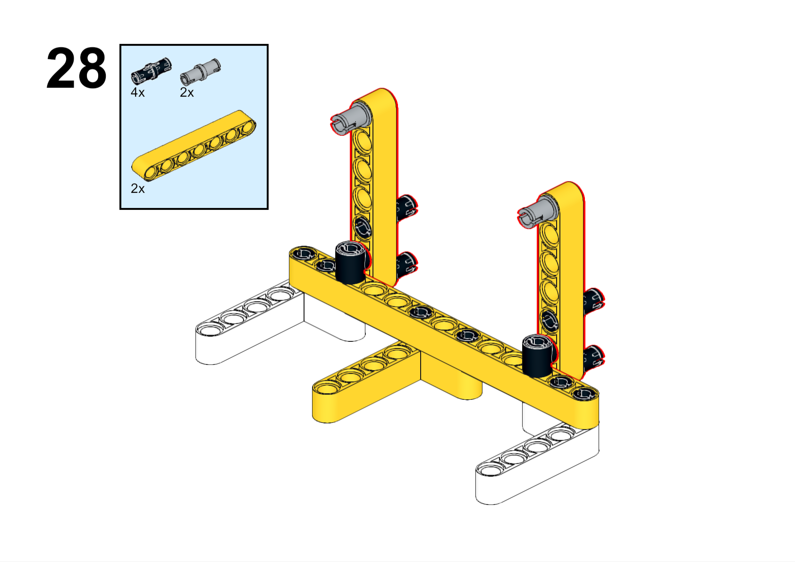

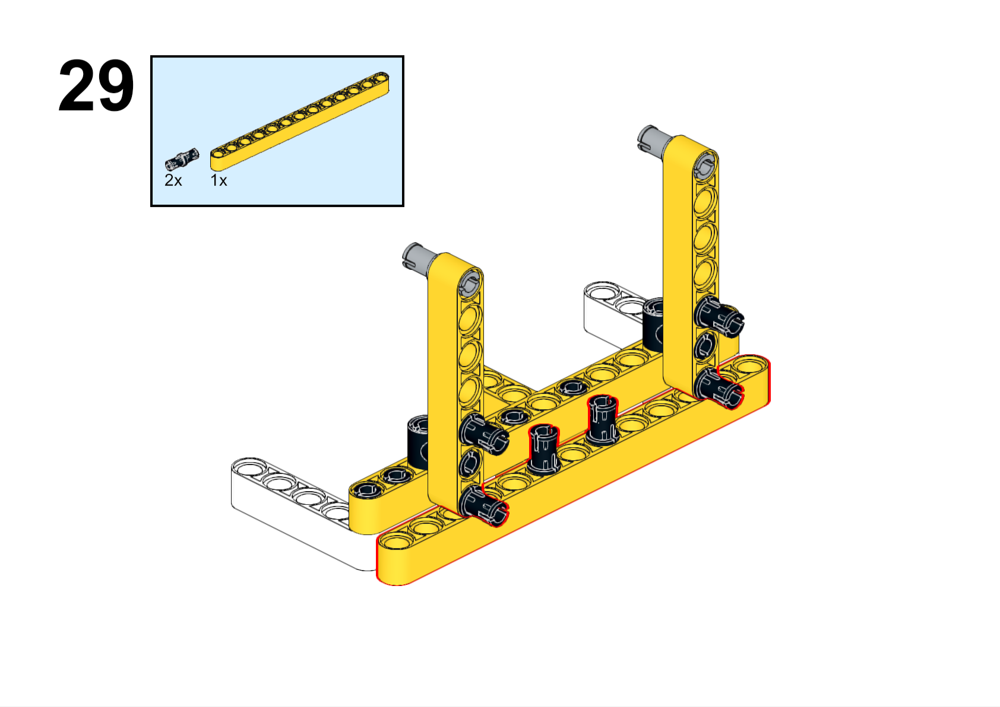

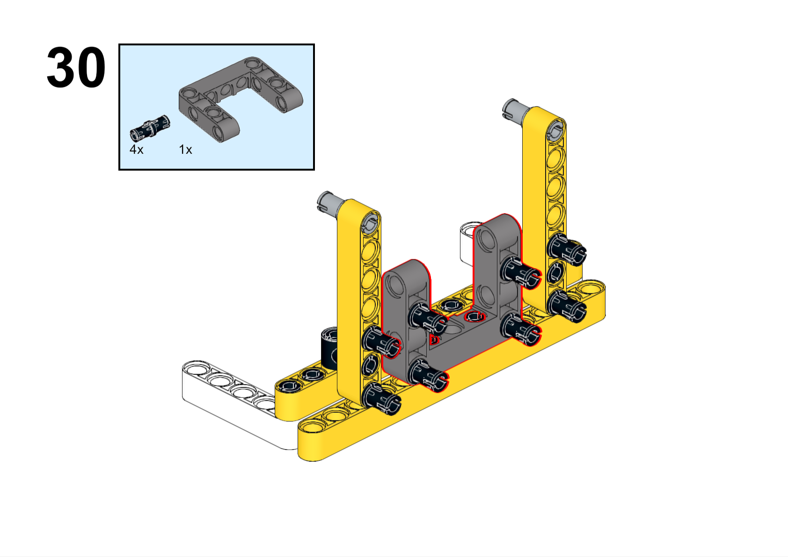

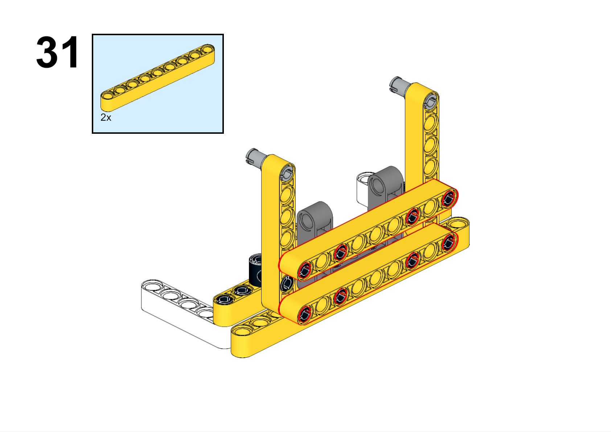

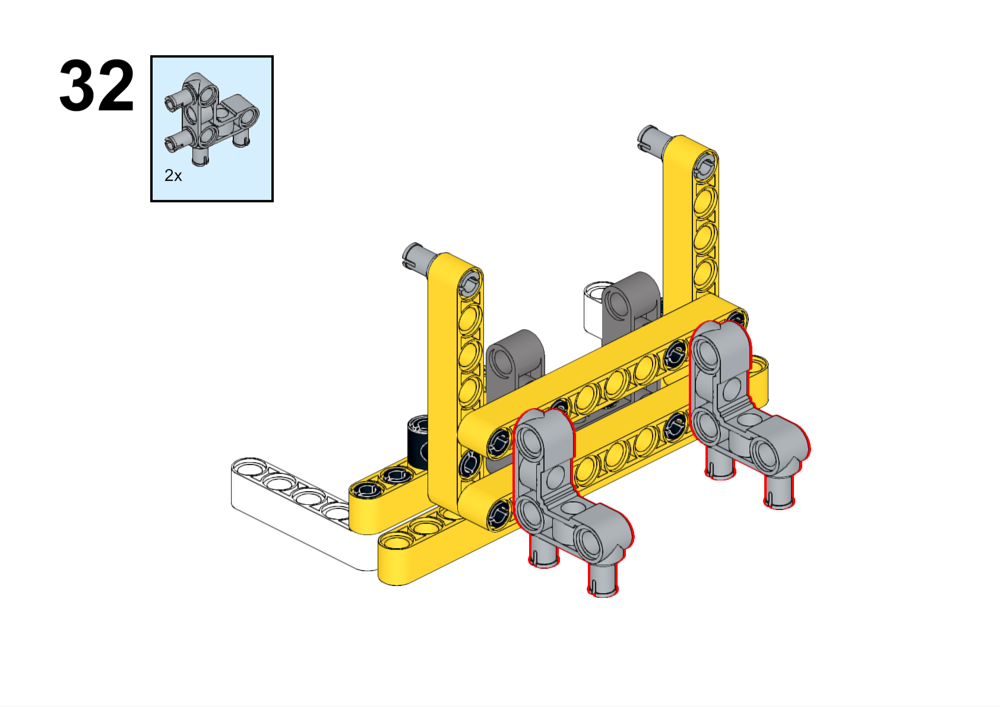

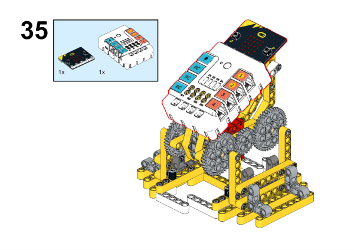

**搭建完成**

##### 硬件连接

将电机连接到哪吒扩展板的M1接口。

##### 软件编程

打开编程平台[makecode](https://makecode.microbit.org/#)

新建项目

点击扩展

在搜索栏搜索`nezha`添加哪吒扩展板的扩展库

编写程序

程序链接:[https://makecode.microbit.org/_i3CacvKkc40L](https://makecode.microbit.org/_i3CacvKkc40L)

你也可以通过以下网页直接下载程序。

    <iframe
        src="https://makecode.microbit.org/_i3CacvKkc40L"
        frameborder="0"
        sandbox="allow-popups allow-forms allow-scripts allow-same-origin"
        style={{
            position: 'absolute',
            width: '100%',
            height: '100%',
        }}
    />

### 展示

>分组展示，比较各组的成果和效果。

#### 示例案例效果

按下micro:bit上的A键，机器人向前行走，按下micro:bit上的B键，机器人停止行走。

### 反思

>分组分享，让每组的学生分享自己的制作过程和心得，总结自己遇到的问题和解决办法，评价自己的优点和不足。
