# Case 03 举重机器人

## 简介

举重是用双手把一根有两个圆盘的杠铃举到头顶，看谁能举起最重的杠铃。这听起来很简单，但其实很难，因为举重不仅需要很强的力量，还需要很快的速度，很好的技巧，很稳的平衡和很高的协调能力。而且，举重还需要很强的心理素质和意志力，因为举重时要面对很大的压力和挑战。

举重可以让我们的身体变得更强壮，更灵活，更健康，也可以让我们的自信心和自尊心变得更高。

我们今天就用哪吒发明家套装 V2 来制作一个可以模拟举重动作的机器人。

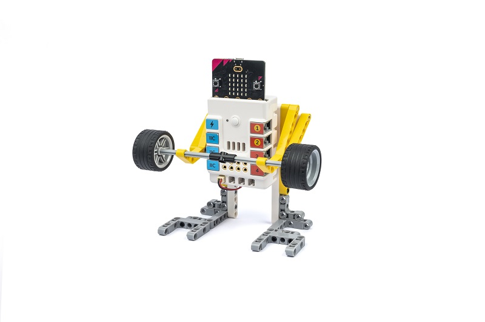

## 教学目标

- 掌握将圆周运动转化为往复运动的原理和方法。
- 掌握积木举重机器人的结构和功能。
- 掌握使用积木、电机等材料制作举重机器人的步骤和技巧。
- 掌握使用编程软件控制举重机器人的动作。

## 教学准备

[哪吒发明家套装 V2](https://www.elecfreaks.com/nezha-inventor-s-kit-v2-for-micro-bit.html)

## 教学过程

### 引入

>向学生介绍举重运动和机器人制作的背景和目标，激发学生的兴趣和好奇心。

举重是用双手把一根有两个圆盘的杠铃举到头顶，看谁能举起最重的杠铃。这听起来很简单，但其实很难，因为举重不仅需要很强的力量，还需要很快的速度，很好的技巧，很稳的平衡和很高的协调能力。而且，举重还需要很强的心理素质和意志力，因为举重时要面对很大的压力和挑战。

你们觉得举重有什么好处呢？举重可以让我们的身体变得更强壮，更灵活，更健康，也可以让我们的自信心和自尊心变得更高。

你们想不想学习一下举重呢？不过，我们今天不是真的要去举杠铃，而是要用积木和电机来制作一个可以模拟举重动作的机器人。这样既安全又有趣，也可以让我们学习一些科学、技术、工程、艺术和数学的知识和技能。你们准备好了吗？那么，让我们开始吧！

### 探究

>分组讨论，让学生思考如何用积木材料来制作一个举重机器人，重点关注圆周运动如何转化为往复运动、电机的使用方法和机械臂的设计方案。

- 什么是往复运动，即在两个相反方向上反复进行的运动；
- 电机的运动是圆周运动，我们需要一个结构来将圆周运动转化为往复运动；
- 机械臂的设计方案可以根据自己的想法和创意来确定，但是要注意结构的稳定性和可行性。

### 实践

>分组动手，按照自己的设计方案，用积木材料来制作一个举重机器人。

按照自己的设计方案，用积木材料来制作一个举重机器人，看看谁的机器人举起的杠铃比较重。

#### 示例

##### 搭建步骤

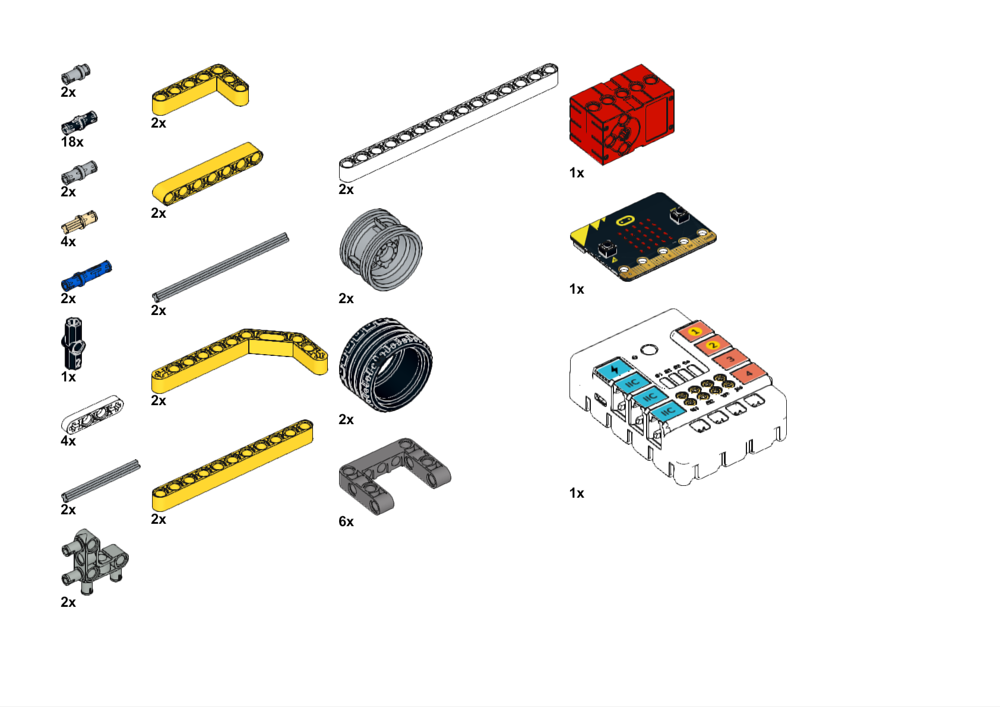

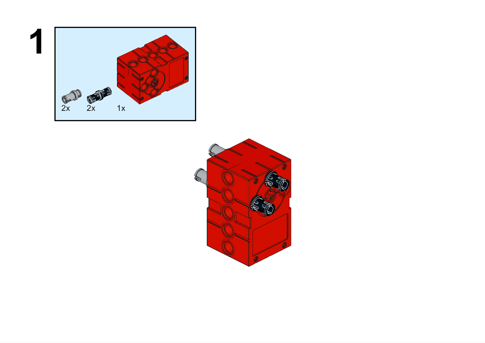

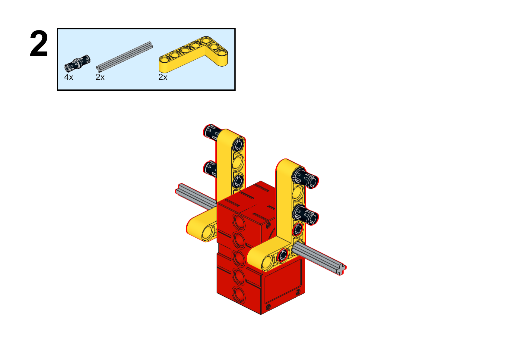

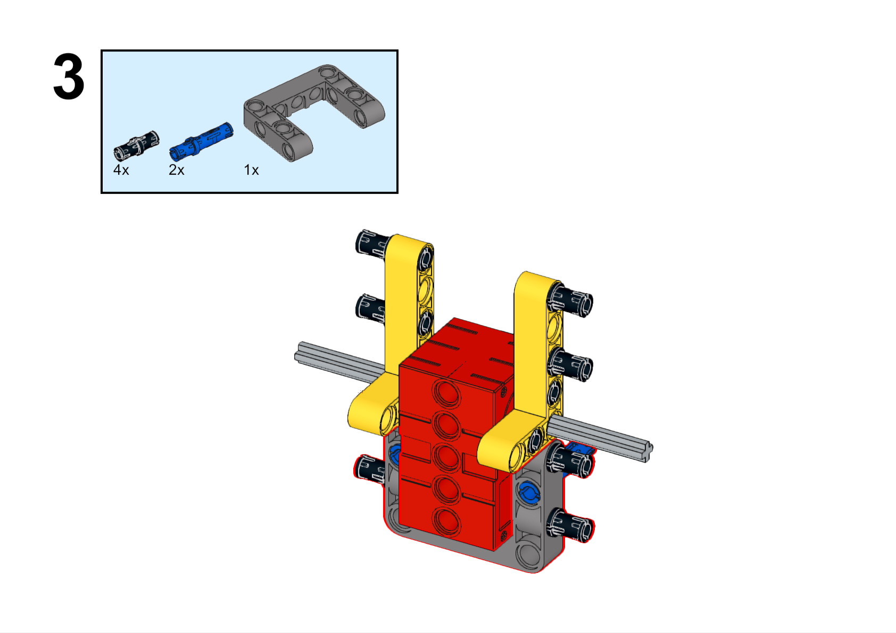

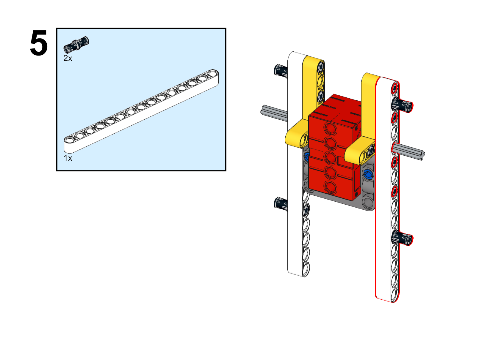

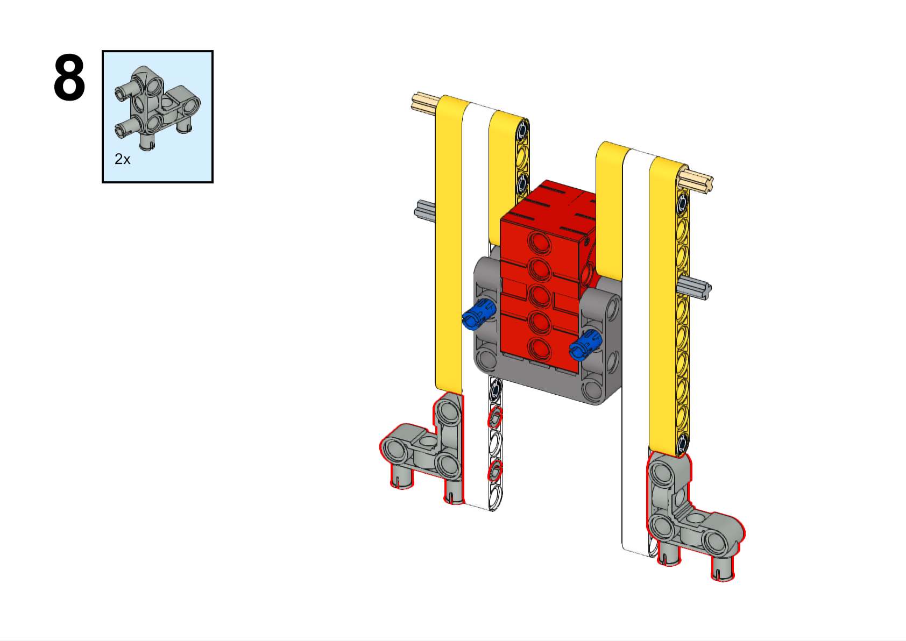

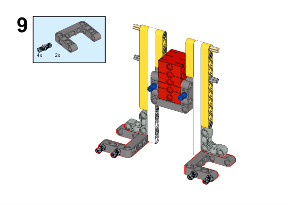

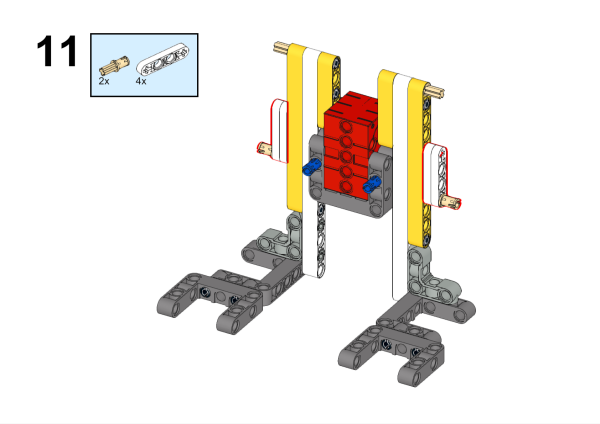

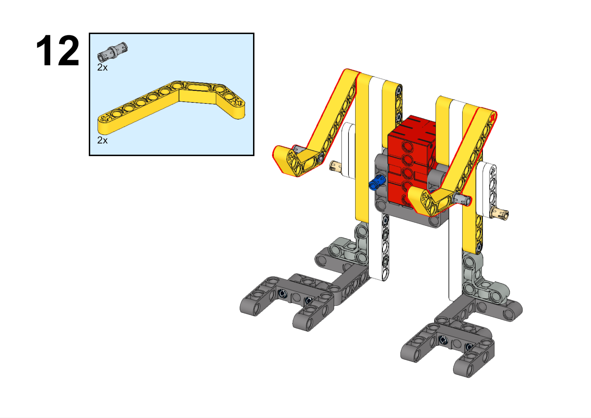

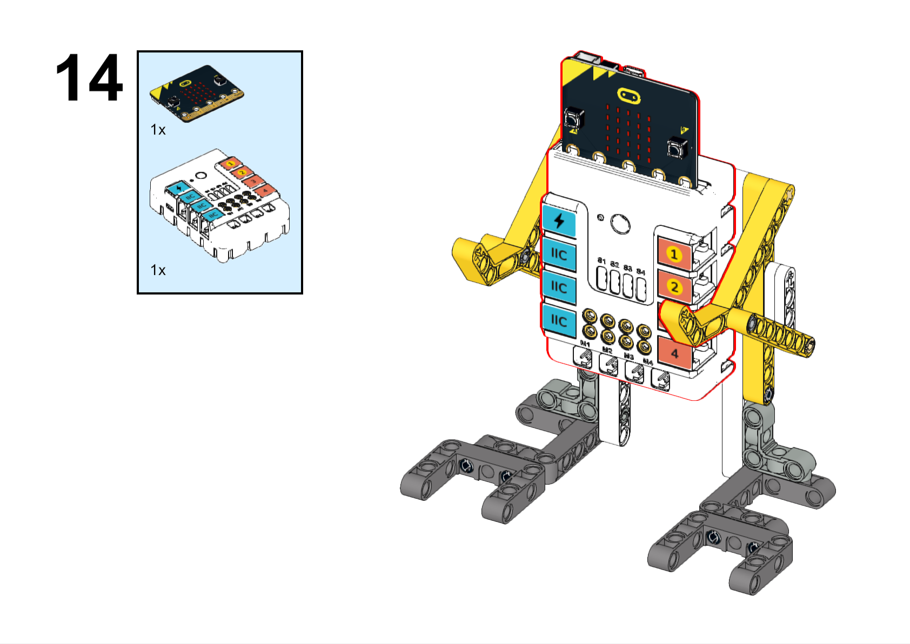

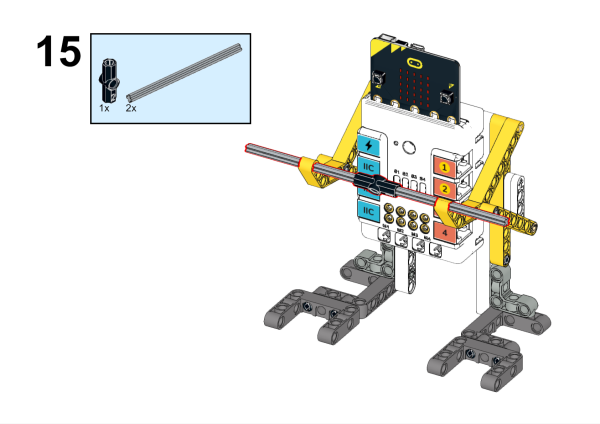

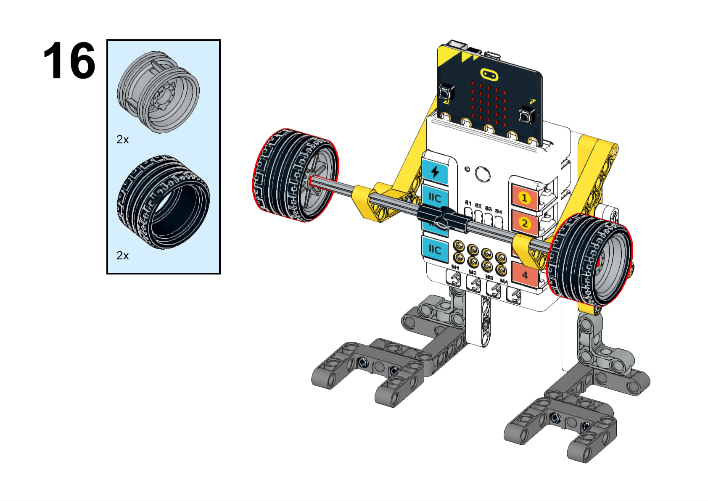

**搭建完成**

### 硬件连接

将电机连接到哪吒扩展板的M1接口。

### 软件编程

打开编程平台[makecode](https://makecode.microbit.org/#)

新建项目

点击扩展

在搜索栏搜索`nezha`添加哪吒扩展板的扩展库

编写程序

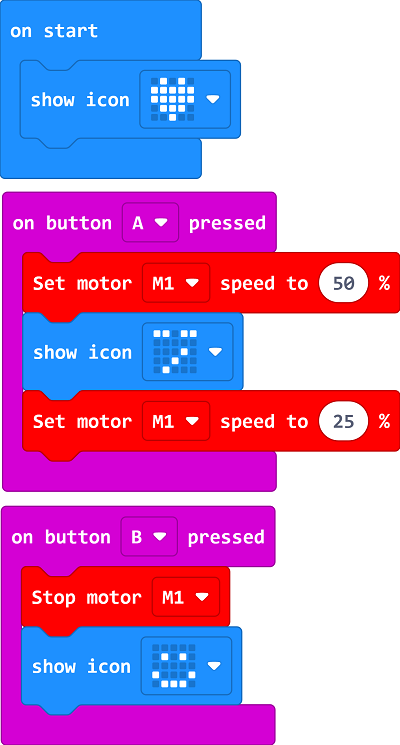

程序链接:[https://makecode.microbit.org/_LgVU5PgYcJKw](https://makecode.microbit.org/_LgVU5PgYcJKw)

你也可以通过以下网页直接下载程序。

    <iframe
        src="https://makecode.microbit.org/_LgVU5PgYcJKw"
        frameborder="0"
        sandbox="allow-popups allow-forms allow-scripts allow-same-origin"
        style={{
            position: 'absolute',
            width: '100%',
            height: '100%',
        }}
    />

### 展示

>分组展示，让每组的机器人进行举重，并对比举起物体的重量，比较各组的成果和效果。

#### 示例案例效果

按下micro:bit上的A键，机器人开始举重，按下micro:bit上的B键，机器人停止举重。

### 反思

>分组分享，让每组的学生分享自己的制作过程和心得，总结自己遇到的问题和解决办法，评价自己的优点和不足。
