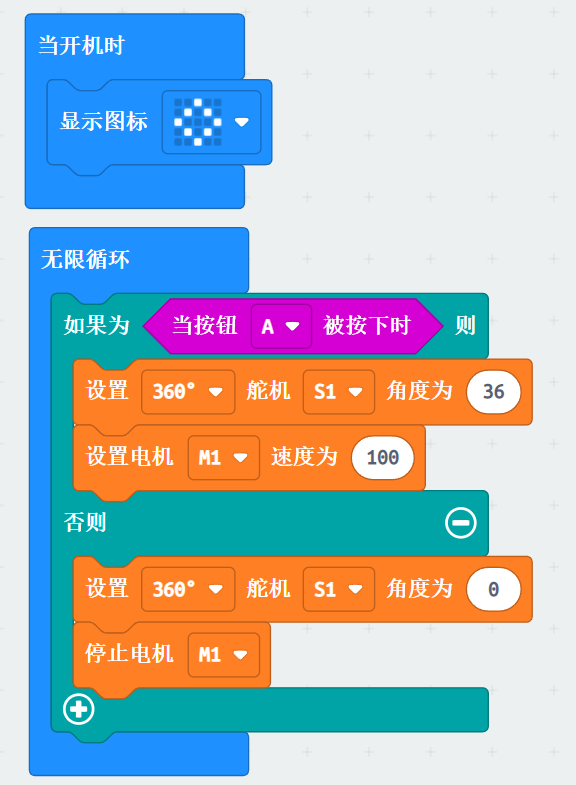

# Case 24: 陀螺发射器
## 目的
制作一个陀螺发射器。

## 购买链接

[悟空创意搭建套装](https://item.taobao.com/item.htm?id=649813731275&spm=2015.23436601.0.0)

## 所需材料

## 搭建步骤

## 编程平台

[MakeCode](https://makecode.microbit.org/)

## 编程
## 添加扩展
在MakeCode的代码抽屉中点击高级，查看更多代码选项，点击扩展。

在搜索框中搜索wukong，点击图片中wukong，添加扩展包。

### 程序

程序链接：[https://makecode.microbit.org/_aVDHqfaFbDRq](https://makecode.microbit.org/_aVDHqfaFbDRq)
