# Case 37: 转向车
## 目的
制作一辆转向车。

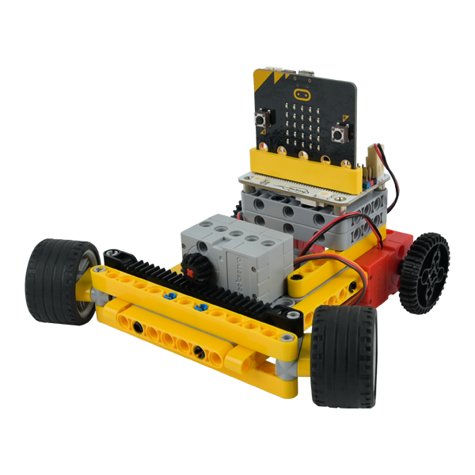
## 购买链接

[micro:bit Wonder Building Kit](https://www.elecfreaks.com/micro-bit-wonder-building-kit-without-micro-bit-board.html)

## 所需材料

## 搭建步骤

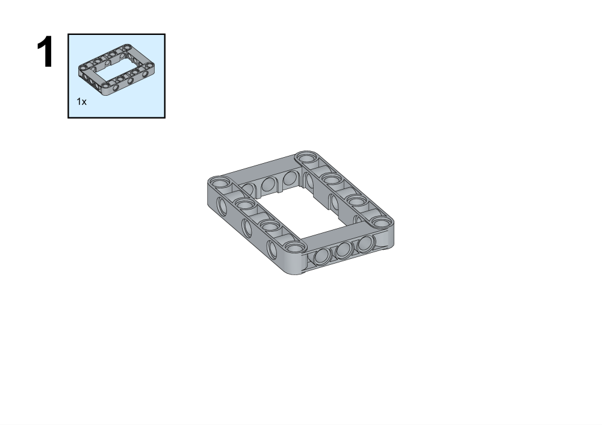

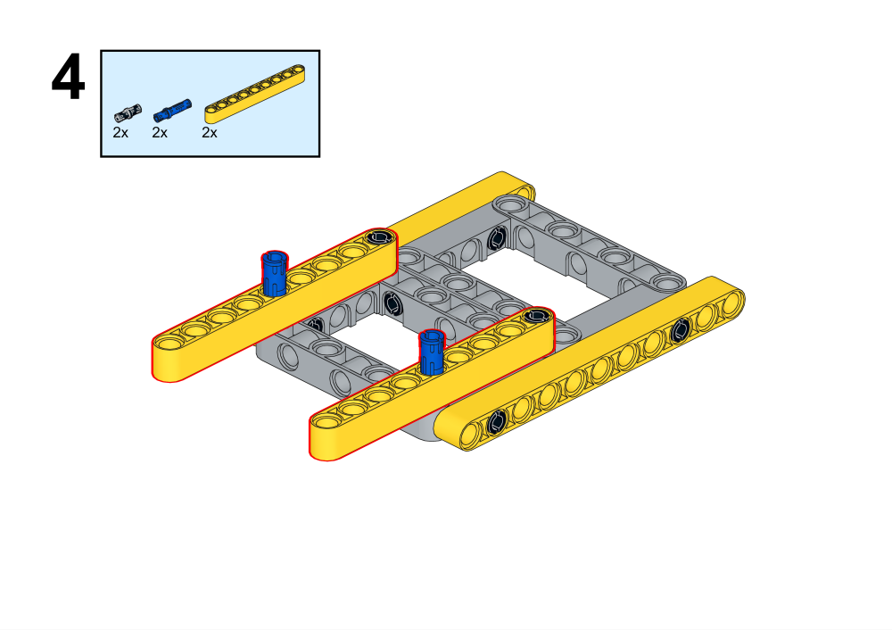

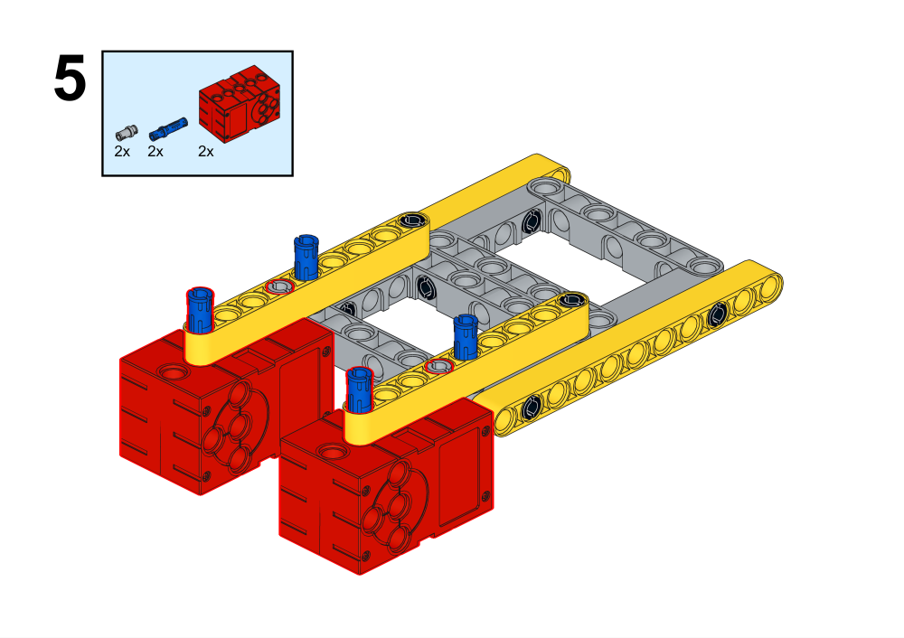

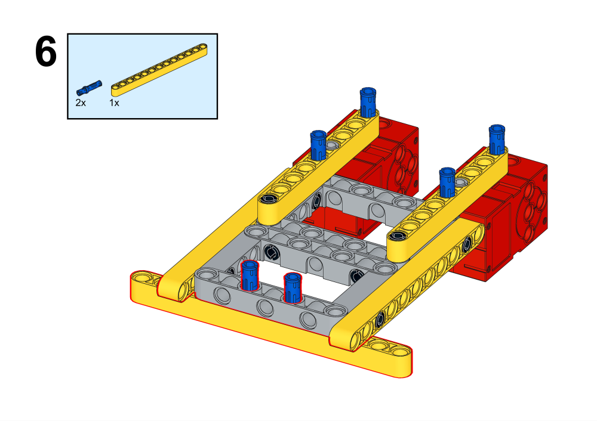

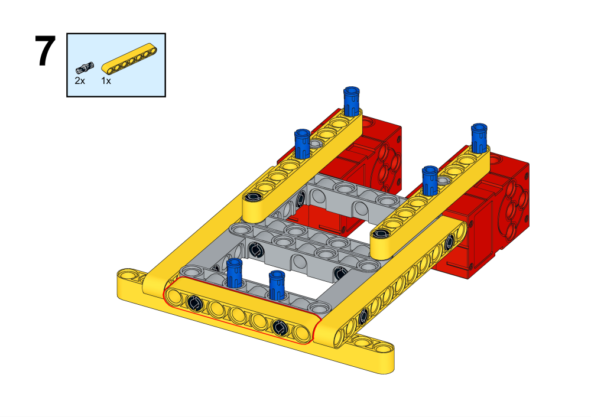

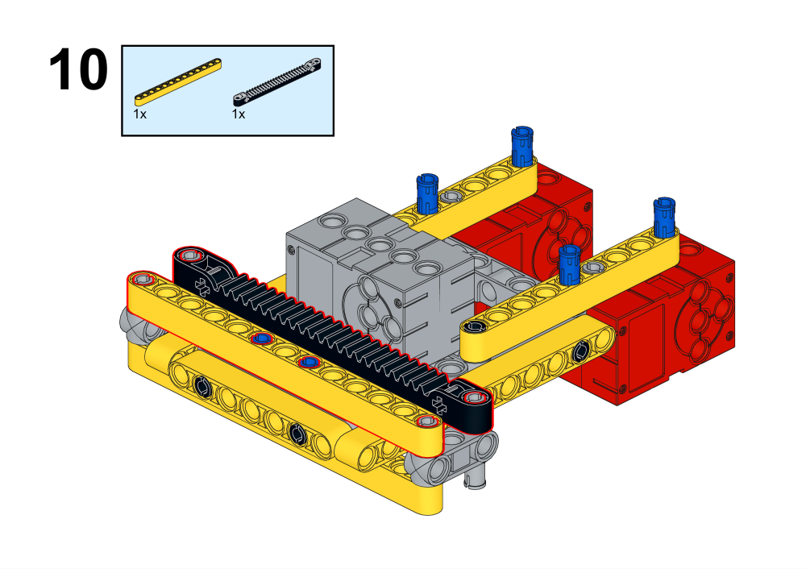

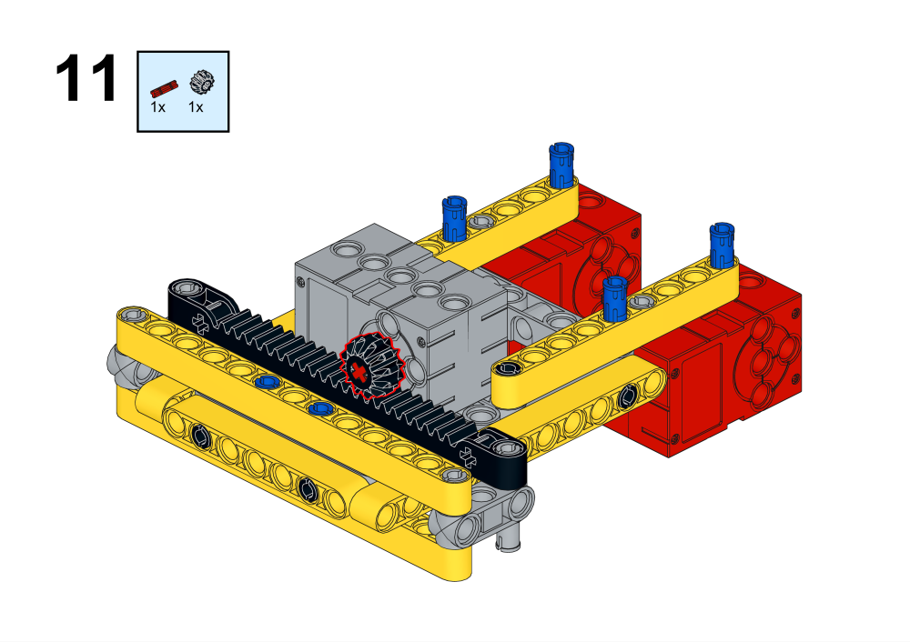

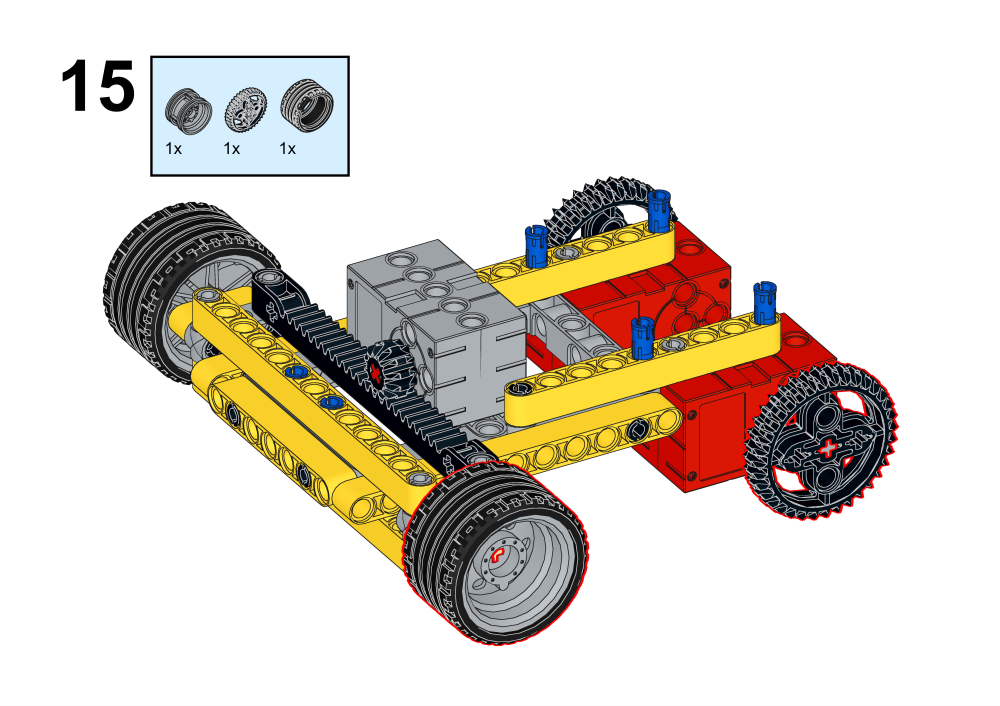

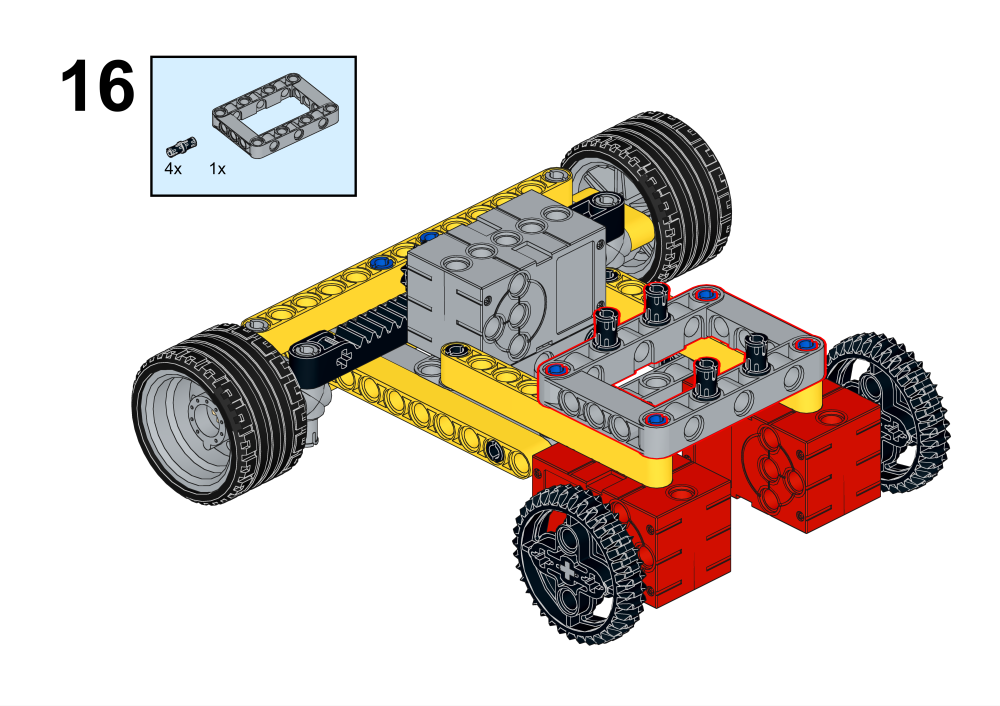

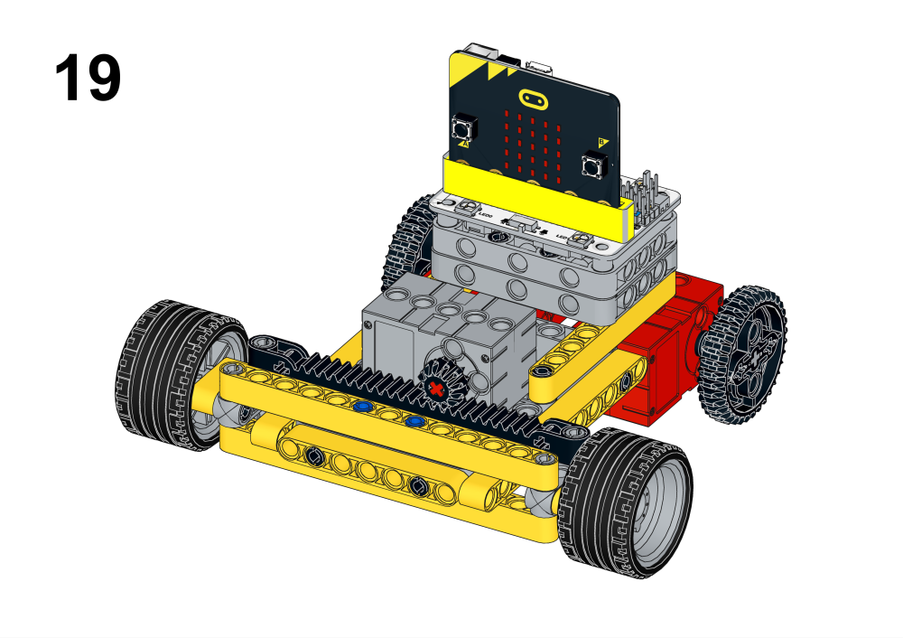

## 硬件连线

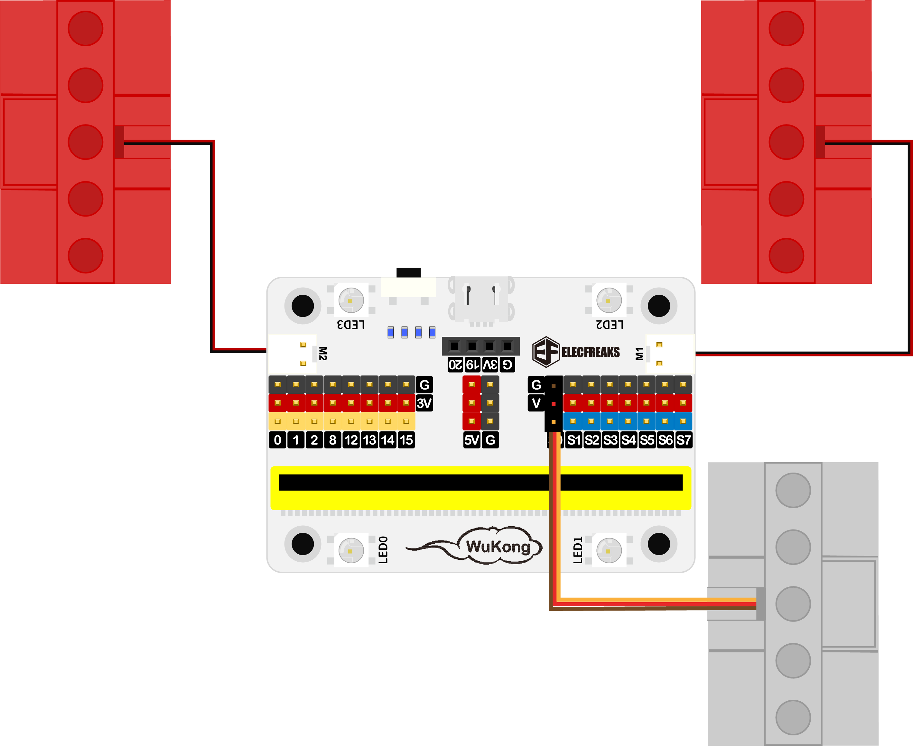

## 编程平台

[MakeCode](https://makecode.microbit.org/)

## 编程
## 添加扩展
在MakeCode的代码抽屉中点击高级，查看更多代码选项，点击扩展。

在搜索框中搜索wukong，点击图片中wukong，添加扩展包。

### 程序

程序链接：[https://makecode.microbit.org/_ATUfe9KM1HTX](https://makecode.microbit.org/_ATUfe9KM1HTX)
