# Case 39: 举重机器人
## 目的
制作一个举重机器人。

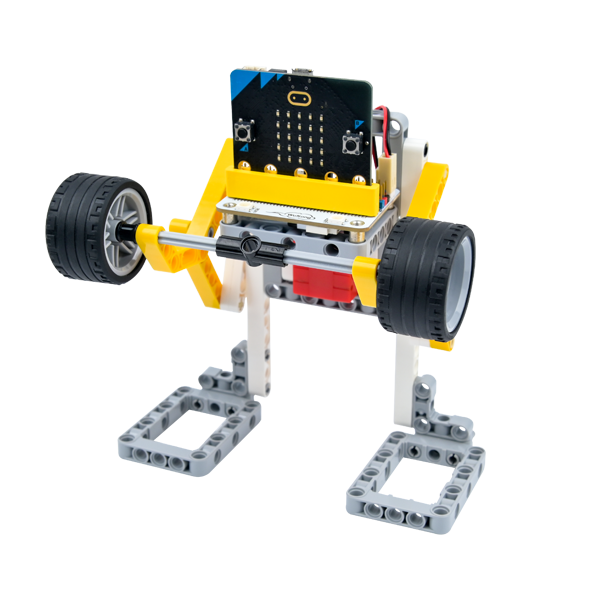

## 购买链接

[micro:bit Wonder Building Kit](https://www.elecfreaks.com/micro-bit-wonder-building-kit-without-micro-bit-board.html)

## 所需材料

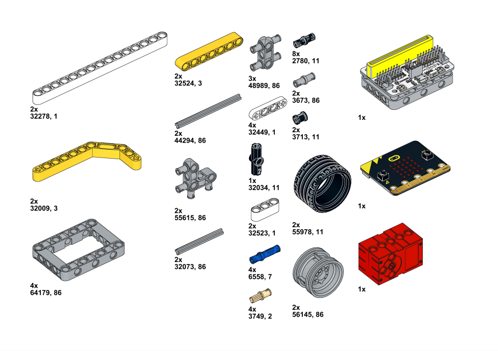

## 搭建步骤

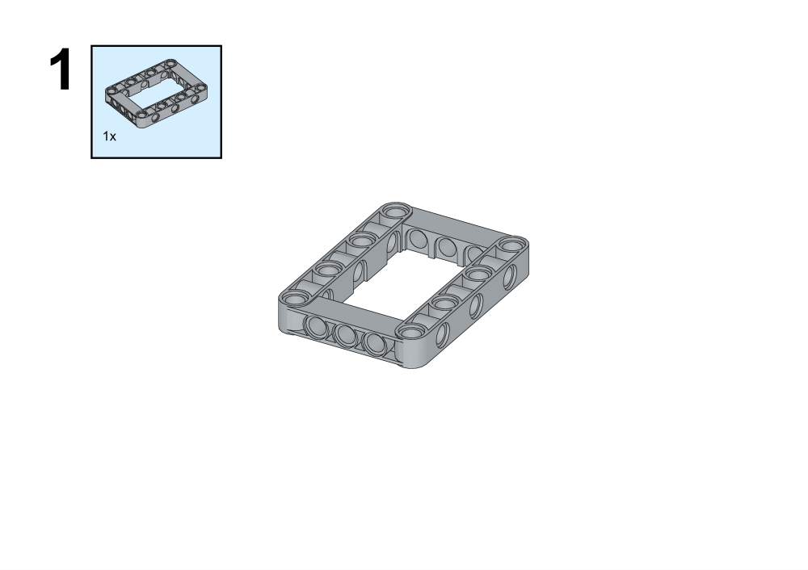

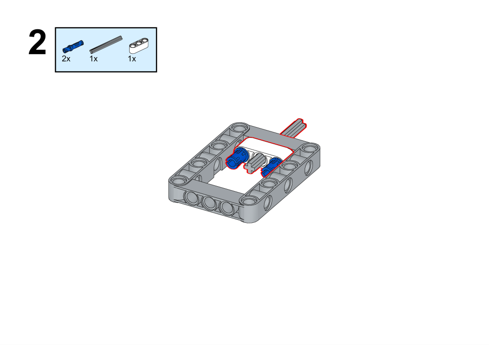

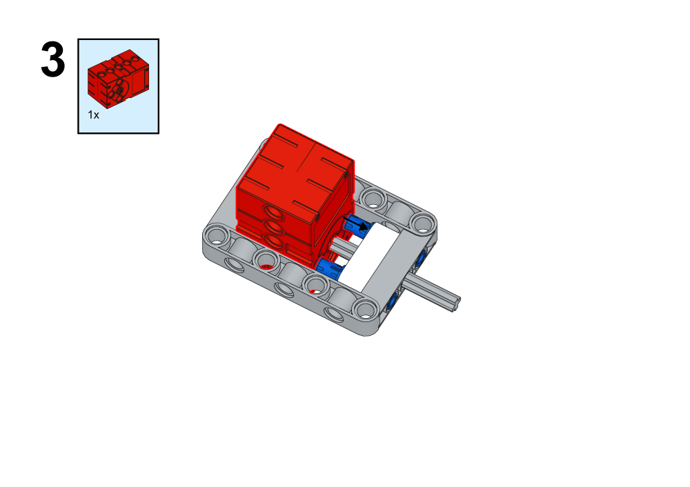

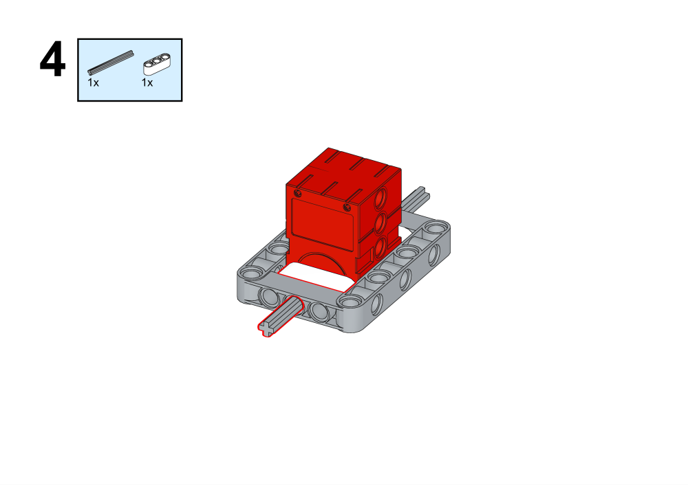

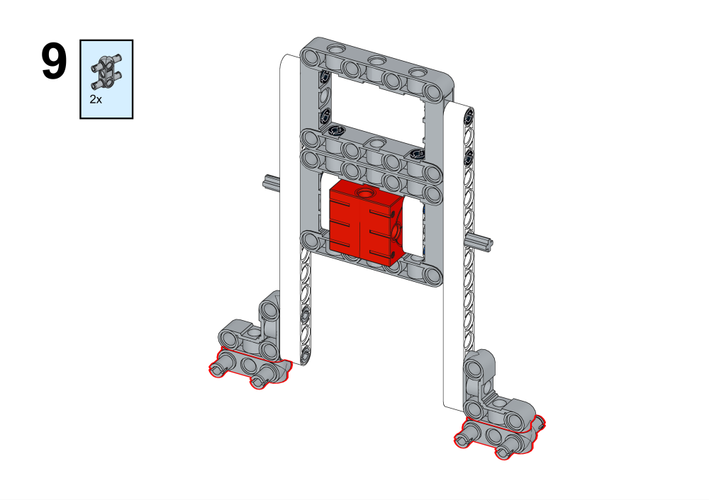

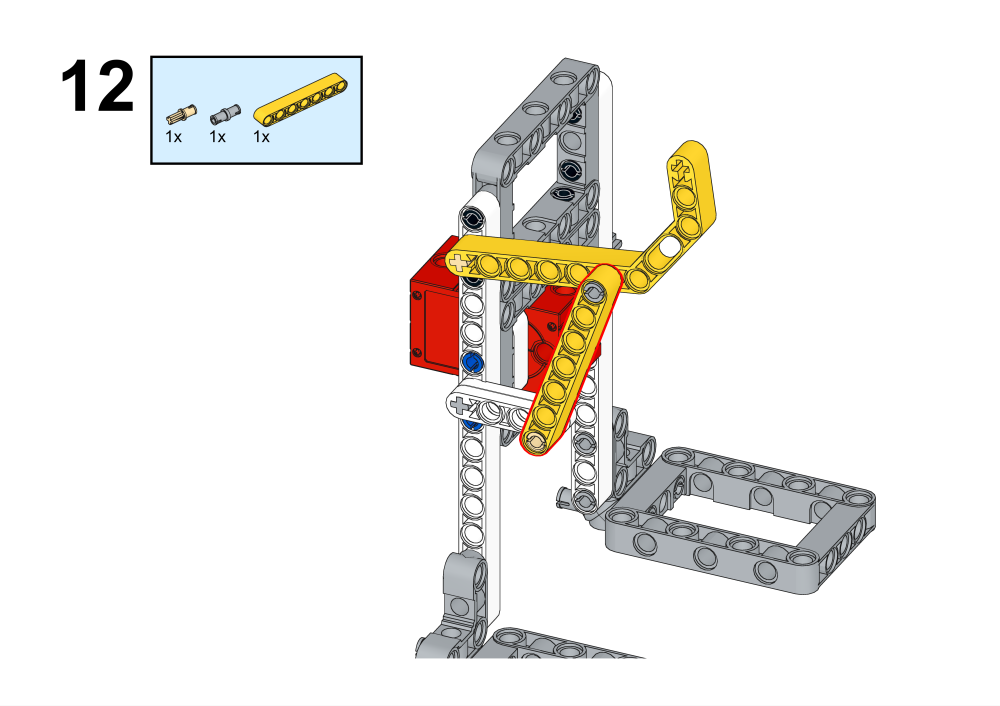

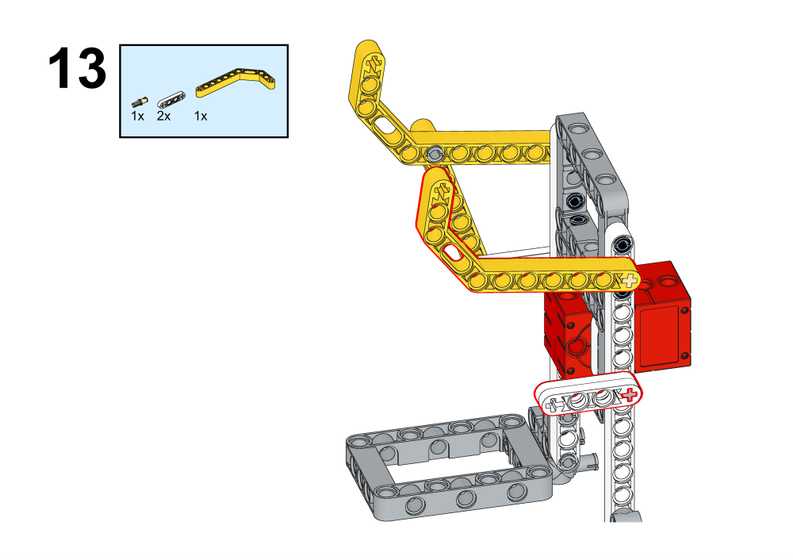

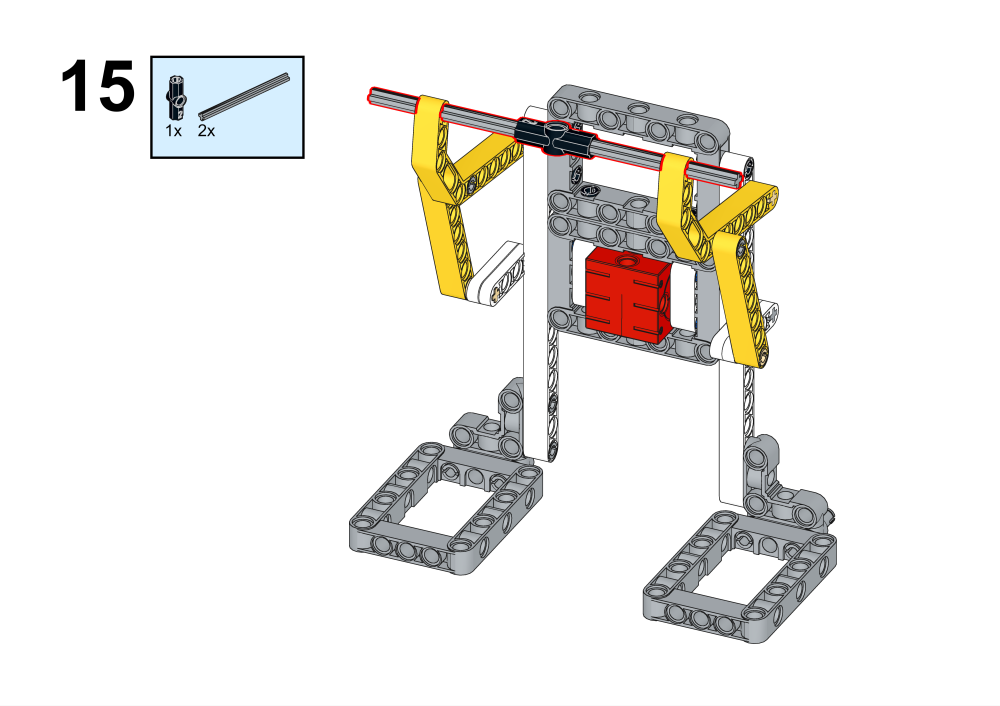

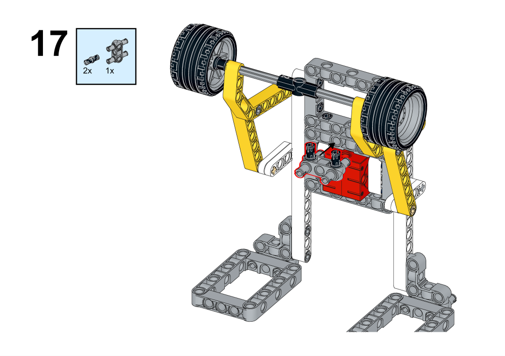

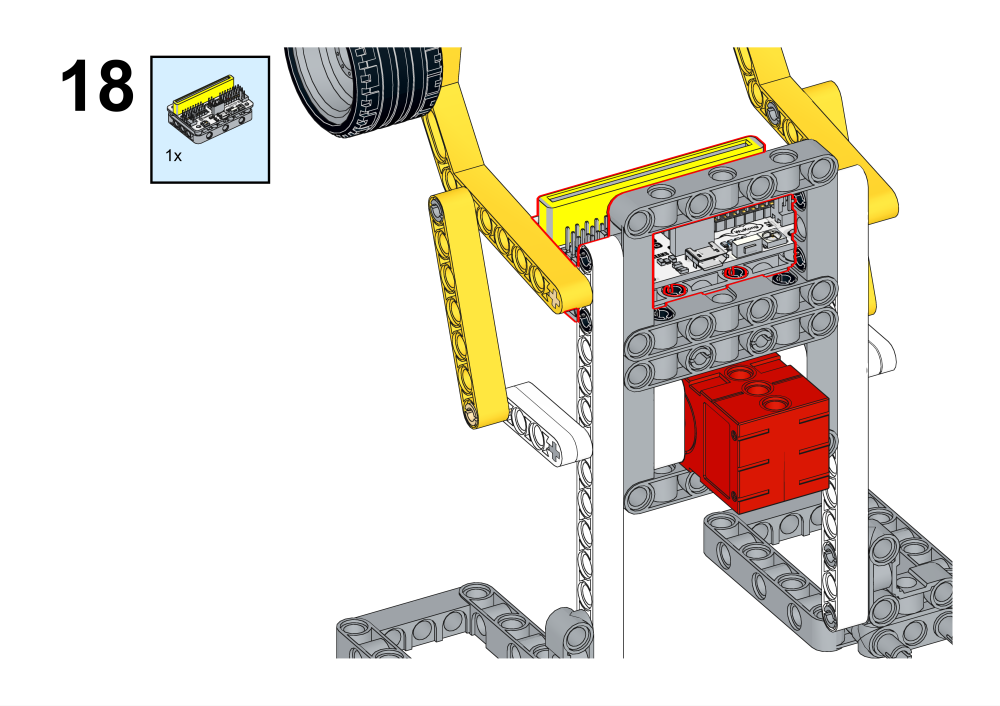

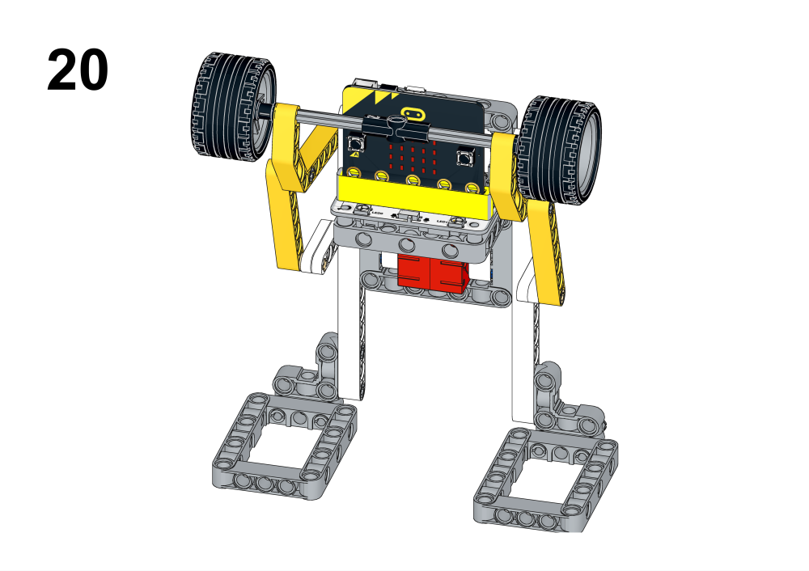

## 硬件连线

## 编程平台

[MakeCode](https://makecode.microbit.org/)

## 编程
## 添加扩展
在MakeCode的代码抽屉中点击高级，查看更多代码选项，点击扩展。

在搜索框中搜索wukong，点击图片中wukong，添加扩展包。

### 程序

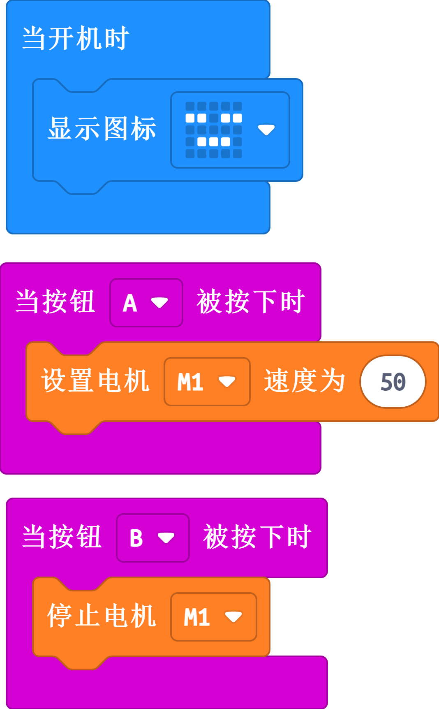

程序链接：[https://makecode.microbit.org/_bhzAEh4FA3z6](https://makecode.microbit.org/_bhzAEh4FA3z6)
