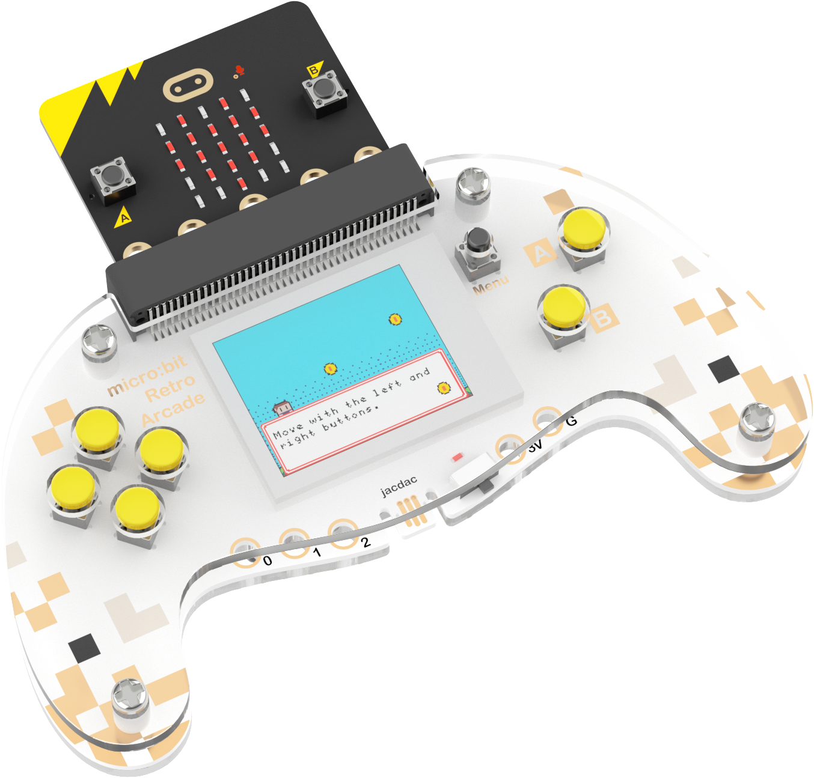
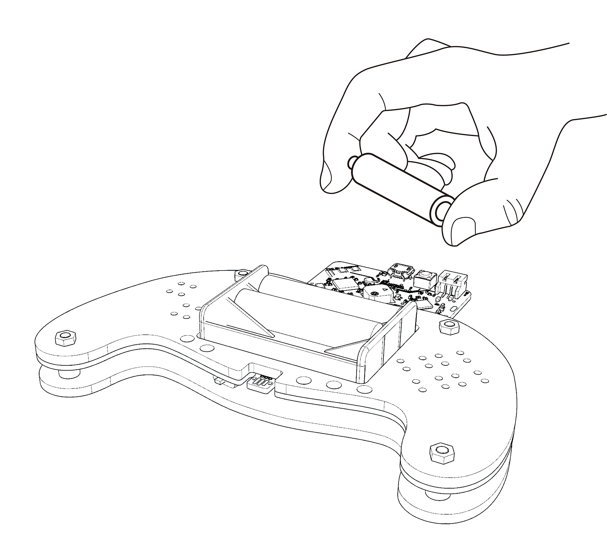
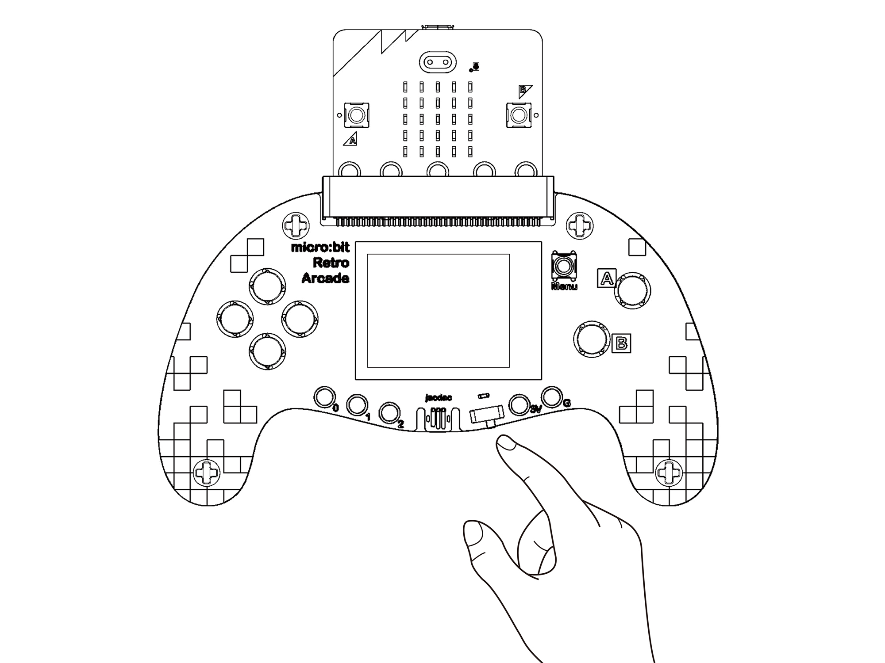
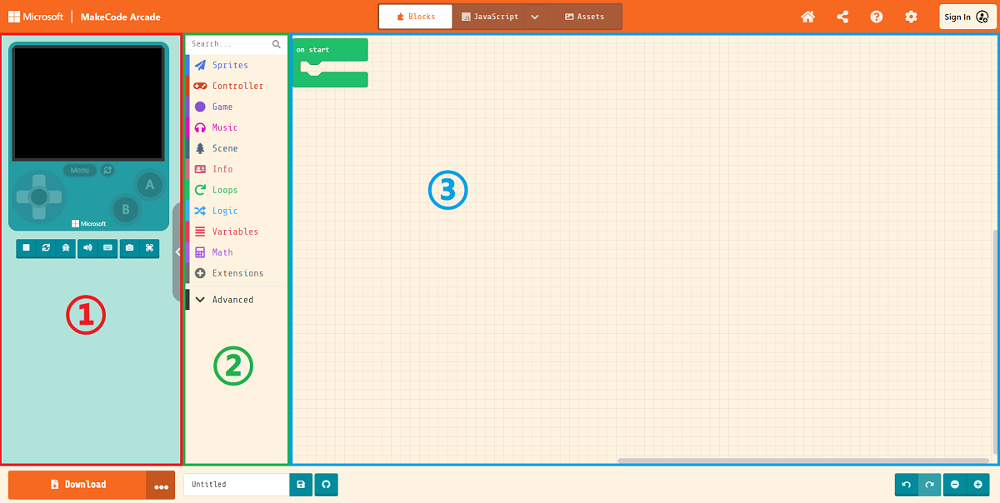
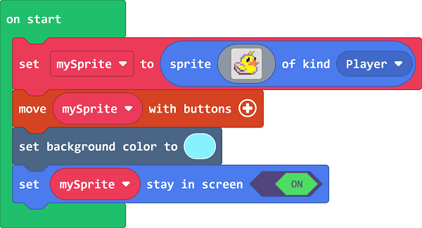

# micro:bit Retro Arcade

## 产品介绍

micro:bit Retro Arcade是专为micro:bit V2打造的彩屏手柄式扩展板，它包含一个TFT 160*128彩屏、4个方向按钮、AB两个按钮和一个复位按钮。它外观小巧，手感舒适。Microbit Retro Arcade搭配micro:bit V2可以在微软Arcade编程平台实现游戏的在线编程及脱机玩耍。通过简单趣味的方式帮助孩子自己编写游戏、了解游戏背后的奥义。它还支持自定义游戏角色、多样化场景和剧情设计，使用图形化编程软件，让每个人都能轻松实现有趣的电子创作和无限的游戏创意。
Microbit Retro Arcade除了作为游戏编程学习机，还可以作为遥控手柄。

## 购买链接

<!--[Microbit Retro Arcade]()-->

## 特点

- 可作为遥控手柄，与机器人小车通讯控制
- 可作为扩展游戏掌机，通过图形化编程创作个性游戏

## 基础参数

| 项目 | 参数 |
|---|---|
| 屏幕类型 | TFT屏幕 |
| 屏幕大小 | 128 x 160 |
| 尺寸 | 13.79cm x 8.13cm |
| 净重 | 52g |
| 供电方式 | 干电池 |

<!--## 外形与尺寸定位

## 功能性模块介绍

-->

### 安装步骤

安装micro:bit retro arcade

安装电池

打开开关

## 游戏编程指南

欢迎学习Retro Arcade！如需了解更多相关知识，请参考：[https://arcade.makecode.com/](https://arcade.makecode.com/)

点击对应项目，即可进入项目教程，通过编写游戏的过程来学习知识。

>micro:bit V2与扩展板结合，microUSB连接在micro:bit V2上。
>此时如果电源从micro:bit V2端供给，扩展板的电源开关无论开关都会导通。
>扩展板电源开关将控制的是从扩展板端供电的情况。

## 编程平台

Arcade游戏编程平台地址：[https://arcade.makecode.com](https://arcade.makecode.com)

### 编程页面介绍

1. 点击编号1的部分输入项目名称建立一个项目开始编程
2. 编号2以下的部分是一些平台提供的简单教程和社区分享的游戏作品

**编程界面介绍，对于基础入门来说大致先分为3部分需要了解**

1. 在线模拟器：按照代码的逻辑实时模拟运行效果
2. 编程积木栏：我们从这里拖入编程代码进行编程
3. 代码编辑区：我们将代码从积木栏拖出后在这里拼接，完成游戏的形象、界面和逻辑构建

## 快速创作

点击新建项目。

输入项目名称新建项目。

创建精灵，并点击积木块中的灰色矩形打开图片编辑器。

自定义精灵形象或者从图库中选择预设精灵即可。
通过使用按键移动精灵积木块控制精灵移动。

设置画面背景颜色。

为了防止精灵移动时走出屏幕画面外，设置精灵处于屏幕范围内。

## 游戏下载

### 下载步骤

由于目前对于Arcade平台官方而言，micro:bit V2（nRF52833）还在测试阶段，所以我们需要首先去到平台的设置页面将还在试验版本的硬件选项开放出来。

确保Expermental Hardware是已启用状态（只需要设定一次即可）

接着返回到编程主页，点击左下角的下载按钮，在弹出的选择硬件窗口拉到最底部选择N3

会得到一个.hex格式的文件，将他拖入到MICROBIT盘符下即可在micro:bit V2 + Microbit Retro Arcade上运行。

## 遥控手柄指南

### 材料准备

本次案例需要用到以下材料：

- micro:bit V2 × 2
- Microbit Retro Arcade × 1
- Cutebot × 1

### 小车端程序

**编程平台**

软件编程平台:[https://makecode.microbit.org/#](https://makecode.microbit.org/#)
新建项目进入编程主页

**添加扩展**

添加Cutebot智能赛车扩展软件库，点击扩展。

在搜索栏输入“cutebot”，点击搜索，添加扩展库。

编写程序.

程序链接：[https://makecode.microbit.org/_gC9gJDET83xd](https://makecode.microbit.org/_gC9gJDET83xd)

### 遥控端程序

**编程平台**

软件编程平台:[https://arcade.makecode.com/#](https://arcade.makecode.com/#)
新建项目进入编程主页

**添加扩展**

添加无线通信扩展库，点击扩展。

在搜索栏输入“radio”，点击搜索，添加扩展库。

编写程序.

程序链接：[https://makecode.com/_1HCLTf71TFJk](https://makecode.com/_1HCLTf71TFJk)

### 下载步骤

由于目前对于Arcade平台官方而言，micro:bit V2（nRF52833）还在测试阶段，所以我们需要首先去到平台的设置页面将还在试验版本的硬件选项开放出来。

确保Expermental Hardware是已启用状态（只需要设定一次即可）

接着返回到编程主页，点击左下角的下载按钮，在弹出的选择硬件窗口拉到最底部选择N3

会得到一个.hex格式的文件，将他拖入到MICROBIT盘符下即可在micro:bit V2 + Microbit Retro Arcade上运行。

## 更多教程

更多教程请参考：[https://arcade.makecode.com/](https://arcade.makecode.com/)

