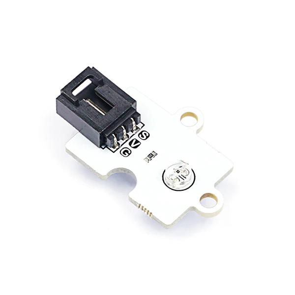
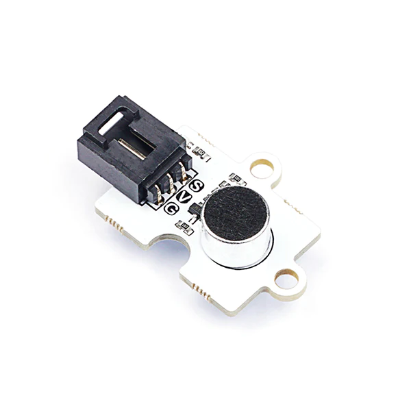
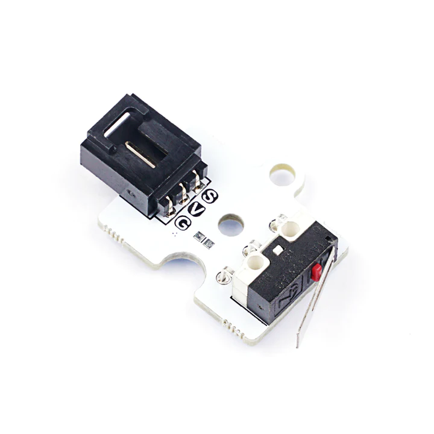
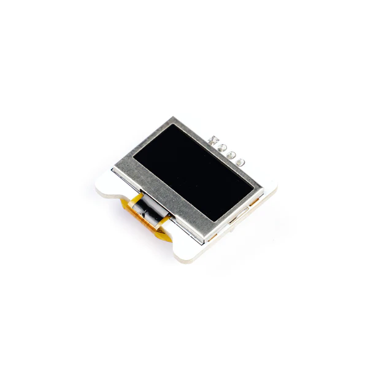
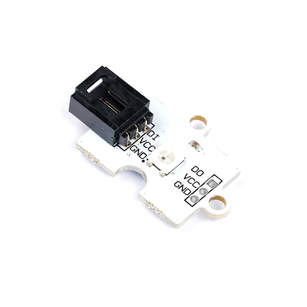

# Hardware Introduction

## IOT:bit

IOT:bit扩展板是一款功能丰富的扩展板，专为micro:bit设计。下面是更详细的介绍：

WiFi模块：
IOT:bit板载了WiFi模块，使您能够轻松连接到无线网络。通过WiFi模块，您可以实现与云平台（如Thingspeak和HiveMQ）的快速通信，将数据传输到云端或从云端获取数据。这为您的智能家居项目提供了广阔的连接和远程控制的可能性。

RTC时钟模块：
IOT:bit还集成了RTC时钟模块（实时时钟），它具有精准的计时功能。即使主板断电，独立供电的RTC模块仍可继续计时。这为您的应用提供了持续准确的时间记录，例如时间戳、定时任务和事件触发等。

蜂鸣器：
IOT:bit还包含了一个蜂鸣器，通过它您可以播放旋律、音效或警报声。蜂鸣器能够产生不同频率的声音，为您的项目增加了声音反馈和交互性。

IO口扩展：
IOT:bit扩展了micro:bit上所有可用的IO口，并以GVS形式引出，方便您与各种3V的电子积木模块连接。您可以扩展各种模块，如LED灯、光敏传感器、舵机等，以构建更丰富、多样化的智能家居系统。

IOT:bit扩展板的功能丰富，能够满足您在智能家居开发中的需求。它提供了WiFi连接、RTC时钟、蜂鸣器和IO口扩展等功能，为您的项目带来更多可能性。不仅可以实现数据的快速传输和远程控制，还可以增加音效和各种传感器的接入，让您的智能家居系统更加智能化和互动性。

更多关于 IOT:bit 的信息请访问：[IOT:bit 物联网扩展板](http://wiki.elecfreaks.com/en/microbit/expansion-board/iot-bit/)。

## 光线传感器

光线传感器是一种用于检测光线强度的传感器。它可以根据周围环境的光照变化输出相应的电信号。通过光敏传感器，您可以实时监测光线的强度，并根据需要自动调节灯光、触发其他设备或进行光照相关的应用。

## 噪音传感器

噪音传感器可以检测周围环境中的声音强度。它可以感应到声音的振动，并将其转化为相应的电信号。在智能声控灯案例中，噪音传感器可以与光敏传感器配合使用，检测到环境中的噪音和光线变暗时触发灯光的自动开启。

## 碰撞传感器

碰撞传感器能够检测物体的碰撞动作。它通过感应到外部的冲击力来触发信号输出，让您能够检测到门锁或其他设备是否受到碰撞的影响。在遥控开门器案例中，碰撞传感器可以作为门铃触发器，通知遥控端有人访问房屋。

## OLED显示屏

0.96寸 OLED 显示模块采用 SSD1306 驱动芯片，有128x64个自发光的白色像素点。具有功耗低、对比度高等优点，可用于许多显示应用，例如：各类传感器的数值显示；mini 小游戏机；智能穿戴设备等。

## 彩虹灯

彩虹灯可以产生丰富的颜色变化效果。可通过编程控制LED的亮度和颜色，以创造出令人愉悦的光效。

## 180度舵机

180度舵机是一种用于控制机械装置的电机驱动器。它可以通过电信号控制舵机转动到指定的角度，从而实现精确的运动控制。在遥控开门器案例中，180度舵机可以用来控制门的打开和关闭，以便实现自动开门的功能。
