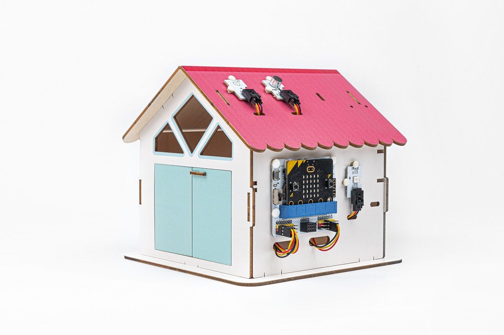
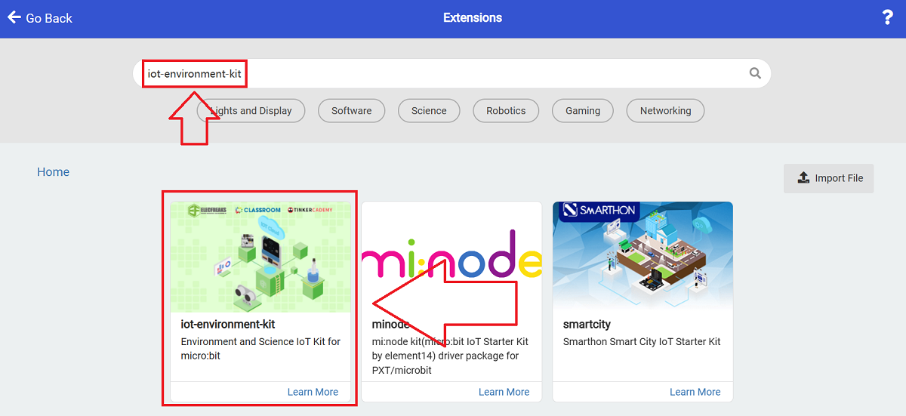
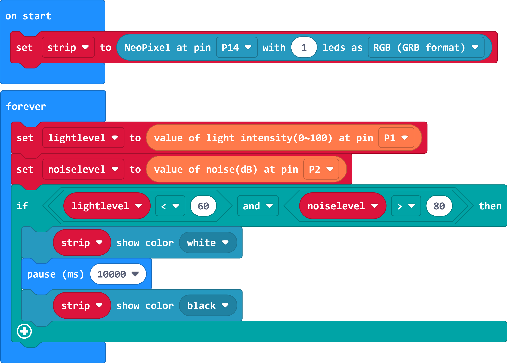

# Smart Voice-Controlled Light

## 功能简介

当光线变暗时，检测周围环境噪音，当周围环境噪音高于设定阈值时，自动打开RGB灯，开启十秒后自动关灯。

## 课前准备

1 × micro:bit V2

1 × Classrom Smart Home Kit

1 × micro USB 数据线

1 × Smart Home Material Pack

## 课程目标

了解声音的产生与传播的基本概念。

了解噪音的分级。

制作声光控制灯案例。

## 扩展知识

*** 声音的产生及传播方式 ***

声音是由物体的振动引起的，它通过介质（如空气、水、固体等）传播。

1.振动源：声音的产生始于物体的振动。当物体振动时，它会以一定的频率和幅度来回震动。振动源可以是任何能够产生振动的物体，如声音箱中的扬声器振膜、乐器的琴弦或鼓面等。

2.压力波传播：当物体振动时，它会导致周围介质（如空气）中的分子也跟随振动，形成压力变化。这些压力变化以波的形式向外传播，形成了声波。

3.声波特性：声波是机械波，具有以下特性：

- 频率：声波的频率是指振动源每秒钟振动的次数，单位是赫兹（Hz）。频率决定了声音的音调，高频率的声波听起来较高音，低频率的声波听起来较低音。
- 振幅：声波的振幅是指振动源振动时的最大偏离位置，决定了声音的音量或强度。振幅越大，声音越响亮。
- 波长：声波的波长是指波的一个完整周期所对应的距离，通常用米（m）表示。波长和频率之间有关系：波长等于声速除以频率。
- 速度：声波在特定介质中传播的速度称为声速，不同介质中的声速不同。在空气中，大约为343米/秒。

4.听觉感知：当声波到达人的耳朵时，它会引起耳膜和耳内的结构振动，这些振动通过听觉系统传递到大脑。大脑解读这些振动并将其识别为声音，使我们能够听到和理解周围的声音。

声音的产生和传播是一个复杂的物理过程，我们可以利用这一原理来设计和控制声音，实现各种应用，如通信、音乐和声音效果等。

*** 噪音的分级 ***

30-40 dBA：安静的图书馆或低噪音环境。
40-50 dBA：安静的办公室或低噪音居住区。
50-60 dBA：正常的办公室、城市交通噪音或家庭电器噪音。
60-70 dBA：繁忙的办公室、街道交通声或一般工业噪音。
70-80 dBA：较高的交通噪音、工业机械噪音或嘈杂的活动场所。
80 dBA以上：非常高的噪音，如飞机起飞声、机械切割声等。

噪音分级对于环境保护、职业健康与安全等方面具有重要意义。通过了解噪音分级，可以更好地了解和管理噪音对人们的健康和生活质量产生的影响，并采取相应的控制措施来减少噪音对环境和人体的不利影响。

## 探究问题

如何检测环境光线的明暗？

如何检测噪音的强弱程度？

如何确保只在光线不足时，声音能够触发灯的开关？

## 硬件连接

将光线传感器连接到IOT:bit的P1端口，将噪音传感器连接到IOT:bit的P2端口，将彩虹灯连接到IOT:bit的P14端口。

## 软件编程

### 添加软件库

打开[makecode编程平台](https://makecode.microbit.org/)

点击新建项目，在弹出的窗口填入项目名称并点击新建。

点击扩展

在弹出界面的搜索栏输入iot-environment-kit，点击搜索，在搜索结果中选择IOT:bit的软件库。

### 程序详解

当开机时，设置彩虹灯数量为一颗，连接在P14端口。

将连接至P1的光线传感器的返回值存入变量lightlevel，将连接至P2的噪音传感器的返回值存入变量noiselevel中。

如果光线传感器的返回值小于60且噪音传感器的返回值大于80，则点亮白色灯光，等待十秒后，灯光自动熄灭。

否则灯光熄灭。

程序链接：[https://makecode.microbit.org/_2ve1HC6q5C5p](https://makecode.microbit.org/_2ve1HC6q5C5p)

## 案例演示

当光线变暗时，检测周围环境噪音，当周围环境噪音高于设定阈值时，自动打开RGB灯，开启十秒后自动关灯。

