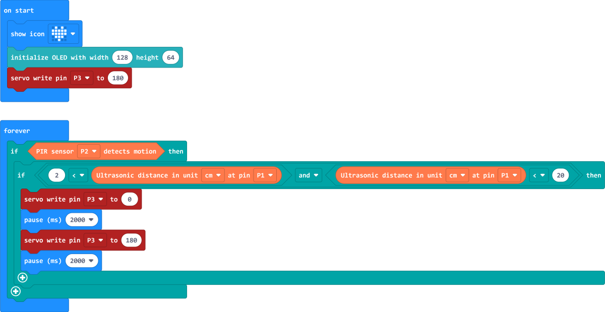

# 智能宠物喂食器

## 简介

在本篇文章中，我们将介绍一款适用于中小学生的创客制作案例——智能宠物喂食器。这款喂食器采用了micro:bit v2主板、IOT:bit 扩展板、八爪鱼系列的人体红外传感器以及超声波传感器、180° 9g 舵机以及一个可爱的木制小房子作为组件。

智能宠物喂食器的工作原理如下：首先，人体红外传感器负责检测是否是宠物靠近；其次，超声波传感器用于检测宠物是否到达木制小房子前20厘米以内的范围。当以上两个条件均满足时，舵机将会转动，从而使得存储宠物粮食的储粮箱将宠物粮食倾倒出来。在倾倒宠物粮食过程完成后，舵机将恢复到原来的位置，等待下一次喂食。

这款智能宠物喂食器旨在培养中小学生的创新能力和动手实践能力，同时通过编写程序控制喂食器的工作，加深学生对编程知识的理解。此外，这个案例还有利于培养学生们关爱宠物的意识，让他们更加关心和照顾家中的小动物。

## 组件清单

1 × micro:bit V2

1 × IOT:bit

1 × 八爪鱼人体红外传感器

1 × 八爪鱼超声波传感器

1 × 180°  舵机

1 × micro USB 数据线

1 × 木制小屋

## 相关知识介绍

### micro:bit 主板介绍

micro:bit 是一款专为青少年编程教育目的而设计的微型计算机，尺寸只有4cm x 5cm，但它拥有一系列的传感器和LED灯，可以用来控制和监测物理世界。

micro:bit 可以通过 USB 线或蓝牙连接到计算机，并使用编程软件进行编程。它支持多种编程语言，包括Microsoft MakeCode、Python和 JavaScript 等。学生可以使用这些编程语言来编写代码，控制 micro:bit 上的传感器和 LED 灯，创造各种有趣的项目。

micro:bit 的设计简单易用，适合初学者使用。它可以用于各种教育活动，如编程课程、科学实验和创客活动等。通过使用 micro:bit，学生可以培养创造力、解决问题的能力和团队合作精神。

更多关于 micro:bit 的信息欢迎访问：[micro:bit 官网](https://microbit.org/)。

### IOT:bit  扩展板介绍

IOT:bit 是一款专为 micro:bit 设计的扩展板，它能够将 micro:bit 变成一个强大的物联网设备。通过连接各种传感器和执行器，IOT:bit 可以实现与互联网的连接和数据传输，让 micro:bit 具备更多的智能功能。

IOT:bit 板载了众多GPIO接口，可以方便地连接各种模块和传感器，实现对环境和物体的监测和控制。

IOT:bit 支持 Wi-Fi 功能，通过与 micro:bit 的连接，使用 Wi-Fi 功能连接到互联网，或者通过蓝牙与其他设备进行数据传输。这使得 micro:bit 可以与云平台、手机或其他物联网设备进行数据交互，实现更多的应用场景。

IOT:bit 的设计简单易用，适合中小学教育和创客项目，可以帮助学生们更好地理解物联网的原理和应用，培养他们的创新思维和科学技术能力。

无论是在课堂教学中还是个人创客项目中，IOT:bit 都是一个强大而有趣的工具。

更多关于 IOT:bit 的信息欢迎访问：[IOT:bit 物联网扩展板介绍 Wiki 链接](http://wiki.elecfreaks.com/en/microbit/expansion-board/iot-bit/)。

### 八爪鱼系列人体红外传感器

人体红外传感器模块是一种采用AM412热释电数字智能传感器的电子积木。这个模块设计用于感知和检测人体或动物的运动。当人体或动物接近传感器时，它能够检测到体温的变化并发出信号。该传感器的感应距离约为4-5米，意味着它能够在这个范围内检测到运动，并向系统发送相应的信号。这种传感器模块常用于安防系统、自动照明系统或其他需要感知和响应运动的应用中。

当检测到人体或动物运动时，返回数值 1 ，并且板载LED灯会亮起，否则返回数值 0 ，并且板载LED灯熄灭。

关于更多人体红外传感器的信息，欢迎访问：[八爪鱼系列人体红外传感器介绍 Wiki 链接](http://wiki.elecfreaks.com/en/microbit/sensor/octopus-sensors/sensor/octopus_ef04055/)。

**注意：人体红外传感器模块检测的是运动信号，而不是热信号。当人体或动物靠近该模块后没有动作后一段时间，板载LED灯熄灭并返回数值 0。**

### 八爪鱼系列超声波传感器

Sonar:bit 是一款基于超声波传感技术的传感器模块，专为 micro:bit 教育开发板设计。

它可以用于测量距离和检测障碍物，为用户提供了一种简单而可靠的方式来实现距离测量和避障功能。Sonar:bit采用超声波传感器，可以向周围发射超声波信号，并通过接收回波来计算物体与传感器之间的距离。它具有高精度和稳定性，可以测量范围为2厘米到400厘米。

通过编程 micro:bit，用户可以根据 Sonar:bit 的测量结果来实现各种应用，如智能小车的避障功能、距离测量等。总之，用户可以创造各种有趣的应用。无论是教育还是创客项目，Sonar:bit 都是一个不可或缺的工具。

关于更多超声波传感器的信息，欢迎访问：[八爪鱼系列超声波传感器介绍 Wiki 链接](http://wiki.elecfreaks.com/en/microbit/sensor/octopus-sensors/sensor/sonar_bit)。

### 180° 舵机

伺服电机通常被称为舵机，它是一种带有输出轴的小装置。当我们向伺服器发送一个控制信号时，输出轴就可以转到特定的位置。只要控制信号持续不变，伺服机构就会保持轴的角度位置不改变。如果控制信号发生变化，输出轴的位置也会相应发生变化。日常生活中，舵机常被用于遥控飞机、遥控汽车、机器人等领域。

## 硬件连接

### 木制房屋搭建步骤

### 八爪鱼传感器连接示意图

Octopus人体红外传感器链接 iot:bit P2引脚，Octopus超声波传感器连接iot:bit P1引脚，180°舵机连接iot:bit P3引脚。

## 开始编程

### 编程准备

本案例的控制程序将在 micro:bit 官方编程平台：MakeCode上完成编写。请点击并打开 MakeCode 官方链接：https://makecode.microbit.org/。如下图所示：

第一步需要新建项目文件，请点击“New Project”，输入项目名称并点击“Create”。

第二步需要添加 iot-environment-kit 库文件，点击积木库列表中的"Extensions"，输入“iot-environment-kit”搜索并添加。在返回的编程界面中看到已经将 iot-environment-kit 库文件添加成功。

第三步需要添加 servo 库文件，同样在扩展库中输入“servo”搜索并添加。在返回的编程界面中看到已经将 servo 库文件添加成功。

### 180° 舵机设置初始角度

为了更好的后续编程，需要设置舵机的初始角度和旋转方向。本案例中将舵机的初始角度设置为180°。

#### 舵机初始设置程序

舵机初始设置程序链接：https://makecode.microbit.org/S06902-77501-41447-67913。

### 宠物喂食盒安装示意图

### 编程示例

程序示例链接：https://makecode.microbit.org/S06902-77501-41447-67913。

## 案例演示

## 思考

虽然我们制作了智能的宠物喂食器，使我们得到更多的休息时间，但是这个案例并不能控制宠物喂食的次数，你能否修改程序，当智能宠物喂食器每天喂食到一定次数就停止喂食？或者通过连接互联网控制喂食次数？

## 常见问题

1. IOT:bit 扩展板板载引脚排针比较尖锐，在插拔传感器接口时注意手指，避免受伤。
2. 请将 IOT:bit  的电源开关打开。
3. 在将 micro:bit 插入和拔出 IOT:bit  的插槽的时候，请按住 micro:bit 左右两侧操作，这样更容易操作。

## 更多信息，欢迎访问：

ELECFREAKS 官方网站：[ELECFREAKS 官网](https://www.elecfreaks.com/)。
