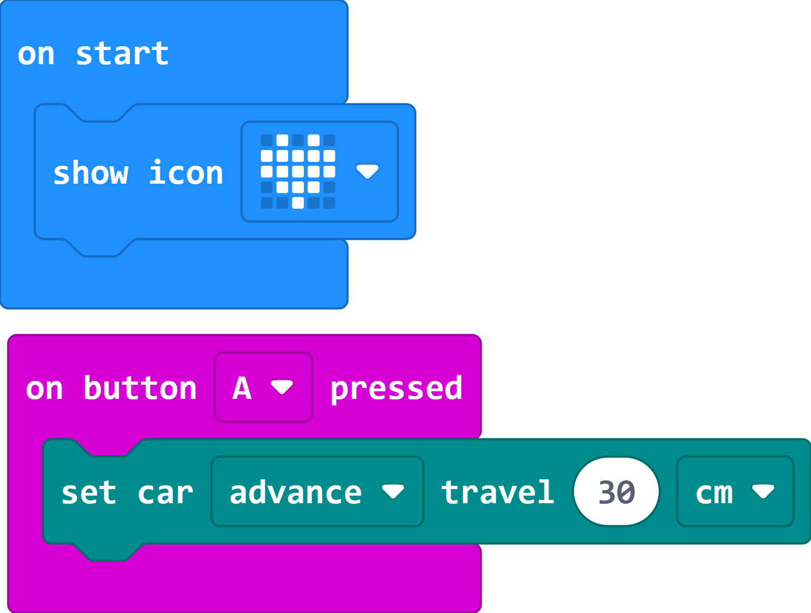

# Case 03 智能避障

## 简介

本课程旨在向学生介绍图形化编程和超声波传感器的应用。学生将使用MakeCode和Cutebot Pro智能赛车，学习如何编写程序让小车具备避障功能。通过这个案例，学生将加深对程序设计的判断、分支、与或非等知识点的理解，以及了解超声波传感器的工作原理。

## 教学目标

理解图形化编程的判断、分支、与或非等相关知识点。

学习超声波传感器的工作原理和应用。

掌握如何使用超声波传感器检测障碍物，并编写相应的程序进行避障。

培养学生的逻辑思维、问题解决能力和创造力。

## 教学准备

Cutebot Pro × 1

micro:bit × 1

## 教学过程

### 课程引入

在本节课，我将带领大家探索一个有趣且刺激的项目，我们将使用Cutebot Pro智能赛车来制作一个令人兴奋的智能赛车。通过这个项目，我们将学习如何利用图形化编程和传感器技术来控制赛车的行为。

首先，我们将使用Cutebot Pro智能赛车作为我们的项目载体。它是一辆功能强大的智能赛车，具有编程控制的能力和多种传感器。我们将利用其中超声波传感器来实现我们的目标。

在今天的课程中，我们的目标是通过编写程序，让智能赛车能够自主行驶并避开障碍物。我们将学习如何使用超声波传感器来检测障碍物，并编写相应的代码来控制赛车的行动。这将涉及到编程的判断、分支和逻辑运算等概念。

通过这个项目，我们将培养你们的创造力、逻辑思维和问题解决能力。准备好迎接这个有趣的挑战了吗？让我们开始吧！

### 探究活动

如何使用超声波传感器检测障碍物？

如何编写一个程序，在遇到障碍物时让小车自动转弯避免碰撞？

如何使用判断、分支和与或非等模块设计一个智能的避障程序？

### 示例代码

请参考程序连接：[https://makecode.microbit.org/_35vDd71jg3tb](https://makecode.microbit.org/_35vDd71jg3tb)

你也可以通过以下网页直接下载程序。

    <iframe
        src="https://makecode.microbit.org/_35vDd71jg3tb"
        frameborder="0"
        sandbox="allow-popups allow-forms allow-scripts allow-same-origin"
        style={{
            position: 'absolute',
            width: '100%',
            height: '100%',
        }}
    />

### 案例展示
