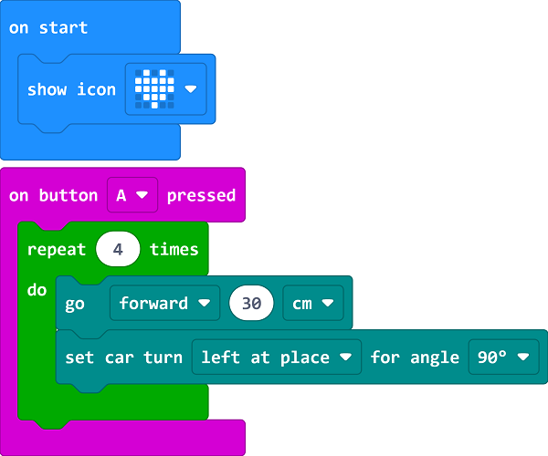

# Case 03 走正方形

## 简介

本课程旨在通过制作智能赛车，让学生学习和探索小车电机控制和转弯方式等知识点，以及应用这些知识让小车沿着正方形轨迹行驶。学生将通过实践操作，掌握电机控制和转弯算法，培养逻辑思维、问题解决和团队合作能力，并进一步提高小车的行驶精度。

## 教学目标

理解小车电机控制的原理和方法，学会控制小车的前进、后退和停止。

掌握不同转弯方式的原理，包括直角转弯和圆弧转弯，并能够将其应用于实现小车沿着正方形轨迹行驶。

培养学生的观察力和动手能力，通过调试和实践提高小车走正方形的准确性和稳定性。

## 教学准备

Cutebot Pro × 1

micro:bit × 1

## 教学过程

### 课程引入

大家好！今天我们将要继续我们的智能赛车制作项目，但这次我们要给小车设置一个新的挑战，让它可以沿着正方形的轨迹行驶。你们认为怎样才能让小车准确地走出一个完美的正方形？

我们可以通过控制小车的电机和转弯方式来实现这个目标。在接下来的课程中，我们将学习如何控制小车的前进、后退和停止，并学习两种不同的转弯方式。这些知识将帮助我们让小车沿着正方形的轨迹行驶。

### 探究活动

我们可以通过控制小车的电机和转弯方式来实现这个目标。在接下来的课程中，我们将学习如何控制小车的前进、后退和停止，并学习两种不同的转弯方式。这些知识将帮助我们让小车沿着正方形的轨迹行驶。

两种不同的转弯方式：直角转弯和圆弧转弯，并了解它们的原理和应用场景。

### 示例代码

请参考程序连接：[https://makecode.microbit.org/_UXu2aKgvJbo1](https://makecode.microbit.org/_UXu2aKgvJbo1)

你也可以通过以下网页直接下载程序。

    <iframe
        src="https://makecode.microbit.org/_UXu2aKgvJbo1"
        frameborder="0"
        sandbox="allow-popups allow-forms allow-scripts allow-same-origin"
        style={{
            position: 'absolute',
            width: '100%',
            height: '100%',
        }}
    />

### 案例展示
