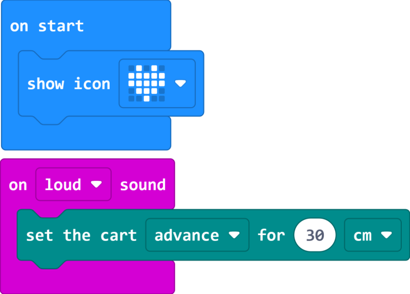

# Case 04 声音控制

## 简介

本课程旨在通过制作智能赛车，让学生学习和探索小车电机控制、噪音传感器、声音的传播和噪音等级等知识点，并应用这些知识来控制小车的行驶。

## 教学目标

理解小车电机控制的原理和方法，学会控制小车的前进、后退和停止。

了解噪音传感器的工作原理和应用，以及声音在空气中的传播方式。

学会根据噪音等级控制小车的行驶速度和方向，实现声控小车的功能。

## 教学准备

Cutebot Pro × 1

micro:bit V2 × 1

## 教学过程

### 课程引入

大家好！今天我们将继续我们的智能赛车制作项目，但这次我们要给小车设置一个新的挑战。你们有没有想过如何用声音来控制小车的行驶呢？

我们可以利用噪音传感器来检测声音的大小，并通过控制小车的电机来实现声控功能。在接下来的课程中，我们将了解声音的传播方式，并实现一个可以通过声音大小控制行驶的小车。

### 探究活动

如何利用小车的电机控制和噪音传感器，实现一个能够通过声音大小控制行驶的小车呢？你们有什么想法和猜测？

了解声音的传播方式；

了解噪音的等级。

### 示例代码

请参考程序连接：[https://makecode.microbit.org/S25223-56312-37429-50965](https://makecode.microbit.org/S25223-56312-37429-50965)

你也可以通过以下网页直接下载程序。

    <iframe
        src="https://makecode.microbit.org/S25223-56312-37429-50965"
        frameborder="0"
        sandbox="allow-popups allow-forms allow-scripts allow-same-origin"
        style={{
            position: 'absolute',
            width: '100%',
            height: '100%',
        }}
    />

### 团队合作与展示

学生分成小组，共同完成小车的制作和程序编写。

鼓励学生之间相互合作、交流和分享经验。

每个小组有机会向其他小组展示他们制作的智能赛车，并演示通过声音大小控制小车行驶的过程。

### 总结与反思

回顾课程内容，提醒学生掌握了哪些知识和技能。

引导学生讨论他们在制作过程中遇到的问题和困难，以及如何解决这些问题。

引导学生思考声控小车的优化和改进方向，如调整噪音等级阈值、增加其他声音控制功能等。

### 延伸活动

为学生提供进一步的探索和实践机会，例如：

挑战学生通过声音控制小车的速度和方向，实现更复杂的行驶路径。

鼓励学生设计和实现其他有趣的声音控制功能，如转弯、停止等。
