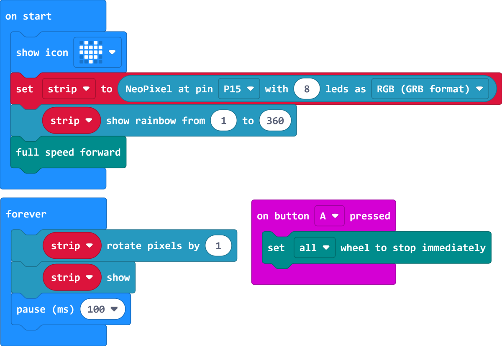

# Case 05 彩虹车灯

## 简介

本课程旨在通过制作智能赛车，让学生学习和探索小车电机控制、RGB灯的控制等知识点，并应用这些知识来实现小车在行驶过程中散发彩虹般的光芒。学生将通过实践操作，掌握电机控制和RGB灯控制的原理，培养创造性思维、问题解决和团队合作能力，并提升小车的效果和可视化效果。

## 教学目标

了解RGB灯的原理和控制方式，学会控制灯的颜色和亮度。

学会将电机控制和RGB灯控制应用到Cutebot Pro智能赛车中，实现彩虹车灯效果。

培养学生的观察力和动手能力，通过调试和实践提高小车可视化效果。

## 教学准备

Cutebot Pro × 1

micro:bit × 1

## 教学过程

### 课程引入

大家好！今天我们将继续我们的智能赛车制作项目，但这次我们要给小车增添一些光彩夺目的特效。你们有没有想过如何让小车在行驶过程中散发出彩虹般的光芒呢？

在接下来的课程中，我们将学习RGB灯的控制方式和颜色模型，并实现一个可以在行驶过程中散发彩虹般光芒的小车。

### 探究活动

如何利用小车的电机控制和RGB灯，实现一个能够在行驶过程中散发彩虹般光芒的小车呢？

我们如何控制彩虹灯的亮度和颜色呢？

### 示例代码

请参考程序连接：[https://makecode.microbit.org/_08vVdaEECKfc](https://makecode.microbit.org/_08vVdaEECKfc)

你也可以通过以下网页直接下载程序。

    <iframe
        src="https://makecode.microbit.org/_08vVdaEECKfc"
        frameborder="0"
        sandbox="allow-popups allow-forms allow-scripts allow-same-origin"
        style={{
            position: 'absolute',
            width: '100%',
            height: '100%',
        }}
    />

### 团队合作与展示

学生分成小组，共同完成小车的制作和程序编写。

鼓励学生之间相互合作、交流和分享经验。

每个小组有机会向其他小组展示他们制作的智能赛车，并展示彩虹车灯在行驶过程中的效果。

### 总结与反思

回顾课程内容，提醒学生掌握了哪些知识和技能。

引导学生讨论他们在制作过程中遇到的问题和困难，以及如何解决这些问题。

引导学生思考彩虹车灯的优化和改进方向，如调整灯光切换的顺序、添加其他特效等。

### 延伸活动

挑战学生改进彩虹车灯效果，例如添加闪烁、渐变等特效。

引导学生设计和实现其他有趣的灯光效果，如随音乐节奏变化、根据环境光强度调节亮度等。

鼓励学生运用创造力和想象力，设计自己独特的小车灯光效果。
