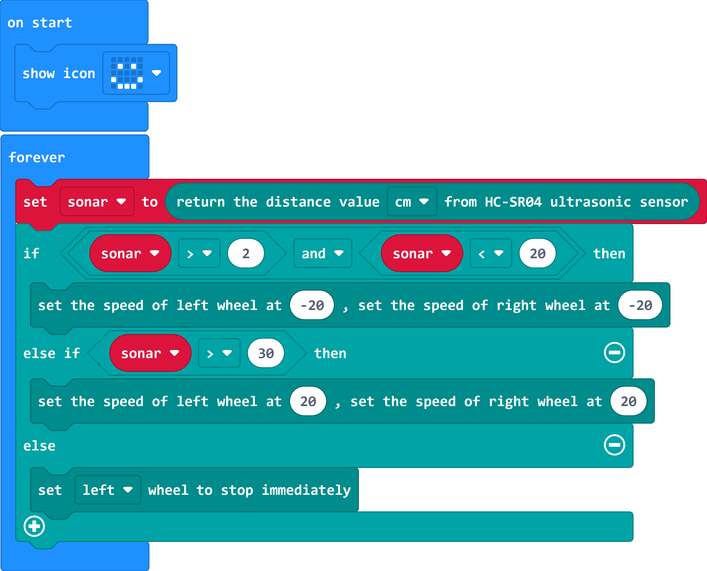

# Case 04 定距跟车

## 简介

本课程旨在通过使用Cutebot Pro智能赛车制作案例，引导学生学习图形化编程和传感器技术的应用。学生将学习如何编写程序，让小车能够跟随前面的小车行驶，并保持一定的距离。在实现这一目标的过程中，学生将涉及到程序设计的判断、分支、逻辑运算等知识点，并了解超声波传感器的工作原理。

## 教学目标

理解超声波传感器的原理和应用。

学会使用图形化编程工具编写程序，实现小车跟随行驶的功能。

培养学生的逻辑思维、问题解决能力和创造力。

## 教学准备

Cutebot Pro × 1

micro:bit × 1

## 教学过程

### 课程引入

大家好！今天我们将用Cutebot Pro智能赛车来制作一个有趣的案例。你们看到这辆智能赛车了吗？它有超声波传感器，能够帮助我们的小车感知周围的环境。我们的目标是让小车能够跟随前面的小车行驶，并保持一定的距离。这将需要我们运用图形化编程和传感器技术来实现。

### 探究活动

如何利用超声波传感器检测到前方的障碍物？

如何编写程序来实现让小车跟随前面的小车行驶，并保持一定的距离？

### 示例代码

请参考程序连接：[https://makecode.microbit.org/_35vDd71jg3tb](https://makecode.microbit.org/_35vDd71jg3tb)

你也可以通过以下网页直接下载程序。

    <iframe
        src="https://makecode.microbit.org/_35vDd71jg3tb"
        frameborder="0"
        sandbox="allow-popups allow-forms allow-scripts allow-same-origin"
        style={{
            position: 'absolute',
            width: '100%',
            height: '100%',
        }}
    />

### 案例展示
