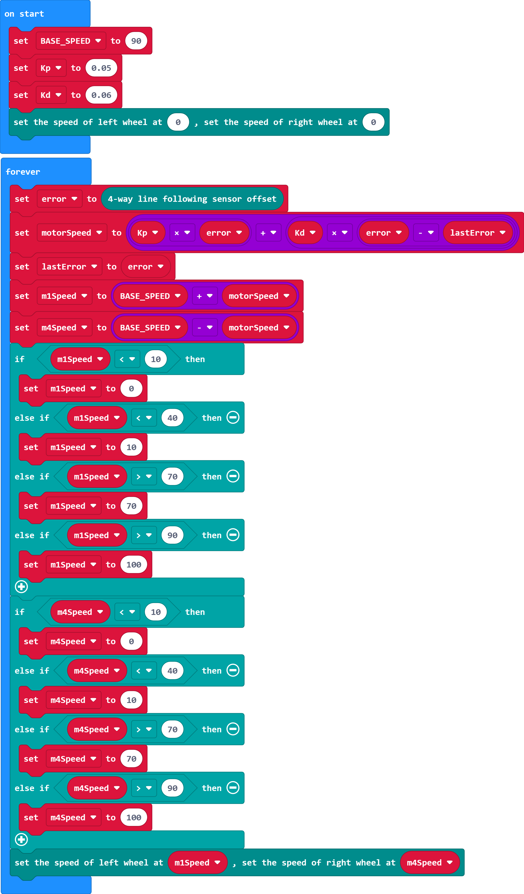

# Case 06 十字路口

## 简介

本课程旨在通过制作智能巡线赛车，让学生学习和探索程序设计中的判断、分支、与或非等概念，并了解巡线传感器的工作原理。学生将通过实践操作，培养逻辑思维、问题解决和团队合作能力，并进一步学习如何分析和处理小车在遇到十字路口时的状态。

## 教学目标

理解程序设计的基本概念，如判断、分支、与或非等，并能够应用于实际问题。

理解巡线传感器的工作原理，了解其在巡线行驶中的应用。

能够使用Cutebot Pro智能赛车制作一个可以巡线行驶的小车，并能够处理十字路口的状态。

## 教学准备

Cutebot Pro × 1

micro:bit × 1

## 教学过程

### 课程引入

大家好！今天我们将要介绍一个非常有趣的项目——制作智能巡线赛车。这辆小车可以沿着黑色线条行驶，而且还能处理遇到的十字路口情况。

### 探究活动

提出问题：小车如何能够沿着黑色线条行驶？遇到十字路口时应该如何处理？

分组讨论，鼓励学生分享自己的观点和想法。

### 示例代码

请参考程序连接：[https://makecode.microbit.org/_35vDd71jg3tb](https://makecode.microbit.org/_35vDd71jg3tb)

你也可以通过以下网页直接下载程序。

    <iframe
        src="https://makecode.microbit.org/_35vDd71jg3tb"
        frameborder="0"
        sandbox="allow-popups allow-forms allow-scripts allow-same-origin"
        style={{
            position: 'absolute',
            width: '100%',
            height: '100%',
        }}
    />

### 案例展示

## 总结与反思

回顾课程内容，提醒学生掌握了哪些知识和技能。

引导学生讨论他们在制作过程中遇到的问题和困难，以及如何解决这些问题。

鼓励学生思考智能赛车制作案例的应用领域和未来发展。

## 延伸活动

让学生尝试改进智能赛车的巡线行驶功能，使其能够应对更复杂的线路和路况。

引导学生设计和实现更复杂的十字路口处理算法，考虑不同交通规则和情况。

鼓励学生思考和讨论智能赛车在日常生活中的实际应用和未来发展前景。
