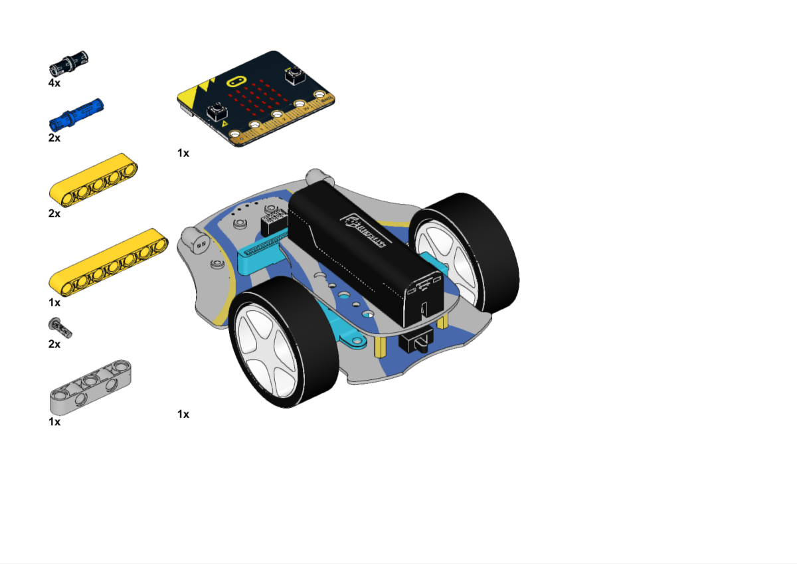
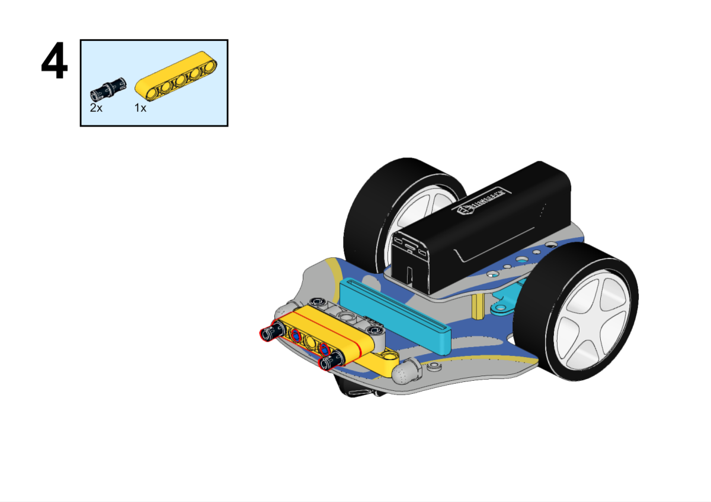

# 简易机械爪小车

## 目的

搭建一辆使用机械爪的Cutebot Pro智能赛车。

## 使用材料

[Cutebot Pro智能赛车](https://www.elecfreaks.com/elecfreaks-smart-cutebot-pro-programming-robot-car-for-micro-bit.html)

[ELECFREAKS Mechanical Catch (Use With Cutebot)](https://www.elecfreaks.com/elecfreaks-mechanical-catch-use-with-cutebot.html)

[科创扩展包](https://shop.elecfreaks.com/products/elecfreaks-tpbot-science-and-technology-pack?_pos=3&_sid=11fe49ca3&_ss=r)

[ELECFREAKS micro:bit Electronic Joystick:bit V2 Kit](https://www.elecfreaks.com/joystick-bit-2-kit-for-micro-bit.html)

## 搭建步骤

## 硬件连接

将简易机械爪连接到Cutebot Pro智能赛车的S1端口。

## 软件

[微软makecode](https://makecode.microbit.org/#)

## 编程

在MakeCode的代码抽屉中点击`高级`，查看更多代码选项。

为了给Cutebot Pro智能赛车编程，我们需要添加一个扩展库。在代码抽屉底部找到`扩展`，并点击它。这时会弹出一个对话框，搜索`CutebotPro`，然后点击下载这个代码库。

为了给joystick:bit V2编程，我们需要添加一个扩展库。在代码抽屉底部找到`扩展`，并点击它。这时会弹出一个对话框，搜索`joystickbit`，然后点击下载这个代码库。

## 示例程序

### 手柄端

### 程序

请参考程序连接：[https://makecode.microbit.org/_DHyiYdULjKg0](https://makecode.microbit.org/_DHyiYdULjKg0)

你也可以通过以下网页直接下载程序。

    <iframe
        src="https://makecode.microbit.org/_DHyiYdULjKg0"
        frameborder="0"
        sandbox="allow-popups allow-forms allow-scripts allow-same-origin"
        style={{
            position: 'absolute',
            width: '100%',
            height: '100%',
        }}
    />

### 小车端

### 程序

请参考程序连接：[https://makecode.microbit.org/_6sDHHp3Jwgbq](https://makecode.microbit.org/_6sDHHp3Jwgbq)

你也可以通过以下网页直接下载程序。

    <iframe
        src="https://makecode.microbit.org/_6sDHHp3Jwgbq"
        frameborder="0"
        sandbox="allow-popups allow-forms allow-scripts allow-same-origin"
        style={{
            position: 'absolute',
            width: '100%',
            height: '100%',
        }}
    />

## 结论

通过手柄摇杆控制小车行驶路线，按下手柄按键C可以控制小车机械爪夹取物品，松开按键C则机械爪放开物品。

## 扩展知识

*** 遥控机械爪小车的应用场景 ***

遥控机械爪小车是一种装备有机械爪的无人车辆，可以通过遥控操作进行移动和控制机械爪的动作。以下是一些遥控机械爪小车的应用场景：

物流和仓储：遥控机械爪小车可以用于物流和仓储领域，用于搬运和堆垛货物。操作员可以通过遥控器控制小车的移动，并使用机械爪抓取、搬运或堆叠货物，提高物流效率和减少人力成本。

搜索和救援：在灾难救援或搜救任务中，遥控机械爪小车可以用于携带和操作救援工具。它可以通过狭窄或危险的地形，到达难以到达的区域，并使用机械爪进行物品搬运、障碍物清除或人员救援等任务。

环境监测和清洁：遥控机械爪小车可以用于环境监测和清洁任务。它可以携带传感器设备，如摄像头或气体传感器，进行环境数据的采集和监测。同时，机械爪可以用于清理垃圾、拾取杂物或进行清洁工作，提高环境整洁度和可持续发展。

建筑和施工：在建筑和施工领域，遥控机械爪小车可以用于搬运和放置建筑材料，如砖块、钢筋等。它可以通过狭窄的施工空间，将材料运输到指定位置，并使用机械爪进行精确的放置，提高施工效率和减少人工劳动。

农业和园艺：遥控机械爪小车在农业和园艺领域具有应用潜力。它可以用于播种、收割、除草或施肥等农业操作。机械爪可以抓取和处理农作物，同时小车的移动性能可以适应不同的农田或园艺场地。
