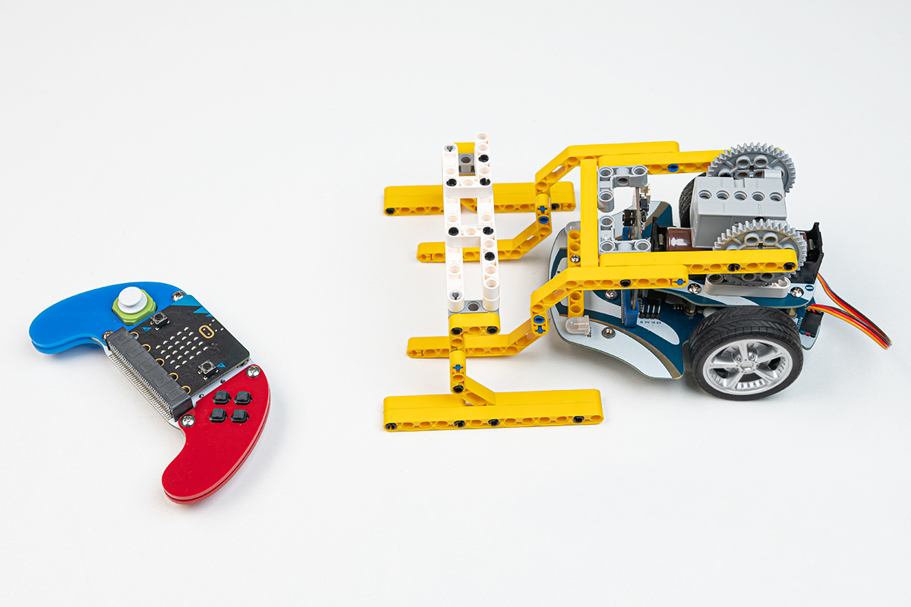
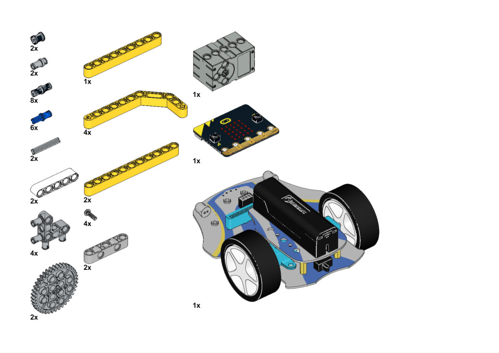
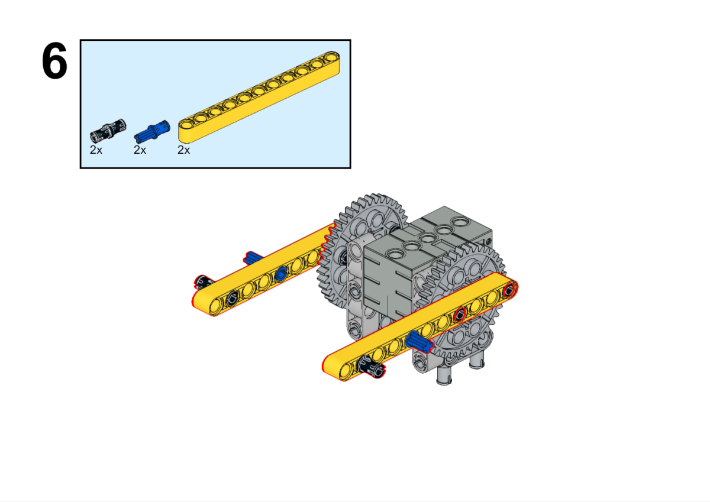
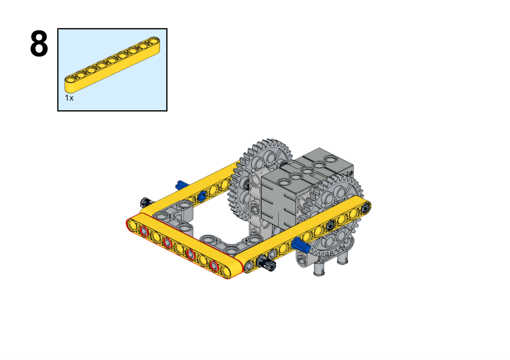
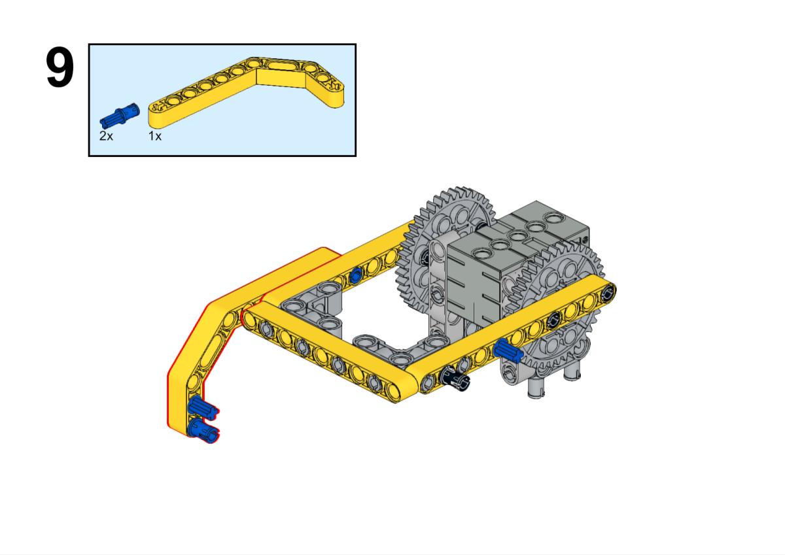
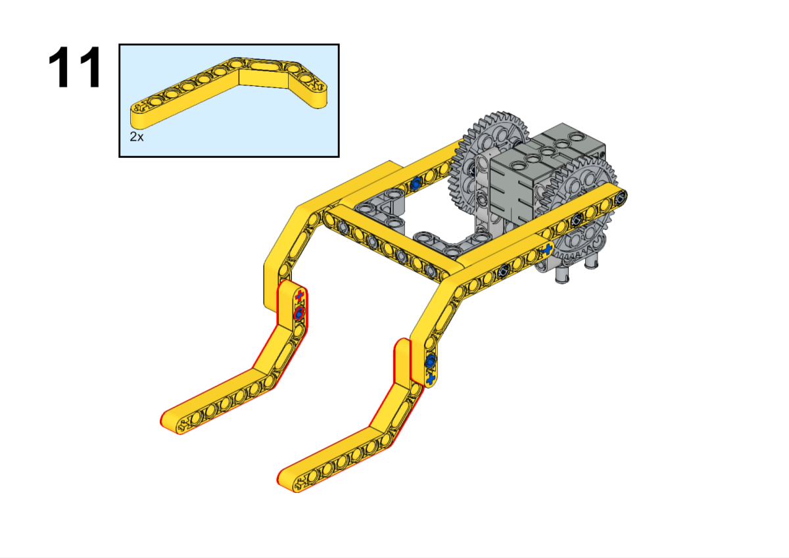
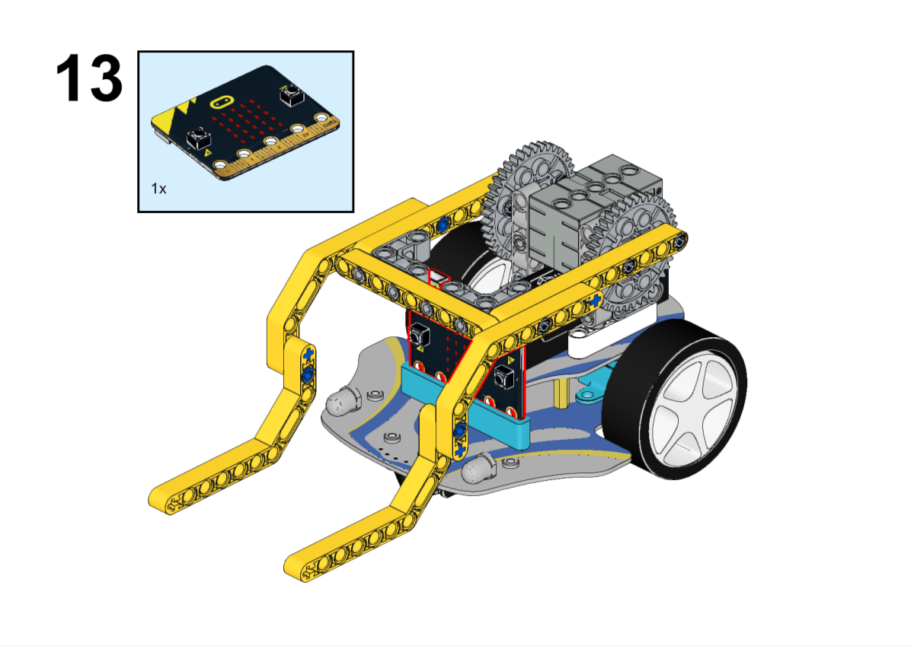
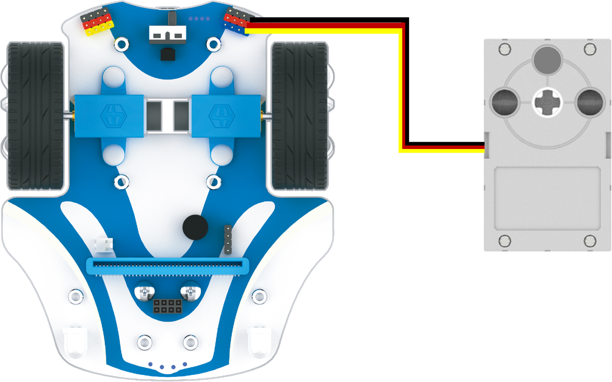
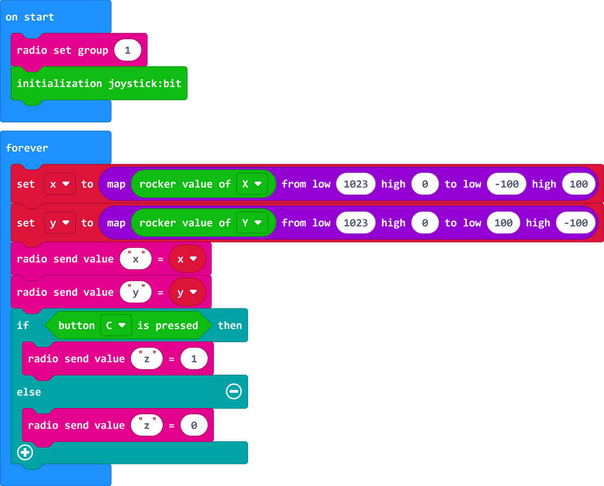
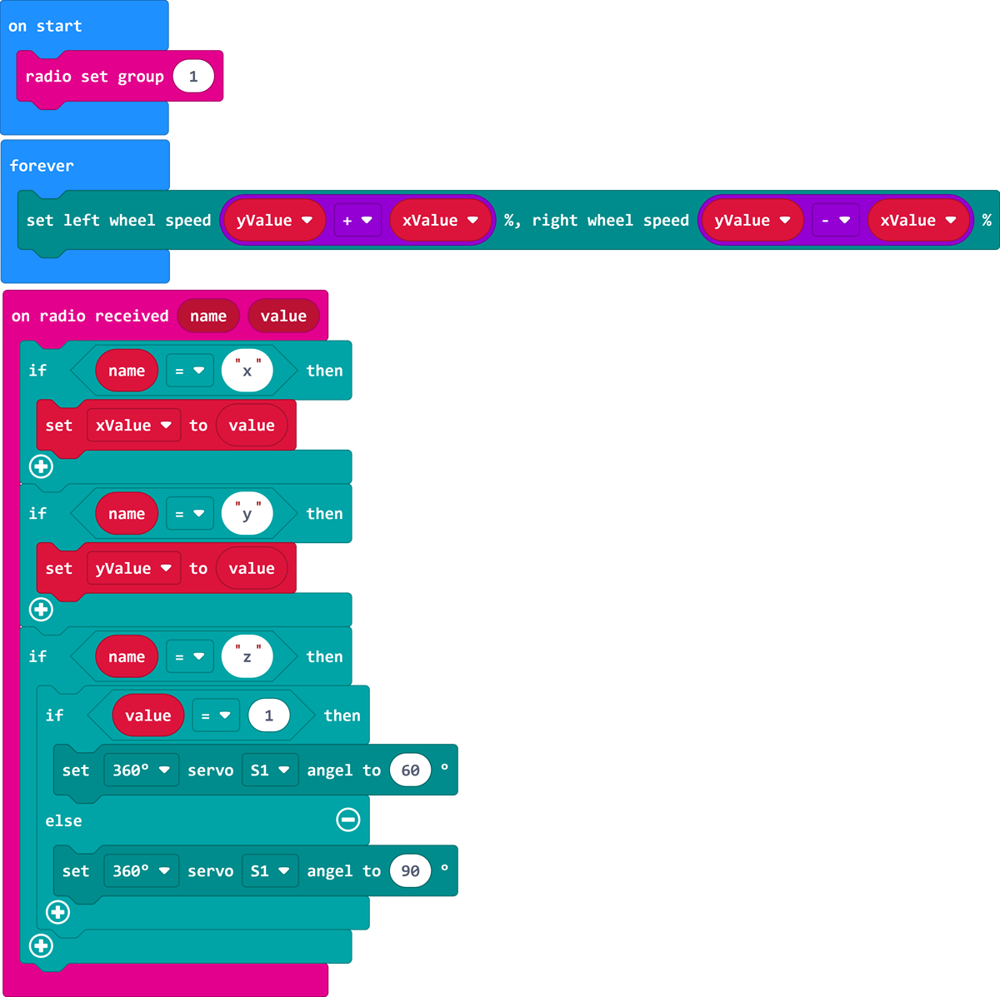

# 遥控叉车

## 目的

搭建一辆车。

## 使用材料

[Cutebot Pro智能赛车](https://www.elecfreaks.com/elecfreaks-smart-cutebot-pro-programming-robot-car-for-micro-bit.html)

[科创扩展包](https://shop.elecfreaks.com/products/elecfreaks-tpbot-science-and-technology-pack?_pos=3&_sid=11fe49ca3&_ss=r)

[ELECFREAKS micro:bit Electronic Joystick:bit V2 Kit](https://www.elecfreaks.com/joystick-bit-2-kit-for-micro-bit.html)

## 搭建步骤

## 硬件连接

将舵机连接到Cutebot Pro智能赛车的S1端口。

## 软件

[微软makecode](https://makecode.microbit.org/#)

## 编程

在MakeCode的代码抽屉中点击`高级`，查看更多代码选项。

为了给Cutebot Pro智能赛车编程，我们需要添加一个扩展库。在代码抽屉底部找到`扩展`，并点击它。这时会弹出一个对话框，搜索`CutebotPro`，然后点击下载这个代码库。

为了给joystick:bit V2编程，我们需要添加一个扩展库。在代码抽屉底部找到`扩展`，并点击它。这时会弹出一个对话框，搜索`joystickbit`，然后点击下载这个代码库。

## 示例程序

### 手柄端

### 程序

请参考程序连接：[https://makecode.microbit.org/_DHyiYdULjKg0](https://makecode.microbit.org/_DHyiYdULjKg0)

你也可以通过以下网页直接下载程序。

    <iframe
        src="https://makecode.microbit.org/_DHyiYdULjKg0"
        frameborder="0"
        sandbox="allow-popups allow-forms allow-scripts allow-same-origin"
        style={{
            position: 'absolute',
            width: '100%',
            height: '100%',
        }}
    />

### 小车端

### 程序

请参考程序连接：[https://makecode.microbit.org/_WgKiF1Ckkbch](https://makecode.microbit.org/_WgKiF1Ckkbch)

你也可以通过以下网页直接下载程序。

    <iframe
        src="https://makecode.microbit.org/_WgKiF1Ckkbch"
        frameborder="0"
        sandbox="allow-popups allow-forms allow-scripts allow-same-origin"
        style={{
            position: 'absolute',
            width: '100%',
            height: '100%',
        }}
    />

## 结论

通过手柄摇杆控制小车行驶路线，按下手柄按键C可以控制小车抬起物品。

## 扩展知识

*** 叉车的结构特点 ***

叉车（或称叉式起重机）是一种用于搬运和堆放货物的机械设备。它具有以下结构特点：

底盘：叉车的底盘是整个机器的基础，通常由钢材构成，具有足够的强度和稳定性。底盘上安装有驾驶室、发动机、液压系统和其它重要的机械和电子组件。

驾驶室：叉车的驾驶室位于底盘的前部或中部，提供给操作员一个舒适和安全的工作环境。驾驶室内有座椅、方向盘、仪表板和控制杆，操作员可以通过这些控制设备操纵叉车的运动和功能。

叉臂：叉车的叉臂是其最主要的工作部件，用于搬运和堆放货物。叉臂通常由钢材制成，呈倒“L”形状，并可上下移动。叉臂的顶端安装有货叉（forks），用于插入货物并提升和搬运。

提升系统：叉车的提升系统由液压系统驱动，用于提升和降低叉臂及货叉。液压缸通过液压泵提供压力，将液压油推动到液压缸中，从而实现叉臂的上下移动。

动力系统：叉车通常使用内燃机或电动机作为动力源。内燃机叉车使用燃油（如汽油、柴油或液化石油气）驱动，而电动叉车则使用电池或电力驱动。动力系统提供叉车的动力和运行能力。

轮胎：叉车通常配备特殊的固体橡胶轮胎或充气轮胎，以提供良好的牵引力和操纵性。轮胎的选择取决于使用环境和货物的性质。

控制系统：叉车的控制系统包括操纵杆、踏板和控制面板等设备，用于操作叉车的运动和功能。操作员可以通过这些控制设备控制方向、提升货叉、倾斜叉臂等操作。

总体而言，叉车具有坚固的底盘、驾驶室、叉臂、提升系统、动力系统、轮胎和控制系统等主要结构特点。这些特点使叉车能够高效、安全地搬运和堆放重物，成为物流和仓储行业中不可或缺的设备。
