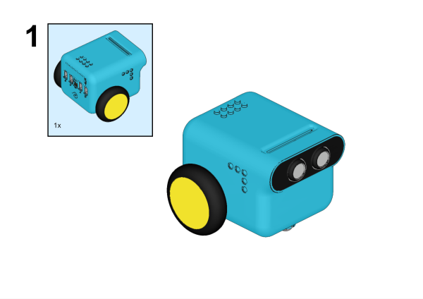
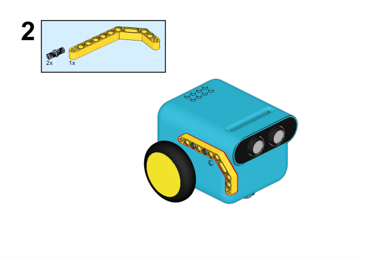
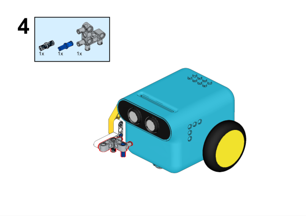
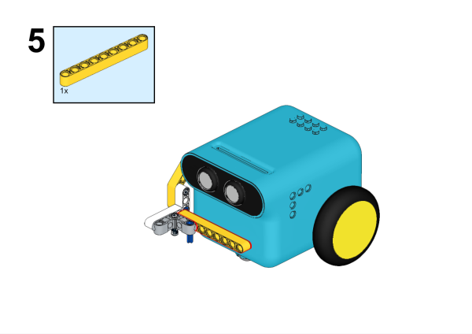
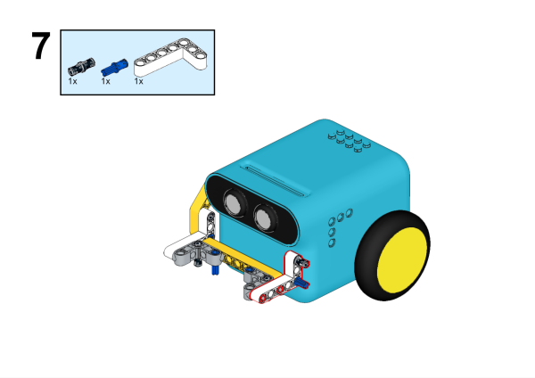
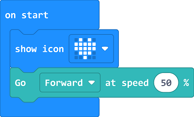

# TPbot格斗小车3

## 目的

搭建一辆TPbotTPbot格斗小车。

## 使用材料

[天蓬智能车](https://www.elecfreaks.com/tpbot.html)

[360度舵机](https://www.elecfreaks.com/geekservo-2kg-360-degrees-compatible-with-lego.html)

扩展积木包

## 搭建步骤

## 软件

[微软makecode](https://makecode.microbit.org/#)

## 编程

在MakeCode的代码抽屉中点击`高级`，查看更多代码选项。

为了给天蓬智能车编程，我们需要添加一个扩展库。在代码抽屉底部找到`扩展`，并点击它。这时会弹出一个对话框，搜索`tpbot`，然后点击下载这个代码库。

## 示例程序

`当开机时`设置显示图标，设置小车以50%的速度向前行驶。

### 程序

请参考程序连接：[https://makecode.microbit.org/_egqdaXL02ey6](https://makecode.microbit.org/_egqdaXL02ey6)

你也可以通过以下网页直接下载程序。

    <iframe
        src="https://makecode.microbit.org/_egqdaXL02ey6"
        frameborder="0"
        sandbox="allow-popups allow-forms allow-scripts allow-same-origin"
        style={{
            position: 'absolute',
            width: '100%',
            height: '100%',
        }}
    />

## 结论

小车向前行驶，使用车头前端的叉子推开其它小车。
