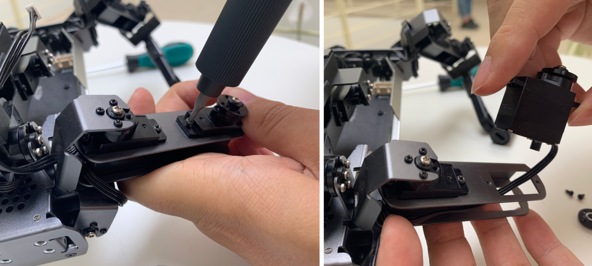
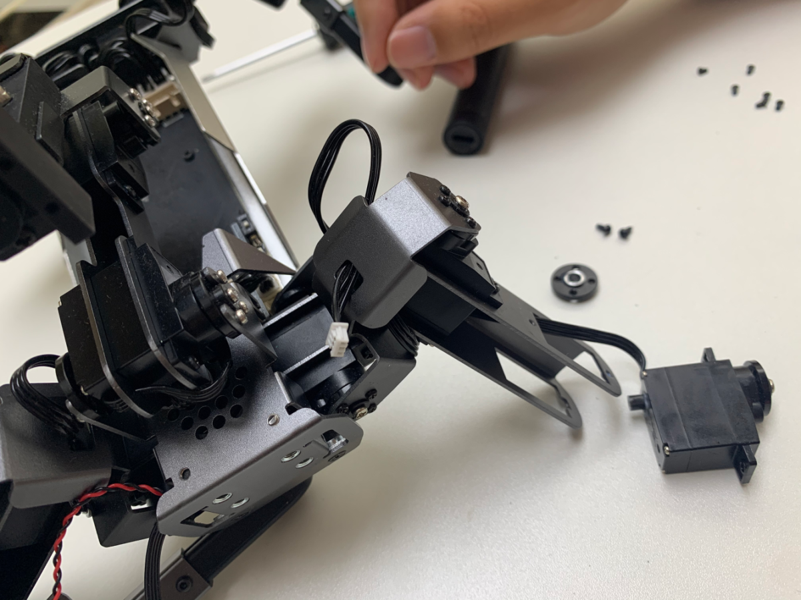
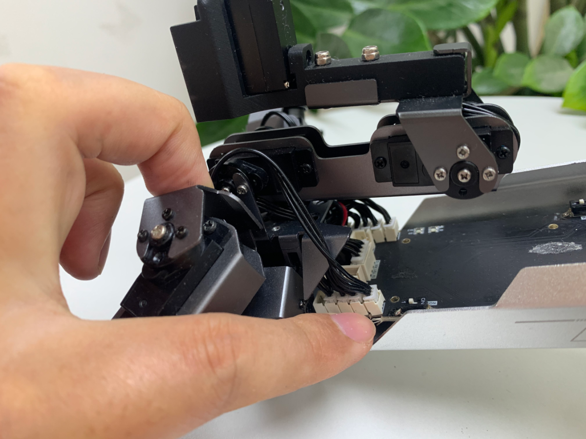

## 更换 XGO 舵机

以更换膝关节舵机为例，图示更换舵机。**注意：机器狗舵机共有15个不同的ID,必须使用相同ID替换**。

舵机更换视频教程链接：https://www.elecfreaks.com/download/xgo/XGO-LITE2_servo_replacement.mp4

步骤一，打开机器狗后盖，从驱动板上拔掉损坏的膝关节舵机线。

步骤二，拆掉膝关节舵机主副舵盘的舵盘螺丝，把小腿取下来。

步骤三，取下损坏的舵机，注意不要使劲拉扯舵机线。

步骤四，把膝关节舵机线穿过对应的位置，并把舵机固定在大腿钣金上。

步骤五，把小腿固定在主副舵盘上，注意小腿和大腿需要形成90°直角。

步骤六，把线插在主板上，关闭机器狗上盖，开机并重新标定机器狗。

