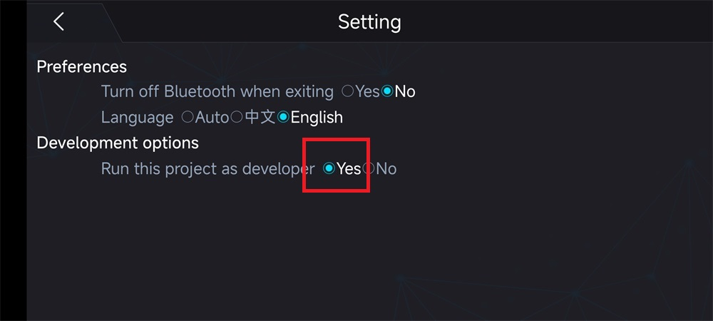
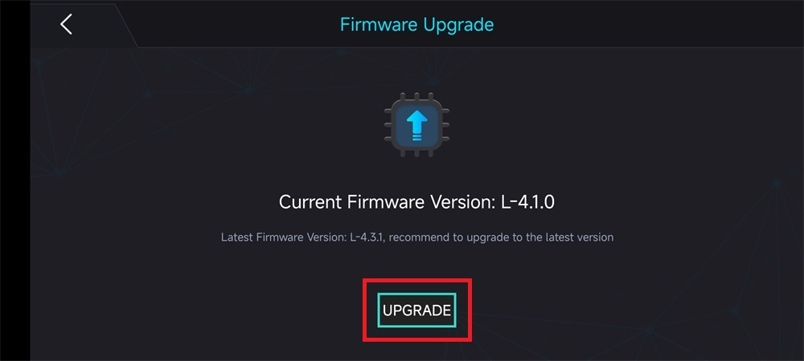
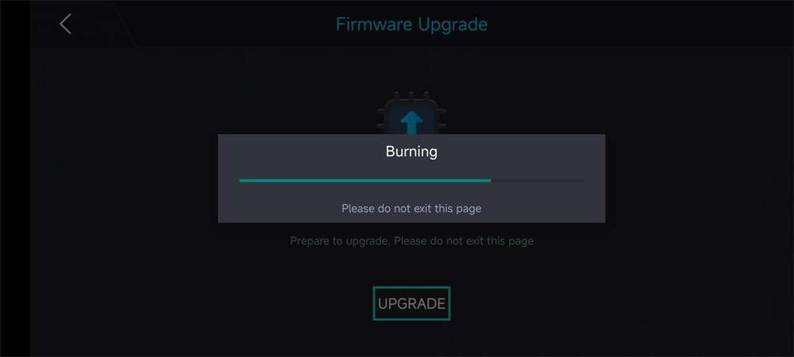
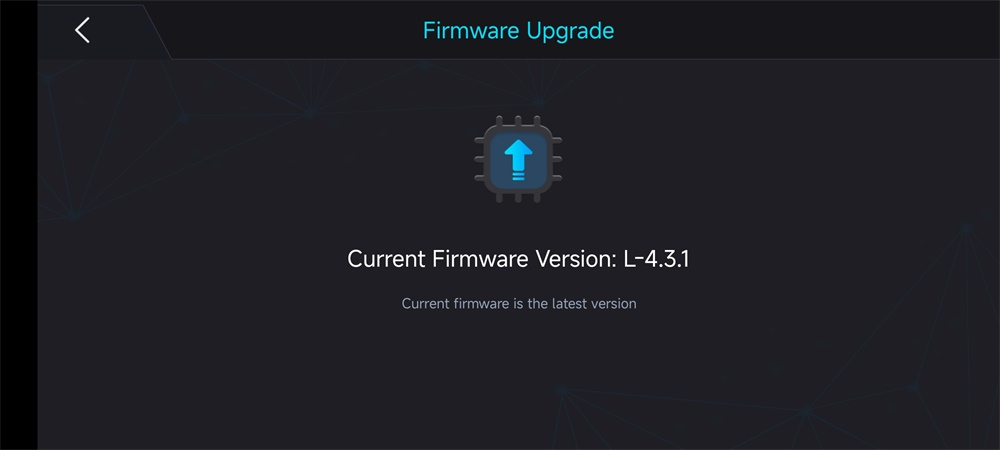
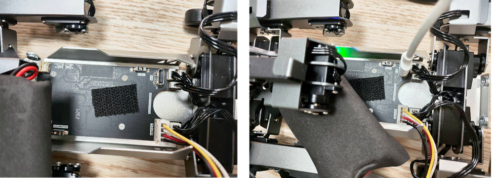

# 升级驱动板固件

我们会不定时的推出优化后的驱动板（下位机）固件，升级固件的操作有两种方式，您可以根据自身的选择完成升级固件操作。

方式一是使用安卓端 XGO 应用程序更新固件，优点是简单、方便，不用拆卸和组装 XGO 机身，缺点是可能需要更新几次才会成功。因为这种方式是通过蓝牙传输，存在一定的失败概率，建议您多更新几次，直到更新成功。

方式二是通过Type-C线直连的方式，通过电脑端固件烧录程序进行固件升级，优点是不存在失败的情况，缺点是需要拆下和组装 XGO 机身。

下面分别介绍两种方式。

## 方式一：使用 XGO 应用程序升级驱动板固件

***备注：只有安卓端 XGO 应用程序具有固件升级的功能，苹果端 XGO 应用程序并没有升级固件的功能。关于 XGO 应用程序的下载和使用，请参考开箱检查页面的“智能手机检测”部分***

1. 将 XGO 开机，打开 XGO 应用程序，通过蓝牙连接方式进行连接。

2. 返回主页面后，点击“Setting”按钮。

3. 在“Development options”中，选择“Yes”，并返回主页面。

4. 点击“DOWNLOAD”按钮，进入固件升级页面。

5. 点击“升级”，等待完成升级动作。

***备注：这种方式并不能保证一次成功，若没有升级成功，请重新进行升级直到成功***

## 方式二：通过Type-C线直连的方式更新驱动板固件

1. 将 XGO 机身六颗螺丝取下。

2. 打开机身上盖,将 Type-C 线连接 XGO 机身 Tpye-C 接口和电脑端口。

3. 下载最新的[驱动板固件文件](https://www.elecfreaks.com/download/xgo/firmware_4.3.zip)和[固件烧录工具](https://www.elecfreaks.com/download/xgo/flash_download_tool_3.9.5_0.zip)到电脑。

4. 打开 flash_download_tool，选择下列参数并点击“OK”。

5. 参考下方表格 ，点击三个点的图标添加 bin 文件，按照下表添加之后， 然后在@后面的方框修改下载地址 ，重新勾选前方的框使这四行都变绿。

6. 选择对应的SPI SPEED、SPI MODE 参数以及电脑的COM端口后，点击“START”，等待烧录完成。

7. 拔下Type-C线，重新组装XGO 机身上盖和打紧固定螺丝。
