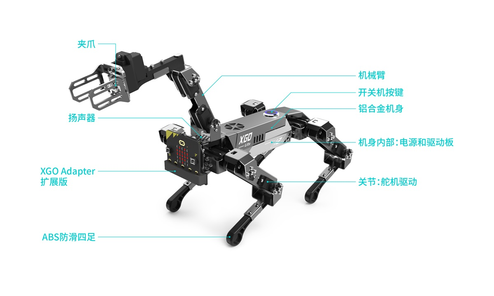
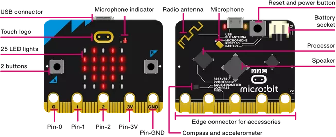
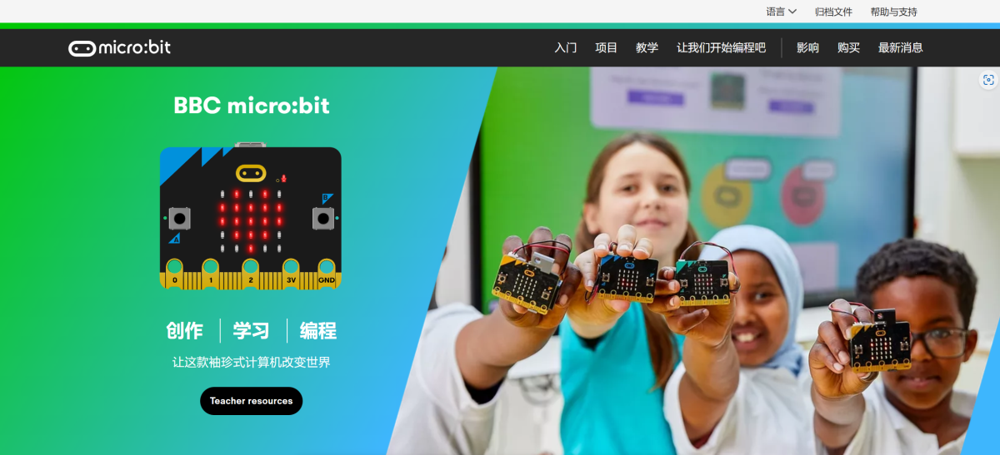
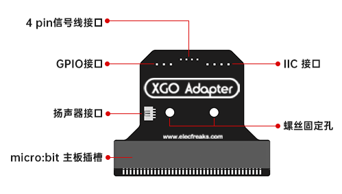

# 硬件介绍

## XGO-Lite V2 主体结构

XGO-lite V2 的主体结构是由铝合金结构件，小腿和总线舵机组成，头部的 XGO Adapter 扩展板由 4pin 信号线连接，内置2节18650锂电池。

- 机器狗前盖，机器狗后盖和机器狗底盖作为机器狗机架，用于联接各部件。前后腿分别通过螺丝固定在机器狗底盖前后侧；核心驱动板固定在机器狗机身内部底盖上面。

- 每条腿上各搭载三个舵机作为肘、肩、髋关节。机械上，三个关节舵机使用铝合金结构件进行固定联接。电气上，肘关节舵机和肩关节舵机，肩关节舵机和髋关节舵机，髋关节舵机和核心驱动板之间各使用一条舵机线连接，使得核心驱动板能够驱动并控制所有的关节舵机。

- XGO Adapter 扩展板固定在机器狗前盖上，并通过 4pin 信号串口连接线与核心驱动板进行连接。

- 开关通过螺母固定在机器狗后盖上，并与核心驱动板进行连接。开关为自锁类型，即按下后不回弹且机器狗处于持续通电状态；再次按下后机器狗断电并在3~4秒后趴下关机。

- 18650 2S电池通过魔术贴粘在驱动板上，充电孔固定在底板。

## micro:bit 主板

micro:bit XGO Robot Kit V2 是通过给 micro:bit V2 编写程序发出指令到下位机驱动板来控制 XGO-lite V2 运动。

首先，让我们来了解一下什么是 micro:bit。micro:bit 是一种微型计算机，它由英国的BBC（英国广播公司）设计，旨在帮助学生学习编程和电子学。它有一个32位 ARM Cortex-M0 处理器和 5x5 LED 矩阵，还有一些其他的传感器和接口，例如加速度计、磁力计、蓝牙和 USB 连接器。通过 micro:bit 编程控制，更是让 XGO-lite V2 成为了一个极具互动性和学习性的工具。

关于 micro:bit 的学习和使用，可以参考它官网教程，官网链接：[Micro:bit](https://microbit.org/)。

## XGO Adapter 扩展板

XGO Adapter 是一种扩展板，它可以与 micro:bit 主板配合使用，为用户提供更多的接口和功能。该扩展板包含micro:bit 主板插槽、4pin 信号线连接端口、扬声器连接端口、GPIO 和 IIC 接口，采用螺丝固定到 XGO-lite2 前盖上，为用户提供了更加便捷和稳定的固定方式。

首先，让我们了解一下 XGO Adapter 的功能和组成部分。它为用户提供以下功能：

1. 提供更多的接口：XGO Adapter 包含 4 pin 信号线连接端口、扬声器连接端口、GPIO 和 IIC 接口等，可以为用户提供更多的接口和扩展方式。
2. 增强系统功能：通过 XGO Adapter，用户可以扩展 micro:bit 主板的功能，例如增加蓝牙、传感器等模块，进一步增强系统的功能。
3. 提高稳定性：XGO Adapter 采用螺丝固定到 XGO-lite V2 前盖上，可以提高扩展板的稳定性和可靠性。

XGO Adapter 的组成部分包括：

1. micro:bit 主板插槽：XGO Adapter 的主板插槽与 micro:bit 主板兼容，可以直接插入 micro:bit 主板，实现扩展功能。
2. 4pin 信号线连接端口：该接口用于连接 XGO-lite V2 的 4pin 信号线，既可以为 micro:bit 主板供电，同时也可以让 micro:bit 与 XGO-lite V2 之间指令传输。
3. 扬声器连接端口：该接口可以用于连接扬声器，实现声音输出功能。
4. GPIO 和 IIC 接口：这些接口可以用于连接各种模块，例如 Octopus 系列传感器、行星系列传感器等，实现更多的功能扩展。

通过 XGO Adapter 扩展板，用户可以将 micro:bit 主板的功能进一步扩展，并且可以实现更加灵活的硬件设计。例如，用户可以通过连接传感器实现环境监测、通过连接驱动器实现机器人控制、通过连接扬声器实现声音输出等。同时，XGO Adapter 的螺丝固定设计可以提高扩展板的稳定性。

总之，XGO Adapter 是一种功能强大的扩展板，可以为用户提供更多的接口和功能，进一步扩展 micro:bit 主板的应用范围。通过 XGO Adapter，用户可以实现更加灵活和创新的硬件设计，为教育、创客等领域提供更多的可能性。

## XGO-Lite V2 驱动板

选用 ESP32-WROVER 模组，ESP32-WROVER 系列模组基于 ESP32-D0WD 双核芯片设计，并且拥有足够的接口与外设通讯，使用串口与串口舵机通信，IIC 接口读取陀螺仪 MPU6050数据，系统使用两节18650锂电池供电。

选用 ESP32-WROVER 模组，ESP32-WROVER 模组是一款高性能、低功耗的 Wi-Fi + 蓝牙/蓝牙 LE 双模组组件，基于 Espressif Systems 的 ESP32 系列芯片而制。在 XGO-lite V2 的驱动板中，它起到了非常关键的作用。下面是一段关于 ESP32-WROVER 模组的详细介绍。

主要特性：

- 集成双核心处理器：ESP32-WROVER 模组集成了一个高性能双核 Tensilica LX6 微处理器，工作频率可达 240 MHz，为 XGO-lite V2 提供强大的计算能力，满足了实时运动学逆解算的算力需求。
- 无线通信：支持 2.4 GHz Wi-Fi 和蓝牙（包括经典蓝牙和蓝牙低功耗 BLE）双模通信，使得机器狗可以轻松实现远程操控和数据传输。
- 大容量内存：最高可达 4MB SPI Flash 和 8MB PSRAM，为复杂数字处理任务提供充足的内存空间。
- 低功耗模式：支持多种低功耗模式，有利于延长机器狗的使用寿命和降低能源消耗。
- 强大的 I/O 接口：包含多达 34 个可编程 GPIO 引脚，可支持各种传感器、执行器和通信接口，方便进行功能扩展。
- 安全性：内置硬件加密引擎，支持 AES、SHA-2、RSA、Elliptic Curve Cryptography (ECC) 等加密算法，确保数据安全。

得益于 ESP32-WROVER 模组的高性能、低功耗和丰富的功能特性，它广泛应用于各类物联网（IoT）项目中，如智能家居、可穿戴设备、无线传感器网络、远程控制等领域。在  XGO-lite V2 中，ESP32-WROVER 模组实现了设备的核心控制、数据处理和通信功能，为用户打造出一款智能、灵活且可拓展的机器狗产品。

## XGO-Lite V2 关节

XGO-lite2 机器狗选用了一款高品质的6V 2.3KG.塑料壳金属齿300度双轴TTL串口舵机作为其关键部件之一。该舵机采用了塑胶外壳、金属齿轮箱、铁芯电机、TTL控制板和高品质电位器，输出头采用25T型。它具有堵转扭矩2.3kg.cm，有效控制角度为300度，可切换伺服模式和连续转电机工作模式。此外，该舵机还可反馈位置、速度、电压、温度和负载参数，从而实现过载保护。

通过采用这款舵机，XGO-lite2 机器狗的运动控制更加精准和稳定。该舵机的金属齿轮箱和铁芯电机保证了其高扭矩和高精度，有效控制角度为300度也使得机器狗的运动更加灵活。同时，该舵机还具备伺服模式和连续转电机工作模式，以及反馈位置、速度、电压、温度和负载参数的功能，从而实现了过载保护，保障机器狗的稳定性和安全性。

总之，6V 2.3KG.塑料壳金属齿300度双轴TTL串口舵机是一款高品质、高性能的舵机，适用于各种机器人和智能设备的运动控制。在 XGO-lite2 机器狗中，它为 XGO-lite V2 的运动控制提供了强大的支持，提高了 XGO-lite V2 的性能和应用价值。

