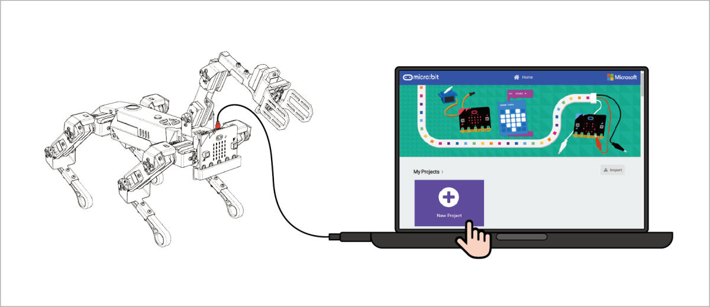
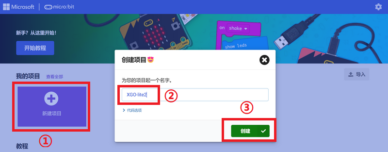
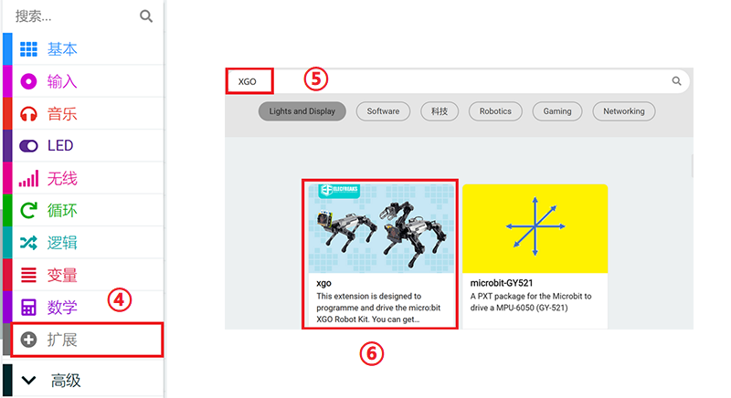
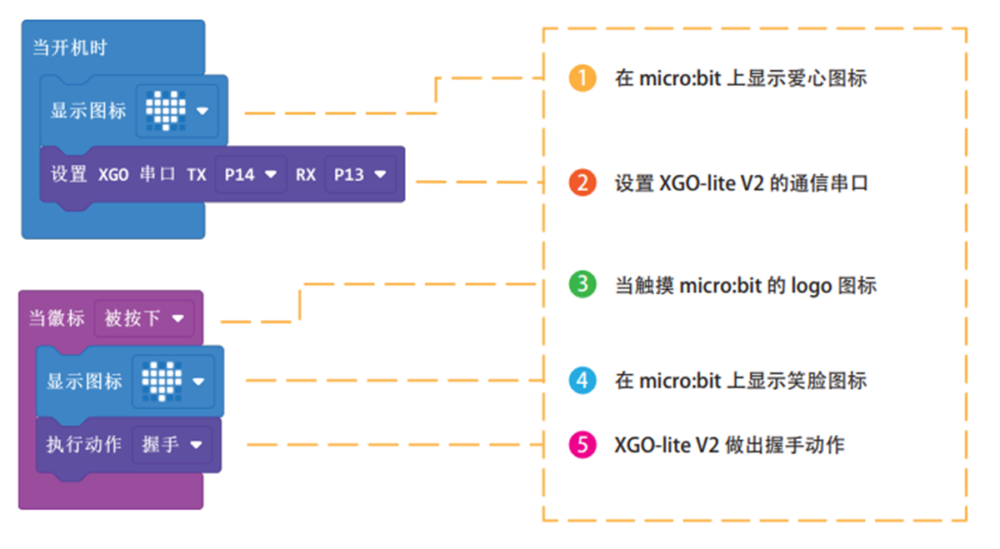

#  开箱自检

进行开箱自检是为了确保您购买的产品符合预期并且没有受到任何损坏。请您根据以下步骤来进行开箱自检操作：

### 1、检查包装

检查包装是否完好无损，确认包装上的标签和描述与您购买的产品相符。

### 2、确认配件

确认产品附带的所有配件是否全部齐全，并与套件清单中的描述相符。

套装清单：

| 项目                                    | 数量 |
| :-------------------------------------- | ---- |
| XGO-lite V2 整机（已安装好XGO Adapter） | 1    |
| 电源适配器 8.4V/1A                      | 1    |
| 快速入门手册                            | 1    |
| 30mm EVA小球                            | 3    |
| 25mm 边长木质立方块                     | 3    |
| 3.0十字螺丝刀                           | 1    |
| 2.0十字螺丝刀                           | 1    |
| M3 * 5 十字沉头螺丝                     | 2    |
| 舵盘螺丝                                | 6    |
| 舵机固定螺丝                            | 4    |
| 外壳固定螺丝                            | 2    |
| 机械爪固定螺丝                          | 2    |
| 齿轮固定螺丝                            | 2    |

### 3、检查外观

检查产品外观是否完好无损，是否有任何明显的磨损、划痕或凹陷。

### 4、检查功能

检查产品的功能是否正常。

##### 开机检测

把机器狗按照卧姿摆放，避免关节卡死，然后按下机器狗背部的电源开关，开关上的电源环形灯快速闪烁后常亮，机器狗缓缓站立，机械臂打开后自动收回，表示开机成功。**注意：不要拿在手里开机，开机过程中机器狗晃动会导致机器狗运动异常。**

##### 关机检测

按下背部电源开关，环形灯缓慢闪烁，机器狗缓缓趴下，机械臂收回，然后环形灯熄灭，表示系统完全关机。

##### 智能手机遥控检测

如果您的智能手机的操作系统是安卓系统，您可以通过**百度手机助手**搜索“XGO”并安装即可；安装完成后打开 XGO APP 启动界面如图所示：

**注意**

1. 截至该教程编写完成日期，所使用的 XGO APP 版本号为：2.4.0，请保证下载的 XGO APP 版本不低于2.4.0。
2. 安装 XGO APP 完成后，请在设置中将 XGO APP 的权限打开，包括：位置信息、附近的设备，否则可能会搜索不到 XGO-lite V2。

打开智能手机的蓝牙功能，并将 XGO-lite V2 开机，打开 XGO APP 在首页界面左上角有图标，点击蓝牙图标，按照提示将智能手机与 XGO-lite V2 连接。

回到主页面并进入“整机控制”页面，操作下图按钮，查看 XGO-lite V2 是否根据操作做出动作。若做出相应操作指令动作，则代表 XGO-lite V2 完好。

##### micro:bit 编程检测

(1) 按照下图所示，将 XGO-lite V2 使用 USB 数据线与电脑连接，并打开：[MakeCode](https://makecode.microbit.org/#)平台，点击“New Project”创建新文件。

(2) 按下图所示，添加'XGO'库文件。

(3) 按编程案例操作并下载到 micro:bit 主板中，按照程序所示进行操作观看 XGO-lite V2 是否做出相应动作。若 XGO-lite V2 做出握手动作，则代表 XGO-lite V2 完好。

### 5、查看说明书

查看说明书，确认自己已经了解所有的操作步骤和安全注意事项。

### 6、联系我们

如果在开箱自检过程中发现了任何问题，请不要自行处理，及时联系售后服务中心寻求帮助。

**请注意，在使用产品之前，应仔细阅读产品指导手册，并遵守所有的安全注意事项和操作规程。如果您不确定如何使用产品，请咨询我们或专业人士的建议。**
