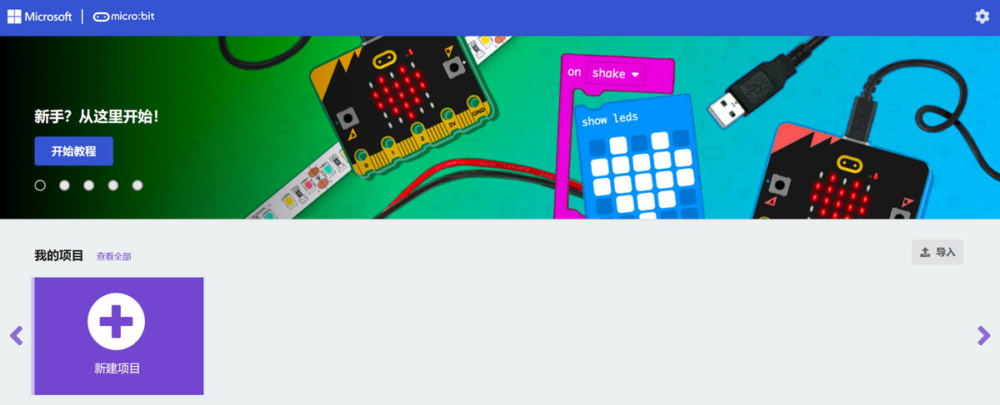
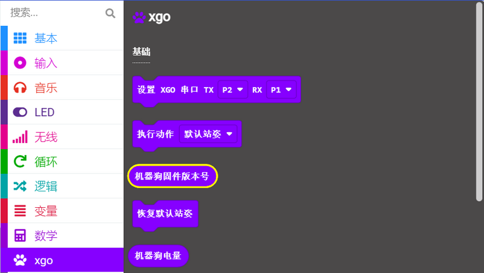
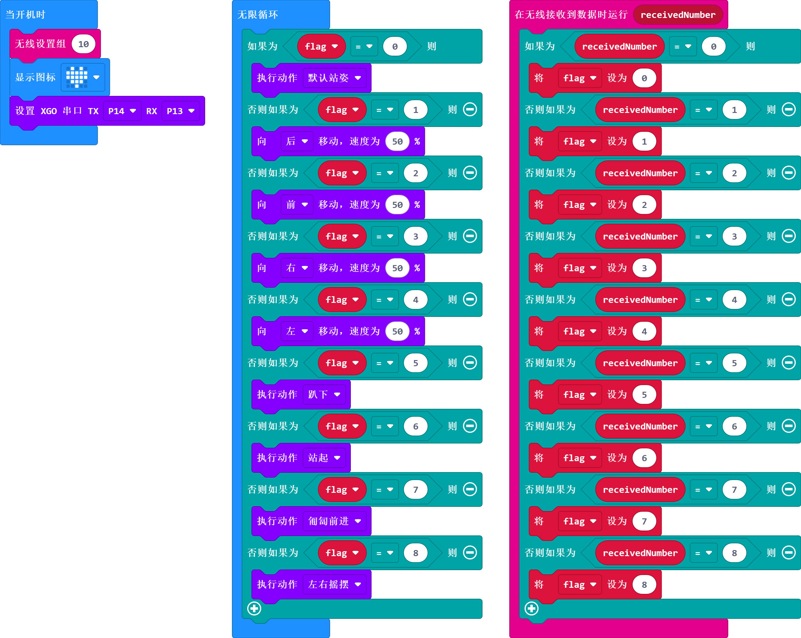
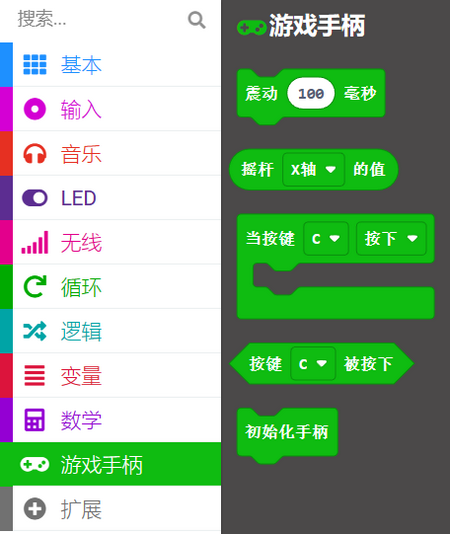
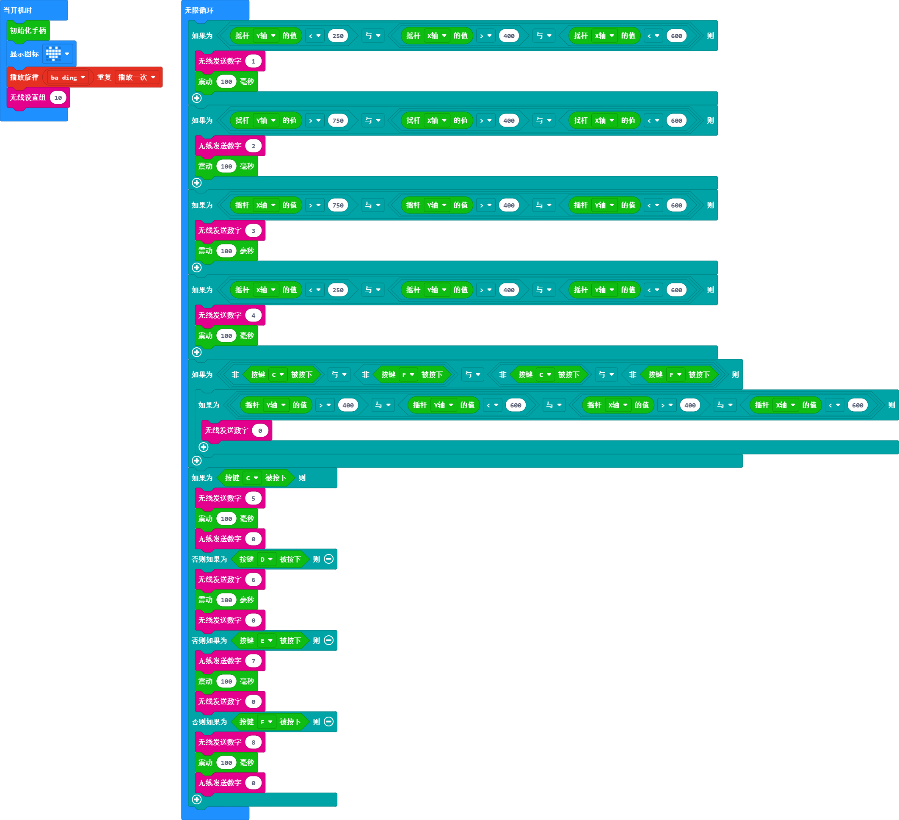

# Joysticks 手柄遥控 XGO-lite V2

## 简介

在本教程中，我们将介绍如何使用 Joystick:bit V2 遥控器实现对 XGO Robot Kit V2 的远程控制。通过结合这两款创新设备，您将能够体验到更有趣的互动方式，为机器狗带来更丰富的功能和动作。

不论您是初学者还是专业人士，通过本教程，您将能够轻松掌握遥控 XGO Robot Kit V2 的方法，并为您的研究、教学或娱乐项目带来更多创意和灵感。让我们一起开始吧！

## 材料准备

1 × micro:bit XGO Robot Kit V2

1 × Joysticks V2

## 开始编程

Joystick:bit V2 与 micro:bit XGO Robot Kit V2 都是使用 micro:bit 为主控制器，可以基于 micro:bit V2 的蓝牙功能，让两块主控制器之间可以进行相互通信。所以，本教程将通过图形化编程平台：MakeCode 对两款设备进行编程。请打开makecode平台官网链接：[MakeCode](https://makecode.microbit.org/#). 并按下面操作方式进行编程环境准备。

### XGO-lite V2 编程环境准备

1.  点击**新建项目**，给项目命名并**创建**

2. 点击**扩展**并在搜索栏搜索**XGO**，选择XGO库，即可将XGO库加载到makecode平台编程环境

   

   

### XGO-lite V2 编程示例

XGO-lite V2 编程示例程序链接：https://makecode.microbit.org/_Cc2g7qHrk45T

### Joystick:bit V2 编程环境准备

Joystick:bit V2 创建编程项目文件与 XGO-lite V2 创建编程项目文件步骤一致，这里不再赘述。不同的是在添加扩展库的步骤，需要添加的是 **joystickbit** 库文件。如下图所示：

### Joystick:bit V2 编程示例

Joystick:bit V2 编程示例程序链接：https://makecode.microbit.org/_bU0LPbJd3Yer

## 案例演示
