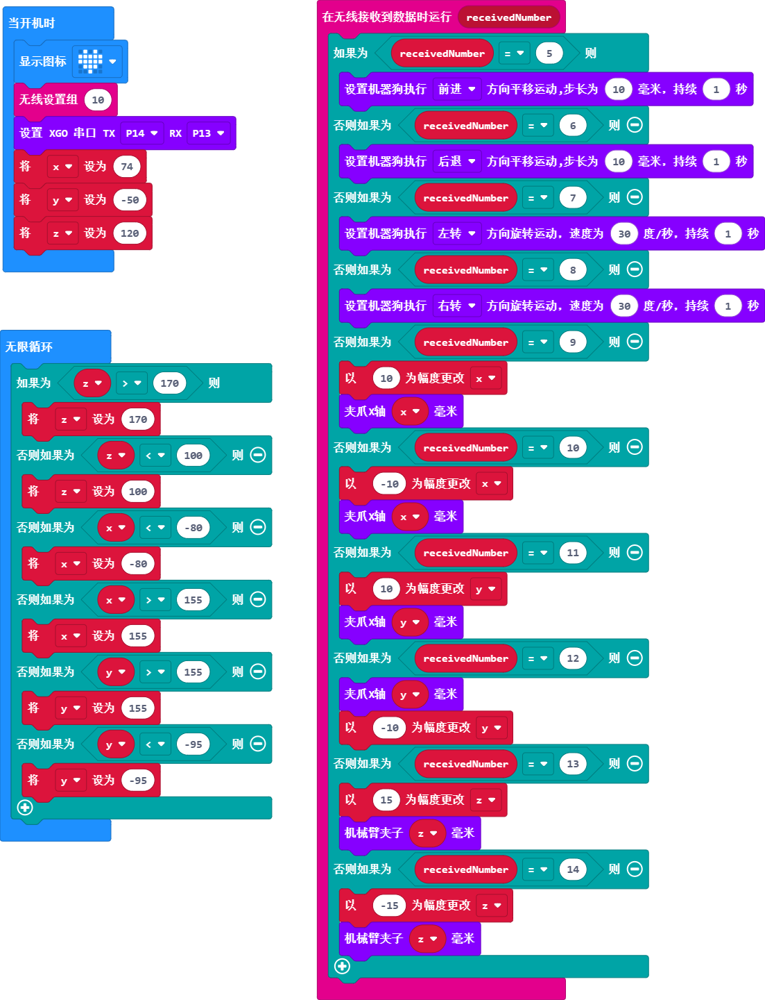
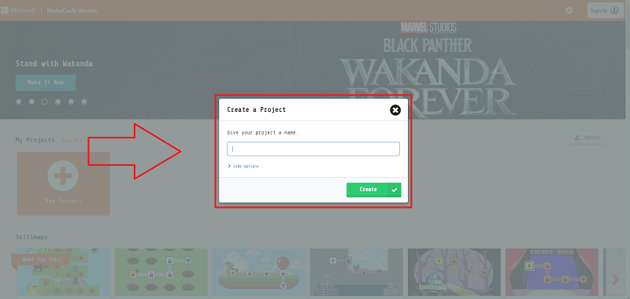
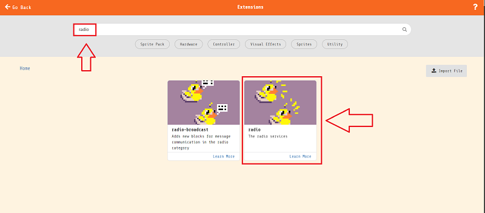
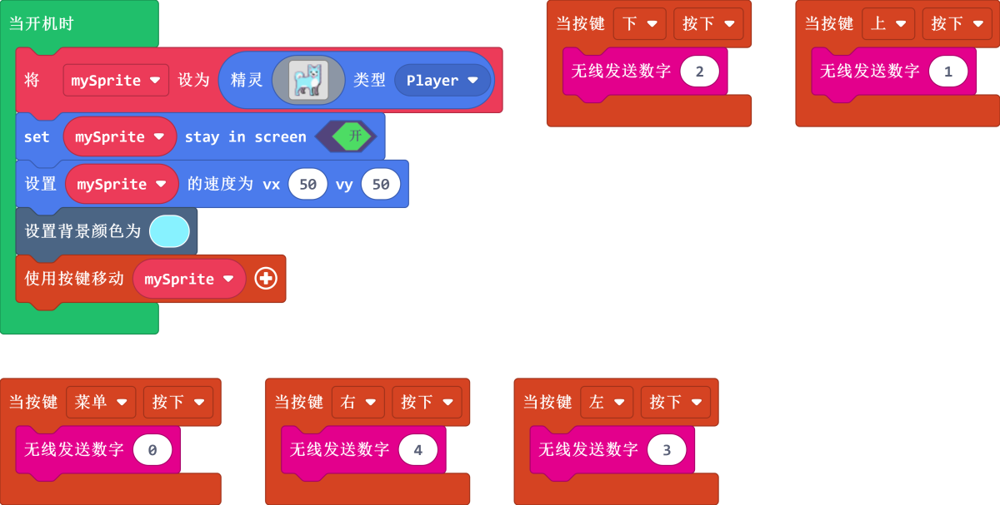
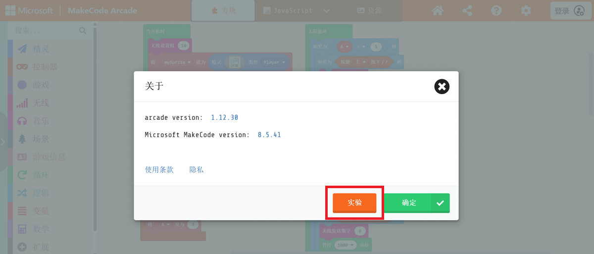
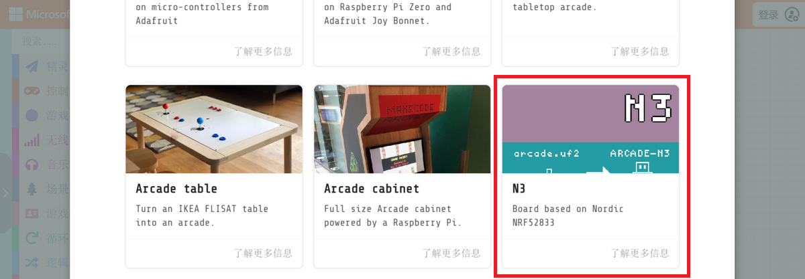

# micro:bit Retro Arcade 遥控 XGO-lite V2

## 简介

micro:bit Retro Arcade 与 XGO Robot Kit V2 的结合将为您带来前所未有的编程及遥控体验。在这个创新实践中，我们将利用 micro:bit Retro Arcade 的彩屏手柄式扩展板，通过遥控的方式控制 XGO Robot Kit V2 这款具备十五自由度的桌面级四足机器狗。您可以在一个充满趣味的编程学习环境中，发挥更多的创造力、增强逻辑思维和动手能力。

通过 micro:bit Retro Arcade 的按键控制，我们可以实现对 XGO Robot Kit V2 的全向移动、六维姿态控制、姿态稳定、多种运动步态和夹持任务等操作。

编写游戏、设计剧情、自定义角色，与遥控四足机器狗的灵活互动，将使您在轻松愉快的氛围中探索编程的奥秘。同时，还可以利用图形化编程，为 XGO Robot Kit V2 打造更多富有创意的应用。

让我们共同期待这一激动人心的创新实践，看看 micro:bit Retro Arcade 如何操控 XGO Robot Kit V2，为您带来无尽的乐趣和启发。

## 材料准备

1 × micro:bit XGO Robot Kit V2

1 × micro:bit Retro Arcade

## 开始编程

micro:bit Retro Arcade 与 micro:bit XGO Robot Kit V2 都是使用 micro:bit 为主控制器，可以基于 micro:bit V2 的蓝牙功能，让两块主控制器之间可以进行相互通信。所以，本教程将通过图形化编程平台：[MakeCode](https://makecode.microbit.org) 与 [MakeCode Arcade](https://arcade.makecode.com) 对两款设备进行编程。

### XGO-lite V2 编程环境准备

1.  打开[MakeCode](https://makecode.microbit.org)官网，点击**新建项目**，给项目命名并**创建**

2.  点击**扩展**并在搜索栏搜索**XGO**，选择XGO库，即可将XGO库加载到makecode平台编程环境

### XGO-lite V2 编程示例

程序链接：https://makecode.microbit.org/_ddT6ypdu34Ap

### Retro Arcade 编程环境准备

点击**新建项目**

输入项目名称新建项目。

添加无线通信扩展库，点击扩展。

在搜索栏输入“radio”，点击搜索，添加扩展库。

### Retro Arcade 程序示例

程序链接：https://makecode.com/_T7FgaeRe294M

由于目前对于Arcade平台官方而言，micro:bit V2（nRF52833）还在测试阶段，所以我们需要首先去到平台的设置页面将还在试验版本的硬件选项开放出来。

确保Expermental Hardware是已启用状态（只需要设定一次即可）

接着返回到编程主页，点击左下角的下载按钮，在弹出的选择硬件窗口拉到最底部选择N3

会得到一个.hex格式的文件，将他拖入到MICROBIT盘符下即可在micro:bit V2 + Microbit Retro Arcade上运行。

## 案例演示

