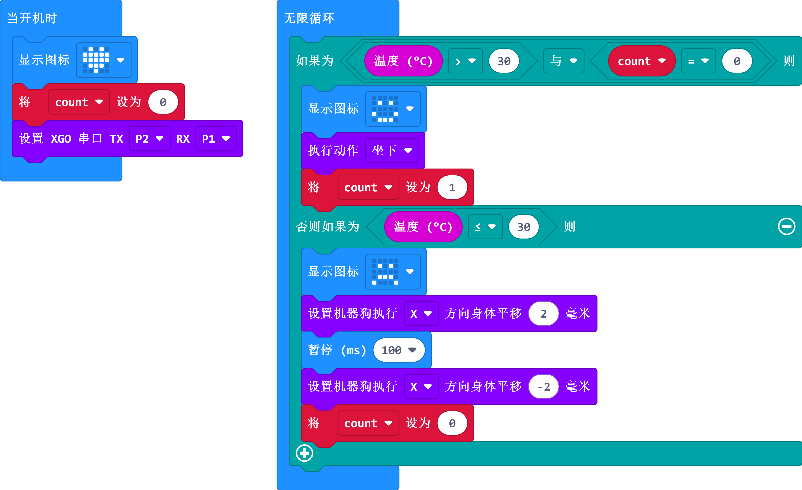

# 案例08 - 瑟瑟发抖的 XGO

## 介绍
哈喽，经过前几节课的内容，我相信你对 XGO 的控制已经很熟练了，接下来，我们将 XGO 当做真正的小狗来控制它，让它看起来就像真的小狗一样，我们知道小狗狗在受冷后会全身抖动，这节课程我们就来设计这样的效果，那我们开始吧。

## 快速开始

### 使用材料

[micro:bit XGO Robot Kit 套件](https://www.elecfreaks.com/micro-bit-xgo-robot-kit.html) × 1

[micro:bit](https://www.elecfreaks.com/bbc-micro-bit-board-for-coding-programming-microbit.html) × 1

### 硬件连接

我们使用数据线（USB 线）将电脑与 micro:bit 相连，相信你已经很熟练了。

## MakeCode 编程

XGO 的程序编写是在 [Makecode](https://makecode.microbit.org/#) 平台进行; Makecode平台可以使用图形化编程，同时还可以使用python代码编程和JavaScript代码编程；

### 步骤一

- 新建项目，命名程序名后点击积木库中的**扩展**按钮，如下：

- 在输入框输入：XGO 或者 XGO Robot Kit 搜索到 xgo 扩展库，如下：

**_注意:_** 如果您遇到提示某些代码库由于不兼容而将被删除的提示

### 步骤二

#### 示例程序

同时，可以直接下载下方程序：

[https://makecode.microbit.org/#editor](https://makecode.microbit.org/#editor)

**注意:**程序中温度值的设置要根据您当前所处的环境温度而定，如果没有加热设备，可以考虑将手掌放在 micro:bit 上面，一两分钟后 micro:bit 的温度会升高1~2度。

### 效果演示

### 相关问题

### 思考

能否添加当 XGO 趴下一段时间后，然后离开的设置？
