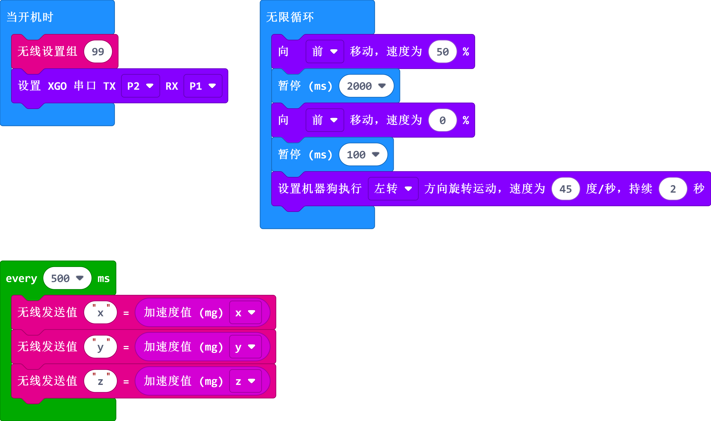

# 案例09 - XGO 的快乐，我知道

## 介绍

哈喽，最近我们和 XGO 玩乐的时候我们突发奇想，如果和我们玩乐的是真实的小狗狗，我们能感受到狗狗的快乐或者悲伤，但是我们如何感受到 XGO 的情感呢？带着这个问题，可以看看我们是如何解决的，当然我们的方案只是众多实现感受 XGO “感情”的一种方法，希望小精灵们能想出更好的办法，那我们开始吧。

## 快速开始

### 使用材料

[micro:bit XGO Robot Kit 套件](https://www.elecfreaks.com/micro-bit-xgo-robot-kit.html) × 1

[micro:bit](https://www.elecfreaks.com/bbc-micro-bit-board-for-coding-programming-microbit.html) × 1

### 工作原理

1.  我们使用 micro:bit 的**加速度值**功能，加速度计传感器是测量移动的移动传感器，因为 micro:bit 内置了加速度传感器，所以我们让 XGO 上面的 micro:bit 取得加速度计的3个维度（x，y和z轴）上的力的恒定读数，并通过无线电发送。
2.  将另一个 micro:bit 连接到电脑，然后使用 MakeCode 编写接受数据程序并刷入到其中。与电脑连接的 micro:bit 接受 XGO 上面 micro:bit 发送的数据，并将数据作为串列数据发送到你的电脑。
3.  现在，你应该会在 micro:bit模拟器下方看到一个“显示控制台设备”按钮，点击它，应该会在屏幕上看到实时数据读数的图形。
4.  给 XGO 设置不同的速度和方向，观察每个轴上的读数如何变化。按“暂停”，可以将数字数据下载为 CSV（逗号分隔值）文件，然后你可以在电子表格程序中打开此文件进行分析。 如果你删除第二和第三时间列，只保留第一时间列，则可以将数据绘制在电子表格的散点图上，以显示力随时间的变化情况。

### 硬件连接

我们使用数据线（USB 线）将电脑与 micro:bit 相连，相信你已经很熟练了。

## MakeCode 编程

XGO 的程序编写是在 [Makecode](https://makecode.microbit.org/#) 平台进行; Makecode平台可以使用图形化编程，同时还可以使用python代码编程和JavaScript代码编程；

### 步骤一

- 新建项目，命名程序名后点击积木库中的**扩展**按钮，如下：

- 在输入框输入：XGO 或者 XGO Robot Kit 搜索到 xgo 扩展库，如下：

**_注意:_** 如果您遇到提示某些代码库由于不兼容而将被删除的提示

### 步骤二

#### 示例程序-XGO程序

同时，可以直接下载下方程序：

[https://makecode.microbit.org/_hf6ThW00tY5Y](https://makecode.microbit.org/_hf6ThW00tY5Y)

#### 示例程序-接受端程序

同时，可以直接下载下方程序：

[https://makecode.microbit.org/#editor](https://makecode.microbit.org/#editor)

**注意**：其中“value”值代表 XGO 的三维加速度向量模的值，可以不用深究，这个值是表达 XGO 往某一方向奔跑的快慢。

### 效果展示

### 相关问题

### 思考

能否设置 XGO 的不同速度和姿态，赋予 XGO 更多的“情感”？
