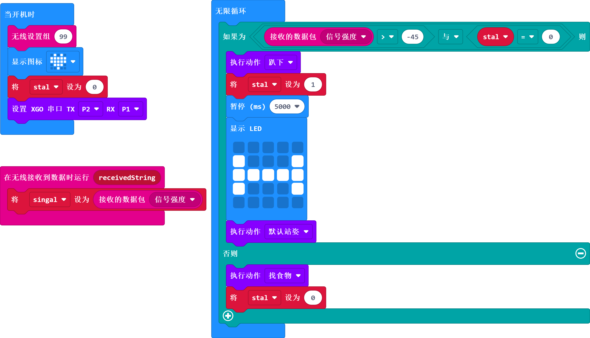
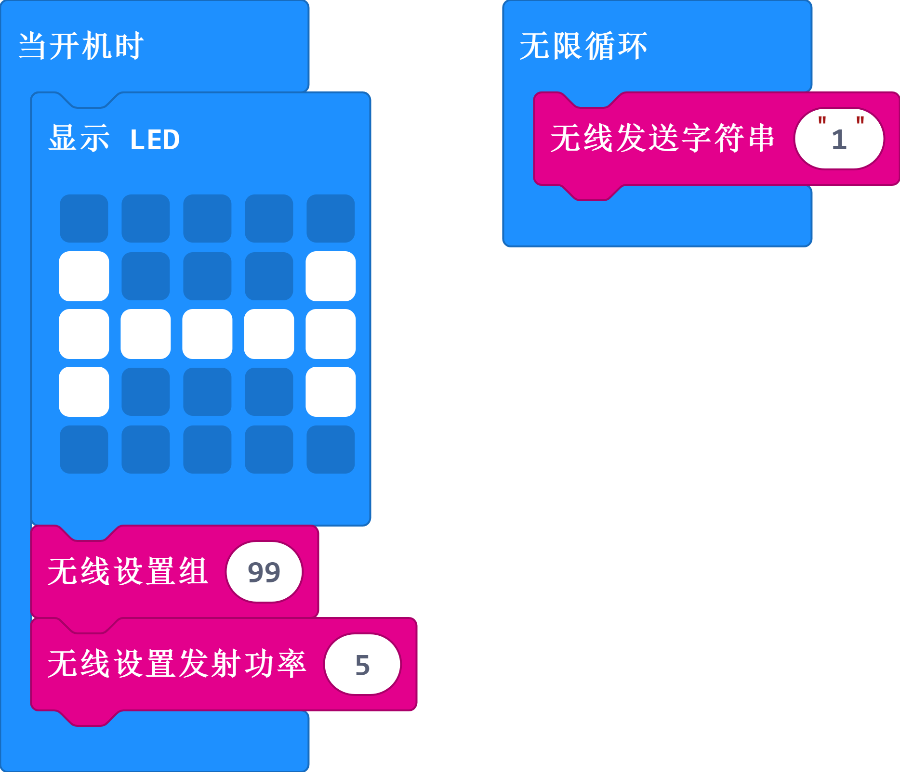

# 案例10 - 吃骨头的 XGO

## 介绍

哈喽，对于狗狗来说最喜欢吃的食物应该是骨头了，那么我们如何通过编程来展示这个效果呢？这篇文章展示了我们的思考结果，仅供参考，欢迎小精灵们有更多的实现方法以及更多的创意。

## 快速开始

### 使用材料

[micro:bit XGO Robot Kit 套件](https://www.elecfreaks.com/micro-bit-xgo-robot-kit.html) × 1

[micro:bit](https://www.elecfreaks.com/micro-bit/board.html) × 1

### 工作原理

1. 至少需要2个micro:bit才能实现。我们将创建两个不同的程序，一个用于不断发送低功率无线电消息的信标。 另一个程序在接收器上。
2. 越靠近发射器，无线电信号越强，因此，如果信号较强，则意味着另一个micro:bit可能就在附近。如果无线电信号很弱，则另一个micro:bit可能距离较远。

### 硬件连接

我们使用数据线（USB 线）将电脑与 micro:bit 相连，相信你已经很熟练了。

## MakeCode 编程

XGO 的程序编写是在 [Makecode](https://makecode.microbit.org/#) 平台进行; Makecode平台可以使用图形化编程，同时还可以使用python代码编程和JavaScript代码编程；

### 步骤一

- 新建项目，命名程序名后点击积木库中的**扩展**按钮，如下：

- 在输入框输入：XGO 或者 XGO Robot Kit 搜索到 xgo 扩展库，如下：

**_注意:_** 如果您遇到提示某些代码库由于不兼容而将被删除的提示

### 步骤二

#### 示例程序

#### XGO 程序

同时，可以直接下载下方程序：
[https://makecode.microbit.org/_Lhrhbp7dDb1M](https://makecode.microbit.org/_Lhrhbp7dDb1M)

#### “骨头”程序

同时，可以直接下载下方程序：
[https://makecode.microbit.org/_dLc2HV21M64H](https://makecode.microbit.org/_dLc2HV21M64H)

### 效果演示

### 相关问题

### 思考
