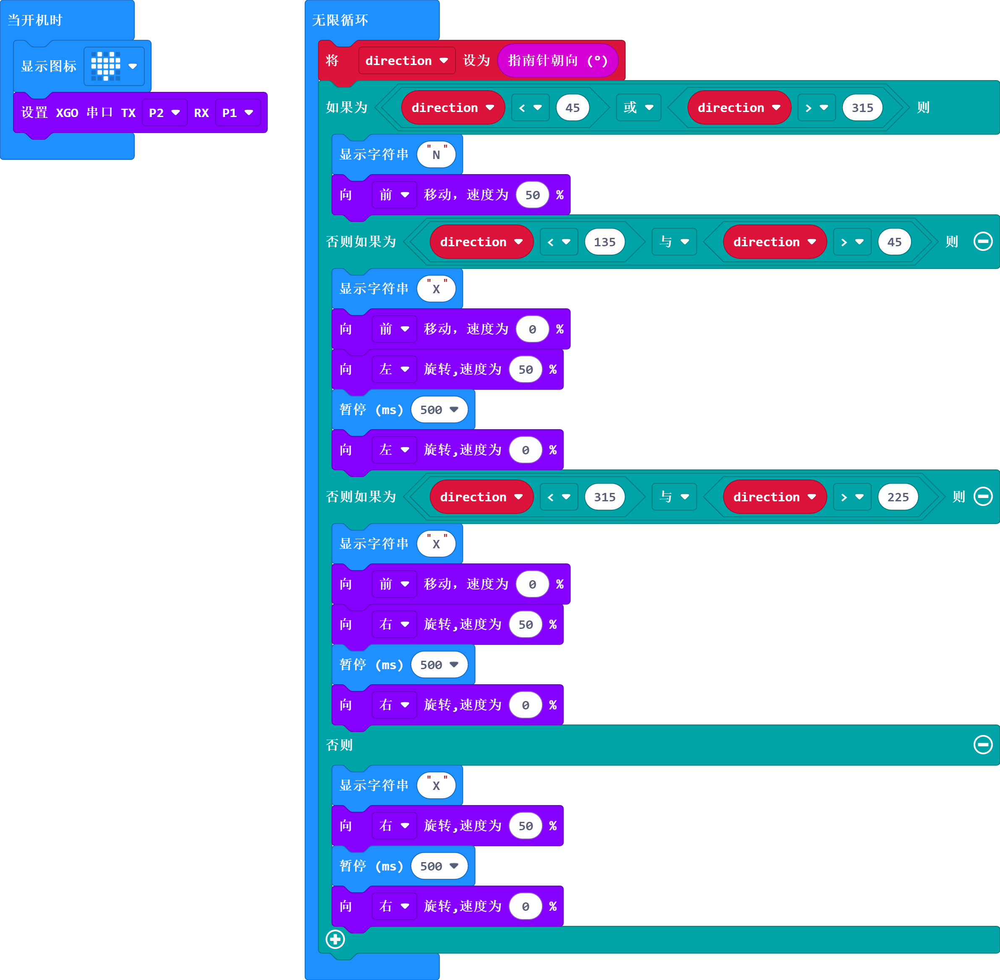

# 案例11 - 不会迷路的 XGO

## 介绍

哈喽，当我们在一个陌生的地方迷路时，如果这个时候你的身边有我们的好朋友-XGO，并且学过了这节课程内容，那么 XGO 会化身为“领路狗”带我们走出去，这节课的内容就是实现将 XGO 变为“领路狗”的内容，那我们开始吧。

## 快速开始

### 使用材料

[micro:bit XGO Robot Kit 套件](https://www.elecfreaks.com/micro-bit-xgo-robot-kit.html) × 1

[micro:bit](https://www.elecfreaks.com/bbc-micro-bit-board-for-coding-programming-microbit.html) × 1

### 工作原理

1. micro:bit有一个称为磁力计的指南针传感器，用于测量磁场。 它可以感应地球的磁场，因此你可以将其用作指南针。
2. 首次使用micro:bit指南针时，必须进行校准。 屏幕上会出现一个小游戏，你必须将micro:bit倾斜以点亮每个LED，然后就可以使用了。

### 硬件连接

我们使用数据线（USB 线）将电脑与 micro:bit 相连，相信你已经很熟练了。

## MakeCode 编程

XGO 的程序编写是在 [Makecode](https://makecode.microbit.org/#) 平台进行; Makecode平台可以使用图形化编程，同时还可以使用python代码编程和JavaScript代码编程；

### 步骤一

- 新建项目，命名程序名后点击积木库中的**扩展**按钮，如下：

- 在输入框输入：XGO 或者 XGO Robot Kit 搜索到 xgo 扩展库，如下：

**_注意:_** 如果您遇到提示某些代码库由于不兼容而将被删除的提示

### 步骤二

方位图如下：

#### 示例程序

同时，可以直接下载下方程序：

[https://makecode.microbit.org/_YYDh669TLXfp](https://makecode.microbit.org/_YYDh669TLXfp)

### 效果演示

### 相关问题

如果 XGO 没有正确的往北方向行走，请重新校验磁力计或者标定 XGO。

### 思考

能否添加当 XGO 走的太远了可以在原地等待我们赶上来的功能？
