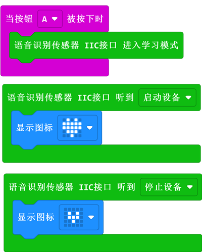

# 语音识别电子积木

## 简介
语音识别模块，可以实现语音识别，支持自学习词条，结合彩虹灯环、智能小车等硬件可以实现语音识别控制灯、语音识别控制小车额趣味案例。

 

## 技术规格
项目 | 参数
| :-: | :-: |
SKU|EF04108
接口类型|IIC
工作电压|3.3V
核心IC|SNR9815

## 外形与定位尺寸

## 语音识别模块预设词条及反馈

**唤醒词**

| 词条 | 反馈音 | IIC返回数据 |
| :-: | :-: | :-: |
| 你好小恩 | 你好啊/我在呢 | 0x01 |

**功能组一**

| 词条 | 反馈音 | IIC返回数据 |
| :-: | :-: | :-: |
| 打开车灯 | 车灯已打开 | 0x10 |
| 关闭车灯 | 已打开 | 0x11 |
| 向左转 | 左转弯 | 0x12 |
| 向右转 | 右转弯 | 0x13 |
| 向前进 | 全速前进 | 0x14 |
| 向后退 | 倒车请注意 | 0x15 |
| 巡线模式 | 进入巡线模式 | 0x16 |
| 避障模式 | 进入避障模式 | 0x17 |
| 停车 | 已停车 | 0x18 |

**功能组二**

| 词条 | 反馈音 | IIC返回数据 |
| :-: | :-: | :-: |
| 启动设备 | 设备运行 | 0x20 |
| 停止设备 | 设备关闭 | 0x21 |
| 暂停运行 | 休息一下 | 0x22 |
| 继续运行 | 开始工作啦 | 0x23 |
| 增加一档 | 已增加 | 0x24 |
| 降低一档 | 已降低 | 0x25 |
| 播放音乐 | 欣赏音乐吧 | 0x26 |
| 关闭音乐 | 已关闭 | 0x27 |
| 切换音乐 | 欣赏下一首音乐 | 0x28 |

**功能组三**

| 词条 | 反馈音 | IIC返回数据 |
| :-: | :-: | :-: |
| 执行功能一 | 执行功能一 | 0x31 |
| 执行功能二 | 执行功能二 | 0x32 |

**自学习词条**

| IIC发送指令 | 反馈音 | 功能 |
| :-: | :-: | :-: |
| 0×50 | 进入学习模式，学习第 X 条词条 | 顺序学习词条 |
| 0×60 | 初始化完成 | 删除所有已学习词条 |

| 词条 | 反馈音 | IIC返回数据 |
| :-: | :-: | :-: |
| 自学词条一 | 默认 | 0x50 |
| 自学词条二 | 默认 | 0x51 |
| 自学词条三 | 默认 | 0x52 |
| 自学词条四 | 默认 | 0x53 |
| 自学词条五 | 默认 | 0x54 |
| 自学词条六 | 默认 | 0x55 |
| 自学词条七 | 默认 | 0x56 |
| 自学词条八 | 默认 | 0x57 |
| 自学词条九 | 默认 | 0x58 |
| 自学词条十 | 默认 | 0x59 |

## 快速上手

### 所需器材及连接示意图

如下图所示，语音识别模块连接到IIC接口。

***以IOT：bit为例***

### 添加软件库
在MakeCode的代码抽屉中点击高级，查看更多代码选项。

点击“扩展”，在弹出的对话框中搜索 “https://github.com/elecfreaks/pxt-ASR” ，下载语音识别电子积木的代码库。

### 如图所示编写程序

### 参考程序
请参考程序连接：[https://makecode.microbit.org/_7TLYW8WzyLka](https://makecode.microbit.org/_7TLYW8WzyLka)

你也可以通过以下网页直接下载程序，下载完成后即可开始运行程序。

    <iframe
        src="https://makecode.microbit.org/_7TLYW8WzyLka"
        frameborder="0"
        sandbox="allow-popups allow-forms allow-scripts allow-same-origin"
        style={{
            position: 'absolute',
            width: '100%',
            height: '100%',
        }}
    />

### 结果
通过语音识别模块控制LED矩阵显示的内容。

## 相关案例

## 技术文档
