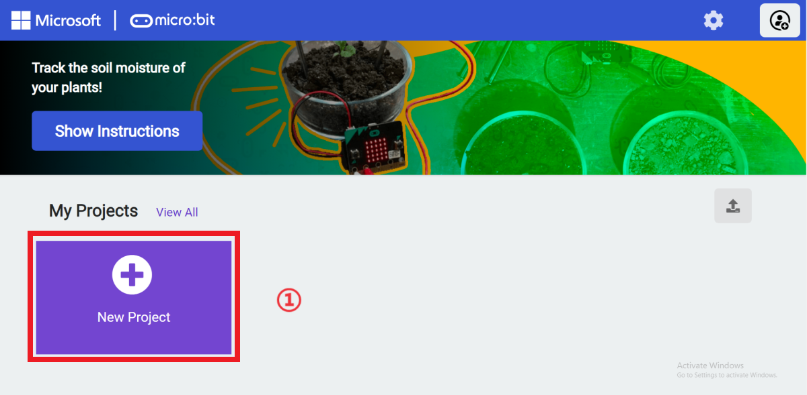
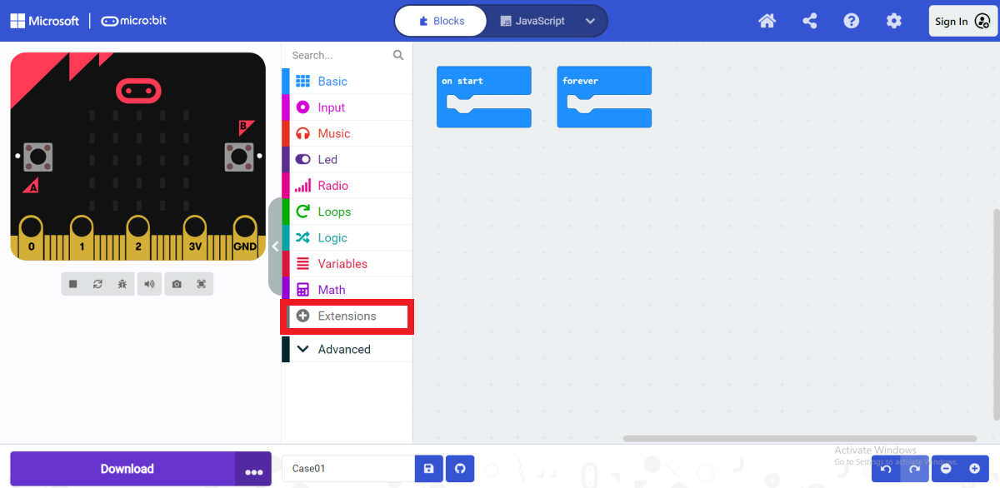
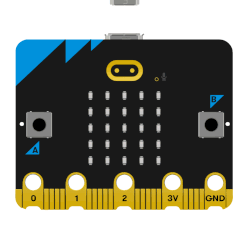
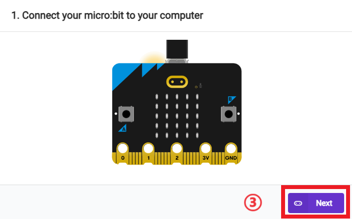
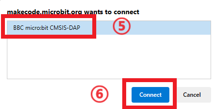

# 案例06 建立植物水源报警器

## 简介

本课程将向学生介绍通过 API 接口平台 IFTTT 搭建植物水源报警器。学生将学习设计植物水源报警器以及通过 API 的调用将报警信息发送到个人邮箱上的方式。

## 教学目标

- 了解 IFTTT 平台的使用方式 。
- 分析极限条件下的触发条件并编写程序。

## 教学准备

在开始教学之前，请确保您已经准备好以下必要的物品：

| 物品 |       名称        |
| :--: | :---------------: |
|      | 智能温室大棚套件  |
|      | micro:bit V2 主板 |
|      |     个人电脑      |

这些物品将为您提供一个完整的体验，确保您可以顺利地进行后续的操作和学习。如果您已准备好以上内容，我们可以继续进入下一步。

## 教学过程

### 课程引入

在前面的课程中，我们通过 ThingSpeak 平台实时观看到植物生长的环境数据，但是植物生长周期是很长的，我们并不能一直盯着 ThingSpeak 平台的看板数据，我们只是希望当植物生长环境发生变化并对植物生长造成危害时，能及时了解并根据情况做出调整，这节课我们将使用 API 平台 IFTTT 制作植物水源报警器。

现在，那我们开始吧！

### 探究活动

- 如何通过编程获取植物生长过程中需要检测的所有数据？
- 如何使用 ThingSpeak 平台观看到所有检测的数据？

### ThingSpeak 平台建立数据看板

关于ThingSpeak平台的使用以及建立看板可以参考这篇文章：[how-to-use-thinkspeak](https://wiki.elecfreaks.com/en/microbit/wisdom-life/microbit-smart-science-iot-kit/how-to-use-thinkspeak/)。

参考如下图所示：

## IFTTT 平台调用 API 

关于 IFTTT 平台的使用方式请参考这篇文章：https://wiki.elecfreaks.com/en/microbit/wisdom-life/microbit-smart-science-iot-kit/how-to-use-IFTTT/

参考如下图所示：

### 代码编程

#### 添加软件库

进入“[makecode.microbit.org](https://makecode.microbit.org/)”，点击“**New Project**”。

在弹出窗口中输入项目名称并点击“**Create**”。

在打开的编程界面中，点击编程积木抽屉中“**Extensions**”。

打开拓展页面后，在搜索栏中输入“**iot-environment-kit**”，点击搜索，在搜索结果中选择 “**iot-environment-kit**” 编程积木库。

添加成功后，可以在编程积木抽屉栏看到 “**ESP8266_IoT**、**OLED**、**RTC1307**、**Octopus**”。

#### 示例代码

#### 完整程序

请参考程序链接：https://makecode.microbit.org/_a06HbiXK1767。

#### 下载程序

使用 USB 数据线连接电脑和 micro:bit V2。

连接成功后，电脑上会识别出一个名为 **MICROBIT** 的盘符。

点击左下角的，选择 **Connect Device**。

点击。

点击。

在弹出窗口选择 “**BBC micro:bit CMSIS-DAP**”，然后选择 “**Connect**”，至此，我们的 micro:bit 就已经连接成功。

点击下载程序。

### 准备智能温室大棚

（元器件连线图）

### 团队合作与展示

学生分成小组，共同完成智能温室大棚的安装和程序编写。

鼓励学生之间相互合作、交流和分享经验。

每个小组有机会向其他小组展示他们制作的智能温室大棚，并演示。

**预期效果：** 当植物生长的土壤湿度值小于200时，水泵开始抽水并输送到植物生长池中。

（GIF动图）

### 总结与反思

回顾课程内容，提醒学生掌握了哪些知识和技能。

引导学生讨论他们在制作过程中遇到的问题和困难，以及如何解决这些问题。

引导学生思考程序的优化和改进方向，比如利用 micro:bit 还能制作哪些有趣的案例。

## 扩展知识

