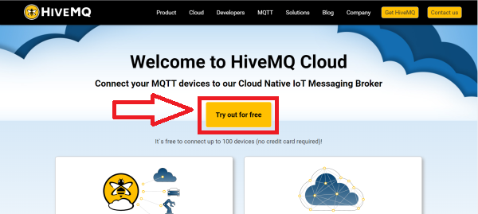
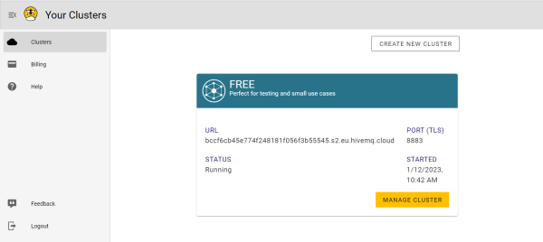
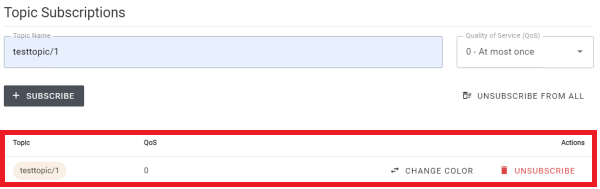
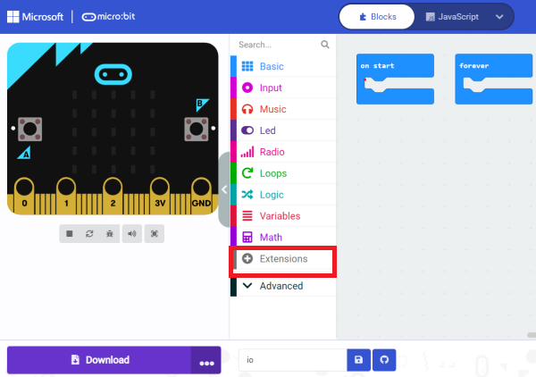
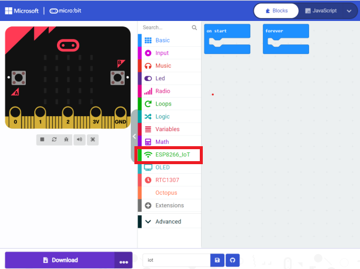
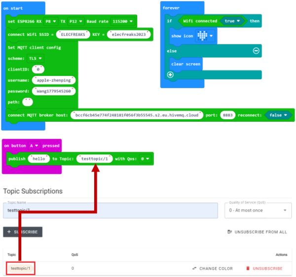
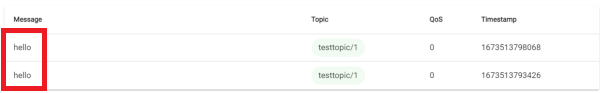
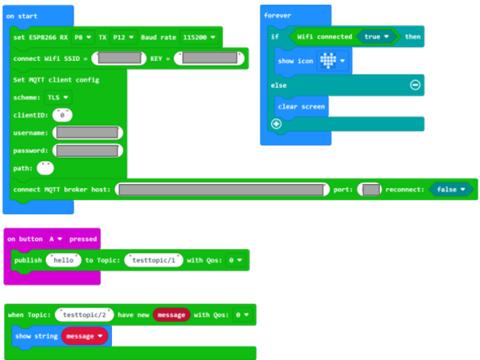

# 如何适配 HiveMQ 平台

**HiveMQ** 是一个 MQTT 代理和基于客户端的消息传递平台，旨在快速、高效和可靠地将数据移入和移出连接的物联网设备。

**HiveMQ 平台链接：[https://www.hivemq.com/](https://www.hivemq.com/).**

## HiveMQ 平台账号注册

进入**HiveMQ官网**，点击在右上角的菜单栏上的 **Cloud**。

在弹出页面点击选择 **Try out for free**。

在弹出页面点击选择 **sign**，输入注册信息（邮箱、密码）,然后点击 **SIGN UP**.

这里需要注意密码输入要求

然后根据平台注册引导注册账号。

## HiveMQ 平台使用操作指南

注册成功后，输入网址：https://www.hivemq.com/mqtt-cloud-broker/
在弹出页面点击选择 **sign up now**

输入你注册的邮箱以及密码，点击 **LOG IN** 登录.

点击右下角 **MANAGE CLUSTER**.

出现默认页面是展示 **OVERVIEW** 页面，其中在 Connection Settings 下面显示的 Cluster URL、Port 以及 Websocker Port 信息是编程中需要配置的内容，后面将用到，可以先记住这个信息所在的位置。

点击 **ACCESS MANAGEMENT**，设置Username，Password并记住，点击ADD。（添加用户账号），添加用户名和密码后，会在右侧显示。

添加成功，请记住这个Username，以及Password，这个信息将在makecode端设置 MQTT 配置的使用。

点击 CONNECT CLIENT ，然后会显示连接成功。

添加订阅主题，主题名：testtopic/1 会在后面编程时用到，已订阅的主题会显示在订阅列表里面。

硬件连接部分请参考wiki：[https://www.elecfreaks.com/learn-en/microbitKit/iot_kit/iot_bit.html](https://www.elecfreaks.com/learn-en/microbitKit/iot_kit/iot_bit.html)

**注意：**请务必使用IOT:bit上的USB接口进行供电，否则wifi模块不供电。

## makecode 平台编程实践

打开makecode编程平台：[https://makecode.microbit.org/#editor](https://makecode.microbit.org/#editor)

点击“Extensions”。

然后在弹出界面的搜索栏输入“iot-environment-kit”点击搜索，并添加软件扩展库。

在添加成功后点击“ESP8266_IoT”。

在当开机时初始化ESP8266，并输入wifi名称和wifi密码连接至wifi。

然后设置MQTT配置，scheme选择为TLS，自定义clientID，username为HiveMQ上添加的username，password为HiveMQ上设置的password。

点击Overview，将HiveMQ上的Host和port复制到makecode中。

接下来我们测试将消息"hello"发送到 HiveMQ 平台。

按照以上程序，按下micro:bit上的按键A即可发送“hello”至平台。

当然，我们也可以从平台上发送数据到本地，在平台上设置Topic为：testtopic/2，在Message中输入想要发送到本地的信息，然后点击Publish即可发送到本地。
同样本地接收程序积木块中也要保持Topic一致。

从平台发送数字2到本地，并通过micro:bit上的LED矩阵显示出来。

完整程序:

完整程序链接：[https://makecode.microbit.org/_6kgWfF8Tkgbp](https://makecode.microbit.org/_6kgWfF8Tkgbp)

## FAQ

### Q：如何判断当前版本的IOT:bit是否支持MQTT？
A：请查看IOT:bit背面的版本号，IOT:bit V1.6版本支持MQTT协议，IOT:bit V1.4及其以下版本不支持MQTT协议。

