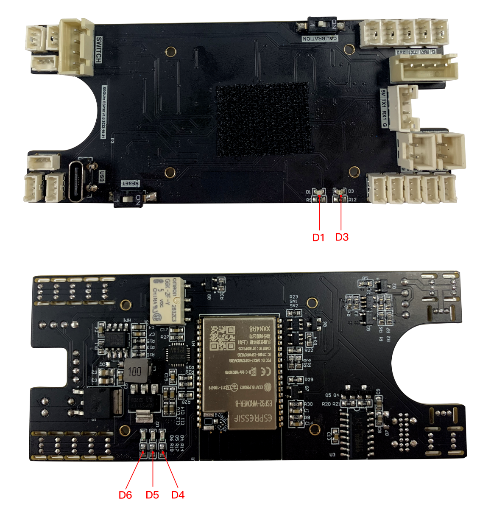

# 故障分析

## 机器狗开机无法站立

机器狗按下电源开关后无法站立，此时可以根据机器狗的开关指示灯和板载指示灯来排除故障。

#### 现象一：开关按下去机器狗没有任何反应

可能是开关电源线路断裂，此时需要拆开机器狗背部，尾部和身体两侧的螺丝，取下背板检查一下开关线路，用电络铁修理即可。

#### 现象二：开关按下，开关指示灯不亮，机器狗站立

可能是开关信号灯线路断裂，此时需要拆开机器狗背部，尾部和身体两侧的螺丝，取下背板检查一下开关线路，用电络铁修理即可。

#### 现象三：开关按下，开关指示灯亮，机器狗不站立

1.  驱动板绿色电源指示灯 D1, D2, D3 亮起同时 D1蓝色指示灯亮起，此时应为某舵机故障影响总线通讯，此时可以逐一拔掉舵机开机，待定位到故障舵机后记录舵机上 ID，用相同 ID 的舵机替换即可。舵机 ID 如图所示：左前腿，右前腿，右后腿，左后腿依次为舵机 ID 的第一位1，2，3 ， 4，每条腿下，中，上舵机分别为舵机 ID 的第二位1，2，3 。 所以举例说明右后腿中间舵机 ID 编号为32。

2.  驱动板的所有指示灯都不亮，此时应该为驱动板故障，需要更换驱动板。

## 机器狗开机后可以站立但是关节位置不对

#### 现象一：机器狗开机后关节位置异常，但是各个舵机都力。

此时舵机工作正常，舵机角度异常，需要给机器狗重新标定。

#### 现象二：机器狗开机后关节位置异常，关节无力或者关节转动位置错误。

这种现象一般是因为舵机电位器损坏或者舵机 MOS 管电流过大导致烧毁，但是舵机通信正常，此时需要更换舵机。

## 机器狗屏幕不亮

#### 现象一：载板电源指示灯不亮。

此时需要检查从驱动板引过来的 4pin 线是否插紧，如线缆没问题则应该是载板损坏，需要更换 CM4 载板。

#### 现象二：载板电源灯亮，但是屏幕不亮。

此时可能的原因是 SD 卡镜像烧录失败，系统没有正常启动，或者是 SD 卡槽故障引起的 SD 卡接触不良。还有一种可能是屏幕连接载板的排线连接处故障，导致屏幕 SPI 通信异常。此时需要更换 CM4 载板或者屏幕，或者重新烧录一下树莓派镜像。
